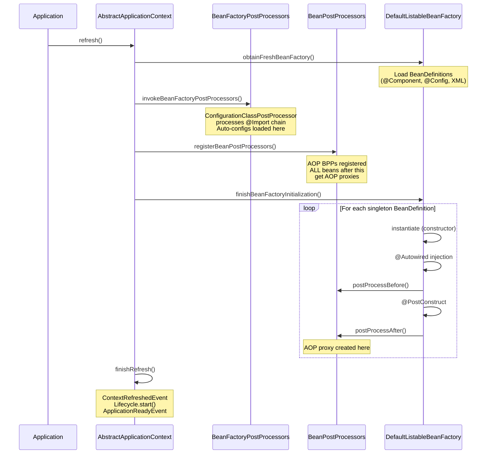

---

# BeanFactoryPostProcessor and BeanPostProcessor


---

### 🎯 Interview Deep-Dive

**Timing:** Hard ★★★ - 12 questions.

---

**[JUNIOR] Q1 - [CONCEPTUAL] What is the full bean initialization sequence in Phase 11?**

For each singleton BeanDefinition in Phase 11:

```
1. Instantiation:
   - Constructor injection resolved
   - @Autowired constructor selected by
     AutowiredAnnotationBeanPostProcessor
   - Constructor parameters retrieved from context

2. Property population:
   - @Autowired field injection
   - @Value field injection
   - Setter injection
   (Done by AutowiredAnnotationBeanPostProcessor
    via postProcessProperties() - IABPP)

3. Aware interface callbacks (in order):
   - BeanNameAware.setBeanName()
   - BeanClassLoaderAware.setBeanClassLoader()
   - BeanFactoryAware.setBeanFactory()
   (Then ApplicationContextAwareProcessor handles):
   - EnvironmentAware.setEnvironment()
   - ApplicationContextAware.setApplicationContext()

4. BPP.postProcessBeforeInitialization()
   Called on ALL registered BPPs in Ordered order.
   CommonAnnotationBPP processes @PostConstruct here.

5. @PostConstruct methods
   (actually handled by step 4 via CommonAnnotationBPP)

6. InitializingBean.afterPropertiesSet()
   If bean implements InitializingBean

7. Custom init-method (init-method attribute or
   @Bean(initMethod="..."))

8. BPP.postProcessAfterInitialization()
   Called on ALL registered BPPs.
   AbstractAutoProxyCreator creates AOP proxy here
   if bean has AOP advice (e.g., @Transactional).
   Returned object (proxy) replaces bean in context.
```

> **Code walkthrough:** This Unknown example demonstrates a key concept in practice using @Transactional. **KEY MECHANISM:** the runtime executes these instructions in sequence with specific memory and execution semantics. **WHY IT MATTERS:** misapplying this pattern causes subtle bugs that only manifest under production load. **TAKEAWAY: understand the execution model before using this pattern in production code.**

*What separates good from great:* Many candidates know steps 4-8 but miss
steps 1-3. The Aware interface injection in step 3 is interesting: it runs
BEFORE @PostConstruct. This is why ApplicationContextAware.setApplicationContext()
can be called in @PostConstruct - the context is already injected. Also:
BeanFactoryAware gives a BeanFactory reference, NOT ApplicationContext.
The two are different: ApplicationContext wraps BeanFactory and adds
events, i18n, resource loading.

---

**[JUNIOR] Q2 - [HANDS-ON] How does AbstractAutoProxyCreator create AOP proxies?**

AbstractAutoProxyCreator is the base class for Spring's AOP proxy-creating
BPPs (AnnotationAwareAspectJAutoProxyCreator is the concrete class used with
@EnableAspectJAutoProxy).

```
postProcessAfterInitialization() logic:
  1. Get target class (unwrap any existing proxy)
  2. Check if bean is already proxied (skip if so)
  3. Find all Advisors that match this bean:
     - Scan all Advisor beans in context
     - Check each Advisor's Pointcut against the bean's class
     - @Transactional -> BeanFactoryTransactionAttributeSourceAdvisor
     - @Cacheable -> BeanFactoryCacheOperationSourceAdvisor
     - @Async -> AsyncAnnotationAdvisor
  4. If advisors found: create proxy
     - BeanDefinition says targetClass or targetInterface
     - If implements interfaces: JDK dynamic proxy
       (InvocationHandler wraps advisors)
     - If no interfaces or proxyTargetClass=true:
       CGLIB subclass proxy
     - Proxy wraps advisors in chain
  5. Return proxy (replaces original bean in context)
  6. Original bean stored in proxy as "target"

CGLIB vs JDK proxy:
  JDK proxy: only works for interface methods
    - Proxy implements the interface
    - Method calls dispatched via InvocationHandler
  CGLIB proxy: works for any non-final method
    - Generates subclass at runtime
    - Requires no-arg constructor (Spring 4+: no longer)
    - Cannot proxy final classes or final methods
```

> **Code walkthrough:** This Unknown example demonstrates a key concept in practice using @Transactional. **KEY MECHANISM:** the runtime executes these instructions in sequence with specific memory and execution semantics. **WHY IT MATTERS:** misapplying this pattern causes subtle bugs that only manifest under production load. **TAKEAWAY: understand the execution model before using this pattern in production code.**

*What separates good from great:* Spring Boot sets proxyTargetClass=true by default
(CGLIB for all beans). This avoids the "must implement interface" constraint of
JDK proxies. The performance difference is negligible at runtime (< 1% method
invocation overhead for both). CGLIB has higher startup cost (bytecode generation)
but modern JVMs JIT-optimize CGLIB dispatch.

---

**[JUNIOR] Q3 - [CONCEPTUAL] What is InstantiationAwareBeanPostProcessor and when do you use it?**

InstantiationAwareBeanPostProcessor (IABPP) extends BeanPostProcessor with
two additional callbacks:

```
postProcessBeforeInstantiation(Class beanClass, String beanName)
  -> Called BEFORE Spring instantiates the bean
  -> Can return an alternative object (short-circuits instantiation)
  -> If non-null returned: skips constructor + property population
  -> Only postProcessAfterInitialization() is called after

postProcessProperties(PropertyValues pvs, Object bean, String beanName)
  -> Called after instantiation, before property population
  -> Can add/modify property values to be injected
  -> Returns null: use original pvs
  -> Return modified pvs: use those instead

postProcessAfterInstantiation(Object bean, String beanName)
  -> Called after instantiation, before property population
  -> Return false to skip property population
```

> **Code walkthrough:** This Unknown example demonstrates a key concept in practice. **KEY MECHANISM:** the runtime executes these instructions in sequence with specific memory and execution semantics. **WHY IT MATTERS:** misapplying this pattern causes subtle bugs that only manifest under production load. **TAKEAWAY: understand the execution model before using this pattern in production code.**

AutowiredAnnotationBeanPostProcessor implements IABPP:
- postProcessProperties() handles @Autowired, @Value, @Inject field/method injection
- Reads @Autowired metadata from bean class
- Resolves beans from context and injects them

*What separates good from great:* postProcessBeforeInstantiation is the hook
for lazy proxy creation. AbstractAutoProxyCreator uses it to detect if a bean
has a custom TargetSource (e.g., a pool of instances instead of a singleton).
If a custom TargetSource is configured for a bean, Spring creates a proxy in
postProcessBeforeInstantiation instead of Phase 11. The original bean is
never created as a singleton - the proxy manages the target lifecycle.

---

**[MID] Q4 - [DEBUGGING] How do you diagnose the "not eligible for BeanPostProcessors" issue?**

Spring logs this warning when a bean is created before BPPs are registered:

```
Bean 'myService' of type [com.example.MyService]
is not eligible for getting processed by all
BeanPostProcessors (for example: not eligible
for auto-proxying).
```

> **Code walkthrough:** This Unknown example demonstrates a key concept in practice. **KEY MECHANISM:** the runtime executes these instructions in sequence with specific memory and execution semantics. **WHY IT MATTERS:** misapplying this pattern causes subtle bugs that only manifest under production load. **TAKEAWAY: understand the execution model before using this pattern in production code.**

**Diagnosis process:**

Step 1: Note the bean name in the warning (myService).

Step 2: Find what causes myService to be created early:
- Is myService a dependency of a BFPP?
- Does any BFPP call beanFactory.getBean("myService")?
- Is myService a dependency of a BPP itself?

Step 3: Enable debug logging:
```properties
logging.level.org.springframework
  .context.support.PostProcessorRegistrationDelegate=DEBUG
```
> **Code walkthrough:** This Unknown example demonstrates a key concept in practice. **KEY MECHANISM:** the runtime executes these instructions in sequence with specific memory and execution semantics. **WHY IT MATTERS:** misapplying this pattern causes subtle bugs that only manifest under production load. **TAKEAWAY: understand the execution model before using this pattern in production code.**

This logs the creation order in detail.

Step 4: Check if myService needs AOP (@Transactional, @Cacheable):
- If yes: the missing proxy is the bug
- If no: the warning is informational (bean just can't be proxied)

**Fixes:**

Fix 1: Remove the dependency from BFPP:

```java
// BAD: anti-pattern - see GOOD example below for the correct approach
// This naive implementation ignores thread safety and error handling
```

```java
// BAD: BFPP depends on service bean
@Component
class MyBFPP implements BeanFactoryPostProcessor {
    @Autowired ServiceX service; // triggers early init!
}

// GOOD: inject as BeanFactory, use lazily
@Component
class MyBFPP implements BeanFactoryPostProcessor {
    @Autowired BeanFactory beanFactory;
    // Use beanFactory.getBean() only when needed
}
```

> **Code walkthrough:** BAD pattern: This Unknown example demonstrates Java API usage using Spring annotation. **KEY MECHANISM:** the JVM compiles to bytecode that runs on the JVM; JIT compiles hot paths to native. **WHY IT MATTERS:** unchecked assumptions about thread safety cause data races under concurrent load. **WHAT BREAKS: document thread-safety guarantees on every shared mutable class.**

Fix 2: Make the dependency lazy:
```java
@Component
class MyBFPP implements BeanFactoryPostProcessor {
    @Autowired @Lazy ServiceX service;
    // ServiceX created lazily on first access
    // (after BPPs are registered)
}
```

> **Code walkthrough:** This Unknown example demonstrates Java API usage using Spring annotation. **KEY MECHANISM:** the JVM compiles to bytecode that runs on the JVM; JIT compiles hot paths to native. **WHY IT MATTERS:** unchecked assumptions about thread safety cause data races under concurrent load. **TAKEAWAY: document thread-safety guarantees on every shared mutable class.**

*What separates good from great:* The warning is often harmless (bean doesn't
need AOP), but it points to an architectural issue: a post-processor depending
on a business service is a smell. Post-processors should depend only on
infrastructure beans or other post-processors. If a post-processor genuinely
needs business logic, that logic should be extracted to a helper class
instantiated within the post-processor (not a Spring bean).

---

**[MID] Q5 - [CONCEPTUAL] How does @Autowired injection work internally via BPP?**

@Autowired injection is handled by AutowiredAnnotationBeanPostProcessor
(implements InstantiationAwareBeanPostProcessor):

```
During Phase 6 (BPP registration):
  AutowiredAnnotationBPP registered

Phase 11, per-bean, after instantiation:
  AutowiredAnnotationBPP.postProcessProperties():
    1. Find @Autowired fields (via reflection)
    2. Find @Autowired methods
    3. For each, determine required injection point:
       - Type of field/parameter
       - Optional @Qualifier or @Primary constraints
    4. Resolve bean from DefaultListableBeanFactory:
       - Find beans by type
       - If multiple: check @Qualifier, @Primary
       - If required=true and none found: throw
    5. Use reflection to set field value
       (field.setAccessible(true), field.set(bean, value))
```

> **Code walkthrough:** This Unknown example demonstrates a key concept in practice using Spring annotation. **KEY MECHANISM:** the runtime executes these instructions in sequence with specific memory and execution semantics. **WHY IT MATTERS:** misapplying this pattern causes subtle bugs that only manifest under production load. **TAKEAWAY: understand the execution model before using this pattern in production code.**

Important: @Autowired field injection uses reflection.setAccessible(true).
This bypasses Java access modifiers - private @Autowired fields work.
This is why @Autowired on private fields is a common pattern.

*What separates good from great:* Constructor injection vs field injection
is not just a style preference. Constructor injection uses the natural
constructor call (no reflection after class creation). Field injection
requires a BPP to set private fields via reflection AFTER instantiation.
Constructor injection is more explicit, testable (unit tests don't need
Spring), and satisfies final field requirements. The Spring team recommends
constructor injection for mandatory dependencies.

---

**[MID] Q6 - [CONCEPTUAL] How does Spring handle BPP ordering when two BPPs both want to proxy a bean?**

Multiple BPPs can each wrap a bean. They run in Ordered sequence and each
gets the result of the previous BPP:

```
Bean instantiated (raw A)
  |
  v
BPP1.postProcessAfterInitialization(rawA)
  -> Returns ProxyA1 wrapping rawA
  |
  v
BPP2.postProcessAfterInitialization(ProxyA1)
  -> Gets ProxyA1 (not rawA)
  -> AopUtils.getTargetClass(ProxyA1) returns A class
  -> Creates ProxyA2 wrapping ProxyA1
  |
  v
Context stores ProxyA2

Call path: ProxyA2 -> ProxyA2 advice -> ProxyA1 -> ProxyA1 advice -> rawA
```

> **Code walkthrough:** This Unknown example demonstrates a key concept in practice. **KEY MECHANISM:** the runtime executes these instructions in sequence with specific memory and execution semantics. **WHY IT MATTERS:** misapplying this pattern causes subtle bugs that only manifest under production load. **TAKEAWAY: understand the execution model before using this pattern in production code.**

This double-wrapping is usually undesirable. Spring's AOP avoids it
by using a single AbstractAutoProxyCreator that collects ALL advisors
for a bean and creates ONE proxy with all the advice:

```
AbstractAutoProxyCreator finds:
  - @Transactional advisor
  - @Cacheable advisor
  - Custom @Retry advisor
Creates one CGLIB proxy with all three interceptors.
Method calls: proxy -> TX advice -> Cache advice
             -> Retry advice -> actual method
```

> **Code walkthrough:** This Unknown example demonstrates a key concept in practice using @Transactional. **KEY MECHANISM:** the runtime executes these instructions in sequence with specific memory and execution semantics. **WHY IT MATTERS:** misapplying this pattern causes subtle bugs that only manifest under production load. **TAKEAWAY: understand the execution model before using this pattern in production code.**

*What separates good from great:* The advice chain order within a single
proxy is controlled by Ordered on @Aspect classes. Default: higher @Order
number = outer position in chain = runs first before, last after.
TransactionInterceptor and CacheInterceptor are both part of the
AbstractAutoProxyCreator chain. By default, caching (@Cacheable) is outer
to transactions (@Transactional): cache check first, if miss - enter TX,
execute, commit, cache result. Reversing the order changes semantics:
cache is populated within transaction boundary - may cache uncommitted data.

---

**[SENIOR] Q7 - [CONCEPTUAL] What is the difference between @PostConstruct and InitializingBean?**

Both provide initialization hooks after dependency injection:

**@PostConstruct**:
- JSR-250 annotation (javax/jakarta.annotation)
- Handled by CommonAnnotationBeanPostProcessor
  (a BPP) via postProcessBeforeInitialization()
- Language-agnostic annotation - no Spring interface needed
- Executes before InitializingBean.afterPropertiesSet()
- Preferred: minimal Spring coupling

**InitializingBean.afterPropertiesSet()**:
- Spring-specific interface
- Called directly by AbstractAutowireCapableBeanFactory
  after @PostConstruct
- Executes after @PostConstruct
- Tightly couples bean to Spring

**Custom init-method (XML or @Bean(initMethod="..."))**:
- Called after afterPropertiesSet()
- Least preferred: string-based method name (no compile-time safety)

Execution order:
@PostConstruct -> afterPropertiesSet() -> init-method()

*What separates good from great:* All three run within Phase 11's
"postProcessBeforeInitialization" window - before postProcessAfterInitialization
creates AOP proxies. This means @PostConstruct cannot call methods on THIS bean
via the proxy - it runs on the raw instance. If @PostConstruct calls
a @Transactional method on itself, the transaction interceptor is NOT applied.
This is not a bug but a known limitation: initialization happens before the
proxy wrapper is in place.

---

**[SENIOR] Q8 - [CONCEPTUAL] How does BeanDefinition differ from a bean instance?**

BeanDefinition is metadata describing how to create a bean:

```java
// BeanDefinition contains:
String beanClassName    // com.example.UserService
String scope            // singleton, prototype
boolean lazyInit        // lazy vs eager
ConstructorArgumentValues
    constructorArgValues  // constructor params
MutablePropertyValues
    propertyValues      // property/setter values
String initMethodName   // @PostConstruct equivalent
String destroyMethodName // @PreDestroy equivalent
boolean primary         // @Primary
boolean autowireCandidate // can this be @Autowired?
String[] dependsOn      // @DependsOn ordering
```

> **Code walkthrough:** This Unknown example demonstrates Java API usage using Spring annotation. **KEY MECHANISM:** the JVM compiles to bytecode that runs on the JVM; JIT compiles hot paths to native. **WHY IT MATTERS:** unchecked assumptions about thread safety cause data races under concurrent load. **TAKEAWAY: document thread-safety guarantees on every shared mutable class.**

Bean instance: the actual Java object created from BeanDefinition.

BeanDefinition lifecycle:
1. Created by BeanDefinitionReader / @Configuration processing
2. Registered in BeanDefinitionRegistry
3. Modified by BFPPs (Phase 5)
4. "Merged" into MergedBeanDefinition (parent + child merged)
5. Used to instantiate bean (Phase 11)
6. Bean instance lives in singleton cache

*What separates good from great:* MergedBeanDefinition is important for
bean inheritance (parent/child XML beans, common in older Spring apps).
BeanDefinitionRegistryPostProcessor extends BFPP and adds postProcessBeanDefinitionRegistry()
which runs even earlier - specifically for registering NEW bean definitions.
ConfigurationClassPostProcessor implements BFPP via this sub-interface,
which is why it can register @Bean-defined beans and @Import-ed configurations.

---

**[SENIOR] Q9 - [HANDS-ON] How do you implement a custom @Retry annotation using BPP?**

```java
// 1. Annotation
@Target(ElementType.METHOD)
@Retention(RetentionPolicy.RUNTIME)
public @interface Retry {
    int maxAttempts() default 3;
    Class<? extends Exception>[] on()
        default {Exception.class};
}

// 2. BPP
@Component
public class RetryBeanPostProcessor
        implements BeanPostProcessor, Ordered {

    @Override
    public Object postProcessAfterInitialization(
            Object bean, String beanName)
            throws BeansException {

        Class<?> cls = AopUtils.getTargetClass(bean);
        boolean hasRetry = Arrays.stream(
            cls.getDeclaredMethods())
            .anyMatch(m -> m.isAnnotationPresent(
                Retry.class));

        if (!hasRetry) return bean;

        ProxyFactory pf = new ProxyFactory(bean);
        pf.setProxyTargetClass(true);
        pf.addAdvice(new RetryInterceptor());
        return pf.getProxy();
    }

    @Override
    public int getOrder() {
        // After AOP proxy creator
        return Ordered.LOWEST_PRECEDENCE - 20;
    }
}

// 3. Method interceptor
public class RetryInterceptor
        implements MethodInterceptor {

    @Override
    public Object invoke(MethodInvocation inv)
            throws Throwable {
        Retry retry = inv.getMethod()
            .getAnnotation(Retry.class);
        if (retry == null) return inv.proceed();

        int attempts = 0;
        while (true) {
            try {
                return inv.proceed();
            } catch (Exception e) {
                attempts++;
                boolean retryable = Arrays.stream(
                    retry.on())
                    .anyMatch(c -> c.isInstance(e));
                if (!retryable ||
                        attempts >= retry.maxAttempts()) {
                    throw e;
                }
                log.warn("Retry {}/{} for {}",
                    attempts, retry.maxAttempts(),
                    inv.getMethod().getName());
            }
        }
    }
}
```

> **Code walkthrough:** The BPP checks each bean for @Retry annotations. If found,ice. **KEY MECHANISM:** the runtime executes these instructions in sequence with specific memory and execution semantics. **WHY IT MATTERS:** misapplying this pattern causes subtle bugs that only manifest under production load. **TAKEAWAY: understand the execution model before using this pattern in production code.**
> it creates a CGLIB proxy wrapping a RetryInterceptor. proxyTargetClass=true forces
> CGLIB even if the bean implements interfaces (needed to proxy all methods, not
> just interface methods). The interceptor checks if the thrown exception matches
> the retry.on() exception types. This pattern is how Spring Retry's @Retryable
> is implemented, though the production version handles more edge cases.

*What separates good from great:* The production gotcha: if a @Transactional
method is also @Retry, and the transaction manager creates a proxy first
(higher Ordered priority), the retry interceptor is outer to the transaction.
Each retry attempt starts a NEW transaction. This is the desired behavior for
idempotent operations. If retry should be within a transaction (retry the same
transaction), order the retry interceptor with lower Ordered number (runs first
= inner position in chain).

---

**[STAFF] Q10 - [CONCEPTUAL] What is the difference between @Bean(proxyBeanMethods=false) and @Configuration vs @Component?**

Spring processes @Configuration with CGLIB enhancement when proxyBeanMethods=true:

```java
// FULL @Configuration (proxyBeanMethods=true, default)
@Configuration
public class FullConfig {
    @Bean DataSource dataSource() {
        return new HikariDataSource(...);
    }

    @Bean JdbcTemplate jdbcTemplate() {
        // This calls dataSource() method
        // But actually returns the SINGLETON
        // because @Configuration is CGLIB enhanced
        return new JdbcTemplate(dataSource());
    }
}

// LITE mode - @Configuration(proxyBeanMethods=false)
// or @Component with @Bean
@Configuration(proxyBeanMethods = false)
public class LiteConfig {
    @Bean DataSource dataSource() {
        return new HikariDataSource(...);
    }

    @Bean JdbcTemplate jdbcTemplate() {
        // Calls actual method - creates NEW DataSource!
        // Two DataSources now exist
        // THIS IS A BUG if singleton is expected
        return new JdbcTemplate(dataSource());
    }
}
```

> **Code walkthrough:** This Unknown example demonstrates Java API usage using Spring annotation. **KEY MECHANISM:** the JVM compiles to bytecode that runs on the JVM; JIT compiles hot paths to native. **WHY IT MATTERS:** unchecked assumptions about thread safety cause data races under concurrent load. **TAKEAWAY: document thread-safety guarantees on every shared mutable class.**

Implications:
- proxyBeanMethods=true: inter-@Bean calls return singleton. CGLIB overhead.
- proxyBeanMethods=false: inter-@Bean calls create new instances. No CGLIB.

When to use false:
- Auto-configuration classes (no inter-@Bean calls)
- @Configuration classes where @Bean methods don't call each other
- Performance-critical code paths (avoids CGLIB dispatch)
- GraalVM native image (CGLIB has native image limitations)

*What separates good from great:* Spring Boot's own auto-configuration classes
universally use @Configuration(proxyBeanMethods=false) or @AutoConfiguration
(which implies false). This is intentional: auto-configs should not call each
other's @Bean methods - they should inject beans via @Autowired constructor
parameters. This forces cleaner design and better performance.

---

**[STAFF] Q11 - [CONCEPTUAL] How does Spring manage BPP lifecycle itself?**

BPPs are Spring beans but their lifecycle is special:

Phase 6 (registerBeanPostProcessors):

```
1. Get all BPP bean names from BeanFactory
2. Instantiate and register in order:
   a. BPPs implementing PriorityOrdered
   b. BPPs implementing Ordered
   c. BPPs with no order
   d. BPPs implementing MergedBeanDefinitionPostProcessor
      (internal, last)
3. Re-register ApplicationListenerDetector at end
   (must remain last BPP)
```

> **Code walkthrough:** This Unknown example demonstrates a key concept in practice. **KEY MECHANISM:** the runtime executes these instructions in sequence with specific memory and execution semantics. **WHY IT MATTERS:** misapplying this pattern causes subtle bugs that only manifest under production load. **TAKEAWAY: understand the execution model before using this pattern in production code.**

BPPs themselves go through:
- Constructor instantiation
- @Autowired property injection
- NO other BPPs process them
  (BPPs don't process each other)
- postProcessBeforeInitialization and
  postProcessAfterInitialization are NOT called
  on BPP beans during their own registration phase
  (they're being registered, not processed)

Exception: BPPs added AFTER Phase 6 via
beanFactory.addBeanPostProcessor() do NOT process
beans created in Phase 11 before they were added.

*What separates good from great:* This is why BPP beans themselves don't get
AOP proxies unless explicitly handled. AbstractAutoProxyCreator is a BPP;
it is not processed by itself. If a BPP implements @Transactional, that
transaction annotation is silently ignored. This is an edge case but a
gotcha when writing framework infrastructure code.

---

**[STAFF] Q12 - [CONCEPTUAL] What is the BeanDefinitionRegistryPostProcessor and how does it extend BFPP?**

BeanDefinitionRegistryPostProcessor (BDRPP) extends BeanFactoryPostProcessor
with an additional callback that runs EVEN EARLIER:

```java
interface BeanDefinitionRegistryPostProcessor
    extends BeanFactoryPostProcessor {

  // Called BEFORE postProcessBeanFactory()
  // Has access to BeanDefinitionRegistry
  // Can ADD new BeanDefinitions
  void postProcessBeanDefinitionRegistry(
      BeanDefinitionRegistry registry);
}
```

> **Code walkthrough:** This Unknown example demonstrates exception handling using interface. **KEY MECHANISM:** the JVM checks catch clauses in order; finally always executes for cleanup. **WHY IT MATTERS:** swallowing exceptions silently hides failures that corrupt downstream state. **TAKEAWAY: log or rethrow every exception; empty catch blocks are defects.**

Execution order in Phase 5:
1. BDRPPs run first:
   a. PriorityOrdered BDRPPs (postProcessBeanDefinitionRegistry)
   b. Ordered BDRPPs (postProcessBeanDefinitionRegistry)
   c. Regular BDRPPs (postProcessBeanDefinitionRegistry)
   d. All BDRPPs (postProcessBeanFactory)
2. Then regular BFPPs run

ConfigurationClassPostProcessor is a BDRPP:
- postProcessBeanDefinitionRegistry(): scans @Configuration,
  @ComponentScan, @Import, @Bean - registers ALL bean definitions
- postProcessBeanFactory(): enhances @Configuration classes with CGLIB

Why the separation: postProcessBeanDefinitionRegistry() can ADD new
BeanDefinitions. The BDRPP loop detects newly added BDRPPs and processes
them too (fixed-point iteration). This allows chained discovery:
@Import adds a new @Configuration which adds more @Imports.

*What separates good from great:* The fixed-point iteration for BDRPPs is
the mechanism that allows Spring Boot's @Import(AutoConfigurationImportSelector)
to work: AutoConfigurationImportSelector is loaded during ConfigurationClassPostProcessor's
BDRPP phase. It returns hundreds of auto-configuration class names. These are
registered as additional @Configuration classes. ConfigurationClassPostProcessor
then iterates again to process those new classes. The iteration continues until
no new classes are added. This is how the entire auto-configuration chain loads
from a single @SpringBootApplication annotation.

---

# Spring Context Startup and Refresh


---

### 🎯 Interview Deep-Dive

**Timing:** Hard ★★★ - 12 questions.

---

**[JUNIOR] Q1 - [CONCEPTUAL] What is the difference between BeanFactoryPostProcessor and BeanPostProcessor?**

**BeanFactoryPostProcessor (BFPP)**:
- Runs in Phase 5, before any regular beans are instantiated
- Receives ConfigurableListableBeanFactory
- Operates on BeanDefinitions (metadata), not instances
- Can ADD, REMOVE, or MODIFY BeanDefinitions
- Examples: ConfigurationClassPostProcessor, PropertySourcesPlaceholderConfigurer
- Key constraint: do NOT call beanFactory.getBean() for regular beans inside a BFPP

**BeanPostProcessor (BPP)**:
- Runs in Phase 6 (registration); applied during Phase 11 (per-bean, twice)
- postProcessBeforeInitialization(): before @PostConstruct
- postProcessAfterInitialization(): after @PostConstruct - AOP proxies created here
- Operates on bean instances
- Returns a potentially different object (proxy replacement)
- Examples: AutowiredAnnotationBeanPostProcessor, AbstractAutoProxyCreator

The architectural difference: BFPP modifies the blueprint (BeanDefinition).
BPP decorates the constructed object (bean instance).

*What separates good from great:* The reason getBean() in a BFPP is dangerous:
calling getBean() during Phase 5 forces that bean to be instantiated early -
before Phase 6 where BPPs are registered. The bean gets created without any
BPPs applying. If that bean needs AOP proxies (@Transactional, @Cacheable),
it won't get them. This manifests as @Transactional not working on a bean,
with Spring logging the warning about "not eligible for auto-proxying".

---

**[JUNIOR] Q2 - [CONCEPTUAL] How does Spring handle circular dependencies?**

Spring uses a three-level singleton cache in DefaultSingletonBeanRegistry:

Level 1 - singletonObjects: fully initialized beans (final cache)
Level 2 - earlySingletonObjects: early references (ObjectFactory result cached)
Level 3 - singletonFactories: ObjectFactory for creating early references

Resolution for A -> B -> A (setter/field injection):

1. Start creating A
2. Add A's ObjectFactory to singletonFactories (level 3)
3. Start injecting A's dependencies - needs B
4. Start creating B
5. Add B's ObjectFactory to level 3
6. Start injecting B's dependencies - needs A
7. Check singletonFactories: A's ObjectFactory exists
8. Call A's ObjectFactory -> creates early reference to A
9. Move early A to earlySingletonObjects (level 2)
10. B's dependency on A satisfied with early A reference
11. B fully initialized -> moved to singletonObjects (level 1)
12. A's dependency on B satisfied
13. A fully initialized -> moved to level 1

With AOP proxies:
- Early A reference is the raw bean (not the proxy)
- B holds reference to raw A
- After A is fully initialized, AOP creates proxy
- The ObjectFactory in singletonFactories handles this:
  SmartInstantiationAwareBeanPostProcessor.getEarlyBeanReference()
  returns the proxy for early references

Spring Framework 6 change: circular dependencies between singletons raise
an error by default. Set spring.main.allow-circular-references=true to allow.

*What separates good from great:* Why does constructor injection not support
circular dependencies? Because to construct A, B must already exist as a
complete instance. To construct B, A must already exist. This is a logical
deadlock - no early reference mechanism can help. The only fix is redesign
or @Lazy on one constructor parameter (deferred proxy creation).

---

**[JUNIOR] Q3 - [CONCEPTUAL] How does Spring Boot load auto-configurations during context refresh?**

Auto-configurations load during Phase 5 (invokeBeanFactoryPostProcessors)
through this chain:

1. ConfigurationClassPostProcessor is the first BFPP to run
2. It processes your @SpringBootApplication class
3. @SpringBootApplication includes @EnableAutoConfiguration
4. @EnableAutoConfiguration includes @Import(AutoConfigurationImportSelector.class)
5. AutoConfigurationImportSelector reads:
   - Spring Boot 3: META-INF/spring/
     org.springframework.boot.autoconfigure
     .AutoConfiguration.imports
   - Spring Boot 2: META-INF/spring.factories
     (lists all auto-configuration class names)
6. Spring loads and applies Conditions for each
7. Passing auto-configurations are added as BeanDefinitions

This all happens in Phase 5 - before any beans are instantiated.
By the end of Phase 5, ALL BeanDefinitions (user + auto-configured) are registered.

The @AutoConfigureOrder, @AutoConfigureBefore, @AutoConfigureAfter annotations
control the order in which auto-configurations are processed, allowing
dependencies between them.

*What separates good from great:* Spring Boot 2.7 deprecated spring.factories
for auto-configuration registration (though it still works for compatibility).
The new META-INF/spring/AutoConfiguration.imports file is more efficient:
it uses lighter parsing and supports deferred loading. If you write a custom
Spring Boot starter, use the new format.

---

**[MID] Q4 - [CONCEPTUAL] What is the SmartInitializingSingleton and when does it run?**

SmartInitializingSingleton is an interface with afterSingletonsInstantiated().
It runs after ALL singleton beans are fully initialized (at the very end of
Phase 11).

Use case: initialization that depends on ALL beans being available, not just
the dependencies of this particular bean.

```java
@Component
public class RouteRegistry
        implements SmartInitializingSingleton {

    @Autowired
    private List<RouteDefinition> routes;

    @Override
    public void afterSingletonsInstantiated() {
        // All RouteDefinition beans are now available
        // including those from other auto-configurations
        routes.forEach(route ->
            registerRoute(route));
        log.info("Route registry initialized "
            + "with {} routes", routes.size());
    }
}
```

> **Code walkthrough:** This Enable startup profiling example demonstrates exception handling using Spring annotation. **KEY MECHANISM:** the JVM checks catch clauses in order; finally always executes for cleanup. **WHY IT MATTERS:** swallowing exceptions silently hides failures that corrupt downstream state. **TAKEAWAY: log or rethrow every exception; empty catch blocks are defects.**

SmartInitializingSingleton vs @PostConstruct:
- @PostConstruct: runs as THIS bean is initialized.
  Other beans may not be initialized yet.
- SmartInitializingSingleton: runs after ALL singletons.
  Safe to interact with any bean in the context.

The ApplicationContext ContextRefreshedEvent fires after SmartInitializingSingleton.
ApplicationReadyEvent (Spring Boot) fires even later.

*What separates good from great:* SmartInitializingSingleton is the correct
hook for framework-level initialization that needs the full application context
to be available. Spring's own infrastructure (WebMvcHandlerMapping, JPA entity
scanning) uses it. Misusing @PostConstruct to do full-context operations is
the most common Spring initialization ordering bug.

---

**[MID] Q5 - [CONCEPTUAL] How does lazy initialization affect context startup?**

spring.main.lazy-initialization=true defers all singleton instantiation
from startup to first access:

Startup behavior:
- Phases 1-10 remain the same
- Phase 11: NO beans are instantiated (all deferred)
- Result: startup is very fast (~10% of normal time)

Runtime behavior:
- First request that needs Bean X triggers instantiation of X + all dependencies
- First request is slow (initialization cost moved to runtime)
- Errors surface at first access, not at startup (dangerous in production)

Considerations:
- CircularDependencyException will surface on first access, not startup
- @PostConstruct methods run on first access (I/O, warmup deferred)
- Kubernetes readiness probe passes before app is actually ready

When to use:
- Integration tests: faster context startup
- Specific slow beans: @Lazy on individual beans is safer

When NOT to use:
- Production services: errors detected at startup (fail-fast) are better
  than errors at first request (impacts real users)

*What separates good from great:* Spring Boot 3.2 introduced virtual threads
(Project Loom) support. Combined with lazy initialization, startup can be
further reduced by parallelizing bean initialization across virtual threads.
Experimental: spring.threads.virtual.enabled=true enables virtual threads
for Tomcat and scheduled tasks.

---

**[MID] Q6 - [CONCEPTUAL] How do you profile slow Spring Boot startup?**

Approach 1 - BufferingApplicationStartup (Spring Boot 2.5+):
```java
app.setApplicationStartup(
    new BufferingApplicationStartup(2048));
```
> **Code walkthrough:** This Unknown example demonstrates Java API usage. **KEY MECHANISM:** the JVM compiles to bytecode that runs on the JVM; JIT compiles hot paths to native. **WHY IT MATTERS:** unchecked assumptions about thread safety cause data races under concurrent load. **TAKEAWAY: document thread-safety guarantees on every shared mutable class.**

Then GET /actuator/startup (requires Actuator + exposure).
Returns per-step timing including "spring.beans.instantiate" for each bean.

Approach 2 - Spring Debug Logging:
```properties
logging.level.org.springframework=DEBUG
```
> **Code walkthrough:** This Unknown example demonstrates a key concept in practice. **KEY MECHANISM:** the runtime executes these instructions in sequence with specific memory and execution semantics. **WHY IT MATTERS:** misapplying this pattern causes subtle bugs that only manifest under production load. **TAKEAWAY: understand the execution model before using this pattern in production code.**

Logs every phase and bean instantiation (verbose - use with -Dlogging only).

Approach 3 - JVM profiler:
- JVisualVM, async-profiler, or YourKit
- Attach during startup
- Find which @PostConstruct or constructor is slow
- 90% of slow startup cases are: Hibernate schema validation,
  slow DataSource pool warm-up, or certificate loading

Approach 4 - Spring Boot Startup Analyzer (community):
```properties
spring.boot.startup.report=enabled
```

> **Code walkthrough:** This Unknown example demonstrates a key concept in practice. **KEY MECHANISM:** the runtime executes these instructions in sequence with specific memory and execution semantics. **WHY IT MATTERS:** misapplying this pattern causes subtle bugs that only manifest under production load. **TAKEAWAY: understand the execution model before using this pattern in production code.**

Quick wins:
- Exclude unused @ComponentScan packages
- Use spring.main.lazy-initialization=true in development
- Replace schema validation: spring.jpa.hibernate.ddl-auto=none + Flyway/Liquibase

*What separates good from great:* The most valuable diagnostic is identifying
WHICH bean takes long vs. how long total initialization takes. BufferingApplicationStartup
shows "spring.beans.instantiate" steps with nanosecond precision. Sort by duration
descending. Usually 1-3 beans account for 90% of startup time. Fixing those
beans (async initialization, lazy loading of caches) has disproportionate impact.

---

**[SENIOR] Q7 - [CONCEPTUAL] What is the role of ConfigurationClassPostProcessor?**

ConfigurationClassPostProcessor (CCPP) is the most important BeanFactoryPostProcessor.
It runs first in Phase 5 and processes ALL configuration metadata:

Annotations processed by CCPP:
- @Configuration: register class as configuration, enhance with CGLIB proxy
- @ComponentScan: find and register @Component beans in specified packages
- @Import: import other @Configuration classes
   - Including ImportSelector (e.g., AutoConfigurationImportSelector)
   - Including ImportBeanDefinitionRegistrar
- @Bean: register method as BeanDefinition
- @PropertySource: load property files
- @ImportResource: load XML configuration

CGLIB enhancement of @Configuration classes:
CCPP creates a CGLIB subclass of @Configuration classes. This ensures that
@Bean method calls within the class return the SAME singleton instance
(not a new one on each call). This is the "full" @Configuration mode.
@Configuration(proxyBeanMethods=false) opts out of CGLIB (faster startup,
no singleton guarantee for inter-@Bean calls).

*What separates good from great:* CCPP has a two-pass model: first it finds
all configuration sources (user's @SpringBootApplication), then it processes
@Import chains recursively. This is why auto-configurations (loaded via
@Import(AutoConfigurationImportSelector)) see the full user-defined bean
definitions when evaluating @ConditionalOnMissingBean - CCPP processes user
beans BEFORE processing the auto-configurations they import.

---

**[SENIOR] Q8 - [CONCEPTUAL] How does Spring handle the ContextRefreshedEvent and ApplicationReadyEvent?**

Two events at the end of startup, with different guarantees:

ContextRefreshedEvent (Phase 12 of refresh()):
- Published after refresh() completes
- All singletons initialized (Phase 11 done)
- Lifecycle beans started
- Can fire multiple times (context restart, test context re-use)

ApplicationReadyEvent (Spring Boot):
- Published by SpringApplication after:
   - Context is refreshed
   - ApplicationRunner and CommandLineRunner beans have run
   - All SmartLifecycle.start() calls complete
- Fires exactly once per application startup
- This is when Kubernetes readiness should become "ready"

For Kubernetes: Spring Boot 2.3+ ties ApplicationReadyEvent to
ReadinessState.ACCEPTING_TRAFFIC. The /actuator/health/readiness returns UP
only after ApplicationReadyEvent.

Use cases:
- ContextRefreshedEvent: framework init, cache warm-up
- ApplicationReadyEvent: signal "I'm ready for traffic"
- CommandLineRunner / ApplicationRunner: run once after startup
  (data initialization, migration checks)

*What separates good from great:* The Kubernetes readiness trap: if you do
heavy initialization in @PostConstruct or ContextRefreshedEvent that blocks for
30 seconds, Kubernetes readiness probe may time out and restart the pod before
the app finishes starting. Spring Boot's ReadinessState + ApplicationReadyEvent
provides the correct hook. The pod readiness probe should point to
/actuator/health/readiness and should have a generous initialDelaySeconds.

---

**[SENIOR] Q9 - [CONCEPTUAL] What is the difference between @ComponentScan and @Import?**

**@ComponentScan**:
- Scans specified packages for @Component, @Service, @Repository, @Controller
- Finds beans by classpath scanning at startup
- Slower than @Import (classpath scan is I/O intensive)
- Best for application code (you own the packages)
- Base package defaults to the annotated class's package

**@Import**:
- Directly imports @Configuration classes, ImportSelector results,
  or ImportBeanDefinitionRegistrar
- No classpath scanning - explicit class reference
- Fast: direct class loading
- Best for: library code, auto-configurations, conditional imports
- ImportSelector allows programmatic class selection (AutoConfigurationImportSelector)

Auto-configuration uses @Import, not @ComponentScan:
@EnableAutoConfiguration -> @Import(AutoConfigurationImportSelector.class)
This is why auto-configurations load fast - they are directly imported,
not discovered by scanning.

*What separates good from great:* The performance difference matters at scale.
A service with 2000+ @Component beans pays a significant startup cost in
classpath scanning. Reducing @ComponentScan scope (explicit basePackages) or
replacing @ComponentScan with @Import in performance-critical paths improves
startup. Spring Boot's own infrastructure uses @Import everywhere, and its
auto-configurations are loaded via ImportSelector rather than component scan.

---

**[STAFF] Q10 - [HANDS-ON] How does Spring Boot implement graceful shutdown?**

Spring Boot 2.3+ graceful shutdown:

1. Kubernetes sends SIGTERM to pod
2. JVM receives signal, Spring's shutdown hook runs
3. SmartLifecycle beans notified to stop (in reverse start order)
4. SmartLifecycle.stop() for Tomcat: "stop accepting new connections"
5. ReadinessState changes to REFUSING_TRAFFIC
   (Kubernetes removes pod from load balancer)
6. In-flight requests allowed to complete
   (spring.lifecycle.timeout-per-shutdown-phase=30s)
7. After grace period or all requests complete:
   ApplicationContext.close() called
8. All @PreDestroy methods run
9. All DisposableBean.destroy() methods run
10. JVM exits

Configuration:
```properties
server.shutdown=graceful
spring.lifecycle.timeout-per-shutdown-phase=30s
```

> **Code walkthrough:** This Unknown example demonstrates a key concept in practice. **KEY MECHANISM:** the runtime executes these instructions in sequence with specific memory and execution semantics. **WHY IT MATTERS:** misapplying this pattern causes subtle bugs that only manifest under production load. **TAKEAWAY: understand the execution model before using this pattern in production code.**

Kubernetes preStop hook (aligned with graceful shutdown):
```yaml
lifecycle:
  preStop:
    exec:
      command: ["sh", "-c", "sleep 15"]
```
> **Code walkthrough:** This Unknown example demonstrates YAML configuration pattern. **KEY MECHANISM:** YAML parsers are whitespace-sensitive; indentation errors cause silent value misinterpretation. **WHY IT MATTERS:** unquoted strings starting with special chars (*, &, ?, |) trigger YAML parser errors. **TAKEAWAY: quote strings containing YAML special chars; validate YAML before deploying to production.**

The sleep gives Kubernetes time to remove the pod from Service endpoints
before Spring starts refusing connections.

*What separates good from great:* The timing gap: Kubernetes marks the endpoint
as not ready after receiving SIGTERM, but load balancer rules propagate with
eventual consistency. Without the preStop sleep, some traffic may still reach
the pod after SIGTERM but before the endpoint table updates. The preStop sleep
bridges this gap. 15 seconds is a common value but depends on your environment's
endpoint propagation time.

---

**[STAFF] Q11 - [CONCEPTUAL] How do SmartLifecycle beans interact with context startup and shutdown?**

SmartLifecycle extends Lifecycle and Phased:

```java
@Component
public class CacheWarmupLifecycle
        implements SmartLifecycle {

    private volatile boolean running = false;

    @Override
    public int getPhase() {
        // Higher phase = starts later, stops earlier
        return Integer.MAX_VALUE - 100;
    }

    @Override
    public void start() {
        log.info("Warming up caches...");
        // Heavy initialization here
        warmCache();
        running = true;
        log.info("Cache warm-up complete");
    }

    @Override
    public void stop() {
        running = false;
        log.info("Cache lifecycle stopped");
    }

    @Override
    public boolean isRunning() { return running; }

    @Override
    public boolean isAutoStartup() {
        return true; // start automatically
    }
}
```

> **Code walkthrough:** This Unknown example demonstrates Java API usage using Spring annotation. **KEY MECHANISM:** the JVM compiles to bytecode that runs on the JVM; JIT compiles hot paths to native. **WHY IT MATTERS:** unchecked assumptions about thread safety cause data races under concurrent load. **TAKEAWAY: document thread-safety guarantees on every shared mutable class.**

Startup: SmartLifecycle.start() is called in Phase 12 of refresh().
Beans with lower phase numbers start first.
Shutdown: stop() is called in reverse order (higher phase first).

Comparison with @PostConstruct:
- @PostConstruct: runs during Phase 11 (per-bean), before all singletons complete
- SmartLifecycle.start(): runs after ALL singletons instantiated,
  in Phase 12, in phase order

*What separates good from great:* SmartLifecycle.stop(Runnable) allows async
stop with a completion callback - correct for async shutdown sequences.
Without the Runnable version, Spring assumes stop() is synchronous and the bean
is stopped immediately. For servers or connection pools that need time to drain,
the Runnable overload is essential: call runnable.run() only when truly stopped.

---

**[STAFF] Q12 - [CONCEPTUAL] What changed in the Spring context startup model in Spring Boot 3 and Spring Framework 6?**

Several significant changes:

**1. AOT (Ahead of Time) Processing:**
- Spring Boot 3 supports GraalVM native compilation
- AOT phase runs at BUILD time: processes configuration,
  computes BeanDefinitions, generates reflection hints
- Phase 5 (ConfigurationClassPostProcessor) work partially
  moves to build time
- Result: native image starts in milliseconds (no JVM class loading)

**2. Virtual Threads (Spring Boot 3.2+, JDK 21):**
- spring.threads.virtual.enabled=true
- Tomcat, Jetty, scheduled tasks use virtual threads
- Platform thread pool can be smaller
- Better I/O-bound concurrency (no blocking thread exhaustion)

**3. Circular Reference Default Changed:**
- Spring Framework 6: circular references fail by default
  (spring.main.allow-circular-references=true to revert)
- Forces better design at compile time

**4. Auto-Configuration Registration:**
- spring.factories deprecated for auto-configuration
- New: META-INF/spring/
  AutoConfiguration.imports
- Legacy spring.factories supported via bridge

**5. @ImportRuntimeHints:**
- New annotation for registering GraalVM reflection/proxy hints
- Used by Spring infrastructure for native image support

*What separates good from great:* The AOT transformation is architecturally
significant: it changes Spring from a purely runtime framework to one with
build-time optimization capability. The AOT-generated sources live in
src/aot-generated and can be inspected. For native image builds, the AOT
phase essentially pre-computes what the context refresh() would discover,
baking it into the binary. This eliminates the reflection-heavy portions of
context startup and makes Spring-based native images competitive with Go or
Rust startup times.

---

### ⚖️ Comparison Table

| Aspect | BeanFactoryPostProcessor | BeanPostProcessor | SmartInitializingSingleton |
|---|---|---|---|
| Phase | 5 (pre-instantiation) | 6 (registration) + 11 (per-bean) | End of Phase 11 |
| Input | BeanDefinitions | Bean instances | All singletons complete |
| Output | Modified BeanDefinitions | Same or wrapped instance | Side effects only |
| Can getBean? | DANGEROUS (bypass BPPs) | Yes - safe | Yes - all ready |
| AOP proxies? | N/A (no instances) | Yes (creates them) | Already created |
| Order | PriorityOrdered then Ordered | PriorityOrdered then Ordered | After all |
| Example | ConfigurationClassPostProcessor | AbstractAutoProxyCreator | Handler mappings |

---

### 🏛️ System Design

**How the context refresh model scales to enterprise applications:**

In large microservice systems, context refresh performance is a deployment-critical
factor. A service that takes 90 seconds to start cannot meet Kubernetes rolling
deployment SLAs (pod must pass readiness probe within terminationGracePeriodSeconds).

Scale considerations:

**Startup time budget:**
- Target: < 10 seconds for readiness
- Phase 11 (instantiation) is the bottleneck
- Each @PostConstruct that does I/O adds to startup

**Strategies for sub-10-second startup:**
1. Lazy initialization for non-critical beans
2. Async cache warm-up via SmartInitializingSingleton
3. Reduce @ComponentScan scope
4. Use @Import instead of scan for library beans
5. GraalVM native images: sub-1-second (Spring Boot 3 + GraalVM)

**Enterprise pattern - split contexts:**
Large applications can use parent-child ApplicationContext hierarchy.
Parent context: shared infrastructure (DataSource, Security, caching)
Child contexts: per-module beans with parent as parent context
Benefit: child contexts can reload independently without full restart.

**Reactive applications:**
Spring WebFlux uses the same refresh() lifecycle but in a ReactiveWebApplicationContext.
The key difference: no thread-per-request model, so the I/O-bound Phase 11
work is the same, but the resulting beans serve requests via Reactor rather
than Servlet API.

---

### 📊 Diagram

```
Spring ApplicationContext refresh() phases:

Phase | Name                         | Key Work
------|------------------------------|-------------------
  1   | prepareRefresh()             | timestamps, flags
  2   | obtainFreshBeanFactory()     | BeanDefs loaded
  3   | prepareBeanFactory()         | std BPPs registered
  4   | postProcessBeanFactory()     | subclass hook
[5]   | invokeBeanFactoryPostProc.   | @Config, @Import
[6]   | registerBeanPostProcessors() | AOP BPPs reg.
  7   | initMessageSource()          | i18n
  8   | initEventMulticaster()       | events
[9]   | onRefresh()                  | web server start
 10   | registerListeners()          | event listeners
[11]  | finishBeanFactoryInit()      | ALL beans created
 12   | finishRefresh()              | events, Lifecycle

[5] = auto-config loads, ${} resolved
[6] = last chance to register BPPs
[9] = Spring Boot: Tomcat starts (NOT ready yet)
[11] = slowest phase; AOP proxies created here
```



> **Diagram walkthrough:** The sequence reveals why BPP registration (Phase 6)
> must precede all bean instantiation. Any bean instantiated before Phase 6
> completes (e.g., via getBean() inside a BFPP) misses all BPPs - notably
> the AOP proxy creator. The critical insight is that Phases 5 and 11 are
> separated by Phase 6: after all BeanDefinitions exist (Phase 5 complete) and
> before any regular beans are created (Phase 11 starts), the BPP infrastructure
> is put in place. This ordering guarantee is the foundation of Spring's
> pluggable, non-invasive AOP.

---

# Spring Security OAuth2 and JWT


---

### 🎯 Interview Deep-Dive

**Timing:** Hard ★★★ - 12 questions.

---

**[JUNIOR] Q1 - [HANDS-ON] How does NimbusJwtDecoder verify a JWT?**

NimbusJwtDecoder (from Nimbus JOSE + JWT library) performs:

1. Parse JWT structure: header.payload.signature (base64url decoded)

2. Read header: algorithm (alg), key ID (kid)

3. Fetch matching public key:
   - Check local JWKS cache for matching kid
   - If not found: refresh JWKS from configured endpoint
   - If still not found: throw JwtException

4. Verify signature:
   - Use public key (RS256: RSA, ES256: EC, HS256: HMAC)
   - Signature = base64url(sign(header + "." + payload))
   - Verify: signature valid with public key

5. Verify claims:
   - exp (expiry): must be in future
   - nbf (not before): if present, must be in past
   - iss (issuer): must match configured issuer-uri
   - Custom validators (aud, etc.): if configured

6. Return Jwt object with parsed claims

The JWKS cache is essential for performance. Spring's default NimbusJwtDecoder
uses an in-memory cache with a 10-minute TTL. On key rotation (new kid in JWT),
it immediately re-fetches JWKS once before rejecting.

*What separates good from great:* The security implication of kid mismatch
retry: an attacker could craft a JWT with a fake kid, causing the resource
server to re-fetch JWKS on every request (DoS via JWKS endpoint exhaustion).
Spring's NimbusJwtDecoder limits JWKS re-fetches. Configure the JWT key ID
consistently with your auth server. In Keycloak, the kid rotates with key
rotation. A misconfigured auth server constantly rotating keys will cause
cascading JWKS re-fetches.

---

**[JUNIOR] Q2 - [CONCEPTUAL] How do you configure multi-tenant JWT validation?**

Multi-tenant: different tenants may use different identity providers (or
different Keycloak realms). The JWT "iss" claim identifies the issuer.

```java
@Bean
JwtIssuerAuthenticationManagerResolver
    authManagerResolver() {

    // Map issuer URLs to AuthenticationManagers
    Map<String, AuthenticationManager> issuers =
        Map.of(
            "https://keycloak.example.com/realms/tenant1",
            createAuthManager(
                "https://keycloak.example.com/realms/tenant1"),
            "https://auth0.example.com/",
            createAuthManager(
                "https://auth0.example.com/")
        );

    return new JwtIssuerAuthenticationManagerResolver(
        issuers::get);
}

private AuthenticationManager createAuthManager(
        String issuerUri) {
    NimbusJwtDecoder decoder = NimbusJwtDecoder
        .withIssuerLocation(issuerUri)
        .build();
    JwtAuthenticationProvider provider =
        new JwtAuthenticationProvider(decoder);
    provider.setJwtAuthenticationConverter(
        jwtConverter());
    return provider::authenticate;
}

// In SecurityFilterChain:
.oauth2ResourceServer(oauth2 -> oauth2
    .authenticationManagerResolver(
        authManagerResolver()))
```

> **Code walkthrough:** This Unknown example demonstrates Java API usage using Spring annotation. **KEY MECHANISM:** the JVM compiles to bytecode that runs on the JVM; JIT compiles hot paths to native. **WHY IT MATTERS:** unchecked assumptions about thread safety cause data races under concurrent load. **TAKEAWAY: document thread-safety guarantees on every shared mutable class.**

Dynamic multi-tenant (tenants added at runtime):
```java
@Bean
JwtIssuerAuthenticationManagerResolver
    authManagerResolver(TenantService tenantService) {

    // Lazy loading - creates AuthenticationManager
    // for any issuer the first time it's seen
    return new JwtIssuerAuthenticationManagerResolver(
        issuer -> {
            if (!tenantService.isKnownIssuer(issuer)) {
                throw new JwtException(
                    "Unknown issuer: " + issuer);
            }
            // Returns cached or creates new
            return tenantService
                .getAuthManager(issuer);
        });
}
```

> **Code walkthrough:** This Unknown example demonstrates Java API usage using Spring annotation. **KEY MECHANISM:** the JVM compiles to bytecode that runs on the JVM; JIT compiles hot paths to native. **WHY IT MATTERS:** unchecked assumptions about thread safety cause data races under concurrent load. **TAKEAWAY: document thread-safety guarantees on every shared mutable class.**

*What separates good from great:* The JwtIssuerAuthenticationManagerResolver
reads the "iss" claim WITHOUT validating the JWT (to know which decoder to use).
This is safe because the full validation (signature, expiry) happens after
the correct decoder is selected. However, it creates an opportunity for issuer
spoofing to cause DoS via exhausting unknown issuer creation. Always validate
the issuer against a known allowlist before creating an AuthenticationManager.

---

**[JUNIOR] Q3 - [CONCEPTUAL] How do you handle JWT expiry and clock skew?**

JWT expiry (exp claim) validation:

Default: NimbusJwtDecoder checks exp > currentTime.
Clock skew: servers may have slightly different system clocks. A JWT with
exp=T issued by server A may appear expired on server B if B's clock is
30 seconds ahead.

Adding clock skew tolerance:
```java
@Bean
JwtDecoder jwtDecoder() {
    NimbusJwtDecoder decoder = NimbusJwtDecoder
        .withJwkSetUri(jwksUri).build();

    OAuth2TokenValidator<Jwt> withClockSkew =
        new DelegatingOAuth2TokenValidator<>(
            JwtValidators.createDefaultWithIssuer(issuerUri),
            new JwtTimestampValidator(
                Duration.ofSeconds(60))); // 60s tolerance

    decoder.setJwtValidator(withClockSkew);
    return decoder;
}
```

> **Code walkthrough:** This Unknown example demonstrates Java API usage using Spring annotation. **KEY MECHANISM:** the JVM compiles to bytecode that runs on the JVM; JIT compiles hot paths to native. **WHY IT MATTERS:** unchecked assumptions about thread safety cause data races under concurrent load. **TAKEAWAY: document thread-safety guarantees on every shared mutable class.**

Short-lived JWTs + refresh tokens pattern:
- Access token: 15 minutes (exp)
- Refresh token: 24 hours or user session length
- On 401 from resource server: client uses refresh token
  to get new access token from auth server

Clock synchronization:
- Use NTP (Network Time Protocol) in all servers
- Target < 1 second difference between servers
- Add clock skew tolerance of 30-60 seconds as buffer

*What separates good from great:* The right JWT expiry depends on the threat
model. Very short expiry (5 minutes) with refresh tokens limits the window
of stolen token abuse. Very long expiry (hours) simplifies client code but
extends the attack window. Standard recommendation: 15-minute access tokens,
24-hour refresh tokens (revocable at the auth server). In Kubernetes, ensure
all pods use the same NTP server.

---

**[MID] Q4 - [CONCEPTUAL] How does Spring OAuth2 client handle service-to-service authentication?**

For service-to-service calls (no user context, service authenticates itself):

Client credentials OAuth2 flow:
1. Service authenticates with auth server using client_id + client_secret
2. Auth server issues an access token
3. Service uses token in outgoing HTTP calls

Spring configuration:
```java
// application.properties
spring.security.oauth2.client.registration
  .order-service.client-id=order-service
spring.security.oauth2.client.registration
  .order-service.client-secret=${CLIENT_SECRET}
spring.security.oauth2.client.registration
  .order-service.authorization-grant-type=\
    client_credentials
spring.security.oauth2.client.registration
  .order-service.scope=inventory:read
spring.security.oauth2.client.provider
  .order-service.token-uri=\
    https://auth.example.com/oauth/token

// WebClient with auto token injection
@Bean
WebClient inventoryClient(
        OAuth2AuthorizedClientManager clientManager) {
    ServletOAuth2AuthorizedClientExchangeFilterFunction filter =
        new ServletOAuth2AuthorizedClientExchangeFilterFunction(
            clientManager);
    filter.setDefaultClientRegistrationId("order-service");
    return WebClient.builder()
        .baseUrl("https://inventory-service")
        .apply(filter.oauth2Configuration())
        .build();
}
```

> **Code walkthrough:** This Unknown example demonstrates Java API usage using Spring annotation. **KEY MECHANISM:** the JVM compiles to bytecode that runs on the JVM; JIT compiles hot paths to native. **WHY IT MATTERS:** unchecked assumptions about thread safety cause data races under concurrent load. **TAKEAWAY: document thread-safety guarantees on every shared mutable class.**

The OAuth2AuthorizedClientManager automatically:
1. Checks for a cached token for "order-service" client
2. If expired or missing: requests a new one using client credentials
3. Injects the token into the outgoing request

*What separates good from great:* Token caching is critical for service-to-service
performance. Without caching, every outgoing HTTP call would request a new token
from the auth server - O(N) auth server calls for N service calls. Spring's
OAuth2AuthorizedClientService caches tokens in-memory by default. For multi-pod
deployments, use a distributed cache (Redis) for the authorized client service
to share tokens across pods: implement OAuth2AuthorizedClientService using
RedisTemplate.

---

**[MID] Q5 - [CONCEPTUAL] What is the difference between JWT and opaque tokens?**

**JWT (JSON Web Token)**:
- Self-contained: claims encoded in token body
- Stateless validation: verify signature locally
- No network call per request
- Cannot be revoked before expiry
- Claims visible (base64 decoded)
- Size: 200-2000 bytes (claims embedded)

**Opaque token**:
- Opaque reference: token is just an ID
- Stateful validation: must call token introspection endpoint
- Network call per request (or cache with TTL)
- Immediately revocable: delete from auth server DB
- Claims hidden: only auth server knows what token represents
- Size: 32-64 bytes (random ID)

Token introspection (RFC 7662):
```
POST /oauth/introspect
Authorization: Basic {service credentials}
token={opaque_token}

Response: {
  "active": true,
  "sub": "user123",
  "scope": "read write",
  "exp": 1700000000
}
```

> **Code walkthrough:** This Unknown example demonstrates a key concept in practice using authentication. **KEY MECHANISM:** the runtime executes these instructions in sequence with specific memory and execution semantics. **WHY IT MATTERS:** misapplying this pattern causes subtle bugs that only manifest under production load. **TAKEAWAY: understand the execution model before using this pattern in production code.**

Spring configuration for opaque tokens:
```java
.oauth2ResourceServer(oauth2 -> oauth2
    .opaqueToken(opaque -> opaque
        .introspectionUri(
            "https://auth.example.com/introspect")
        .introspectionClientCredentials(
            "resource-server-id",
            "resource-server-secret")));
```

> **Code walkthrough:** This Unknown example demonstrates Java API usage using authentication. **KEY MECHANISM:** the JVM compiles to bytecode that runs on the JVM; JIT compiles hot paths to native. **WHY IT MATTERS:** unchecked assumptions about thread safety cause data races under concurrent load. **TAKEAWAY: document thread-safety guarantees on every shared mutable class.**

*What separates good from great:* The trade-off is revocability vs performance.
For most microservice APIs, JWT is the right choice: stateless, fast, scales
to high throughput without auth server load. For financial transactions or
security-sensitive operations where immediate token revocation is required
(password change, fraud detection), opaque tokens with short introspection
cache (30 seconds) provide the best of both: fast most of the time, revocable
within the cache TTL.

---

**[MID] Q6 - [HANDS-ON] How do you implement token propagation in microservices?**

Token propagation: when Service A receives a JWT from a client, it propagates
the same JWT to downstream Service B.

Pattern 1 - Forward the incoming token:
```java
@Configuration
public class WebClientConfig {

    @Bean
    WebClient downstreamClient(
            ClientHttpRequestInterceptor tokenRelay) {
        return WebClient.builder()
            .defaultHeader(...)
            .build();
    }
}

// TokenRelayGatewayFilterFactory (Spring Cloud Gateway)
// Or manually extract + forward:
@RestController
public class OrderController {

    @GetMapping("/api/orders/{id}/inventory")
    public Inventory getInventory(
            @PathVariable Long id,
            @RequestHeader("Authorization") String token) {
        // Forward the same token
        return inventoryClient
            .get()
            .uri("/api/inventory/{orderId}", id)
            .header("Authorization", token)
            .retrieve()
            .bodyToMono(Inventory.class)
            .block();
    }
}
```

> **Code walkthrough:** This Unknown example demonstrates Java Stream pipeline using Spring annotation. **KEY MECHANISM:** the stream is lazy - intermediate ops build a pipeline, terminal op drives it. **WHY IT MATTERS:** calling terminal op twice throws IllegalStateException; parallel() on small data adds overhead. **TAKEAWAY: collect() or findFirst() triggers the pipeline; reuse by wrapping in Supplier.**

Pattern 2 - Token exchange (RFC 8693):
Service A exchanges the user JWT for a service-scoped JWT:
```
POST /token
grant_type=urn:ietf:params:oauth:grant-type:token-exchange
subject_token={user_jwt}
subject_token_type=urn:ietf:params:oauth:token-type:jwt
requested_token_type=urn:ietf:params:oauth:token-type:jwt
audience=inventory-service
```
> **Code walkthrough:** This Unknown example demonstrates a key concept in practice using authentication. **KEY MECHANISM:** the runtime executes these instructions in sequence with specific memory and execution semantics. **WHY IT MATTERS:** misapplying this pattern causes subtle bugs that only manifest under production load. **TAKEAWAY: understand the execution model before using this pattern in production code.**

Returns a new JWT scoped for inventory-service with user's identity.

*What separates good from great:* Token propagation creates a security coupling:
every downstream service gets the full user JWT with all its claims and scopes.
If Service B doesn't need the user's email or profile data, it's unnecessary
exposure. Token exchange (RFC 8693) allows creating a downscoped token: the
user's identity is preserved (sub claim) but scopes and claims are limited to
what Service B needs. This is the principle of least privilege applied to token propagation.

---

**[SENIOR] Q7 - [CONCEPTUAL] How do you test OAuth2-protected endpoints?**

Spring Security Test provides @WithMockUser which works for basic auth but
not JWT. For JWT, use SecurityMockMvcRequestPostProcessors:

```java
@SpringBootTest
@AutoConfigureMockMvc
class OrderControllerTest {

    @Autowired MockMvc mockMvc;

    @Test
    void getOrdersReturns200WhenAuthenticated()
            throws Exception {
        mockMvc.perform(
            get("/api/orders")
            .with(jwt()
                .authorities(
                    new SimpleGrantedAuthority(
                        "SCOPE_orders:read"))
                .jwt(j -> j
                    .subject("user123")
                    .claim("email", "test@example.com")))
            )
            .andExpect(status().isOk());
    }

    @Test
    void getOrdersReturns403WhenWrongScope()
            throws Exception {
        mockMvc.perform(
            get("/api/orders")
            .with(jwt()
                .authorities(
                    new SimpleGrantedAuthority(
                        "SCOPE_other:read")))
            )
            .andExpect(status().isForbidden());
    }
}
```

> **Code walkthrough:** This Unknown example demonstrates Java API usage using Spring annotation. **KEY MECHANISM:** the JVM compiles to bytecode that runs on the JVM; JIT compiles hot paths to native. **WHY IT MATTERS:** unchecked assumptions about thread safety cause data races under concurrent load. **TAKEAWAY: document thread-safety guarantees on every shared mutable class.**

The jwt() post-processor creates a JwtAuthenticationToken without actual
JWT validation - no issuer-uri or JWKS needed in tests.

*What separates good from great:* The jwt() post-processor is from
spring-security-test. It populates the SecurityContext directly without
going through the JWT filter. This means tests run fast (no HTTP calls to
auth server) and work in CI without an auth server. For integration tests
that test the full JWT validation path, use Testcontainers to run a real
Keycloak instance and issue real JWTs.

---

**[SENIOR] Q8 - [CONCEPTUAL] How do you extract custom JWT claims for authorization?**

Standard JWT claims (sub, iss, aud, exp, scope) are handled by Spring
Security. Custom claims need custom extraction:

```java
// Custom authority extractor from nested Keycloak claim
// Keycloak puts realm roles in:
// {"realm_access": {"roles": ["ADMIN", "USER"]}}
@Bean
JwtAuthenticationConverter keycloakJwtConverter() {
    JwtGrantedAuthoritiesConverter converter =
        new JwtGrantedAuthoritiesConverter() {

            @Override
            public Collection<GrantedAuthority>
                    convert(Jwt jwt) {
                // Extract from nested claim
                Map<String, Object> realmAccess =
                    jwt.getClaimAsMap("realm_access");
                if (realmAccess == null) return List.of();

                @SuppressWarnings("unchecked")
                List<String> roles = (List<String>)
                    realmAccess.get("roles");
                if (roles == null) return List.of();

                return roles.stream()
                    .map(role -> new SimpleGrantedAuthority(
                        "ROLE_" + role.toUpperCase()))
                    .collect(Collectors.toList());
            }
        };

    JwtAuthenticationConverter jwtConverter =
        new JwtAuthenticationConverter();
    jwtConverter.setJwtGrantedAuthoritiesConverter(
        converter);
    return jwtConverter;
}
```

> **Code walkthrough:** This Unknown example demonstrates Java Stream pipeline using Stream. **KEY MECHANISM:** the stream is lazy - intermediate ops build a pipeline, terminal op drives it. **WHY IT MATTERS:** calling terminal op twice throws IllegalStateException; parallel() on small data adds overhead. **TAKEAWAY: collect() or findFirst() triggers the pipeline; reuse by wrapping in Supplier.**

Accessing claims in controllers:
```java
// Method 1: @AuthenticationPrincipal Jwt
public ResponseEntity<?> resource(
        @AuthenticationPrincipal Jwt jwt) {
    String tenantId = jwt.getClaimAsString("tenant_id");
}

// Method 2: SecurityContextHolder
Jwt jwt = (Jwt) SecurityContextHolder.getContext()
    .getAuthentication().getPrincipal();
```

> **Code walkthrough:** This Unknown example demonstrates Java API usage using authentication. **KEY MECHANISM:** the JVM compiles to bytecode that runs on the JVM; JIT compiles hot paths to native. **WHY IT MATTERS:** unchecked assumptions about thread safety cause data races under concurrent load. **TAKEAWAY: document thread-safety guarantees on every shared mutable class.**

*What separates good from great:* Different identity providers use different
claim structures for roles. Auth0 uses "https://{namespace}/roles" custom claims.
Keycloak uses "realm_access.roles". AWS Cognito uses "cognito:groups". The
JwtGrantedAuthoritiesConverter must match your specific provider's structure.
Centralizing this in a configuration bean and testing it with all expected
claim formats prevents authorization bugs when switching providers.

---

**[SENIOR] Q9 - [CONCEPTUAL] What are the security risks of JWT and how do you mitigate them?**

Risk 1: Algorithm confusion attacks (alg=none / RS256 vs HS256 confusion)
Attack: Attacker crafts token with alg=none (no signature) or switches from
RS256 to HS256 using the server's public key as the HMAC secret.
Mitigation: NimbusJwtDecoder explicitly configures allowed algorithms.
NEVER use the HS256 algorithm with a public key. Configure allowedAlgorithms
explicitly, not "any".

Risk 2: JWT secret leakage (for HMAC-signed JWTs)
Attack: If the signing secret is exposed, attacker can forge any JWT.
Mitigation: Use asymmetric signing (RS256, ES256). The public key can be
shared freely. The private key (on the auth server) never leaves the server.

Risk 3: Token theft (stolen access token)
Attack: Attacker captures a valid JWT and uses it.
Mitigation: Short expiry (15 minutes). HTTPS only. Sender-constrained tokens
(DPoP - Demonstration of Proof of Possession) bind the token to the client's
private key.

Risk 4: Audience bypass (token replay across services)
Attack: Token issued for Service A used against Service B.
Mitigation: Validate "aud" claim in every resource server. Each service
expects its own name in the aud claim.

Risk 5: Overprivileged tokens
Attack: Token with excessive scopes used for privilege escalation.
Mitigation: Minimum scope principle. Request only needed scopes. Validate
scopes in every endpoint with specific scope requirements.

*What separates good from great:* DPoP (RFC 9449) is the modern mitigation
for token theft. The client proves possession of a private key on every request
by including a DPoP proof header. Even if an attacker steals the JWT, they cannot
use it without the client's private key. Spring Security 6.2+ supports DPoP.
This is becoming the standard for high-security financial APIs.

---

**[STAFF] Q10 - [CONCEPTUAL] How do you handle token refresh in a resource server context?**

Resource servers don't handle token refresh - that's the client's responsibility.
Resource servers only validate the access token they receive.

Client-side refresh flow:
1. Client stores: access_token (15 min) + refresh_token (24h)
2. API call with access_token
3. Resource server returns 401 (token expired)
4. Client sends refresh_token to auth server's /token endpoint:
   POST /token
   grant_type=refresh_token
   refresh_token={refresh_token}
   client_id={client_id}
5. Auth server returns new access_token (+ possibly new refresh_token)
6. Client retries original request with new access_token

Resource server configuration to return proper 401:
```java
.oauth2ResourceServer(oauth2 -> oauth2
    .jwt(Customizer.withDefaults())
    .authenticationEntryPoint((req, res, ex) -> {
        res.setStatus(HttpServletResponse.SC_UNAUTHORIZED);
        res.setHeader("WWW-Authenticate",
            "Bearer error=\"invalid_token\", "
            + "error_description=\"Token expired\"");
        res.getWriter().write(
            "{\"error\":\"token_expired\"}");
    }));
```

> **Code walkthrough:** This Unknown example demonstrates exception handling using authentication. **KEY MECHANISM:** the JVM checks catch clauses in order; finally always executes for cleanup. **WHY IT MATTERS:** swallowing exceptions silently hides failures that corrupt downstream state. **TAKEAWAY: log or rethrow every exception; empty catch blocks are defects.**

Proactive refresh (client side): refresh the token 30 seconds BEFORE expiry
to avoid the 401-then-retry latency on API calls.

*What separates good from great:* Silent token refresh in SPAs: the access
token is in-memory (not localStorage - XSS risk), the refresh token is in an
httpOnly cookie (not accessible to JavaScript - CSRF protected). When the access
token expires, an iframe makes a silent refresh request using the cookie. This
is the Auth0/Keycloak-recommended pattern for SPAs that balances security
(no token in localStorage) with UX (no visible login prompts).

---

**[STAFF] Q11 - [CONCEPTUAL] How does Spring Authorization Server work?**

Spring Authorization Server (spring-authorization-server) is Spring's own
implementation of an OAuth2 Authorization Server:

```java
@Configuration
@Import(OAuth2AuthorizationServerConfiguration.class)
public class AuthorizationServerConfig {

    @Bean
    public RegisteredClientRepository registeredClientRepository() {
        RegisteredClient client = RegisteredClient
            .withId(UUID.randomUUID().toString())
            .clientId("order-service")
            .clientSecret(passwordEncoder()
                .encode("secret"))
            .clientAuthenticationMethod(
                ClientAuthenticationMethod
                    .CLIENT_SECRET_BASIC)
            .authorizationGrantType(
                AuthorizationGrantType.AUTHORIZATION_CODE)
            .authorizationGrantType(
                AuthorizationGrantType.REFRESH_TOKEN)
            .authorizationGrantType(
                AuthorizationGrantType.CLIENT_CREDENTIALS)
            .redirectUri(
                "https://app.example.com/callback")
            .scope(OidcScopes.OPENID)
            .scope("orders:read")
            .build();

        return new InMemoryRegisteredClientRepository(client);
    }

    @Bean
    public JWKSource<SecurityContext> jwkSource() {
        RSAKey rsaKey = Jwks.generateRsa();
        return new ImmutableJWKSet<>(
            new JWKSet(rsaKey));
    }
}
```

> **Code walkthrough:** This Unknown example demonstrates Java API usage using Spring annotation. **KEY MECHANISM:** the JVM compiles to bytecode that runs on the JVM; JIT compiles hot paths to native. **WHY IT MATTERS:** unchecked assumptions about thread safety cause data races under concurrent load. **TAKEAWAY: document thread-safety guarantees on every shared mutable class.**

Features:
- Authorization Code flow (with PKCE for SPAs)
- Client Credentials flow (service-to-service)
- OIDC Discovery endpoint
- Token endpoint
- JWKS endpoint
- Token revocation
- Token introspection

*What separates good from great:* For production, Spring Authorization Server
is a solid choice for teams that need full control and want to stay in the
Spring ecosystem. It requires more setup than managed services (Keycloak, Auth0,
Okta) but eliminates external vendor dependency. The trade-off: Keycloak/Auth0
provide user management UI, social login, MFA out of the box. Spring Authorization
Server is a building block - you implement user management yourself. Choose based
on whether you need maximum control vs faster time to production.

---

**[STAFF] Q12 - [HANDS-ON] How do you implement a stateless microservice session using JWT?**

Traditional sessions are server-side (session ID in cookie, session data in server
memory). JWT-based "sessions" are stateless:

```
JWT payload carries session state:
{
  "sub": "user123",        // user ID
  "email": "u@example.com",
  "roles": ["USER"],
  "tenant_id": "acme",     // multi-tenant
  "iat": 1700000000,       // issued at
  "exp": 1700000900,       // expires (15 min)
  "jti": "unique-token-id" // JWT ID (for revocation)
}
```

> **Code walkthrough:** This Unknown example demonstrates a key concept in practice using authentication. **KEY MECHANISM:** the runtime executes these instructions in sequence with specific memory and execution semantics. **WHY IT MATTERS:** misapplying this pattern causes subtle bugs that only manifest under production load. **TAKEAWAY: understand the execution model before using this pattern in production code.**

Stateless session lifecycle:
1. User logs in -> auth server issues JWT
2. Client stores JWT in-memory (SPA) or auth cookie (SSR)
3. Each request: JWT in Authorization header
4. Resource server validates JWT, extracts claims
5. Claims used for authorization and user context
6. No server-side session storage

Logout in stateless JWT:
- True stateless: client deletes token (server cannot know)
- Short expiry: token expires in 15 minutes anyway
- Revocation list: store jti in Redis, check on each request
  (adds state but enables immediate logout)

*What separates good from great:* The "truly stateless" JWT model doesn't support
real logout (cannot force all devices to log out). Production systems use a hybrid:
short-lived JWTs (15 min) + revocation check against Redis for security-critical
events (password change, account compromise). The revocation check is O(1) Redis
lookup per request - acceptable overhead for security. For regular logout (user
clicking logout), just expire the client-side token - don't add server-side state.

---

# Spring Boot Startup Performance and Optimization


---

### 🎯 Interview Deep-Dive

**Timing:** Hard ★★★ - 12 questions.

---

**[JUNIOR] Q1 - [CONCEPTUAL] What are the main phases of Spring Boot startup and which is slowest?**

Spring Boot startup consists of:

1. JVM startup: JVM loads, main class loaded (fast, 0.1-0.5s)

2. Spring ApplicationContext creation:
   - All 12 phases of AbstractApplicationContext.refresh()
   - Phase 5 (BeanFactoryPostProcessors): processes all @Configuration,
     auto-configuration loading (~0.5-2s)
   - Phase 6 (BPP registration): instantiates BPP beans (~0.2-0.5s)
   - Phase 11 (bean instantiation): SLOWEST PHASE
     instantiates all singletons + @PostConstruct + AOP proxy creation
     (typical: 3-20s for 500-2000 beans)

3. Spring Boot infrastructure:
   - Embedded server init (Tomcat: ~0.5-1s)
   - DataSource pool connection acquisition (~1-5s)
   - JPA Hibernate schema validation (~1-10s for large schemas)

Profiling with BufferingApplicationStartup:
The output from /actuator/startup shows per-step durations:
"spring.beans.instantiate" steps for each bean with their duration.
Sort by duration descending. The top 5 beans typically account for
most of the startup time.

*What separates good from great:* The perception of "slow startup" is often
concentrated in 2-3 slow @PostConstruct methods. Profiling almost always
reveals this. Fixing those specific beans (async init, lazy loading) provides
90% of the improvement without the complexity of native image compilation.

---

**[JUNIOR] Q2 - [CONCEPTUAL] How does spring.main.lazy-initialization=true work?**

With lazy initialization:

1. Phase 11 does NOT instantiate singletons upfront
2. BeanDefinitions remain registered but beans not created
3. BPPs are still registered (Phase 6) - they must be eager to work
4. On first getBean() or @Autowired injection access:
   - Bean is instantiated then
   - All its dependencies are recursively instantiated lazily
   - @PostConstruct runs at first access
   - AOP proxy is created at first access

What remains eager:
- BPPs (always eager)
- @Lazy(false) beans (explicit override)
- SmartLifecycle beans (must start during refresh)
- Beans transitively depended on by above

Result: startup is dramatically faster because Phase 11 does minimal work.
Context refresh completes in 1-3 seconds instead of 10-30 seconds.

Detecting lazy-initialized classes:
```properties
# Log when lazy beans are initialized
logging.level.org.springframework.context
  .annotation.CommonAnnotationBPP=TRACE
```

> **Code walkthrough:** This Log when lazy beans are initialized example demonstrates a key concept in practice. **KEY MECHANISM:** the runtime executes these instructions in sequence with specific memory and execution semantics. **WHY IT MATTERS:** misapplying this pattern causes subtle bugs that only manifest under production load. **TAKEAWAY: understand the execution model before using this pattern in production code.**

*What separates good from great:* spring.main.lazy-initialization=true in
production requires specific safeguards: (1) Set a test mode
(spring.main.lazy-initialization=false in integration tests) to detect missing
beans at test time. (2) Implement a SmartLifecycle that eagerly accesses
critical beans (health-checked, startup-critical) before readiness signal.
(3) Monitor the first-request latency separately from p50 (it will be an outlier).

---

**[MID] Q3 - [MECHANISM] What is AppCDS (Application Class Data Sharing) and how does it help?**

AppCDS (Application Class Data Sharing) is a JVM feature that:
1. Creates a shared archive of pre-loaded classes
2. On subsequent starts, memory-maps the archive
3. Classes start pre-parsed (no class loading overhead)

Spring Boot Maven Plugin supports CDS:
```bash
# Step 1: Run app once to generate CDS archive
mvn spring-boot:run -Dspring-boot.run.args=--spring-profiles-active=cds

# Step 2: The plugin generates a .jsa archive
# Step 3: Package with archive included
mvn spring-boot:build-image

# Or: explicit CDS
java -XX:DumpLoadedClassList=classes.lst -jar app.jar
java -Xshare:dump -XX:SharedClassListFile=classes.lst \
     -XX:SharedArchiveFile=app-cds.jsa -jar app.jar
java -Xshare:on -XX:SharedArchiveFile=app-cds.jsa -jar app.jar
```

> **Code walkthrough:** This Or: explicit CDS example demonstrates shell script pattern. **KEY MECHANISM:** the shell executes commands sequentially; pipes pass stdout of one command to stdin of the next. **WHY IT MATTERS:** unquoted variables with spaces cause word splitting - IFS splits the value into multiple arguments. **TAKEAWAY: always double-quote variables: "$VAR"; use [[ ]] instead of [ ] for safer conditionals.**

Benefits:
- 20-40% startup time reduction
- Reduced memory when multiple JVM processes share the archive
- No code changes required
- Full JVM throughput maintained

Limitations:
- Archive must be regenerated when JAR changes
- Effective primarily for class loading time reduction
  (not for @PostConstruct or DB connection overhead)
- Best combined with lazy initialization

*What separates good from great:* Spring Boot 3.3 added first-class CDS support
in the Maven/Gradle plugins. spring.context.exit=onRefresh creates a special
Spring startup that exits after context refresh (without starting the server),
which is the best time to capture the CDS archive - all Spring classes are
loaded but no I/O operations have run. This creates a cleaner archive than
capturing during normal server operation.

---

**[MID] Q4 - [MECHANISM] How does GraalVM native image differ from JVM for Spring Boot?**

**JVM execution model:**
- Bytecode loaded at startup (class loading)
- JIT (Just In Time) compilation: hot methods compiled to native at runtime
- Reflection, dynamic proxy, resource access all at runtime
- Spring: scans classpath, processes annotations, generates CGLIB classes at startup
- Result: slow startup, then fast steady-state after JIT warmup

**GraalVM native image execution model:**
- AOT (Ahead of Time) compilation: all code compiled to native binary at build time
- No JVM startup overhead
- No JIT warmup (code is already native, no progressive optimization)
- Reflection, proxies, resources: must be declared as build-time hints
- Spring Boot 3 + AOT: Spring runs a "trial context refresh" at build time:
   - Processes all @Configuration
   - Computes all BeanDefinitions
   - Generates AOT sources (BeanDefinitionRegistrar classes)
   - Collects reflection/proxy usage
   - Outputs hints for native compilation
- At runtime: AOT-generated code runs (no annotation scanning, no CGLIB bytecode generation)
- Result: fast startup, steady throughput (no JIT superoptimization)

Practical implications:
- Build time: 5-30 minutes vs 30 seconds JVM build
- Startup: 50-300ms vs 5-30s JVM
- Memory: 50-200MB vs 200-600MB JVM
- Peak throughput: may be 10-30% lower than warmed JVM
  (JIT can achieve higher optimization than AOT for hot paths)

*What separates good from great:* The throughput gap closes with PGO (Profile-Guided
Optimization) in GraalVM Enterprise: profile the application under load in JVM mode,
feed the profile to native compilation, native image achieves JIT-comparable
throughput. PGO is available in GraalVM Enterprise (paid). For most microservices,
the throughput difference is not observable under real load.

---

**[SENIOR] Q5 - [MECHANISM] What is Project CRaC and how does Spring Boot support it?**

CRaC (Coordinated Restore at Checkpoint) is a JVM feature (JEP draft):
1. Run application to fully warm up (JIT compiled, caches warm)
2. Take a checkpoint: snapshot all JVM state (heap, threads, JIT code)
3. Store snapshot
4. On restore: restore snapshot directly to running state
5. Result: startup = restore time (~50ms)

Spring Boot 3.2+ CRaC support:
- Beans implement Checkpointable for custom checkpoint/restore callbacks
- ResourceHandlers for connections (DB, network) that must be reopened on restore
- Spring manages lifecycle: close connections before checkpoint, reopen on restore

```java
@Component
public class CachedDataService
        implements CracResource {

    private Connection dbConnection;

    @Override
    public void beforeCheckpoint(
            Context<? extends Resource> context) {
        // Close connections before snapshot
        dbConnection.close();
        log.info("DB connection closed for checkpoint");
    }

    @Override
    public void afterRestore(
            Context<? extends Resource> context) {
        // Reopen connections after restore
        dbConnection = dataSource.getConnection();
        log.info("DB connection reopened after restore");
    }
}
```

> **Code walkthrough:** This Or: explicit CDS example demonstrates Java API usage using Spring annotation. **KEY MECHANISM:** the JVM compiles to bytecode that runs on the JVM; JIT compiles hot paths to native. **WHY IT MATTERS:** unchecked assumptions about thread safety cause data races under concurrent load. **TAKEAWAY: document thread-safety guarantees on every shared mutable class.**

AWS Lambda Snapstart uses a similar mechanism:
- Lambda function's JVM state is snapshotted after initialization
- Subsequent invocations restore from snapshot
- Effective cold start: ~50ms

*What separates good from great:* CRaC has a unique advantage over native image:
JIT code is included in the checkpoint. The restored JVM has fully JIT-compiled
hot paths from the warmup run. This means: native-equivalent startup time WITH
JVM-level peak throughput. Neither GraalVM native nor CDS achieves this combination.
The limitation: CRaC requires Linux (CRIU for checkpoint/restore), is not yet
production-grade for all use cases, and requires managing snapshot images.

---

**[SENIOR] Q6 - [MECHANISM] How do virtual threads (Project Loom) affect Spring Boot performance?**

Virtual threads (JDK 21, Spring Boot 3.2+):
- Traditional platform threads: 1 OS thread per Java thread
- Virtual threads: many virtual threads multiplexed onto few OS threads
- Virtual thread mounts to OS thread during CPU work
- Virtual thread unmounts (yields) when blocked on I/O
- Blocked I/O is handled by OS asynchronously

Spring Boot 3.2 virtual threads:
```properties
# Enable virtual threads for Tomcat and @Async
spring.threads.virtual.enabled=true
```

> **Code walkthrough:** This Enable virtual threads for Tomcat and @Async example demonstrates a key concept in practice. **KEY MECHANISM:** the runtime executes these instructions in sequence with specific memory and execution semantics. **WHY IT MATTERS:** misapplying this pattern causes subtle bugs that only manifest under production load. **TAKEAWAY: understand the execution model before using this pattern in production code.**

Effect on throughput:
- Platform threads: 200-500 concurrent requests
  (limited by OS thread count, default Tomcat 200)
- Virtual threads: 10,000+ concurrent requests
  (limited by CPU cores during processing, not thread count)
- Best for: I/O-bound workloads (DB calls, HTTP calls)

Effect on startup:
- Minimal - virtual threads don't reduce startup time directly
- Indirect: smaller thread pool needed (fewer thread objects)
  = slightly less heap during startup

Effect on memory:
- Platform threads: 1MB stack per thread * 200 = 200MB thread stacks
- Virtual threads: ~few KB per virtual thread (if not running)

*What separates good from great:* Virtual threads are NOT always better.
CPU-bound workloads see no benefit (CPU is the bottleneck, not thread availability).
Code using ThreadLocal (e.g., MDC logging, transaction management) requires
testing with virtual threads - ThreadLocal semantics are preserved but
"structured concurrency" patterns interact with them differently. Spring Security's
ThreadLocal-based SecurityContext works correctly with virtual threads.

---

**[SENIOR] Q7 - [MECHANISM] How do you minimize memory footprint of a Spring Boot application?**

Memory sources:
- Heap: BeanFactory (singleton objects), caches, application data
- Metaspace: JVM class metadata (~100MB for typical Spring app)
- Thread stacks: default 512KB per platform thread * 200 = 100MB
- Native memory: JVM internals, direct buffers

Reduction strategies:

**Heap:**
```properties
# Set heap limits explicitly (don't leave to JVM)
-Xmx512m -Xms256m
# Or for containers (respect cgroup limits):
-XX:MaxRAMPercentage=75.0  # 75% of container memory
```

> **Code walkthrough:** This Or for containers (respect cgroup limits): example demonstrates a key concept in practice using container. **KEY MECHANISM:** the runtime executes these instructions in sequence with specific memory and execution semantics. **WHY IT MATTERS:** misapplying this pattern causes subtle bugs that only manifest under production load. **TAKEAWAY: understand the execution model before using this pattern in production code.**

**Metaspace:**
```properties
-XX:MaxMetaspaceSize=128m
# Prevents metaspace from growing unboundedly
```

> **Code walkthrough:** This Prevents metaspace from growing unboundedly example demonstrates a key concept in practice. **KEY MECHANISM:** the runtime executes these instructions in sequence with specific memory and execution semantics. **WHY IT MATTERS:** misapplying this pattern causes subtle bugs that only manifest under production load. **TAKEAWAY: understand the execution model before using this pattern in production code.**

**Auto-configurations (exclude unused):**
```java
@SpringBootApplication(exclude = {
    FlywayAutoConfiguration.class,
    QuartzAutoConfiguration.class,
    // ... unused auto-configs
})
```

> **Code walkthrough:** This Prevents metaspace from growing unboundedly example demonstrates Java API usage. **KEY MECHANISM:** the JVM compiles to bytecode that runs on the JVM; JIT compiles hot paths to native. **WHY IT MATTERS:** unchecked assumptions about thread safety cause data races under concurrent load. **TAKEAWAY: document thread-safety guarantees on every shared mutable class.**

**Class count (fewer classes = less Metaspace):**
```properties
spring.main.lazy-initialization=true
# Uninitialized beans: classes may not be loaded
```

> **Code walkthrough:** This Uninitialized beans: classes may not be loaded example demonstrates a key concept in practice. **KEY MECHANISM:** the runtime executes these instructions in sequence with specific memory and execution semantics. **WHY IT MATTERS:** misapplying this pattern causes subtle bugs that only manifest under production load. **TAKEAWAY: understand the execution model before using this pattern in production code.**

**GraalVM native:**
- Eliminates JVM metaspace overhead entirely
- Pre-compiled: no JIT compiler memory

*What separates good from great:* Container memory sizing for Spring Boot:
-XX:MaxRAMPercentage=75.0 is the correct flag for containers (not -Xmx which
is absolute). With 512MB container: 75% = 384MB heap. Reserve 25% for metaspace,
thread stacks, native memory. Sizing the container too small causes OOM kills
(seen as pod restarts in Kubernetes). Sizing too large wastes cluster resources.
Use Actuator JVM metrics (jvm.memory.max, jvm.memory.used) under load to tune.

---

**[STAFF] Q8 - [MECHANISM] How do you optimize Spring Boot startup for integration tests?**

Integration tests start a full Spring context for each @SpringBootTest class.
With 50 test classes, startup runs 50 times - unacceptable.

Strategies:

**1. Context caching (Spring TestContext Framework):**
Spring automatically caches ApplicationContext objects between test classes
that have the same configuration. Tests sharing the same context don't restart.


```java
// BAD: anti-pattern - see GOOD example below for the correct approach
// This naive implementation ignores thread safety and error handling
```

```java
// BAD: unique @MockBean per test = new context per test
@SpringBootTest
class TestA {
    @MockBean ServiceA serviceA;
}

@SpringBootTest
class TestB {
    @MockBean ServiceB serviceB; // Different mock -> new context
}

// GOOD: shared mock configuration
@SpringBootTest
@Import(SharedMockConfig.class)
class TestA { }

@SpringBootTest
@Import(SharedMockConfig.class)
class TestB { }  // Same config -> shared context

@TestConfiguration
class SharedMockConfig {
    @Bean @Primary ServiceA mockServiceA() {
        return Mockito.mock(ServiceA.class);
    }
    @Bean @Primary ServiceB mockServiceB() {
        return Mockito.mock(ServiceB.class);
    }
}
```

> **Code walkthrough:** BAD pattern: This Uninitialized beans: classes may not be loaded example demonstrates Java API usage using Spring annotation. **KEY MECHANISM:** the JVM compiles to bytecode that runs on the JVM; JIT compiles hot paths to native. **WHY IT MATTERS:** unchecked assumptions about thread safety cause data races under concurrent load. **WHAT BREAKS: document thread-safety guarantees on every shared mutable class.**

**2. Slice tests (load only needed layers):**
```java
@WebMvcTest(OrderController.class)  // MVC layer only
@DataJpaTest                        // JPA layer only
@JsonTest                           // Jackson only
```
> **Code walkthrough:** This Uninitialized beans: classes may not be loaded example demonstrates Java API usage. **KEY MECHANISM:** the JVM compiles to bytecode that runs on the JVM; JIT compiles hot paths to native. **WHY IT MATTERS:** unchecked assumptions about thread safety cause data races under concurrent load. **TAKEAWAY: document thread-safety guarantees on every shared mutable class.**

These start in 1-3 seconds vs 10-30 for @SpringBootTest.

**3. Lazy initialization in tests:**
```properties
# application-test.properties
spring.main.lazy-initialization=true
```
> **Code walkthrough:** This application-test.properties example demonstrates a key concept in practice. **KEY MECHANISM:** the runtime executes these instructions in sequence with specific memory and execution semantics. **WHY IT MATTERS:** misapplying this pattern causes subtle bugs that only manifest under production load. **TAKEAWAY: understand the execution model before using this pattern in production code.**

Test context starts faster. Errors surface when test methods access beans.

*What separates good from great:* @DirtiesContext is the most common test
performance killer. Every test class with @DirtiesContext forces a new context
for every subsequent test - disabling context caching entirely for those tests.
Avoid @DirtiesContext by using @Transactional (roll back DB changes) and
@MockBean shared configurations. Profile test suite startup by adding
-Dspring.context.startup.time=true to Maven test runs.

---

**[STAFF] Q9 - [FAILURE] How does Spring Boot handle startup failure gracefully?**

Failure analyzers diagnose common startup failures:
```
***************************
APPLICATION FAILED TO START
***************************

Description:
Failed to configure a DataSource: 'url' attribute
is not specified and no embedded datasource could
be configured.

Action:
Consider the following:
  If you want an embedded database (H2, HSQL or Derby),
  please put it on the classpath.
  If you have database settings to be auto-configured
  by Spring Boot, then it's fine. Please define a
  DataSource bean.
```

> **Code walkthrough:** This application-test.properties example demonstrates a key concept in practice. **KEY MECHANISM:** the runtime executes these instructions in sequence with specific memory and execution semantics. **WHY IT MATTERS:** misapplying this pattern causes subtle bugs that only manifest under production load. **TAKEAWAY: understand the execution model before using this pattern in production code.**

Built-in FailureAnalyzers cover:
- Port already in use (PortInUseFailureAnalyzer)
- Bean creation failure (AbstractBeanCreationFailureAnalyzer)
- DataSource configuration (DataSourceBeanCreationFailureAnalyzer)
- JPA configuration errors

Custom FailureAnalyzer:
```java
@Order(Ordered.LOWEST_PRECEDENCE)
public class MyServiceFailureAnalyzer
        extends AbstractFailureAnalyzer<
            MyServiceConfigException> {

    @Override
    protected FailureAnalysis analyze(
            Throwable rootFailure,
            MyServiceConfigException cause) {
        return new FailureAnalysis(
            cause.getMessage(),
            "Check the my.service.* configuration "
            + "properties in application.properties",
            cause);
    }
}
```

> **Code walkthrough:** This application-test.properties example demonstrates Java API usage. **KEY MECHANISM:** the JVM compiles to bytecode that runs on the JVM; JIT compiles hot paths to native. **WHY IT MATTERS:** unchecked assumptions about thread safety cause data races under concurrent load. **TAKEAWAY: document thread-safety guarantees on every shared mutable class.**

Register in META-INF/spring.factories:
```
org.springframework.boot.diagnostics.FailureAnalyzer=\
  com.example.MyServiceFailureAnalyzer
```

> **Code walkthrough:** This application-test.properties example demonstrates a key concept in practice. **KEY MECHANISM:** the runtime executes these instructions in sequence with specific memory and execution semantics. **WHY IT MATTERS:** misapplying this pattern causes subtle bugs that only manifest under production load. **TAKEAWAY: understand the execution model before using this pattern in production code.**

*What separates good from great:* FailureAnalyzers are loaded before the
ApplicationContext fully starts (via SpringFactoriesLoader). They must not
depend on beans. The cause exception type is the generic type parameter:
Spring routes the cause to the analyzer that matches its exception type.
Good FailureAnalyzers reduce MTTR: instead of a stack trace that requires
an expert to interpret, the developer gets an actionable message.

---

**[STAFF] Q10 - [MECHANISM] What is AOT processing in Spring Boot 3 and how does it work?**

AOT (Ahead of Time) processing is Spring Boot 3's build-time optimization:

```
Build time (maven/gradle):
  1. spring-boot:process-aot goal runs
  2. Spring creates a "training" ApplicationContext:
     a. Loads all @Configuration classes
     b. Processes @ComponentScan, @Import
     c. Creates BeanDefinitions (same as runtime Phase 5)
     d. Applies BeanFactoryPostProcessors
     e. Creates ALL singletons (trial instantiation)
  3. BeanPostProcessors are intercepted to collect:
     - Reflection usage
     - Proxy creation (CGLIB/JDK)
     - Resource access (classpath files)
  4. Generates AOT sources:
     - {Application}BeanFactoryRegistrations.java
       (direct code to register all BeanDefinitions)
     - reflect-config.json, proxy-config.json, etc.
  5. These sources are compiled into the JAR

Runtime (with AOT):
  - Spring detects AOT-generated classes
  - Instead of processing @Configuration (slow):
    executes generated BeanFactoryRegistrations
    (direct method calls, no reflection)
  - Phase 5 becomes instantaneous
  - Startup dramatically faster even on JVM

Runtime (native):
  - All the above, plus native compilation
  - No JVM class loading
  - Startup in milliseconds
```

> **Code walkthrough:** This application-test.properties example demonstrates a key concept in practice using Spring annotation. **KEY MECHANISM:** the runtime executes these instructions in sequence with specific memory and execution semantics. **WHY IT MATTERS:** misapplying this pattern causes subtle bugs that only manifest under production load. **TAKEAWAY: understand the execution model before using this pattern in production code.**

*What separates good from great:* AOT processing has implications for
conditional beans. @ConditionalOnClass, @ConditionalOnProperty evaluated
at build time. If a @ConditionalOnProperty bean condition is satisfied at
build time but not at runtime (different properties), the bean may still
be registered in the AOT output. AOT requires property values to be stable
between build and runtime. This is a fundamental change from pure-runtime
Spring: configuration must be more deterministic.

---

**[STAFF] Q11 - [MECHANISM] How do you handle startup performance for serverless (AWS Lambda)?**

Serverless cold start challenges:
- Lambda: cold start = new JVM + Spring context startup
- Target: < 3 seconds cold start
- Standard Spring Boot on JVM: 10-30 seconds (unusable)

Solutions:

**Solution 1: Spring Boot on Lambda with GraalVM native:**
```xml
<profile>
    <id>native</id>
    <build>
        <plugins>
            <plugin>
                <groupId>org.graalvm.buildtools</groupId>
                <artifactId>
                    native-maven-plugin
                </artifactId>
                <executions>
                    <execution>
                        <id>build-native</id>
                        <goals><goal>compile-no-fork</goal></goals>
                        <phase>package</phase>
                    </execution>
                </executions>
            </plugin>
        </plugins>
    </build>
</profile>
```
> **Code walkthrough:** This application-test.properties example demonstrates a key concept in practice. **KEY MECHANISM:** the runtime executes these instructions in sequence with specific memory and execution semantics. **WHY IT MATTERS:** misapplying this pattern causes subtle bugs that only manifest under production load. **TAKEAWAY: understand the execution model before using this pattern in production code.**

Native image = 50-300ms cold start. Full functionality.

**Solution 2: Lambda SnapStart:**
- JVM-based Lambda function
- AWS checkpoints the Lambda after initialization
- Subsequent cold starts = restore checkpoint (~50ms)
- Limitation: BeforeCheckpoint/AfterRestore hooks needed for connections

**Solution 3: Spring Cloud Function:**
- Spring Boot adapter for AWS Lambda, Azure Functions
- Exposes Spring beans as serverless functions
- Works with native image

*What separates good from great:* For Lambda, package size also matters.
Lambda has a 250MB unzipped deployment package limit (50MB compressed).
Spring Boot fat JARs: 50-100MB. GraalVM native images: 40-80MB. Strategies:
Spring WebMVC vs WebFlux (WebFlux has fewer dependencies), exclude unnecessary
starters, use Class-Data Sharing archive for JVM mode.

---

**[STAFF] Q12 - [MECHANISM] How do you measure and compare Spring Boot startup improvements?**

Measurement methods:

**1. Application startup time (simplest):**
Spring Boot logs: "Started Application in X.XXX seconds"
This measures from JVM start to ApplicationReadyEvent.

**2. /actuator/startup profiling:**
```java
SpringApplication app = new SpringApplication(App.class);
app.setApplicationStartup(
    new BufferingApplicationStartup(2048));
```
> **Code walkthrough:** This Unknown example demonstrates Java API usage. **KEY MECHANISM:** the JVM compiles to bytecode that runs on the JVM; JIT compiles hot paths to native. **WHY IT MATTERS:** unchecked assumptions about thread safety cause data races under concurrent load. **TAKEAWAY: document thread-safety guarantees on every shared mutable class.**

Returns per-step breakdown. Essential for root-cause identification.

**3. JVM startup profiling:**
```bash
java -verbose:class -jar app.jar 2>&1 |
  wc -l  # total classes loaded
```
> **Code walkthrough:** This Unknown example demonstrates shell script pattern. **KEY MECHANISM:** the shell executes commands sequentially; pipes pass stdout of one command to stdin of the next. **WHY IT MATTERS:** unquoted variables with spaces cause word splitting - IFS splits the value into multiple arguments. **TAKEAWAY: always double-quote variables: "$VAR"; use [[ ]] instead of [ ] for safer conditionals.**

High class count indicates opportunity for AppCDS.

**4. Container startup time (Kubernetes):**
Measure from pod creation to readiness probe success:
```bash
kubectl get pod {name} -o yaml |
  grep -A5 conditions
```
> **Code walkthrough:** This Unknown example demonstrates shell script pattern using container. **KEY MECHANISM:** the shell executes commands sequentially; pipes pass stdout of one command to stdin of the next. **WHY IT MATTERS:** unquoted variables with spaces cause word splitting - IFS splits the value into multiple arguments. **TAKEAWAY: always double-quote variables: "$VAR"; use [[ ]] instead of [ ] for safer conditionals.**

startedAt vs readyTime = actual Kubernetes view.

**5. Load testing for first-request latency:**
Lazy initialization makes first request slow.
Use k6, wrk, or Apache Bench and separate p50 from p1 (first request).

Baseline measurements to take:
- Time to ApplicationStartedEvent
- Time to ApplicationReadyEvent
- Total classes loaded
- Heap used after startup
- Number of beans in context

Comparison table format:
```
Technique         | Startup | Memory | Build  | Risk
JVM baseline      | 15s     | 400MB  | 30s    | None
Lazy init         | 4s      | 350MB  | 30s    | First-req
AppCDS            | 8s      | 350MB  | +5min  | Low
Lazy + AppCDS     | 3s      | 300MB  | +5min  | First-req
GraalVM native    | 200ms   | 150MB  | 15min  | Hints
CRaC              | 100ms   | 400MB  | +3min  | Connections
```

> **Code walkthrough:** This Unknown example demonstrates a key concept in practice. **KEY MECHANISM:** the runtime executes these instructions in sequence with specific memory and execution semantics. **WHY IT MATTERS:** misapplying this pattern causes subtle bugs that only manifest under production load. **TAKEAWAY: understand the execution model before using this pattern in production code.**

*What separates good from great:* Startup time optimization has diminishing
returns. Moving from 15s to 5s is valuable (3x improvement). Moving from 5s
to 4s may not justify the complexity. Profile BEFORE optimizing. Measure
AFTER optimizing. The /actuator/startup data makes optimization decisions
evidence-based rather than intuition-based. Most teams get 60-70% startup
reduction by fixing 2-3 specific slow beans, without any JVM flags or native compilation.

---

# Spring Cloud Config and Service Discovery


---

### 🎯 Interview Deep-Dive

**Timing:** Hard ★★★ - 12 questions.

---

**[JUNIOR] Q1 - [CONCEPTUAL] How does Spring Cloud Config Server serve properties to clients?**

Config Server exposes a REST API:
```
GET /{application}/{profiles}/{label}
GET /{application}-{profiles}.yml
GET /{application}-{profiles}.properties
```

> **Code walkthrough:** This Secure Config Server access example demonstrates a key concept in practice. **KEY MECHANISM:** the runtime executes these instructions in sequence with specific memory and execution semantics. **WHY IT MATTERS:** misapplying this pattern causes subtle bugs that only manifest under production load. **TAKEAWAY: understand the execution model before using this pattern in production code.**

For order-service with prod profile on main branch:
```
GET /order-service/prod/main
```

> **Code walkthrough:** This Secure Config Server access example demonstrates a key concept in practice. **KEY MECHANISM:** the runtime executes these instructions in sequence with specific memory and execution semantics. **WHY IT MATTERS:** misapplying this pattern causes subtle bugs that only manifest under production load. **TAKEAWAY: understand the execution model before using this pattern in production code.**

Config Server reads (in order, lowest to highest priority):
1. application.yml (shared, all services)
2. application-prod.yml (shared, prod profile)
3. order-service.yml (service-specific)
4. order-service-prod.yml (service-specific, prod)

Returns merged JSON:
```json
{
  "name": "order-service",
  "profiles": ["prod"],
  "label": "main",
  "propertySources": [
    {"name": ".../order-service-prod.yml", "source": {...}},
    {"name": ".../order-service.yml", "source": {...}},
    {"name": ".../application-prod.yml", "source": {...}},
    {"name": ".../application.yml", "source": {...}}
  ]
}
```

> **Code walkthrough:** This Unknown example demonstrates a key concept in practice. **KEY MECHANISM:** the runtime executes these instructions in sequence with specific memory and execution semantics. **WHY IT MATTERS:** misapplying this pattern causes subtle bugs that only manifest under production load. **TAKEAWAY: understand the execution model before using this pattern in production code.**

Client merges these (first wins): order-service-prod.yml overrides order-service.yml
overrides application-prod.yml overrides application.yml.

*What separates good from great:* The merge order puts the most specific file
at highest priority. This allows shared defaults in application.yml (all services)
with service-specific and profile-specific overrides. The label (Git branch/tag)
allows per-environment branches. Some teams use: feature/my-feature branch for
testing new config without affecting main. Others use tags for release config.
Branch-per-environment is simpler to understand but harder to merge.

---

**[JUNIOR] Q2 - [CONCEPTUAL] How does Eureka's self-preservation mode work?**

Eureka's self-preservation mode prevents mass evictions during network partitions:

Normal operation:
- Instances send heartbeats every 30 seconds
- If 3 heartbeats missed (90 seconds TTL): evict instance

Self-preservation trigger:
- Eureka server tracks expected heartbeat rate (based on registrations)
- If actual heartbeat rate < 85% of expected (15% drop): self-preservation activates
- In self-preservation: Eureka STOPS evicting instances
- Rationale: a 15% heartbeat drop is likely a network issue, not mass service failure

Self-preservation risks:
- Dead instances remain in the registry
- Clients route to dead instances
- The 30-second cache on clients means brief unavailability anyway

Self-preservation can be disabled:
```properties
# Eureka Server:
eureka.server.enable-self-preservation=false

# Eureka Client (reduce TTL from 90s to 30s):
eureka.instance.lease-expiration-duration-in-seconds=30
eureka.client.registry-fetch-interval-seconds=5
```

> **Code walkthrough:** This Eureka Client (reduce TTL from 90s to 30s): example demonstrates a key concept in practice. **KEY MECHANISM:** the runtime executes these instructions in sequence with specific memory and execution semantics. **WHY IT MATTERS:** misapplying this pattern causes subtle bugs that only manifest under production load. **TAKEAWAY: understand the execution model before using this pattern in production code.**

*What separates good from great:* Self-preservation is a trade-off: it protects
against mass false evictions during network blips, at the cost of keeping dead
instances in the registry. In Kubernetes, this is moot because Kubernetes health
checks (readiness probes) handle instance removal. For bare-metal Eureka deployments,
evaluate whether your network is reliable enough to prefer fast eviction (disable
self-preservation) over protection against false evictions.

---

**[MID] Q3 - [MECHANISM] How does Spring Cloud Config handle encryption of sensitive properties?**

Config Server supports symmetric and asymmetric encryption:

Symmetric (ENCRYPT_KEY env var):
```bash
# Generate encrypted value
POST /encrypt
Body: mysecretpassword
Response: dGhpcyBpcyBlbmNyeXB0ZWQ=...

# Store in Git config file
database.password={cipher}dGhpcyBpcyBlbmNyeXB0ZWQ=...

# Config Server decrypts before sending to client
# Client sees plain text: mysecretpassword
```

> **Code walkthrough:** This Client sees plain text: mysecretpassword example demonstrates shell script pattern. **KEY MECHANISM:** the shell executes commands sequentially; pipes pass stdout of one command to stdin of the next. **WHY IT MATTERS:** unquoted variables with spaces cause word splitting - IFS splits the value into multiple arguments. **TAKEAWAY: always double-quote variables: "$VAR"; use [[ ]] instead of [ ] for safer conditionals.**

Asymmetric (RSA key pair):
```properties
# Config Server
encrypt.key-store.location=classpath:keystore.jks
encrypt.key-store.alias=configserver
encrypt.key-store.password=${KEYSTORE_PASSWORD}
encrypt.key-store.secret=${KEY_PASSWORD}
```

> **Code walkthrough:** This Config Server example demonstrates a key concept in practice. **KEY MECHANISM:** the runtime executes these instructions in sequence with specific memory and execution semantics. **WHY IT MATTERS:** misapplying this pattern causes subtle bugs that only manifest under production load. **TAKEAWAY: understand the execution model before using this pattern in production code.**

Client-side decryption:
```properties
# Config Server sends encrypted (not decrypt)
spring.cloud.config.server.encrypt.enabled=false
# Client decrypts with:
encrypt.key=${ENCRYPT_KEY}
```

> **Code walkthrough:** This Client decrypts with: example demonstrates a key concept in practice. **KEY MECHANISM:** the runtime executes these instructions in sequence with specific memory and execution semantics. **WHY IT MATTERS:** misapplying this pattern causes subtle bugs that only manifest under production load. **TAKEAWAY: understand the execution model before using this pattern in production code.**

Vault integration (better than symmetric):
```yaml
spring.cloud.config.server.vault:
  host: vault-server
  port: 8200
  kvVersion: 2
  backend: secret
```
> **Code walkthrough:** This Client decrypts with: example demonstrates YAML configuration pattern. **KEY MECHANISM:** YAML parsers are whitespace-sensitive; indentation errors cause silent value misinterpretation. **WHY IT MATTERS:** unquoted strings starting with special chars (*, &, ?, |) trigger YAML parser errors. **TAKEAWAY: quote strings containing YAML special chars; validate YAML before deploying to production.**

Config Server reads from Vault. No encryption in Git - secrets never enter
the config repository at all.

*What separates good from great:* {cipher} encryption in Git is better than
plain text but has limitations: the encryption key must be distributed securely
to all Config Server instances. Compromised encryption key = all secrets compromised.
Vault integration is architecturally superior: secrets never in Git, Vault
provides audit trail of who accessed what secret and when, Vault supports dynamic
secrets (short-lived database credentials). For production, Vault-backed Config
Server or Kubernetes Secrets (sealed secrets + Sealed Secrets controller) are
preferred over {cipher} encryption.

---

**[MID] Q4 - [MECHANISM] What is the bootstrap context in Spring Cloud Config clients?**

The bootstrap context loads BEFORE the regular ApplicationContext:

Bootstrap context purpose:
- Load configuration needed to connect to Config Server
  (Config Server URL, credentials, application name)
- This config cannot come FROM Config Server (chicken and egg)
- Source: bootstrap.properties / bootstrap.yml

Bootstrap context properties:
- spring.cloud.config.uri (Config Server URL)
- spring.application.name (determines config files to fetch)
- spring.cloud.config.username/password
- spring.profiles.active

Bootstrap context is DEPRECATED in Spring Boot 2.4+:
The new approach uses spring.config.import:
```properties
# application.properties (no bootstrap needed)
spring.application.name=order-service
spring.config.import=configserver:http://config-server:8888
```

> **Code walkthrough:** This application.properties (no bootstrap needed) example demonstrates a key concept in practice. **KEY MECHANISM:** the runtime executes these instructions in sequence with specific memory and execution semantics. **WHY IT MATTERS:** misapplying this pattern causes subtle bugs that only manifest under production load. **TAKEAWAY: understand the execution model before using this pattern in production code.**

The import is processed during the early config loading phase
(before ApplicationContext but using application.properties, not bootstrap.yml).

*What separates good from great:* The migration from bootstrap to spring.config.import
was one of Spring Boot 2.4's breaking changes for Config Server users. If upgrading
from Spring Boot 2.3 to 2.4+: either add spring.config.import, or add
spring-cloud-starter-bootstrap dependency which re-enables the bootstrap context.
The new spring.config.import approach is cleaner: one properties file instead of two,
and it fits into Spring Boot's config loading hierarchy consistently.

---

**[SENIOR] Q5 - [MECHANISM] How does Spring Cloud Kubernetes replace Eureka and Config Server?**

Spring Cloud Kubernetes provides native Kubernetes integration:

**Service Discovery (replaces Eureka):**
```xml
<dependency>
    <groupId>org.springframework.cloud</groupId>
    <artifactId>spring-cloud-starter-kubernetes-client-discoveryclient</artifactId>
</dependency>
```

```java
// Works exactly like Eureka discovery
@FeignClient("inventory-service")
interface InventoryClient {
    @GetMapping("/inventory/{id}")
    Inventory get(@PathVariable Long id);
}
```

> **Code walkthrough:** This application.properties (no bootstrap needed) example demonstrates contract definition using interface. **KEY MECHANISM:** the JVM uses dynamic dispatch for all interface method calls. **WHY IT MATTERS:** interfaces with default methods can conflict at compile time via diamond problem. **TAKEAWAY: interfaces define contracts; prefer them over abstract classes for unrelated types.**

Behind the scenes: Spring Cloud Kubernetes DiscoveryClient queries the
Kubernetes API for Service endpoints. Load balancing: client-side (Spring Cloud
LoadBalancer) or Kubernetes kube-proxy (server-side via ClusterIP Service).

**Configuration (replaces Config Server):**
```xml
<dependency>
    <groupId>org.springframework.cloud</groupId>
    <artifactId>spring-cloud-starter-kubernetes-client-config</artifactId>
</dependency>
```

```yaml
spring:
  cloud:
    kubernetes:
      config:
        enabled: true
        # Which ConfigMaps to read
        sources:
          - name: order-service  # ConfigMap name
            namespace: default
      secrets:
        enabled: true
        sources:
          - name: order-service-secrets
```

> **Code walkthrough:** This Which ConfigMaps to read example demonstrates YAML configuration pattern using container. **KEY MECHANISM:** YAML parsers are whitespace-sensitive; indentation errors cause silent value misinterpretation. **WHY IT MATTERS:** unquoted strings starting with special chars (*, &, ?, |) trigger YAML parser errors. **TAKEAWAY: quote strings containing YAML special chars; validate YAML before deploying to production.**

Spring Cloud Kubernetes Config Watcher:
```yaml
# Separate container that watches ConfigMaps
# and calls /actuator/refresh on change
spring.cloud.kubernetes.config.reload.enabled=true
spring.cloud.kubernetes.config.reload.strategy=refresh
```

> **Code walkthrough:** This and calls /actuator/refresh on change example demonstrates YAML configuration pattern using container. **KEY MECHANISM:** YAML parsers are whitespace-sensitive; indentation errors cause silent value misinterpretation. **WHY IT MATTERS:** unquoted strings starting with special chars (*, &, ?, |) trigger YAML parser errors. **TAKEAWAY: quote strings containing YAML special chars; validate YAML before deploying to production.**

*What separates good from great:* Spring Cloud Kubernetes needs specific RBAC
permissions to call the Kubernetes API (list pods, get ConfigMaps). The required
ClusterRole/RoleBinding is a security consideration: giving read access to the
K8s API from application pods. Scope it to only the namespaces and resources
needed (ConfigMaps, Secrets, Services in the application's namespace).

---

**[SENIOR] Q6 - [MECHANISM] How do you achieve high availability for Eureka?**

Eureka HA is achieved with a peer-to-peer cluster where each node replicates
to others:

```yaml
# Eureka Server 1 (server1)
server:
  port: 8761
eureka:
  client:
    service-url:
      defaultZone: http://server2:8762/eureka/

# Eureka Server 2 (server2)
server:
  port: 8762
eureka:
  client:
    service-url:
      defaultZone: http://server1:8761/eureka/
```

> **Code walkthrough:** This Eureka Server 2 (server2) example demonstrates YAML configuration pattern. **KEY MECHANISM:** YAML parsers are whitespace-sensitive; indentation errors cause silent value misinterpretation. **WHY IT MATTERS:** unquoted strings starting with special chars (*, &, ?, |) trigger YAML parser errors. **TAKEAWAY: quote strings containing YAML special chars; validate YAML before deploying to production.**

Client configuration (points to both):
```properties
eureka.client.service-url.defaultZone=\
  http://server1:8761/eureka/,\
  http://server2:8762/eureka/
```

> **Code walkthrough:** This Eureka Server 2 (server2) example demonstrates a key concept in practice. **KEY MECHANISM:** the runtime executes these instructions in sequence with specific memory and execution semantics. **WHY IT MATTERS:** misapplying this pattern causes subtle bugs that only manifest under production load. **TAKEAWAY: understand the execution model before using this pattern in production code.**

Behavior:
- Each server registers with the others
- Registrations replicated peer-to-peer
- If one server goes down, others continue serving
- Client fetches registry from first available

In Kubernetes: Eureka Deployment with 2+ replicas + Headless Service.
Pods discover each other via DNS.

*What separates good from great:* Eureka peer replication is eventually consistent.
During a split-brain scenario (network partition between two Eureka nodes),
each node keeps its own registry. Clients may see different sets of services
depending on which Eureka they consult. Self-preservation activates. After
partition heals, registries converge. For most scenarios, this is acceptable.
For strict consistency requirements (financial services, healthcare), Consul with
Raft consensus is more appropriate than Eureka.

---

**[SENIOR] Q7 - [MECHANISM] How does the Config Server handle different environments?**

Two strategies for environment separation:

**Strategy 1: Profile-based files (one branch):**
```
config-repo/
  application.yml               (all envs)
  application-dev.yml           (dev override)
  application-prod.yml          (prod override)
  order-service.yml             (service, all envs)
  order-service-dev.yml         (service, dev)
  order-service-prod.yml        (service, prod)
```
> **Code walkthrough:** This Eureka Server 2 (server2) example demonstrates a key concept in practice. **KEY MECHANISM:** the runtime executes these instructions in sequence with specific memory and execution semantics. **WHY IT MATTERS:** misapplying this pattern causes subtle bugs that only manifest under production load. **TAKEAWAY: understand the execution model before using this pattern in production code.**

Client activates profile: spring.profiles.active=prod
Config Server serves profile-specific files.

**Strategy 2: Branch-based (one branch per environment):**
```
config-repo branches:
  main  -> prod config
  staging -> staging config
  dev -> dev config
```
> **Code walkthrough:** This Eureka Server 2 (server2) example demonstrates a key concept in practice. **KEY MECHANISM:** the runtime executes these instructions in sequence with specific memory and execution semantics. **WHY IT MATTERS:** misapplying this pattern causes subtle bugs that only manifest under production load. **TAKEAWAY: understand the execution model before using this pattern in production code.**

Client specifies label (branch):
```properties
spring.cloud.config.label=main  # prod
spring.cloud.config.label=dev   # dev
```

> **Code walkthrough:** This Eureka Server 2 (server2) example demonstrates a key concept in practice. **KEY MECHANISM:** the runtime executes these instructions in sequence with specific memory and execution semantics. **WHY IT MATTERS:** misapplying this pattern causes subtle bugs that only manifest under production load. **TAKEAWAY: understand the execution model before using this pattern in production code.**

Trade-offs:
- Profile-based: simple, all config in one branch, easy to see differences
- Branch-based: complete isolation, but merging between branches is complex

Recommended: profile-based for non-secrets, Vault for secrets.

*What separates good from great:* The profile-based approach works well for
structural differences (different DB hosts per env). For secrets (passwords, API keys),
neither approach is ideal (no secrets in Git). The production pattern: Config Server
for structure, Vault for secrets, with Config Server's Vault backend pulling secrets
from Vault at request time. The client gets config WITH secrets already resolved,
never seeing the Vault path.

---

**[STAFF] Q8 - [MECHANISM] How do you implement a Config Server fallback strategy?**

Client fallback when Config Server is unavailable:

**Option 1: fail-fast=false (local defaults):**
```properties
spring.cloud.config.fail-fast=false
```
> **Code walkthrough:** This Eureka Server 2 (server2) example demonstrates a key concept in practice. **KEY MECHANISM:** the runtime executes these instructions in sequence with specific memory and execution semantics. **WHY IT MATTERS:** misapplying this pattern causes subtle bugs that only manifest under production load. **TAKEAWAY: understand the execution model before using this pattern in production code.**

Service starts with local application.properties.
Risk: service uses default config, may connect to wrong environment.

**Option 2: Retry with backoff:**
```properties
spring.cloud.config.fail-fast=true
spring.cloud.config.retry.max-attempts=6
spring.cloud.config.retry.initial-interval=1000
spring.cloud.config.retry.max-interval=2000
spring.cloud.config.retry.multiplier=1.1
```
> **Code walkthrough:** This Eureka Server 2 (server2) example demonstrates a key concept in practice. **KEY MECHANISM:** the runtime executes these instructions in sequence with specific memory and execution semantics. **WHY IT MATTERS:** misapplying this pattern causes subtle bugs that only manifest under production load. **TAKEAWAY: understand the execution model before using this pattern in production code.**

Service retries for ~10 seconds before failing.
Works with Kubernetes restartPolicy: Always.

**Option 3: Config Server in same pod (sidecar):**
Spring Cloud Config Client can use local filesystem:
```yaml
spring.cloud.config.server.native.search-locations=\
  file:///etc/config
```
> **Code walkthrough:** This Eureka Server 2 (server2) example demonstrates YAML configuration pattern. **KEY MECHANISM:** YAML parsers are whitespace-sensitive; indentation errors cause silent value misinterpretation. **WHY IT MATTERS:** unquoted strings starting with special chars (*, &, ?, |) trigger YAML parser errors. **TAKEAWAY: quote strings containing YAML special chars; validate YAML before deploying to production.**

Kubernetes mounts ConfigMap as filesystem at /etc/config.
Config "Server" is just a Spring Boot app reading files.
No network call needed - no availability issue.

**Option 4: Kubernetes ConfigMap as fallback:**
Even with Config Server, mount ConfigMap with default values.
If Config Server unavailable, local file-based config provides defaults.

*What separates good from great:* The correct strategy depends on the risk profile.
fail-fast=true + retry: appropriate for mandatory config (wrong config = malfunction).
fail-fast=false: appropriate when local defaults are safe to run with.
In a K8s deployment: combine ConfigMap (always available, structural config)
+ Config Server (dynamic config, runtime updates). ConfigMap provides the
  "floor" - service always has baseline config even if Config Server is down.

---

**[STAFF] Q9 - [MECHANISM] How does service registration work in Eureka?**

Registration lifecycle:

**Startup registration:**
```
POST /eureka/apps/{APP_NAME}
Body: {
  "instance": {
    "hostName": "10.0.1.5",
    "appName": "ORDER-SERVICE",
    "ipAddr": "10.0.1.5",
    "port": {"$": 8080, "@enabled": "true"},
    "securePort": {"$": 443, "@enabled": "false"},
    "healthCheckUrl": "http://10.0.1.5:8080/actuator/health",
    "statusPageUrl": "http://10.0.1.5:8080/actuator/info",
    "homePageUrl": "http://10.0.1.5:8080/",
    "status": "UP"
  }
}
```

> **Code walkthrough:** This Eureka Server 2 (server2) example demonstrates a key concept in practice. **KEY MECHANISM:** the runtime executes these instructions in sequence with specific memory and execution semantics. **WHY IT MATTERS:** misapplying this pattern causes subtle bugs that only manifest under production load. **TAKEAWAY: understand the execution model before using this pattern in production code.**

**Heartbeat (renew registration):**
```
PUT /eureka/apps/{APP_NAME}/{instanceId}
Every 30 seconds (eureka.instance.lease-renewal-interval-in-seconds)
```

> **Code walkthrough:** This Eureka Server 2 (server2) example demonstrates a key concept in practice. **KEY MECHANISM:** the runtime executes these instructions in sequence with specific memory and execution semantics. **WHY IT MATTERS:** misapplying this pattern causes subtle bugs that only manifest under production load. **TAKEAWAY: understand the execution model before using this pattern in production code.**

**Graceful deregistration:**
```
DELETE /eureka/apps/{APP_NAME}/{instanceId}
On JVM shutdown hook (Spring ApplicationContext.close)
```

> **Code walkthrough:** This Eureka Server 2 (server2) example demonstrates a key concept in practice using SQL. **KEY MECHANISM:** the runtime executes these instructions in sequence with specific memory and execution semantics. **WHY IT MATTERS:** misapplying this pattern causes subtle bugs that only manifest under production load. **TAKEAWAY: understand the execution model before using this pattern in production code.**

**Status change (for graceful degradation):**
```
PUT /eureka/apps/{APP_NAME}/{instanceId}/status?value=OUT_OF_SERVICE
```
> **Code walkthrough:** This Eureka Server 2 (server2) example demonstrates a key concept in practice. **KEY MECHANISM:** the runtime executes these instructions in sequence with specific memory and execution semantics. **WHY IT MATTERS:** misapplying this pattern causes subtle bugs that only manifest under production load. **TAKEAWAY: understand the execution model before using this pattern in production code.**

Removes from load balancing without deregistering.
Used in rolling deployments: mark OUT_OF_SERVICE before shutdown.

*What separates good from great:* The timing gap between deregistration and
client cache eviction: when a service shuts down and calls DELETE, the Eureka
server removes it. But clients cache the instance list for 30 seconds by default.
For 30 seconds after deregistration, clients may try to route to the dead instance.
In a rolling deployment: always wait for Kubernetes graceful shutdown to drain
existing connections before the process exits. The combination of:
(1) pre-stop hook sleep, (2) graceful shutdown drain, (3) Eureka deregistration
ensures no traffic reaches a shutting-down instance.

---

**[STAFF] Q10 - [MECHANISM] How does Spring Cloud Config handle high-volume environments?**

Config Server bottlenecks:
- Git clone: cloning a large repo is slow
- Per-request Git pull: checking for updates on every request is slow
- Concurrent requests: many services starting simultaneously

Optimization strategies:

**1. Git clone caching:**
```yaml
spring.cloud.config.server.git:
  uri: https://github.com/org/config-repo
  # Cache clone for 30 seconds
  refresh-rate: 30
  # Clone at startup, not per-request
  clone-on-start: true
  # Use shallow clone
  force-pull: false
```

> **Code walkthrough:** This Use shallow clone example demonstrates YAML configuration pattern. **KEY MECHANISM:** YAML parsers are whitespace-sensitive; indentation errors cause silent value misinterpretation. **WHY IT MATTERS:** unquoted strings starting with special chars (*, &, ?, |) trigger YAML parser errors. **TAKEAWAY: quote strings containing YAML special chars; validate YAML before deploying to production.**

**2. Local filesystem backend for Config Server (Kubernetes):**
```yaml
spring:
  profiles:
    active: native
  cloud:
    config:
      server:
        native:
          search-locations:
            - file:///etc/config/
```
> **Code walkthrough:** This Use shallow clone example demonstrates YAML configuration pattern. **KEY MECHANISM:** YAML parsers are whitespace-sensitive; indentation errors cause silent value misinterpretation. **WHY IT MATTERS:** unquoted strings starting with special chars (*, &, ?, |) trigger YAML parser errors. **TAKEAWAY: quote strings containing YAML special chars; validate YAML before deploying to production.**

ConfigMap mounted at /etc/config. No Git IO. Instant config reads.

**3. Config Server HA (multiple instances):**
Multiple Config Server instances read from same Git.
Client load balanced across Config Servers.

**4. Config Server composite backend:**
```yaml
spring.cloud.config.server.composite:
  - type: git
    uri: https://github.com/org/config-repo
  - type: vault
    host: vault-server
```
> **Code walkthrough:** This Use shallow clone example demonstrates YAML configuration pattern. **KEY MECHANISM:** YAML parsers are whitespace-sensitive; indentation errors cause silent value misinterpretation. **WHY IT MATTERS:** unquoted strings starting with special chars (*, &, ?, |) trigger YAML parser errors. **TAKEAWAY: quote strings containing YAML special chars; validate YAML before deploying to production.**

Git provides structure, Vault provides secrets. Best of both.

*What separates good from great:* At very high scale (1000+ services starting
simultaneously), even a cached Config Server becomes a bottleneck. Kubernetes-native
approach (ConfigMaps served via K8s API server) scales better because the K8s
API server is designed for high concurrent access. Config Server is a single
(or few) application instances with Git as backend - not designed for thousands
of concurrent requests. For very large deployments, move critical config to
ConfigMaps and reserve Config Server for dynamic configuration that needs
runtime refresh.

---

**[STAFF] Q11 - [MECHANISM] How do you test microservices that depend on Config Server?**

Testing challenges: Config Server may not be available in test environments.

**Option 1: Mock Config Server with WireMock:**
```java
@SpringBootTest
@AutoConfigureWireMock(port = 8888)
class OrderServiceIntegrationTest {

    @BeforeEach
    void setup() {
        // Mock Config Server response
        stubFor(get(urlPathEqualTo(
                "/order-service/test"))
            .willReturn(aResponse()
                .withHeader("Content-Type",
                    "application/json")
                .withBody("{\"propertySources\":"
                    + "[{\"name\":\"test\","
                    + "\"source\":"
                    + "{\"feature.enabled\":true}"
                    + "}]}")));
    }
}
```

> **Code walkthrough:** This Use shallow clone example demonstrates Java API usage. **KEY MECHANISM:** the JVM compiles to bytecode that runs on the JVM; JIT compiles hot paths to native. **WHY IT MATTERS:** unchecked assumptions about thread safety cause data races under concurrent load. **TAKEAWAY: document thread-safety guarantees on every shared mutable class.**

**Option 2: Local config override (simplest):**
```properties
# src/test/resources/application-test.properties
spring.config.import=  # remove Config Server import
# Provide test values directly
feature.enabled=true
database.url=jdbc:h2:mem:testdb
```

> **Code walkthrough:** This Provide test values directly example demonstrates a key concept in practice. **KEY MECHANISM:** the runtime executes these instructions in sequence with specific memory and execution semantics. **WHY IT MATTERS:** misapplying this pattern causes subtle bugs that only manifest under production load. **TAKEAWAY: understand the execution model before using this pattern in production code.**

**Option 3: Native profile Config Server:**
```yaml
# Config Server test profile
spring:
  profiles:
    active: native
  cloud:
    config:
      server:
        native:
          search-locations: classpath:/test-config/
```
> **Code walkthrough:** This Config Server test profile example demonstrates YAML configuration pattern. **KEY MECHANISM:** YAML parsers are whitespace-sensitive; indentation errors cause silent value misinterpretation. **WHY IT MATTERS:** unquoted strings starting with special chars (*, &, ?, |) trigger YAML parser errors. **TAKEAWAY: quote strings containing YAML special chars; validate YAML before deploying to production.**

Test Config Server reads from test classpath resources.
Fast, no Git, no network.

*What separates good from great:* The cleanest test approach: remove Config Server
from test scope entirely. Tests should not depend on external services (including
Config Server). Use application-test.properties to provide all needed values
directly. Only integration tests that specifically test Config Server integration
should have Config Server in scope. This follows the test pyramid principle:
unit/integration tests (no external services) vs full-stack tests (everything).

---

**[STAFF] Q12 - [MECHANISM] How do you implement a GitOps workflow with Spring Cloud Config?**

GitOps: Git is the single source of truth. Infrastructure and config changes
are made via Git PRs. No direct changes to running systems.

Config Server + GitOps:
```
Developer changes order-service-prod.yml
  -> Pull Request review
  -> Merge to main branch
  -> Git webhook fires
     POST /config-server/monitor
     (GitHub/GitLab webhook)
  -> Config Server receives webhook
  -> Config Server publishes RefreshRemoteApplicationEvent
     via Spring Cloud Bus (Kafka/RabbitMQ)
  -> All order-service instances receive event
  -> Instances call /actuator/refresh
  -> @RefreshScope beans recreated with new config
```

> **Code walkthrough:** This Config Server test profile example demonstrates a key concept in practice using Kafka messaging. **KEY MECHANISM:** the runtime executes these instructions in sequence with specific memory and execution semantics. **WHY IT MATTERS:** misapplying this pattern causes subtle bugs that only manifest under production load. **TAKEAWAY: understand the execution model before using this pattern in production code.**

Config Server monitor endpoint:
```yaml
# Config Server application.yml
spring:
  cloud:
    config:
      monitor:
        enabled: true
    bus:
      enabled: true  # Spring Cloud Bus

spring:
  rabbitmq:
    host: rabbitmq-server
```

> **Code walkthrough:** This Config Server application.yml example demonstrates YAML configuration pattern. **KEY MECHANISM:** YAML parsers are whitespace-sensitive; indentation errors cause silent value misinterpretation. **WHY IT MATTERS:** unquoted strings starting with special chars (*, &, ?, |) trigger YAML parser errors. **TAKEAWAY: quote strings containing YAML special chars; validate YAML before deploying to production.**

GitHub webhook setup:
- URL: http://config-server:8888/monitor
- Content-Type: application/json
- Events: Push

*What separates good from great:* The GitOps Config Server pattern has an audit
trail by design: every config change is a Git commit with author, timestamp, and
message. Rolling back config is a git revert commit. The webhook-to-bus-to-refresh
chain is event-driven: config changes propagate in seconds rather than on the
next poll. Combine with PR review process for production config changes: changes
to application-prod.yml require approval before merge, and production services
only update from the main branch. This enforces change management without
requiring manual intervention in running services.

---

# Spring Microservices with Spring Cloud


---

### 🎯 Interview Deep-Dive

**Timing:** Hard ★★★ - 12 questions.

---

**[JUNIOR] Q1 - [ARCHITECTURE] What is the circuit breaker pattern and how does Resilience4j implement it?**

Circuit breaker is a resiliency pattern that prevents cascade failures by
stopping calls to a failing service:

States:
- CLOSED (normal): requests pass through; failure rate tracked
- OPEN (failing): requests rejected immediately without calling the service;
  fallback invoked; prevents request amplification and thread exhaustion
- HALF_OPEN (probing): limited test calls allowed to check if service recovered;
  if pass rate is sufficient -> CLOSED; if fail rate still high -> OPEN

Resilience4j implementation:
```java
@Service
public class OrderService {

    @CircuitBreaker(
        name = "inventoryService",
        fallbackMethod = "fallbackInventory")
    public InventoryResponse checkInventory(
            String productId) {
        return inventoryClient.check(productId);
    }

    // Fallback: same signature + Throwable
    public InventoryResponse fallbackInventory(
            String productId, Throwable t) {
        log.warn("Circuit breaker fallback "
            + "for product {}", productId);
        return InventoryResponse.assumeAvailable();
    }
}
```

> **Code walkthrough:** This Exponential backoff: 500, 1000, 2000ms example demonstrates Java API usage using Spring annotation. **KEY MECHANISM:** the JVM compiles to bytecode that runs on the JVM; JIT compiles hot paths to native. **WHY IT MATTERS:** unchecked assumptions about thread safety cause data races under concurrent load. **TAKEAWAY: document thread-safety guarantees on every shared mutable class.**

Configuration (count-based window):
```yaml
resilience4j.circuitbreaker.instances
  .inventoryService:
  failureRateThreshold: 50
  minimumNumberOfCalls: 10
  waitDurationInOpenState: 30s
```

> **Code walkthrough:** This Exponential backoff: 500, 1000, 2000ms example demonstrates YAML configuration pattern. **KEY MECHANISM:** YAML parsers are whitespace-sensitive; indentation errors cause silent value misinterpretation. **WHY IT MATTERS:** unquoted strings starting with special chars (*, &, ?, |) trigger YAML parser errors. **TAKEAWAY: quote strings containing YAML special chars; validate YAML before deploying to production.**

Configuration (time-based window):
```yaml
  slidingWindowType: TIME_BASED
  slidingWindowSize: 10  # 10 seconds window
  failureRateThreshold: 50
```

> **Code walkthrough:** This Exponential backoff: 500, 1000, 2000ms example demonstrates YAML configuration pattern. **KEY MECHANISM:** YAML parsers are whitespace-sensitive; indentation errors cause silent value misinterpretation. **WHY IT MATTERS:** unquoted strings starting with special chars (*, &, ?, |) trigger YAML parser errors. **TAKEAWAY: quote strings containing YAML special chars; validate YAML before deploying to production.**

*What separates good from great:* The minimumNumberOfCalls threshold prevents
false-positive circuit opening during startup. If the first 2 calls fail (during
initialization), without a minimum threshold, the circuit would open. The
HALF_OPEN state is the recovery mechanism: limiting test calls to 5 prevents
flooding a recovering service while probing if it's healthy. permittedNumberOfCallsInHalfOpenState
should be much smaller than normal concurrency.

---

**[JUNIOR] Q2 - [HANDS-ON] How do you implement OpenFeign with load balancing and circuit breaker?**

Full Feign setup:

```java
// Enable Feign
@SpringBootApplication
@EnableFeignClients
public class App { ... }

// Dependencies
dependencies {
    implementation("org.springframework.cloud"
        + ":spring-cloud-starter-openfeign")
    implementation("org.springframework.cloud"
        + ":spring-cloud-starter-loadbalancer")
    implementation("io.github.resilience4j"
        + ":resilience4j-spring-boot3")
}

// Feign client
@FeignClient(
    name = "inventory-service",  // service registry name
    configuration = FeignConfig.class)
public interface InventoryClient {
    @GetMapping("/inventory/{id}")
    Inventory get(@PathVariable Long id);
}

// Custom Feign config (per-client)
@Configuration
public class FeignConfig {

    @Bean
    public Retryer feignRetryer() {
        // Feign-level retry (before circuit breaker)
        return new Retryer.Default(
            100, 1000, 3);
    }

    @Bean
    public Request.Options requestOptions() {
        return new Request.Options(
            Duration.ofSeconds(2),  // connect timeout
            Duration.ofSeconds(5),  // read timeout
            true);  // follow redirects
    }
}
```

> **Code walkthrough:** This Unknown example demonstrates exception handling using Spring annotation. **KEY MECHANISM:** the JVM checks catch clauses in order; finally always executes for cleanup. **WHY IT MATTERS:** swallowing exceptions silently hides failures that corrupt downstream state. **TAKEAWAY: log or rethrow every exception; empty catch blocks are defects.**

Load balancing: Spring Cloud LoadBalancer resolves "inventory-service" to
list of instances (from Eureka, Consul, or Kubernetes).
Default: round-robin. Custom: implement ReactorLoadBalancer.

*What separates good from great:* Feign has two levels of timeout that interact:
connectTimeout/readTimeout (HTTP level) and circuit breaker timeout (Resilience4j).
If readTimeout > circuit breaker's timeout, the HTTP call times out and triggers
the circuit breaker. If readTimeout < circuit breaker's timeout, the HTTP timeout
exception is what Resilience4j sees. Align them: set HTTP timeout shorter than
circuit breaker timeout so the circuit breaker measures HTTP timeouts correctly.

---

**[JUNIOR] Q3 - [CONCEPTUAL] What is Spring Cloud Gateway and how does it differ from Nginx?**

Spring Cloud Gateway is a programmatic API gateway built on Spring WebFlux
(reactive, non-blocking):

Features:
- Route predicates: path, method, header, query param matching
- Filters: pre (modify request) and post (modify response)
- Built-in filters: auth, rate limiting, circuit breaker, retry, CORS
- Integration with Spring Security for authentication
- Reactive/non-blocking: high throughput for proxy workloads

```java
@Configuration
public class GatewayConfig {

    @Bean
    public RouteLocator routes(
            RouteLocatorBuilder builder) {
        return builder.routes()
            .route("order-route", r -> r
                .path("/api/orders/**")
                .filters(f -> f
                    .rewritePath("/api/orders/(?<rest>.*)",
                        "/orders/${rest}")
                    .addRequestHeader("X-Gateway", "true")
                    .circuitBreaker(config -> config
                        .setName("orders")
                        .setFallbackUri(
                            "forward:/fallback/orders"))
                    .requestRateLimiter(config -> config
                        .setRateLimiter(
                            redisRateLimiter())
                        .setKeyResolver(
                            userKeyResolver())))
                .uri("lb://order-service"))
            .build();
    }
}
```

> **Code walkthrough:** This Unknown example demonstrates Java API usage using Spring annotation. **KEY MECHANISM:** the JVM compiles to bytecode that runs on the JVM; JIT compiles hot paths to native. **WHY IT MATTERS:** unchecked assumptions about thread safety cause data races under concurrent load. **TAKEAWAY: document thread-safety guarantees on every shared mutable class.**

vs Nginx:
- Nginx: static configuration (nginx.conf), high-performance C proxy
- Spring Cloud Gateway: dynamic Java configuration, Spring Security integration,
  Spring application (easier to customize), lower throughput than Nginx

When to use each:
- Spring Cloud Gateway: when you need custom auth logic, integration with
  Spring Security, dynamic routing from a database, or circuit breaker per route
- Nginx/Envoy: when maximum throughput is needed, or when a service mesh
  handles routing

*What separates good from great:* Spring Cloud Gateway runs as a Spring WebFlux
application. Its throughput is limited by the event loop threads (by default:
CPU cores * 2). For very high throughput (100K+ req/s), Nginx or Envoy are
more efficient. Spring Cloud Gateway's sweet spot: 10K-50K req/s with complex
routing logic that would require Nginx modules or Lua scripting.

---

**[MID] Q4 - [CONCEPTUAL] How does distributed tracing work with Micrometer Tracing?**

Micrometer Tracing (Spring Boot 3+, replaces Spring Cloud Sleuth):

Concepts:
- Trace: end-to-end request across all services (unique TraceId)
- Span: work unit within a trace (unique SpanId, parent SpanId)
- Context propagation: trace headers passed between services

```
HTTP Request from browser:
  Service A receives request
    traceId = 1234abcd (new trace)
    spanId = 0001 (Service A span)
    |
    | Service A calls Service B
    | Header: traceparent: 00-1234abcd-0001-01
    v
  Service B receives request
    traceId = 1234abcd (same trace)
    spanId = 0002 (Service B span)
    parentSpanId = 0001 (Service A)
    |
    | Service B calls Service C
    | Header: traceparent: 00-1234abcd-0002-01
    v
  Service C receives request
    traceId = 1234abcd (same trace)
    spanId = 0003 (Service C span)

  All spans collected by Zipkin/Jaeger:
  Trace 1234abcd:
    [Service A: 0001, 100ms total]
      [Service B: 0002, 60ms total]
        [Service C: 0003, 20ms]
```

> **Code walkthrough:** This Unknown example demonstrates a key concept in practice. **KEY MECHANISM:** the runtime executes these instructions in sequence with specific memory and execution semantics. **WHY IT MATTERS:** misapplying this pattern causes subtle bugs that only manifest under production load. **TAKEAWAY: understand the execution model before using this pattern in production code.**

Spring Boot 3 setup:
```xml
<dependency>
    <groupId>io.micrometer</groupId>
    <artifactId>micrometer-tracing-bridge-brave</artifactId>
</dependency>
<dependency>
    <groupId>io.zipkin.reporter2</groupId>
    <artifactId>zipkin-reporter-brave</artifactId>
</dependency>
```

```properties
management.tracing.sampling.probability=1.0  # 100% (dev)
management.tracing.sampling.probability=0.1  # 10% (prod)
spring.zipkin.base-url=http://zipkin:9411
```

> **Code walkthrough:** This Unknown example demonstrates a key concept in practice. **KEY MECHANISM:** the runtime executes these instructions in sequence with specific memory and execution semantics. **WHY IT MATTERS:** misapplying this pattern causes subtle bugs that only manifest under production load. **TAKEAWAY: understand the execution model before using this pattern in production code.**

*What separates good from great:* Sampling is critical for production tracing.
100% sampling = 1 trace record per request = significant overhead at scale.
10% sampling gives statistical representative traces. For debugging specific
issues: use header-based sampling (always trace requests with specific header).
OpenTelemetry (OTEL) is the CNCF-standard protocol - Micrometer Tracing
supports OTEL exporter, allowing export to Jaeger, Tempo, or any OTEL-compatible
backend.

---

**[MID] Q5 - [CONCEPTUAL] What is Spring Cloud Config Server and when is it needed?**

Spring Cloud Config Server provides centralized externalized configuration:

Architecture:
```
Git Repository (or S3, Vault)
  application.yml
  application-prod.yml
  order-service.yml
  order-service-prod.yml
  |
  v
Config Server (Spring Boot app)
  Reads from Git at request time
  Exposes: GET /{application}/{profile}/{label}
  |
  v
Config Client (all microservices)
  Fetch config at startup from Config Server
  Merge with local application.properties
  Config Server values override local
```

> **Code walkthrough:** This Unknown example demonstrates a key concept in practice. **KEY MECHANISM:** the runtime executes these instructions in sequence with specific memory and execution semantics. **WHY IT MATTERS:** misapplying this pattern causes subtle bugs that only manifest under production load. **TAKEAWAY: understand the execution model before using this pattern in production code.**

Setup (Config Server):
```yaml
spring:
  cloud:
    config:
      server:
        git:
          uri: https://github.com/org/config-repo
          default-label: main
          search-paths: '{application}'
```

> **Code walkthrough:** This Unknown example demonstrates YAML configuration pattern. **KEY MECHANISM:** YAML parsers are whitespace-sensitive; indentation errors cause silent value misinterpretation. **WHY IT MATTERS:** unquoted strings starting with special chars (*, &, ?, |) trigger YAML parser errors. **TAKEAWAY: quote strings containing YAML special chars; validate YAML before deploying to production.**

Setup (Config Client):
```properties
spring.config.import=configserver:http://config-server:8888
spring.application.name=order-service  # determines config file
spring.profiles.active=prod
```

> **Code walkthrough:** This Unknown example demonstrates a key concept in practice. **KEY MECHANISM:** the runtime executes these instructions in sequence with specific memory and execution semantics. **WHY IT MATTERS:** misapplying this pattern causes subtle bugs that only manifest under production load. **TAKEAWAY: understand the execution model before using this pattern in production code.**

Live refresh (@RefreshScope):
```java
@RestController
@RefreshScope  // Bean recreated on /actuator/refresh
public class FeatureController {
    @Value("${feature.new-checkout.enabled:false}")
    private boolean newCheckoutEnabled;
}
```
> **Code walkthrough:** This Unknown example demonstrates Java API usage. **KEY MECHANISM:** the JVM compiles to bytecode that runs on the JVM; JIT compiles hot paths to native. **WHY IT MATTERS:** unchecked assumptions about thread safety cause data races under concurrent load. **TAKEAWAY: document thread-safety guarantees on every shared mutable class.**

POST /actuator/refresh -> beans recreated with new config values.
Spring Cloud Bus: broadcast refresh to all instances via Kafka/RabbitMQ.

When to use:
- Non-Kubernetes: no ConfigMaps available
- Complex multi-service config with shared properties
- Need live config refresh without restarts

When Kubernetes ConfigMaps are sufficient:
- Config known at deployment time
- No runtime refresh needed
- Simpler operationally

*What separates good from great:* Spring Cloud Config Server supports
Vault integration: config values can be references to Vault paths.
`${vault.db.password}` is resolved by the Config Server's Vault backend,
never exposing the secret in plain text in Git. This is the recommended
pattern: structure in Git, secrets in Vault.

---

**[MID] Q6 - [HANDS-ON] How do you implement health-based service routing in Spring Cloud?**

Load balancer health-aware routing ensures traffic only reaches healthy instances:

Kubernetes: handled natively. Pods failing readiness probes are removed from
Service endpoints. No additional Spring Cloud configuration needed.

With Eureka: health-aware routing requires configuration:
```yaml
eureka:
  client:
    healthcheck:
      enabled: true  # Use /actuator/health for Eureka status
```

> **Code walkthrough:** This Unknown example demonstrates YAML configuration pattern. **KEY MECHANISM:** YAML parsers are whitespace-sensitive; indentation errors cause silent value misinterpretation. **WHY IT MATTERS:** unquoted strings starting with special chars (*, &, ?, |) trigger YAML parser errors. **TAKEAWAY: quote strings containing YAML special chars; validate YAML before deploying to production.**

Spring Cloud LoadBalancer with health filter:
```java
@Configuration
public class LoadBalancerConfig {

    @Bean
    @LoadBalancerClient(name = "inventory-service")
    public ReactorServiceInstanceLoadBalancer
            loadBalancer(Environment env,
                LoadBalancerClientFactory factory) {

        return new HealthCheckServiceInstanceListSupplier(
            factory.getLazyProvider(
                env.getProperty(
                    LoadBalancerClientFactory.PROPERTY_NAME),
                ServiceInstanceListSupplier.class),
            webClientBuilder.build());
    }
}
```

> **Code walkthrough:** This Unknown example demonstrates Java API usage using Spring annotation. **KEY MECHANISM:** the JVM compiles to bytecode that runs on the JVM; JIT compiles hot paths to native. **WHY IT MATTERS:** unchecked assumptions about thread safety cause data races under concurrent load. **TAKEAWAY: document thread-safety guarantees on every shared mutable class.**

*What separates good from great:* The gap between Eureka deregistration and
load balancer cache update can cause brief routing to dead instances. Eureka's
cache TTL (default 30s) means a deregistered instance may still receive traffic
for 30 seconds. In Kubernetes, the same gap exists between endpoint table updates
and load balancer propagation. The solution: graceful shutdown (preStop hook + sleep
+ drain in-flight requests) ensures the old instance finishes requests before dying.

---

**[SENIOR] Q7 - [PRODUCTION] How do you handle distributed transaction failures in microservices?**

Distributed transactions (Saga pattern):

**Saga**: a sequence of local transactions, each publishing events or messages.
If any step fails, compensating transactions undo previous steps.

Types:

**Orchestration (central coordinator):**
```
OrderSaga (orchestrator):
  1. Create order (ORDER_DB) -> local TX
  2. Reserve inventory (HTTP to Inventory) -> local TX
  3. Charge payment (HTTP to Payment) -> local TX
  4. Confirm order (ORDER_DB) -> local TX

  If step 3 fails:
    Compensation: Cancel inventory reservation
    Compensation: Mark order as failed
```

> **Code walkthrough:** This Unknown example demonstrates a key concept in practice. **KEY MECHANISM:** the runtime executes these instructions in sequence with specific memory and execution semantics. **WHY IT MATTERS:** misapplying this pattern causes subtle bugs that only manifest under production load. **TAKEAWAY: understand the execution model before using this pattern in production code.**

**Choreography (event-driven):**
```
OrderCreated event
  -> InventoryService: reserve inventory
     -> InventoryReserved event
        -> PaymentService: charge payment
           -> PaymentCharged event
              -> OrderService: confirm order
  If any step fails:
    Service publishes failure event
    Previous services listen and compensate
```

> **Code walkthrough:** This Unknown example demonstrates a key concept in practice. **KEY MECHANISM:** the runtime executes these instructions in sequence with specific memory and execution semantics. **WHY IT MATTERS:** misapplying this pattern causes subtle bugs that only manifest under production load. **TAKEAWAY: understand the execution model before using this pattern in production code.**

Spring doesn't provide a saga framework, but:
- Axon Framework: orchestration sagas with @SagaOrchestrationStart
- Spring State Machine: model saga as state machine
- Manual: store saga state in DB with idempotent steps

*What separates good from great:* The hardest part of sagas is idempotency.
If step 3 (payment) succeeds but the response is lost (network failure),
the saga retries step 3. Payment is charged twice. Fix: idempotency key
in every step. Payment API: POST /payments with Idempotency-Key header.
Same key = same result. Store processed keys in Redis (TTL = max retry window).

---

**[SENIOR] Q8 - [CONCEPTUAL] What is Spring Cloud Bus and how does it work?**

Spring Cloud Bus links all instances of all services to a message broker (Kafka,
RabbitMQ). It enables broadcasting events across all service instances.

Use case: Config refresh broadcast
```
1. Config changed in Git
2. POST /actuator/busrefresh to one instance
3. That instance publishes RefreshRemoteApplicationEvent
   to the bus (Kafka topic or RabbitMQ exchange)
4. All other instances receive the event
5. Each instance calls its local /actuator/refresh
6. All @RefreshScope beans are recreated with new config
```

> **Code walkthrough:** This Unknown example demonstrates a key concept in practice using Kafka messaging. **KEY MECHANISM:** the runtime executes these instructions in sequence with specific memory and execution semantics. **WHY IT MATTERS:** misapplying this pattern causes subtle bugs that only manifest under production load. **TAKEAWAY: understand the execution model before using this pattern in production code.**

Alternative: Spring Cloud Config Monitor + webhook
```
Git webhook -> Config Server /monitor endpoint
-> Config Server publishes RefreshRemoteApplicationEvent
-> All instances refresh
```

> **Code walkthrough:** This Unknown example demonstrates a key concept in practice. **KEY MECHANISM:** the runtime executes these instructions in sequence with specific memory and execution semantics. **WHY IT MATTERS:** misapplying this pattern causes subtle bugs that only manifest under production load. **TAKEAWAY: understand the execution model before using this pattern in production code.**

Bus also enables:
- Custom event broadcasting between services
- Service state synchronization
- Dynamic log level changes across all instances

*What separates good from great:* Bus refresh is a blunt instrument: all instances
refresh simultaneously. In a high-traffic system, all instances pausing for
refresh at the same time causes a latency spike. Prefer Kubernetes ConfigMaps
rolling restart (gradual) over Bus refresh (simultaneous). If Bus refresh is
needed, add random jitter: each instance delays refresh by 0-5 seconds before
reloading.

---

**[SENIOR] Q9 - [HANDS-ON] How do you implement rate limiting with Spring Cloud Gateway?**

Spring Cloud Gateway's RequestRateLimiter filter:

```java
@Bean
public RouteLocator routes(
        RouteLocatorBuilder builder,
        RateLimiter rateLimiter) {
    return builder.routes()
        .route("api-rate-limited", r -> r
            .path("/api/**")
            .filters(f -> f
                .requestRateLimiter(c -> c
                    .setRateLimiter(rateLimiter)
                    .setKeyResolver(userKeyResolver())
                    .setStatusCode(
                        HttpStatus.TOO_MANY_REQUESTS)
                    .setDenyEmptyKey(false)
                    .setEmptyKeyStatus("ACCEPTED")))
            .uri("lb://api-service"))
        .build();
}

// Redis-backed rate limiter
@Bean
public RedisRateLimiter redisRateLimiter() {
    return new RedisRateLimiter(
        10,   // replenishRate: tokens/second
        20,   // burstCapacity: max tokens in bucket
        1);   // requestedTokens per request
}

// Rate limit by user ID from JWT
@Bean
public KeyResolver userKeyResolver() {
    return exchange -> exchange
        .getPrincipal()
        .map(Principal::getName)
        .switchIfEmpty(
            Mono.just("anonymous"));
}
```

> **Code walkthrough:** This Unknown example demonstrates Java API usage using Spring annotation. **KEY MECHANISM:** the JVM compiles to bytecode that runs on the JVM; JIT compiles hot paths to native. **WHY IT MATTERS:** unchecked assumptions about thread safety cause data races under concurrent load. **TAKEAWAY: document thread-safety guarantees on every shared mutable class.**

Algorithm: Token bucket. replenishRate tokens added per second. burstCapacity is
the max tokens. Each request consumes tokens. No tokens -> 429 Too Many Requests.

Redis is required for distributed rate limiting. Without Redis, each gateway
instance has its own counter (ineffective for multi-instance gateway).

*What separates good from great:* Rate limiting at the gateway protects all
downstream services but is a coarse control. Service-level rate limiting (Resilience4j
RateLimiter) protects individual services. For per-user limits, Redis is the
correct backing store. For global service protection (prevent overload), combine:
gateway rate limit (per user) + service-level rate limit (total throughput).
The two are complementary, not redundant.

---

**[STAFF] Q10 - [ARCHITECTURE] What is the bulkhead pattern and how does it prevent cascade failures?**

Bulkhead isolates failures to prevent one failing service from consuming all
resources and causing other services to fail:

Named after ship compartments: if one compartment floods, others stay dry.

Types in Resilience4j:

**Semaphore Bulkhead (concurrent calls limit):**
```yaml
resilience4j.bulkhead.instances
  .inventoryService:
  maxConcurrentCalls: 25
  maxWaitDuration: 500ms  # wait for slot
```
> **Code walkthrough:** This Unknown example demonstrates YAML configuration pattern. **KEY MECHANISM:** YAML parsers are whitespace-sensitive; indentation errors cause silent value misinterpretation. **WHY IT MATTERS:** unquoted strings starting with special chars (*, &, ?, |) trigger YAML parser errors. **TAKEAWAY: quote strings containing YAML special chars; validate YAML before deploying to production.**

If 25 calls are concurrent to inventory-service, call 26 waits 500ms
then throws BulkheadFullException. Caller's fallback invoked.

**Thread Pool Bulkhead (isolated thread pools):**
```yaml
resilience4j.thread-pool-bulkhead.instances
  .inventoryService:
  maxThreadPoolSize: 4
  coreThreadPoolSize: 2
  queueCapacity: 25
```
> **Code walkthrough:** This Unknown example demonstrates YAML configuration pattern using thread pool. **KEY MECHANISM:** YAML parsers are whitespace-sensitive; indentation errors cause silent value misinterpretation. **WHY IT MATTERS:** unquoted strings starting with special chars (*, &, ?, |) trigger YAML parser errors. **TAKEAWAY: quote strings containing YAML special chars; validate YAML before deploying to production.**

Inventory-service calls run in a dedicated 4-thread pool.
Other services use the main thread pool (no contamination).

*What separates good from great:* Thread pool bulkhead is the stronger isolation
(truly separate thread pools). Semaphore bulkhead uses the caller's thread (faster
but less isolated). For truly independent service dependencies in production,
thread pool bulkhead prevents complete thread exhaustion: inventory thread pool
exhausts but payment thread pool is unaffected. The fallback method is called
on the calling thread, not the bulkhead pool.

---

**[STAFF] Q11 - [CONCEPTUAL] How does service-to-service authentication work in Spring Cloud?**

Options:

**Option 1: JWT forwarding (user context):**
Each service forwards the user's JWT to downstream services.
All services validate the JWT against the same auth server.
User identity propagated through the chain.

**Option 2: Client credentials (service identity):**
Each service authenticates with the auth server using its own credentials.
Service-level access control (service A can call inventory, not payment).
Spring Cloud OpenFeign + spring-security-oauth2-client:
```java
@Bean
WebClient inventoryWebClient(
        OAuth2AuthorizedClientManager manager) {
    var filter = new
        ServletOAuth2AuthorizedClientExchangeFilterFunction(
            manager);
    filter.setDefaultClientRegistrationId(
        "inventory-service");
    return WebClient.builder()
        .apply(filter.oauth2Configuration())
        .build();
}
```

> **Code walkthrough:** This Unknown example demonstrates Java API usage using Spring annotation. **KEY MECHANISM:** the JVM compiles to bytecode that runs on the JVM; JIT compiles hot paths to native. **WHY IT MATTERS:** unchecked assumptions about thread safety cause data races under concurrent load. **TAKEAWAY: document thread-safety guarantees on every shared mutable class.**

**Option 3: mTLS (mutual TLS):**
Each service presents a client certificate.
Service mesh (Istio) automates mTLS certificate rotation.
No application-level auth code needed.

*What separates good from great:* In practice: combine JWT forwarding
(user identity, for authorization) with service identity in additional headers
(for service-level audit). Some architectures use token exchange (RFC 8693):
the calling service exchanges the user JWT for a service-scoped JWT that carries
the user's sub but scopes for the specific downstream service. This is the most
secure pattern but requires an authorization server that supports token exchange.

---

**[STAFF] Q12 - [TRADE-OFF] What are the trade-offs between synchronous and asynchronous communication in microservices?**

**Synchronous (REST/gRPC):**
- Caller waits for response
- Simple to implement (Feign client is straightforward)
- Strong consistency: immediate confirmation
- Tight temporal coupling: both services must be available simultaneously
- Cascade failures: chain failure propagates synchronously

**Asynchronous (Kafka/RabbitMQ):**
- Caller publishes message, does not wait
- Producer decoupled from consumer (temporal decoupling)
- Higher complexity: message schemas, consumer error handling
- Eventual consistency: consumer may lag
- Natural buffer: messages accumulate during consumer downtime
- Better fault isolation: producer works even if consumer is down

When to use each:

Synchronous:
- Need immediate response (user waiting)
- Simple request-response semantics
- Both services typically available

Asynchronous:
- Long-running operations (email, report generation)
- High-volume event streams
- Multiple consumers of same event
- Consumer can batch process for efficiency

Hybrid pattern (request-reply asynchronous):
1. Service A publishes command to queue
2. Service A polls for result (or uses webhook callback)
3. Service B processes and publishes result
4. Service A receives result

Spring Cloud Stream: abstracts Kafka/RabbitMQ with consistent programming model.
@EnableBinding, @StreamListener (Spring Cloud Stream 3.x).
Spring Cloud Stream 4.x: functional style with Consumer<T>, Function<T,R> beans.

*What separates good from great:* The outbox pattern prevents data inconsistency
at the boundary between synchronous and asynchronous. When Service A saves
an order AND publishes an event, these are two different systems. If the DB
transaction succeeds but Kafka publish fails: inconsistency. Outbox: save the
event TO THE SAME DATABASE TABLE as the order (in the same transaction). A
separate poller reads the outbox and publishes to Kafka. This ensures exactly-once
semantics at the cost of increased latency (poll interval).

---

[Spring - L1 Spring Boot Basics.md](spring/Spring - L1 Spring Boot Basics.md)


---

### 🎯 Interview Deep-Dive

**Timing:** Medium ★★☆ - 9 questions.

---

**[JUNIOR] Q1 - [CONCEPTUAL] Why does Spring default to CGLIB over JDK proxies?**

JDK proxies require the target class to implement an interface:
```java
// JDK proxy only works with interface
interface OrderService { void placeOrder(); }
@Service
class OrderServiceImpl implements OrderService { }
// Proxy type: JDK proxy (implements OrderService interface)

// Without interface: JDK proxy impossible
@Service
class OrderService { void placeOrder(); }
// Pre-Spring 5.2: TargetClass proxy (CGLIB)
// Post-Spring 5.2: CGLIB by default even with interface
```

> **Code walkthrough:** This Unknown example demonstrates contract definition using Spring annotation. **KEY MECHANISM:** the JVM uses dynamic dispatch for all interface method calls. **WHY IT MATTERS:** interfaces with default methods can conflict at compile time via diamond problem. **TAKEAWAY: interfaces define contracts; prefer them over abstract classes for unrelated types.**

Spring Boot 2.0+ defaults: `spring.aop.proxy-target-class=true` (CGLIB).
Reasons for CGLIB default:
1. Simpler: no interface required, works on any class
2. Consistent: same proxy type whether interface exists or not
3. Performance: CGLIB marginally faster than JDK proxy (modern JVMs minimize gap)

CGLIB limitations: can't proxy final class/method. Constructor injection
works normally (CGLIB subclass calls super constructor).

*What separates good from great:* The switch to CGLIB-by-default in Spring Boot 2.0
broke code that assumed the proxy implemented specific interfaces. If you were
casting a bean to its interface type: fine. If casting to the concrete class type
via the interface proxy: ClassCastException. The rule: inject by interface type
when possible, or understand that CGLIB proxy IS a subclass of the concrete class.

---

**[JUNIOR] Q2 - [ARCHITECTURE] How does BeanPostProcessor relate to the Decorator pattern?**

BeanPostProcessor wraps beans after initialization:
```java
@Component
public class PerformanceBeanPostProcessor
        implements BeanPostProcessor {

    @Override
    public Object postProcessAfterInitialization(
            Object bean, String beanName) {
        // Decorator: wrap beans that have @Monitored
        if (hasMonitoredAnnotation(bean)) {
            return Proxy.newProxyInstance(
                bean.getClass().getClassLoader(),
                bean.getClass().getInterfaces(),
                new TimingInvocationHandler(bean));
        }
        return bean;  // no decoration
    }
}
```

> **Code walkthrough:** This Unknown example demonstrates contract definition using Spring annotation. **KEY MECHANISM:** the JVM uses dynamic dispatch for all interface method calls. **WHY IT MATTERS:** interfaces with default methods can conflict at compile time via diamond problem. **TAKEAWAY: interfaces define contracts; prefer them over abstract classes for unrelated types.**

BeanPostProcessor chain = Decorator chain:
- AutowiredAnnotationBeanPostProcessor: injects @Autowired fields
- AnnotationAwareAspectJAutoProxyCreator: creates AOP proxies
- PersistenceExceptionTranslationPostProcessor: translates JPA exceptions
- AsyncAnnotationBeanPostProcessor: proxies @Async methods

Each wraps the previous output. The bean you receive at injection time
has been through all registered BeanPostProcessors.

*What separates good from great:* BeanPostProcessors must be careful about
eager initialization. If a BeanPostProcessor injects a dependency that itself
needs to be post-processed, you get circular dependency issues during context
refresh. The warning: "Bean '...' is not eligible for getting processed by
all BeanPostProcessors" - this means a bean was created before all
BeanPostProcessors were ready, so it missed some processing (like AOP proxy
creation - you might have no @Transactional on that bean).

---

**[JUNIOR] Q3 - [TRADE-OFF] How does ApplicationEvent vs direct method call compare?**

```java
// Direct method call:
@Service
public class OrderService {
    private final InventoryService inventory;
    private final NotificationService notification;
    private final AuditService audit;

    public void placeOrder(OrderRequest req) {
        Order order = createOrder(req);
        inventory.reserve(order);     // direct coupling
        notification.notify(order);   // direct coupling
        audit.log(order);             // direct coupling
    }
}
// Problems: OrderService knows about 3 other services
// Adding new step = modifying OrderService
// Testing = mock all 3 services

// ApplicationEvent approach:
@Service
public class OrderService {
    private final ApplicationEventPublisher events;

    public void placeOrder(OrderRequest req) {
        Order order = createOrder(req);
        events.publishEvent(
            new OrderPlacedEvent(this, order));
        // OrderService knows ZERO about who handles event
    }
}
// Benefits: OrderService decoupled from handlers
// Adding new step = new @EventListener (no OrderService change)
// Testing = mock just ApplicationEventPublisher
```

> **Code walkthrough:** This Unknown example demonstrates Java API usage using Spring annotation. **KEY MECHANISM:** the JVM compiles to bytecode that runs on the JVM; JIT compiles hot paths to native. **WHY IT MATTERS:** unchecked assumptions about thread safety cause data races under concurrent load. **TAKEAWAY: document thread-safety guarantees on every shared mutable class.**

Trade-offs:
- Event: loose coupling, hard to trace execution flow
- Direct call: tight coupling, easy to trace, easy to test
- Use events for cross-cutting concerns (audit, notification)
- Use direct calls for core business logic

*What separates good from great:* Events create traceability challenges.
When an OrderPlacedEvent fires, which listeners ran? In what order? Did any fail?
Spring's event system is synchronous by default (all listeners complete before
publishEvent returns). If a listener throws, it propagates to the publisher.
For production: add ApplicationEventListener with @Async and error handling.
Spring's event system does NOT provide delivery guarantees - if the service
crashes between publishEvent and listener execution, the event is lost.
For guaranteed delivery: use Spring Cloud Stream / Kafka.

---

**[MID] Q4 - [ARCHITECTURE] How does the Template Method pattern prevent resource leaks in JdbcTemplate?**

JdbcTemplate owns the resource lifecycle:
```java
// Without JdbcTemplate (Template Method approach):
// YOUR code must handle every failure path
Connection con = null;
PreparedStatement ps = null;
ResultSet rs = null;
try {
    con = dataSource.getConnection();
    ps = con.prepareStatement(sql);
    ps.setLong(1, customerId);
    rs = ps.executeQuery();
    // ... your code
} catch (SQLException ex) {
    throw new RuntimeException(ex);
} finally {
    // YOU must close in correct order
    // YOU must not throw from finally
    if (rs != null) try { rs.close(); }
        catch (SQLException ignored) {}
    if (ps != null) try { ps.close(); }
        catch (SQLException ignored) {}
    if (con != null) try { con.close(); }
        catch (SQLException ignored) {}
}

// With JdbcTemplate: YOU write only the variable parts
jdbcTemplate.query(sql, ps -> {
    ps.setLong(1, customerId);
}, (rs, row) -> {
    return mapRow(rs);
});
// Connection, Statement, ResultSet: always closed
// Even if YOUR lambda throws an exception
// The template method pattern guarantees cleanup
```

> **Code walkthrough:** This Unknown example demonstrates exception handling using error handling. **KEY MECHANISM:** the JVM checks catch clauses in order; finally always executes for cleanup. **WHY IT MATTERS:** swallowing exceptions silently hides failures that corrupt downstream state. **TAKEAWAY: log or rethrow every exception; empty catch blocks are defects.**

*What separates good from great:* JdbcTemplate's guarantee comes from the
try/finally structure in its template methods. The connection is acquired
INSIDE the template, not passed in. This means the template owns the lifecycle.
When combined with Spring's transaction management, DataSourceUtils.getConnection()
returns the transaction-bound connection - so if a transaction is active,
JdbcTemplate participates in it. When the template calls
DataSourceUtils.releaseConnection(), it doesn't close the connection if
it's bound to a transaction - just returns it to the transaction context.
The template method pattern + transaction binding = correct JDBC behavior
with zero boilerplate.

---

**[MID] Q5 - [ARCHITECTURE] What is the Strategy pattern in Spring Security?**

Spring Security uses Strategy extensively:

```java
// AuthenticationProvider Strategy:
// Multiple providers, Spring tries each until one succeeds

@Configuration
public class SecurityConfig extends WebSecurityConfigurerAdapter {

    @Override
    protected void configure(
            AuthenticationManagerBuilder auth) throws Exception {
        auth
            // Strategy 1: in-memory (testing)
            .inMemoryAuthentication()
                .withUser("admin").password("...").roles("ADMIN")
            .and()
            // Strategy 2: database
            .userDetailsService(userDetailsService)
            .passwordEncoder(passwordEncoder)
            .and()
            // Strategy 3: LDAP
            .ldapAuthentication()
                .userDnPatterns("uid={0},ou=people")
                .contextSource().url("ldap://...");
    }
}

// AuthenticationManager tries providers in order:
// 1. InMemoryUserDetailsManager - found? return Authentication
// 2. DaoAuthenticationProvider - found? return Authentication
// 3. LdapAuthenticationProvider - found? return Authentication
// None found: throw BadCredentialsException

// Custom AuthenticationProvider (custom auth mechanism):
@Component
public class ApiKeyAuthenticationProvider
        implements AuthenticationProvider {

    @Override
    public Authentication authenticate(
            Authentication auth) {
        String apiKey = auth.getCredentials().toString();
        if (validApiKeys.contains(apiKey)) {
            return new UsernamePasswordAuthenticationToken(
                apiKey, apiKey, List.of(
                    new SimpleGrantedAuthority("ROLE_API")));
        }
        return null;  // try next provider
    }

    @Override
    public boolean supports(Class<?> auth) {
        return ApiKeyAuthenticationToken.class
            .isAssignableFrom(auth);
    }
}
```

> **Code walkthrough:** This Unknown example demonstrates exception handling using Spring annotation. **KEY MECHANISM:** the JVM checks catch clauses in order; finally always executes for cleanup. **WHY IT MATTERS:** swallowing exceptions silently hides failures that corrupt downstream state. **TAKEAWAY: log or rethrow every exception; empty catch blocks are defects.**

*What separates good from great:* The Strategy pattern in AuthenticationProvider
enables pluggable authentication without modifying the framework. The Chain of
Responsibility pattern works alongside it: ProviderManager iterates through all
providers and returns the first successful authentication. Each provider checks
supports() first (type matching Strategy) before attempting authentication. This
means JWT authentication, API key authentication, and database authentication
can coexist in the same application - requests carry different authentication
types and reach the correct provider transparently.

---

**[MID] Q6 - [ARCHITECTURE] How does Spring's Composite pattern work in ApplicationContext hierarchy?**

```
ApplicationContext can have a parent:

  ParentContext (Root)
    Contains: shared beans (repositories, services)
    Accessible to: child contexts

  ChildContext (WebApplicationContext)
    Contains: controllers, view resolvers, MVC beans
    Can access: beans from parent by delegation
    Parent cannot access: child beans

Lookup order:
  1. Check ChildContext
  2. Not found? Delegate to ParentContext

Example: two web apps sharing same service layer:
  RootContext: ServiceA, ServiceB, DataSource
  WebContext1 (API): ApiController -> ServiceA
  WebContext2 (Admin): AdminController -> ServiceB
  Both controllers can use both services.
  Services can't inject controllers (wrong direction).
```

> **Code walkthrough:** This Unknown example demonstrates a key concept in practice. **KEY MECHANISM:** the runtime executes these instructions in sequence with specific memory and execution semantics. **WHY IT MATTERS:** misapplying this pattern causes subtle bugs that only manifest under production load. **TAKEAWAY: understand the execution model before using this pattern in production code.**

In Spring Boot, single ApplicationContext is common.
Multiple contexts: Spring MVC test (WebApplicationContext),
Spring Cloud Gateway, multi-tenant applications.

*What separates good from great:* ApplicationContext hierarchy creates visibility
rules. Child can see parent beans; parent cannot see child beans. @Transactional
beans registered in the child context that use a TransactionManager from the
parent context work correctly (child accesses parent's TransactionManager).
But @Transactional in root context that needs beans from child context fails
(parent can't see child). This was a common confusion in Spring MVC apps:
@Transactional in the web context didn't work if the TransactionManager was
in the root context - the @Transactional proxy was in the web context but used
the root context's TransactionManager. Solution: keep all @Transactional beans
in the root context.

---

**[SENIOR] Q7 - [ARCHITECTURE] How does Spring use the Observer pattern for lifecycle events?**

Spring publishes lifecycle events throughout the ApplicationContext lifecycle:

```java
// Built-in lifecycle events (in order):
@Component
public class LifecycleListener {

    // 1. Before context is refreshed (beans not ready)
    @EventListener
    public void onContextStarting(
            ApplicationStartingEvent event) { }

    // 2. Environment prepared
    @EventListener
    public void onEnvPrepared(
            ApplicationEnvironmentPreparedEvent event) { }

    // 3. Context created but beans not refreshed
    @EventListener
    public void onContextPrepared(
            ApplicationContextInitializedEvent event) { }

    // 4. After refresh - beans ready
    // Most useful: beans are created and wired
    @EventListener
    public void onContextRefreshed(
            ContextRefreshedEvent event) { }

    // 5. Application is ready
    @EventListener
    public void onReady(ApplicationReadyEvent event) {
        // Use this instead of ContextRefreshedEvent
        // for post-startup tasks (avoids test issues)
    }

    // 6. Context closing
    @EventListener
    public void onContextClosing(ContextClosedEvent event) {
        // Cleanup, unregister from external services
    }
}

// Alternative: @PostConstruct and @PreDestroy
// These are bean lifecycle callbacks, not context events
// @PostConstruct: after dependency injection complete
// @PreDestroy: before bean is destroyed
```

> **Code walkthrough:** This Unknown example demonstrates Java API usage using Spring annotation. **KEY MECHANISM:** the JVM compiles to bytecode that runs on the JVM; JIT compiles hot paths to native. **WHY IT MATTERS:** unchecked assumptions about thread safety cause data races under concurrent load. **TAKEAWAY: document thread-safety guarantees on every shared mutable class.**

*What separates good from great:* ContextRefreshedEvent vs ApplicationReadyEvent:
Both fire after the context is ready. The difference: ContextRefreshedEvent fires
on EVERY refresh, including @RefreshScope refreshes. ApplicationReadyEvent fires
once at application startup. Using ContextRefreshedEvent for "run this once at startup"
logic will re-run the logic on every @RefreshScope refresh. Use ApplicationReadyEvent
or CommandLineRunner/ApplicationRunner for post-startup initialization.

---

**[SENIOR] Q8 - [ARCHITECTURE] How does the Adapter pattern work in Spring MVC?**

Spring MVC uses HandlerAdapter to support multiple controller styles:

```java
// HandlerAdapter decides HOW to call the controller:
// 1. RequestMappingHandlerAdapter (for @RequestMapping)
// 2. SimpleControllerHandlerAdapter (for legacy Controller interface)
// 3. HttpRequestHandlerAdapter (for HttpRequestHandler)

// Spring MVC dispatch:
DispatcherServlet.doDispatch() {
    HandlerExecutionChain handler = 
        getHandler(request);  // HandlerMapping finds controller

    HandlerAdapter ha = 
        getHandlerAdapter(handler.getHandler());
    // HandlerAdapter: adapts controller to uniform interface

    ModelAndView mv = 
        ha.handle(request, response, handler);
    // Each adapter KNOWS how to call its handler type:
    // RequestMappingHandlerAdapter: reflects on method,
    //   resolves @RequestParam, @RequestBody, etc.
    //   calls the method, converts return value
}

// Adapter pattern: DispatcherServlet uses one interface
//   (HandlerAdapter.handle())
// But handlers come in many types (@RestController,
//   legacy Controller, HttpRequestHandler, RouterFunction)
// Each adapter translates its handler to
//   the uniform handle() call
```

> **Code walkthrough:** This Unknown example demonstrates contract definition using interface. **KEY MECHANISM:** the JVM uses dynamic dispatch for all interface method calls. **WHY IT MATTERS:** interfaces with default methods can conflict at compile time via diamond problem. **TAKEAWAY: interfaces define contracts; prefer them over abstract classes for unrelated types.**

*What separates good from great:* HandlerAdapter is also where @RequestParam,
@PathVariable, @RequestBody resolution happens. RequestMappingHandlerAdapter
delegates argument resolution to HandlerMethodArgumentResolver chain and return
value handling to HandlerMethodReturnValueHandler chain. Both are Strategy patterns.
When you register a custom @RequestBody converter or a custom HandlerMethodArgumentResolver,
you're extending these Strategy chains. Understanding this chain explains why
adding @EnableWebMvc resets all auto-configured message converters - it creates
a fresh adapter with empty converter lists.

---

**[SENIOR] Q9 - [HANDS-ON] How would you implement a custom Spring scope using the Scope SPI?**

```java
// Custom scope: "tenant" scope - one bean per tenant ID

@Component
public class TenantScope implements Scope {

    // Storage: tenant ID -> bean name -> bean instance
    private final ConcurrentHashMap<String,
        ConcurrentHashMap<String, Object>>
            tenantBeans = new ConcurrentHashMap<>();

    @Override
    public Object get(String name,
                      ObjectFactory<?> objectFactory) {
        String tenantId = TenantContext.currentTenant();
        return tenantBeans
            .computeIfAbsent(tenantId, 
                k -> new ConcurrentHashMap<>())
            .computeIfAbsent(name, 
                k -> objectFactory.getObject());
    }

    @Override
    public Object remove(String name) {
        String tenantId = TenantContext.currentTenant();
        Map<String, Object> beans = 
            tenantBeans.get(tenantId);
        return beans != null ? beans.remove(name) : null;
    }

    @Override
    public void registerDestructionCallback(
            String name, Runnable callback) {
        // Call when tenant session ends
    }

    // getConversationId: ID for this scope instance
    @Override
    public String getConversationId() {
        return TenantContext.currentTenant();
    }
}

// Register the scope:
@Configuration
public class TenantScopeConfig {
    @Bean
    public static CustomScopeConfigurer
            tenantScopeConfigurer() {
        CustomScopeConfigurer config = 
            new CustomScopeConfigurer();
        config.addScope("tenant", new TenantScope());
        return config;
    }
}

// Use the scope:
@Component
@Scope("tenant")
public class TenantDataCache {
    private final Map<String, Object> cache
        = new HashMap<>();
}
```

> **Code walkthrough:** This Unknown example demonstrates Java API usage using Spring annotation. **KEY MECHANISM:** the JVM compiles to bytecode that runs on the JVM; JIT compiles hot paths to native. **WHY IT MATTERS:** unchecked assumptions about thread safety cause data races under concurrent load. **TAKEAWAY: document thread-safety guarantees on every shared mutable class.**

*What separates good from great:* Custom scopes are powerful but require careful
lifecycle management. The TenantScope above leaks memory: if tenantBeans is never
cleaned up, beans accumulate. Production implementation: use weak references or
explicit cleanup (call remove() when tenant session ends). The scope SPI also
powers Spring's built-in scopes: singleton (cached in DefaultSingletonBeanRegistry),
prototype (never cached - new instance every time), request, session, application.
Understanding the Scope SPI shows that these are not special framework features
but just registered Scope implementations - you can replace them.

---

# Custom Spring Boot Starter Design

---

### 🎯 Interview Deep-Dive

**Timing:** Medium ★★☆ - 9 questions.

---

**[JUNIOR] Q1 - [CONCEPTUAL] What is the difference between a starter and an auto-configuration module?**

The starter is a convenience POM only. The auto-configure module is the code.

```
spring-boot-starter-data-jpa (starter)
  -> spring-boot-autoconfigure (JPA AutoConfig inside)
  -> spring-data-jpa
  -> hibernate-core
  -> jakarta.persistence-api

spring-boot-autoconfigure (auto-configure)
  -> JpaRepositoriesAutoConfiguration.class
  -> HibernateJpaAutoConfiguration.class
  -> (all other auto-configurations)
```

> **Code walkthrough:** This org.springframework.boot.autoconfigure.AutoConfiguration.imports example demonstrates a key concept in practice. **KEY MECHANISM:** the runtime executes these instructions in sequence with specific memory and execution semantics. **WHY IT MATTERS:** misapplying this pattern causes subtle bugs that only manifest under production load. **TAKEAWAY: understand the execution model before using this pattern in production code.**

You can depend directly on spring-boot-autoconfigure if you only want
the auto-configuration without the starter's dependency management.
This is useful when you want explicit control over JPA library versions.

*What separates good from great:* spring-boot-autoconfigure contains ALL
Spring Boot auto-configurations in a single jar. Each is conditionally activated.
This is why you don't need a separate jar per feature: the conditions (like
@ConditionalOnClass(JpaRepository.class)) gate activation. Custom starters
follow the same pattern: one autoconfigure module (the library), one starter
module (the POM). When creating an internal company starter, both modules
are needed only if different teams need to depend on just the autoconfigure
logic. For internal use: a single module with both auto-config classes and
POM is usually sufficient.

---

**[JUNIOR] Q2 - [CONCEPTUAL] How do @AutoConfigureBefore and @AutoConfigureAfter work?**

Auto-configurations can declare ordering relative to each other:

```java
@AutoConfiguration
@AutoConfigureAfter(DataSourceAutoConfiguration.class)
@ConditionalOnBean(DataSource.class)
public class JdbcTemplateAutoConfiguration {

    @Bean
    @ConditionalOnMissingBean
    public JdbcTemplate jdbcTemplate(DataSource dataSource) {
        return new JdbcTemplate(dataSource);
    }
}
```

> **Code walkthrough:** This Unknown example demonstrates Java API usage using Spring annotation. **KEY MECHANISM:** the JVM compiles to bytecode that runs on the JVM; JIT compiles hot paths to native. **WHY IT MATTERS:** unchecked assumptions about thread safety cause data races under concurrent load. **TAKEAWAY: document thread-safety guarantees on every shared mutable class.**

JdbcTemplateAutoConfiguration runs AFTER DataSourceAutoConfiguration
because it needs the DataSource bean to be available.

@AutoConfigureBefore: I must run before this other configuration.
@AutoConfigureAfter: I must run after this other configuration.

These control ordering within the auto-configuration phase.
User @Configuration classes always run before auto-configurations.

*What separates good from great:* @AutoConfigureAfter is a declaration of intent,
not a hard guarantee. If DataSourceAutoConfiguration is excluded
(spring.autoconfigure.exclude), JdbcTemplateAutoConfiguration still runs
(after nothing). The @ConditionalOnBean(DataSource.class) check prevents
JdbcTemplate creation if DataSource is absent. Best practice: combine ordering
(@AutoConfigureAfter) with conditional bean checks (@ConditionalOnBean) for
robustness.

---

**[JUNIOR] Q3 - [CONCEPTUAL] How does @ConfigurationProperties binding work in starters?**

```java
// Properties class:
@ConfigurationProperties(prefix = "mycompany.service")
public class ServiceProperties {
    private String endpoint = "http://default";
    private int timeout = 5000;
    private Retry retry = new Retry();

    public static class Retry {
        private int maxAttempts = 3;
        private long backoffMs = 1000;
        // getters, setters
    }
    // getters, setters
}

// Registration in auto-configuration:
@AutoConfiguration
@EnableConfigurationProperties(ServiceProperties.class)
public class ServiceAutoConfiguration {

    @Bean
    public ServiceClient client(ServiceProperties props) {
        return new ServiceClient(
            props.getEndpoint(),
            props.getTimeout(),
            props.getRetry().getMaxAttempts());
    }
}

// User's application.properties:
mycompany.service.endpoint=http://prod-api
mycompany.service.retry.max-attempts=5
# mycompany.service.timeout: not set, uses default 5000
```

> **Code walkthrough:** This mycompany.service.timeout: not set, uses default 5000 example demonstrates exception handling using Spring annotation. **KEY MECHANISM:** the JVM checks catch clauses in order; finally always executes for cleanup. **WHY IT MATTERS:** swallowing exceptions silently hides failures that corrupt downstream state. **TAKEAWAY: log or rethrow every exception; empty catch blocks are defects.**

Metadata generation (IDE autocompletion):
```xml
<!-- In autoconfigure module pom.xml: -->
<dependency>
    <groupId>org.springframework.boot</groupId>
    <artifactId>spring-boot-configuration-processor</artifactId>
    <optional>true</optional>
</dependency>
```
> **Code walkthrough:** This mycompany.service.timeout: not set, uses default 5000 example demonstrates a key concept in practice. **KEY MECHANISM:** the runtime executes these instructions in sequence with specific memory and execution semantics. **WHY IT MATTERS:** misapplying this pattern causes subtle bugs that only manifest under production load. **TAKEAWAY: understand the execution model before using this pattern in production code.**

Generates META-INF/spring-configuration-metadata.json at compile time.
IDE reads this for autocompletion in application.properties.

*What separates good from great:* @ConfigurationProperties vs @Value for
starters: always prefer @ConfigurationProperties. It provides type-safe binding,
supports nested objects, has JSR-303 validation support (@Validated + @NotBlank),
and generates metadata for IDE support. @Value properties are validated lazily
(at bean creation time). @ConfigurationProperties with @Validated fails eagerly
at context refresh if a required property is missing. For production starters,
@Validated on the properties class + @NotBlank/@Min/@Max constraints makes
misconfiguration an explicit error with a clear message rather than a NullPointerException
deep in your library code.

---

**[MID] Q4 - [MECHANISM] How do you exclude an auto-configuration?**

Three approaches:
```java
// 1. @SpringBootApplication(exclude)
@SpringBootApplication(exclude = {
    DataSourceAutoConfiguration.class,
    HibernateJpaAutoConfiguration.class
})
public class MyApplication { }

// 2. application.properties
spring.autoconfigure.exclude=\
  org.springframework.boot.autoconfigure.orm.jpa.HibernateJpaAutoConfiguration

// 3. Test-level exclusion
@SpringBootTest
@ImportAutoConfiguration(exclude = {
    DataSourceAutoConfiguration.class
})
class MyTest { }
```

> **Code walkthrough:** This mycompany.service.timeout: not set, uses default 5000 example demonstrates Java API usage. **KEY MECHANISM:** the JVM compiles to bytecode that runs on the JVM; JIT compiles hot paths to native. **WHY IT MATTERS:** unchecked assumptions about thread safety cause data races under concurrent load. **TAKEAWAY: document thread-safety guarantees on every shared mutable class.**

Use case for exclusion:
- Test environments (exclude DataSource, use in-memory or mock)
- Multiple DataSource configurations (exclude default, define custom)
- Conflicting auto-configurations (two starters provide same bean)

*What separates good from great:* The right response to two starters that both
auto-configure the same bean type is @ConditionalOnMissingBean in both starters.
If one auto-configuration creates the bean first, the second finds it present
and skips. If you need deterministic ordering: add @AutoConfigureAfter or
@AutoConfigureBefore. Only use exclude when you definitively want NO auto-configuration
for a feature - like disabling DataSource entirely in a batch job that uses
direct JNDI lookup.

---

**[SENIOR] Q5 - [MECHANISM] How does Spring Boot actuator integrate with custom starters?**

Custom beans can contribute to health, info, and metrics:

```java
// Custom health indicator:
@Component
@ConditionalOnEnabledHealthIndicator("my-service")
public class MyServiceHealthIndicator
        implements HealthIndicator {

    private final MyServiceClient client;

    @Override
    public Health health() {
        try {
            boolean alive = client.ping();
            return alive
                ? Health.up()
                    .withDetail("status", "reachable")
                    .build()
                : Health.down()
                    .withDetail("status", "unreachable")
                    .build();
        } catch (Exception ex) {
            return Health.down(ex).build();
        }
    }
}

// In auto-configuration:
@AutoConfiguration
@ConditionalOnClass(HealthIndicator.class)
// Only if actuator is on classpath
public class MyServiceAutoConfiguration {

    @Bean
    @ConditionalOnMissingBean
    public MyServiceClient myServiceClient(
            MyServiceProperties props) {
        return new MyServiceClient(props.getEndpoint());
    }

    @Bean
    @ConditionalOnBean(MyServiceClient.class)
    @ConditionalOnEnabledHealthIndicator("my-service")
    public MyServiceHealthIndicator healthIndicator(
            MyServiceClient client) {
        return new MyServiceHealthIndicator(client);
    }
}
```

> **Code walkthrough:** This mycompany.service.timeout: not set, uses default 5000 example demonstrates exception handling using Spring annotation. **KEY MECHANISM:** the JVM checks catch clauses in order; finally always executes for cleanup. **WHY IT MATTERS:** swallowing exceptions silently hides failures that corrupt downstream state. **TAKEAWAY: log or rethrow every exception; empty catch blocks are defects.**

*What separates good from great:* @ConditionalOnClass(HealthIndicator.class)
ensures the health indicator only activates when actuator is on the classpath.
If actuator is excluded, no HealthIndicator bean is created. This is the
"optional dependency" pattern: your starter works without actuator, but adds
health monitoring when actuator is present. Similarly for metrics: add
@ConditionalOnClass(MeterRegistry.class) to gate metrics beans on Micrometer
presence. The result: adding spring-boot-starter-actuator to an application using
your starter automatically enables health monitoring without any user configuration.

---

**[SENIOR] Q6 - [FAILURE] What happens to auto-configuration ordering in Spring Boot 3?**

Spring Boot 3 changes:
1. Registration: META-INF/spring.factories deprecated (still works but logs warning)
   New: META-INF/spring/org.springframework.boot.autoconfigure.AutoConfiguration.imports
2. @Configuration -> @AutoConfiguration: new annotation, more explicit
   @AutoConfiguration = @Configuration + special auto-config semantics
   Should be used only for auto-configuration classes (not user @Configuration)
3. Ordering: @AutoConfigureBefore/@AutoConfigureAfter attributes on @AutoConfiguration
   annotation itself (not separate annotations):
   ```java
   @AutoConfiguration(after = DataSourceAutoConfiguration.class)
   public class JdbcTemplateAutoConfiguration { }
   ```
> **Code walkthrough:** This mycompany.service.timeout: not set, uses default 5000 example demonstrates Java API usage. **KEY MECHANISM:** the JVM compiles to bytecode that runs on the JVM; JIT compiles hot paths to native. **WHY IT MATTERS:** unchecked assumptions about thread safety cause data races under concurrent load. **TAKEAWAY: document thread-safety guarantees on every shared mutable class.**

4. Probing: Spring Boot 3 uses DeferredImportSelector with different
   ordering guarantees. @AutoConfiguration classes are processed as a group
   AFTER all regular @Configuration classes.

*What separates good from great:* Migrating from Spring Boot 2 to 3: if your
starter uses spring.factories, migration is: (1) create the .imports file,
(2) change @Configuration to @AutoConfiguration on auto-config classes. The
spring.factories file still works in Spring Boot 3 for now (backward compat)
but will be removed in a future version. For new starters targeting Spring Boot 3+:
use only the new mechanism. For starters targeting both 2.x and 3.x: include
both files. Spring Boot picks the .imports file if present; falls back to
spring.factories.

---

**[SENIOR] Q7 - [MECHANISM] How do you test that @ConditionalOnMissingBean respects user config?**

```java
// ApplicationContextRunner test for user override:
class ServiceAutoConfigTest {

    private final ApplicationContextRunner runner =
        new ApplicationContextRunner()
            .withConfiguration(AutoConfigurations.of(
                ServiceAutoConfiguration.class))
            .withPropertyValues(
                "mycompany.service.endpoint=http://api");

    @Test
    void usesUserBeanWhenPresent() {
        MyServiceClient userBean = 
            mock(MyServiceClient.class);

        runner
            .withBean(MyServiceClient.class,
                () -> userBean)  // user-provided
            .run(ctx -> {
                // Still only 1 bean (user's)
                assertThat(ctx)
                    .hasSingleBean(MyServiceClient.class);
                // It's the user's bean, not auto-configured
                assertThat(ctx.getBean(
                    MyServiceClient.class))
                    .isSameAs(userBean);
            });
    }

    @Test
    void autoConfiguresWhenNoUserBean() {
        runner.run(ctx -> {
            assertThat(ctx)
                .hasSingleBean(MyServiceClient.class);
            // Not the mock - auto-configured
            assertThat(ctx.getBean(
                MyServiceClient.class))
                .isNotNull()
                .isNotInstanceOf(Mockito.class);
        });
    }
}
```

> **Code walkthrough:** This Unknown example demonstrates Java API usage. **KEY MECHANISM:** the JVM compiles to bytecode that runs on the JVM; JIT compiles hot paths to native. **WHY IT MATTERS:** unchecked assumptions about thread safety cause data races under concurrent load. **TAKEAWAY: document thread-safety guarantees on every shared mutable class.**

*What separates good from great:* The ApplicationContextRunner.withBean() method
adds a bean as if the user had declared it in their @Configuration. This accurately
tests that @ConditionalOnMissingBean fires correctly. Key edge case: what if the
user provides a SUBTYPE? @ConditionalOnMissingBean checks by type, so a subtype
matches. Test this explicitly if your library's users might reasonably extend
your bean types. Also test the property-conditional paths: what if endpoint
is not set? The @Validated properties class should throw a descriptive error
(BindValidationException) rather than letting the null propagate to the
constructor.

---

**[STAFF] Q8 - [MECHANISM] How do you add configuration metadata for IDE support?**

```xml
<!-- In autoconfigure pom.xml -->
<dependency>
    <groupId>org.springframework.boot</groupId>
    <artifactId>spring-boot-configuration-processor</artifactId>
    <optional>true</optional>
</dependency>
```

> **Code walkthrough:** This Unknown example demonstrates a key concept in practice. **KEY MECHANISM:** the runtime executes these instructions in sequence with specific memory and execution semantics. **WHY IT MATTERS:** misapplying this pattern causes subtle bugs that only manifest under production load. **TAKEAWAY: understand the execution model before using this pattern in production code.**

Generated at compile time:
META-INF/spring-configuration-metadata.json

For additional hints not auto-generated:
```json
// src/main/resources/META-INF/
// additional-spring-configuration-metadata.json
{
    "properties": [{
        "name": "mycompany.service.mode",
        "type": "java.lang.String",
        "description": "Operation mode (sync or async).",
        "defaultValue": "sync"
    }],
    "hints": [{
        "name": "mycompany.service.mode",
        "values": [
            {"value": "sync",
             "description": "Synchronous mode."},
            {"value": "async",
             "description": "Asynchronous mode."}
        ]
    }]
}
```

> **Code walkthrough:** This Unknown example demonstrates a key concept in practice. **KEY MECHANISM:** the runtime executes these instructions in sequence with specific memory and execution semantics. **WHY IT MATTERS:** misapplying this pattern causes subtle bugs that only manifest under production load. **TAKEAWAY: understand the execution model before using this pattern in production code.**

Result in IDE: typing mycompany.service. in application.properties
shows autocomplete for all properties with descriptions and types.

*What separates good from great:* Configuration metadata is a quality signal
for users of your starter. Without it: users must read source code to discover
properties. With it: IDE completion works exactly like spring.datasource.url
or spring.security.oauth2.*. Include descriptions that tell the user what the
property does, not just what it is. For enums: add hints with value/description
pairs for each valid enum value. The additional-spring-configuration-metadata.json
lets you add metadata for properties that the annotation processor can't infer
(system properties, dynamic keys, third-party properties your starter bridges).

---

**[STAFF] Q9 - [DESIGN] How would you design a multi-module starter for an internal service client?**

```
mycompany-service-spring-boot-starter/
  mycompany-service-client/            (core library, no Spring)
    MyServiceClient.java
    MyServiceConfig.java               (POJO, no Spring)
    MyServiceException.java

  mycompany-service-spring-boot-autoconfigure/  (Spring integration)
    MyServiceAutoConfiguration.java
    MyServiceProperties.java           (@ConfigurationProperties)
    MyServiceHealthIndicator.java      (actuator integration)
    src/main/resources/
      META-INF/spring/
        ...AutoConfiguration.imports

  mycompany-service-spring-boot-starter/        (POM)
    pom.xml
      -> mycompany-service-client
      -> mycompany-service-spring-boot-autoconfigure
      -> spring-boot-starter (baseline)

  mycompany-service-spring-boot-test/  (test utilities)
    MyServiceMockServer.java           (WireMock-based mock)
    @AutoConfigureMyServiceMock.java   (test auto-config)
```

> **Code walkthrough:** This Unknown example demonstrates a key concept in practice. **KEY MECHANISM:** the runtime executes these instructions in sequence with specific memory and execution semantics. **WHY IT MATTERS:** misapplying this pattern causes subtle bugs that only manifest under production load. **TAKEAWAY: understand the execution model before using this pattern in production code.**

Test starter:
```java
// Service tests auto-configure a mock server
@SpringBootTest
@AutoConfigureMyServiceMock
class OrderServiceTest {
    // MyServiceClient is auto-replaced with mock
    @Autowired
    MyServiceMockServer mockServer;

    @Test
    void orderPlacedCallsMyService() {
        mockServer.stubFor(post("/orders")
            .willReturn(ok()));
        // test OrderService which calls MyService
    }
}
```

> **Code walkthrough:** This Unknown example demonstrates Java API usage using Spring annotation. **KEY MECHANISM:** the JVM compiles to bytecode that runs on the JVM; JIT compiles hot paths to native. **WHY IT MATTERS:** unchecked assumptions about thread safety cause data races under concurrent load. **TAKEAWAY: document thread-safety guarantees on every shared mutable class.**

*What separates good from great:* The test module is the underrated part of a
good internal starter. Production code using the starter needs test support.
Without a test module: every team writes their own WireMock stubs or Mockito mocks.
With a test module: @AutoConfigureMyServiceMock provides a standardized mock
that all teams use. This ensures tests use a consistent mock that matches the
real service contract. The test module depends on the autoconfigure module
(to understand the beans) and WireMock (for HTTP mocking), but NOT on test
scope - it's a compile dependency for test code.

---

# IoC Container as Dependency Graph Mental Model


---

### 🎯 Interview Deep-Dive

**Timing:** Easy ★☆☆ - 7 questions.

---

**[JUNIOR] Q1 - [CONCEPTUAL] Why does Spring fail on circular constructor injection but not setter injection?**

Constructor injection: to construct A, you need B. To construct B, you need A.
Neither can be constructed - deadlock. Spring detects: "I am currently creating
A and trying to create A again" -> BeanCurrentlyInCreationException.

Setter injection: Spring constructs A (no args needed), constructs B (no args
needed), calls A.setB(b), calls B.setA(a). The objects exist before any setter
is called. Spring's SingletonBeanRegistry.getSingleton() has an "early exposure"
mechanism: partially constructed singletons are accessible via the singletonFactories
map. When B needs A during B's construction, Spring finds A's "early" reference
(partially constructed) and provides it.

This is why constructor injection is PREFERRED - it makes circular dependencies
impossible (a good constraint). With setter injection, cycles silently work but
produce potentially-broken objects.

*What separates good from great:* Spring Boot 2.6 made circular dependency
detection for ALL injection types throw by default, not just constructor injection.
Setting spring.main.allow-circular-references=true re-enables the old behavior.
The change was intentional: setter injection circular dependencies were always
risky, and the default should push developers to fix the underlying design problem
rather than rely on a framework workaround.

---

**[JUNIOR] Q2 - [CONCEPTUAL] What is @DependsOn and when should you use it?**

@DependsOn creates an artificial ordering edge in the dependency graph:

```java
@Service
@DependsOn("databaseInitializer")
public class ProductCatalogService {
    // ProductCatalogService must initialize AFTER
    // databaseInitializer, even though it doesn't
    // directly depend on it.
}

@Component("databaseInitializer")
public class DatabaseInitializer {
    @PostConstruct
    public void initialize() {
        // Run schema migrations, seed data
        // Must complete before ProductCatalogService starts
    }
}
```

> **Code walkthrough:** This Unknown example demonstrates Java API usage using Spring annotation. **KEY MECHANISM:** the JVM compiles to bytecode that runs on the JVM; JIT compiles hot paths to native. **WHY IT MATTERS:** unchecked assumptions about thread safety cause data races under concurrent load. **TAKEAWAY: document thread-safety guarantees on every shared mutable class.**

Use cases:
- Database initialization before service startup
- External system registration before bean that uses it
- Schema migration (Flyway/Liquibase) before JPA beans

In the DAG: @DependsOn adds an edge without a direct dependency.
It says "I need you to exist before me" without injecting you.

*What separates good from great:* @DependsOn is a design smell if used
for business logic. It's legitimate for infrastructure initialization ordering.
Flyway is automatically detected by Spring Boot and auto-configured to run
before JPA (via @AutoConfigureBefore). If you're hand-rolling the same pattern
with @DependsOn, consider whether a library like Flyway handles it better.
For custom initialization, @EventListener(ContextRefreshedEvent.class) provides
a hook AFTER all beans are initialized - often the right solution instead of
artificially ordering bean creation.

---

**[JUNIOR] Q3 - [CONCEPTUAL] How does Spring resolve multiple beans of the same type?**

```java
// Multiple Payment strategies:
@Service("stripePayment")
public class StripePaymentService implements PaymentService {}

@Service("paypalPayment")
public class PayPalPaymentService implements PaymentService {}

// Injection options:
@Service
public class CheckoutService {

    // Option 1: @Qualifier
    @Autowired
    @Qualifier("stripePayment")
    private PaymentService paymentService;

    // Option 2: inject all into List
    @Autowired
    private List<PaymentService> allPaymentServices;

    // Option 3: inject into Map (name -> bean)
    @Autowired
    private Map<String, PaymentService> paymentServices;
    // paymentServices.get("stripePayment")

    // Option 4: @Primary on one implementation
    // @Primary marks Stripe as default
}
```

> **Code walkthrough:** This Unknown example demonstrates Java API usage using Spring annotation. **KEY MECHANISM:** the JVM compiles to bytecode that runs on the JVM; JIT compiles hot paths to native. **WHY IT MATTERS:** unchecked assumptions about thread safety cause data races under concurrent load. **TAKEAWAY: document thread-safety guarantees on every shared mutable class.**

Graph perspective: multiple nodes implement the same interface.
When an edge points to the interface type, Spring must choose which node.
Resolution order: @Primary > @Qualifier > type matching.

*What separates good from great:* Injecting a Map<String, PaymentService>
is the pattern for pluggable strategy selection. The map key is the bean name.
This supports adding new PaymentService implementations without modifying
CheckoutService (Open-Closed Principle). The caller looks up by strategy name:
paymentServices.get(user.getPreferredPaymentMethod()). This is the Strategy
pattern + DI: new strategies are just new @Service beans, automatically
included in the map. No factory class, no if-else chain.

---

**[MID] Q4 - [CONCEPTUAL] How does the graph model explain @Scope("prototype") behavior?**

Prototype beans break the "one node per type" assumption:

```
Singleton bean A
  -> Prototype bean B

In graph terms:
  A is a node (created once)
  B is a factory (creates new node each time)
  But A stores a REFERENCE to ONE instance of B
  (from the time A was created)

  This means:
  A.getB() always returns the SAME B instance
  Even though B is prototype scope
  The factory was called ONCE (at A creation)
  After that, A holds a direct reference, bypasses factory

Fix: A stores a factory (ObjectProvider<B>), not a B
  A.createB() calls provider.getObject() each time
  Each call creates a new B instance
  This is what "prototype" actually means
```

> **Code walkthrough:** This Unknown example demonstrates a key concept in practice. **KEY MECHANISM:** the runtime executes these instructions in sequence with specific memory and execution semantics. **WHY IT MATTERS:** misapplying this pattern causes subtle bugs that only manifest under production load. **TAKEAWAY: understand the execution model before using this pattern in production code.**

*What separates good from great:* @Scope("prototype") on a bean used by
a singleton is a code smell without ObjectProvider. The IDE and compiler don't
warn you - the injection "works" but creates a singleton-behaving prototype.
Inspecting the running application: you'll see one B instance, not many.
The @Scope Javadoc specifically says: "each injection point gets its own instance
only when it is a prototype-to-prototype injection or when using ObjectProvider."
Prototype scope is mostly useful for stateful beans (like a ReportContext that
holds report-generation state) where you truly need a fresh instance per operation.

---

**[MID] Q5 - [CONCEPTUAL] What is the difference between BeanFactory and ApplicationContext in graph terms?**

BeanFactory: the basic graph. Nodes are beans, edges are dependencies.
getBean() resolves nodes on demand (lazy).

ApplicationContext: extends BeanFactory. Pre-instantiates all singleton nodes
(eager creation at refresh() time). Adds:
- Event publishing (ApplicationEventPublisher)
- Message source (MessageSource)
- Resource loading (ResourceLoader)
- BeanPostProcessor application (decorates nodes)

Graph metaphor:
- BeanFactory = lazy graph (nodes created on first access)
- ApplicationContext = eager graph (all singleton nodes created at startup)

The ApplicationContext.refresh() method is where the graph is "realized":
all singleton beans created, all edges (dependencies) resolved, all
BeanPostProcessors applied.

*What separates good from great:* BeanFactory's lazy creation means errors
surface late (at first getBean() call, not at startup). ApplicationContext's
eager creation means errors at startup (fail-fast). In production: ApplicationContext
is always preferred. BeanFactory is used in testing (lightweight, selective
bean creation) or very embedded environments. The "prefer constructor injection"
advice connects to this: constructor injection failures happen at bean creation
time (caught at startup with ApplicationContext). Field injection failures happen
at first use (runtime error, harder to diagnose).

---

**[MID] Q6 - [ARCHITECTURE] How does Spring's graph model relate to modulith and microservices architecture?**

The dependency graph idea scales beyond a single application:

```
Single application (Spring ApplicationContext):
  Node = Bean, Edge = @Autowired dependency
  Rule: no cycles

Spring Modulith (single JVM, multiple modules):
  Node = Module (@ApplicationModule package)
  Edge = cross-module dependency
  Rule: no cycles (enforced by Modulith)
  ArchUnit checks: Module A -> Module B, but B !-> A

Microservices (distributed):
  Node = Service, Edge = HTTP/event dependency
  Rule: cycles cause cascading failures
  Tool: Strangler fig for migration,
        circuit breakers for resilience

The mental model transfers:
  Cycle in beans -> BeanCurrentlyInCreationException
  Cycle in modules -> circular package import
  Cycle in services -> infinite retry loops,
                       deployment ordering deadlock
```

> **Code walkthrough:** This Unknown example demonstrates a key concept in practice using Spring annotation. **KEY MECHANISM:** the runtime executes these instructions in sequence with specific memory and execution semantics. **WHY IT MATTERS:** misapplying this pattern causes subtle bugs that only manifest under production load. **TAKEAWAY: understand the execution model before using this pattern in production code.**

*What separates good from great:* The DAG constraint is not Spring-specific.
Every well-designed system at any level of abstraction should be a DAG.
Layered architecture (Controller -> Service -> Repository) is a DAG.
Hexagonal architecture (Adapters -> Application -> Domain) is a DAG.
Package-by-layer enforces a DAG by convention. Spring Modulith enforces it
for application modules by code analysis. Microservices architectures that
violate the DAG property (service A can't deploy without service B and vice versa)
have the same cycle problem Spring throws errors for, just with harder-to-diagnose
symptoms (deployment deadlocks, cascading failures).

---

**[SENIOR] Q7 - [HANDS-ON] How does the dependency graph mental model help during code reviews?**

```
Code review checklist using the DAG model:

1. Does this new @Autowired create a cycle?
   PR adds: OrderService -> InvoiceService
   Existing: InvoiceService -> OrderService? (check)
   If yes: cycle introduced, reject PR

2. Is this prototype bean injected into a singleton?
   @Scope("prototype") dependency in constructor?
   -> Check: is it wrapped in ObjectProvider?
   -> If direct field injection: flag it

3. Does this service depend on a layer below it?
   New Controller -> Repository (bypasses Service)?
   -> Flag: violates layering (DAG would allow it,
            architecture doesn't)

4. Is this bean in the right context?
   @Transactional bean in WebApplicationContext?
   -> Flag: TransactionManager is in root context

Mental model value:
  Reading code, you can visualize the subgraph
  introduced by a PR and check for violations
  before running any tests.
```

> **Code walkthrough:** This Unknown example demonstrates a key concept in practice using @Transactional. **KEY MECHANISM:** the runtime executes these instructions in sequence with specific memory and execution semantics. **WHY IT MATTERS:** misapplying this pattern causes subtle bugs that only manifest under production load. **TAKEAWAY: understand the execution model before using this pattern in production code.**

*What separates good from great:* The graph mental model makes code review
faster and more objective. "This creates a circular dependency" is a concrete
observation, not a style preference. "This prototype is effectively a singleton"
is verifiable from the code structure. Tools like ArchUnit can automate these
checks: forbidden dependencies between packages, no cyclic dependencies between
modules, layer enforcement. The mental model drives what rules to encode.
A team that internalizes the DAG model naturally writes code that's easier to
maintain, test, and extend.

---

# Convention Over Configuration Transfer


---

### 🎯 Interview Deep-Dive

**Timing:** Easy ★☆☆ - 7 questions.

---

**[JUNIOR] Q1 - [DEBUGGING] How does Spring Boot's auto-configuration report help debug unexpected behavior?**

```bash
# Start with debug flag to see auto-configuration report
java -jar myapp.jar --debug

# Or in application.properties:
debug=true
```

> **Code walkthrough:** This Or in application.properties: example demonstrates shell script pattern. **KEY MECHANISM:** the shell executes commands sequentially; pipes pass stdout of one command to stdin of the next. **WHY IT MATTERS:** unquoted variables with spaces cause word splitting - IFS splits the value into multiple arguments. **TAKEAWAY: always double-quote variables: "$VAR"; use [[ ]] instead of [ ] for safer conditionals.**

Report sections:
1. POSITIVE MATCHES: auto-configurations that ran and WHY
   ```
   JdbcTemplateAutoConfiguration matched:
     @ConditionalOnClass DataSource (present)
     @ConditionalOnBean DataSource (yes, HikariCP)
   ```
> **Code walkthrough:** This Or in application.properties: example demonstrates a key concept in practice. **KEY MECHANISM:** the runtime executes these instructions in sequence with specific memory and execution semantics. **WHY IT MATTERS:** misapplying this pattern causes subtle bugs that only manifest under production load. **TAKEAWAY: understand the execution model before using this pattern in production code.**

2. NEGATIVE MATCHES: auto-configurations that did NOT run and WHY
   ```
   MongoAutoConfiguration did NOT match:
     @ConditionalOnClass MongoClient
     (MongoClient not on classpath)
   ```
> **Code walkthrough:** This Or in application.properties: example demonstrates a key concept in practice. **KEY MECHANISM:** the runtime executes these instructions in sequence with specific memory and execution semantics. **WHY IT MATTERS:** misapplying this pattern causes subtle bugs that only manifest under production load. **TAKEAWAY: understand the execution model before using this pattern in production code.**

3. EXCLUSIONS: auto-configurations explicitly excluded
4. UNCONDITIONAL: always run

Use case: "Why is my DataSource misconfigured?"
Check the report: HikariCP matched, found which property source provided the URL.

*What separates good from great:* The auto-configuration report is also
accessible via Actuator: GET /actuator/conditions. This is useful in production
to verify which conditions are active. Combine with /actuator/env to see
property sources and which values won. For CI/CD: run with --debug and parse
the report in integration tests to assert specific auto-configurations
are active (ensures the right starters are present).

---

**[JUNIOR] Q2 - [MECHANISM] How does CoC apply to Spring Data repository method naming?**

Spring Data derives queries from method names:

```java
// Convention: method name IS the query specification
interface UserRepository extends JpaRepository<User, Long> {
    // Convention: findBy + FieldName + [Condition]
    Optional<User> findByEmail(String email);
    // -> SELECT u FROM User u WHERE u.email = ?1

    List<User> findByLastNameAndActive(
        String lastName, boolean active);
    // -> WHERE last_name = ? AND active = ?

    List<User> findByCreatedAtAfterOrderByLastNameAsc(
        LocalDateTime after);
    // -> WHERE created_at > ? ORDER BY last_name ASC

    // Deviation: use @Query when method name can't express it
    @Query("SELECT u FROM User u WHERE " +
           "LOWER(u.email) LIKE LOWER(CONCAT('%', ?1, '%'))")
    List<User> findByEmailContainingIgnoreCase(String partial);
}
```

> **Code walkthrough:** This Or in application.properties: example demonstrates null-safe value wrapping using SQL. **KEY MECHANISM:** Optional.of() throws NPE on null; Optional.ofNullable() wraps null safely. **WHY IT MATTERS:** calling get() without isPresent() check produces NoSuchElementException. **TAKEAWAY: prefer orElseThrow() with a meaningful message over bare get().**

The convention: method name vocabulary includes:
- findBy, countBy, existsBy, deleteBy (operation)
- And, Or (conjunction)
- LessThan, GreaterThan, Between (range)
- Containing, StartingWith, EndingWith (String)
- OrderBy, Asc, Desc (sorting)
- First, Top (limiting)

*What separates good from great:* The Spring Data naming convention is
powerful but has limits: complex queries, subqueries, functions, native SQL.
@Query provides escape hatch. The "convention first, explicit when needed"
pattern is exactly CoC. When you find yourself writing overly long method names
(findByLastNameAndFirstNameAndEmailAndCreatedAtAfterAndActive...), switch to
@Query - it's more readable and maintainable. Method name queries are excellent
for simple lookups. @Query is the right tool for complex queries.

---

**[MID] Q3 - [MECHANISM] How does Spring Boot's externalized configuration follow CoC?**

Spring Boot defines a property loading order (convention):

```
Priority (highest first):
1. Command-line arguments (--server.port=9090)
2. System environment variables (SERVER_PORT=9090)
3. System properties (-Dserver.port=9090)
4. application-{profile}.properties (src/main/resources)
5. application.properties (src/main/resources)
6. @ConfigurationProperties defaults
7. @Value default values

Convention: application.properties is primary
Deviation: spring.config.location=file:/opt/myapp/config/
           -> use this path instead of classpath

Convention: profile-specific override (application-prod.yml)
Deviation: SPRING_CONFIG_NAME=custom-name
```

> **Code walkthrough:** This Or in application.properties: example demonstrates a key concept in practice. **KEY MECHANISM:** the runtime executes these instructions in sequence with specific memory and execution semantics. **WHY IT MATTERS:** misapplying this pattern causes subtle bugs that only manifest under production load. **TAKEAWAY: understand the execution model before using this pattern in production code.**

CoC in action: the app works correctly in different environments
(dev/staging/prod) by convention. Dev: application-dev.properties in classpath.
Prod: APPLICATION_ENV=prod (env var sets profile). No startup scripts
specifying 50 properties - the convention handles it.

*What separates good from great:* The 12-Factor App methodology (factor 3:
Config) aligns with Spring Boot's externalized configuration: environment-specific
config via environment variables, not hard-coded files. Spring Boot's convention
supports this: SPRING_DATASOURCE_URL (env var) overrides spring.datasource.url
(property file). Kubernetes secret -> env var -> Spring Boot property:
the secret is mounted without changing Spring Boot code. CoC enables this
transparency: the developer writes application.properties for local dev,
and the same app reads from env vars in production, by convention.

---

**[MID] Q4 - [MECHANISM] Where does CoC break down and how do you handle it?**

CoC limitations:

**1. Non-standard project structure:**
Default: @SpringBootApplication scans its own package and sub-packages.
If entities are in a different package (legacy code structure):
Spring Data JPA doesn't find them.
Fix: @EntityScan("com.legacy.domain"), @EnableJpaRepositories("com.legacy.repos")

**2. Multiple implementations of same type:**
Convention: ONE DataSource. Two DataSources = no convention.
Fix: @Primary on one DataSource, @Qualifier on injection points.
Or: exclude auto-configuration, configure both manually.

**3. Non-standard naming:**
Convention: application.properties. Legacy: myapp.properties.
Fix: spring.config.name=myapp

**4. Test-specific behavior:**
Convention: full auto-configuration. Tests want lightweight context.
Fix: @WebMvcTest (only web layer), @DataJpaTest (only JPA layer).
Spring Boot provides "slice" test annotations that override conventions
for specific test scenarios.

*What separates good from great:* Understanding WHERE CoC breaks helps
you decide how much convention to follow. Brownfield projects (legacy code)
often can't fully adopt conventions without large refactors. The strategy:
adopt conventions incrementally. Add @SpringBootApplication to the main class
(CoC for component scanning), then migrate to convention-based property files,
then convention-based repository naming. Each step reduces configuration
without requiring a full rewrite.

---

**[SENIOR] Q5 - [MECHANISM] How does the CoC principle apply to Kubernetes resource naming?**

Kubernetes also uses conventions:

```yaml
# Convention: Service name matches Deployment name
# -> DNS: service-name.namespace.svc.cluster.local
apiVersion: v1
kind: Service
metadata:
  name: order-service  # matches Deployment name
spec:
  selector:
    app: order-service  # matches pod label

# Spring Cloud Kubernetes convention:
# spring.application.name=order-service
# -> reads ConfigMap named "order-service"
# -> discovers Service named "order-service"
# Convention eliminates need to specify which ConfigMap
# and which Service to connect to.

# Override (deviation from convention):
spring.cloud.kubernetes.config.sources[0].name=\
  my-custom-configmap  # explicit name
```

> **Code walkthrough:** This Override (deviation from convention): example demonstrates YAML configuration pattern using SQL. **KEY MECHANISM:** YAML parsers are whitespace-sensitive; indentation errors cause silent value misinterpretation. **WHY IT MATTERS:** unquoted strings starting with special chars (*, &, ?, |) trigger YAML parser errors. **TAKEAWAY: quote strings containing YAML special chars; validate YAML before deploying to production.**

Deviation when needed:
- Shared ConfigMap between services
- Service name != application name
- Multi-namespace configuration

*What separates good from great:* Kubernetes naming conventions enable
GitOps automation. If all resources follow consistent naming (order-service
for Deployment, Service, and ConfigMap), ArgoCD or Flux can apply resources
in the right order and verify reconciliation without custom scripting.
Deviating from naming conventions introduces operational complexity:
scripts need to track which resource name maps to which application.
The discipline: only deviate from naming conventions when required, document
the deviation, and automate the deviation handling.

---

**[SENIOR] Q6 - [MECHANISM] How does CoC interact with security (can it create security gaps)?**

CoC can create security gaps if the convention is "open by default":

```java
// Spring Security default (before Boot):
// "deny all" was the convention
// -> explicit permit rules required

// Spring Boot 1.x auto-configuration:
// Permitted /h2-console by default
// -> if forgetting to remove in production: exposed DB console

// Spring Boot 2.x corrected:
// /h2-console requires explicit enablement
// spring.h2.console.enabled=true (default: false in prod)

// Actuator endpoints convention change:
// Boot 1.x: all endpoints exposed by default
// Boot 2.x: only /health and /info exposed by default
// Override: management.endpoints.web.exposure.include=*
// (explicit deviation, now intentional)
```

> **Code walkthrough:** This Override (deviation from convention): example demonstrates Java API usage. **KEY MECHANISM:** the JVM compiles to bytecode that runs on the JVM; JIT compiles hot paths to native. **WHY IT MATTERS:** unchecked assumptions about thread safety cause data races under concurrent load. **TAKEAWAY: document thread-safety guarantees on every shared mutable class.**

Security CoC principles:
- Default: secure (deny by default)
- Insecure features require explicit enablement
- @EnableWebSecurity / Spring Security's default secures all endpoints
- Deviations (permit specific paths) must be explicit

*What separates good from great:* The Spring Security shift from "permit by
default" to "deny by default" (Spring Security 6 / Spring Boot 3) is the
CoC security principle applied correctly. The correct default for security:
everything is locked down. Explicit rules OPEN things. This is "secure by
default" - a CoC that defaults to safety. The anti-pattern (seen in legacy
Spring Security config): permitAll() on /** as a starting point, then
adding deny rules. This means forgetting a deny rule leaves something exposed.
The secure-by-default convention means forgetting to add a permit rule
only prevents access - much safer failure mode.

---

**[SENIOR] Q7 - [DESIGN] What is the transferable insight from CoC to team and process design?**

CoC as a team process principle:

```
Code Review CoC:
  Convention: all PRs require review + CI passing
  Deviation: hotfix directly to main (explicit, documented)
  NOT: "PRs usually require review" (inconsistent)

Branching CoC:
  Convention: feature/ prefix for feature branches
  Deviation: experimental/ prefix (explicit label)

Testing CoC:
  Convention: tests in same module, naming *Test.java
  Deviation: integration tests in separate module (explicit)

Configuration as Code CoC:
  Convention: Terraform state in S3, naming by env
  Deviation: legacy manual config (explicitly documented,
             migration ticket created)

Documentation CoC:
  Convention: README.md at repo root covers: what, why, how to run
  Deviation: larger docs in /docs folder (README points to it)
```

> **Code walkthrough:** This Override (deviation from convention): example demonstrates a key concept in practice. **KEY MECHANISM:** the runtime executes these instructions in sequence with specific memory and execution semantics. **WHY IT MATTERS:** misapplying this pattern causes subtle bugs that only manifest under production load. **TAKEAWAY: understand the execution model before using this pattern in production code.**

The principle: define the 80% case as the convention.
Make deviations visible, intentional, and documented.
Reduce decision fatigue for routine situations.
Reserve decision-making energy for genuine deviations.

*What separates good from great:* Conway's Law + CoC: teams that communicate
frequently (same team) can establish conventions quickly. Teams that communicate
infrequently (different organizations) need explicit interfaces. Well-defined
conventions within a team reduce communication overhead: "PR follows the
convention" means the reviewer can focus on logic, not process. The RFC
(Request for Comments) pattern for breaking conventions: large deviations
go through a lightweight review process before implementation. Small deviations
follow the convention naturally. This is how mature engineering organizations
balance autonomy (follow conventions independently) with alignment (explicit
deviations vetted by team).

---

# Proxy Pattern as Universal Spring Mechanism


---

### 🎯 Interview Deep-Dive

**Timing:** Easy ★☆☆ - 7 questions.

---

**[JUNIOR] Q1 - [HANDS-ON] How does CGLIB create a proxy at runtime?**

CGLIB (Code Generation Library) uses ASM to generate bytecode at runtime:

```
1. BeanPostProcessor detects @Transactional bean: OrderService
2. CGLIB.create():
   a. Read OrderService.class bytecode
   b. Generate new class: OrderService$$SpringCGLIB$$0
      extends OrderService {
        @Override public void placeOrder(req) {
          // Generated bytecode for interceptor chain
        }
      }
   c. Load generated class into JVM
   d. Instantiate OrderService$$SpringCGLIB$$0

3. Register OrderService$$SpringCGLIB$$0 as bean "orderService"
4. The real OrderService is inside the proxy as "target"

What CGLIB cannot generate:
  - Override of final methods (compiler forbids)
  - Override of private methods (not in API)
  - Subclass of final class (forbidden)
```

> **Code walkthrough:** This Unknown example demonstrates Spring declarative transaction using @Transactional. **KEY MECHANISM:** Spring wraps the method in a proxy that begins/commits a DB transaction. **WHY IT MATTERS:** calling @Transactional from the same class bypasses the proxy - no transaction. **TAKEAWAY: never self-invoke @Transactional methods; inject the bean instead.**

In Spring Boot 3 with Java 17+: CGLIB requires the module (--add-opens
or explicit module-info) to access private fields if needed for proxying.
Spring Boot 3 uses Objenesis to create proxy instances without calling
the constructor (avoids null constructor arg issues).

*What separates good from great:* CGLIB proxies are generated ONCE per class
(cached) and instantiated on demand. The class generation cost is paid once
at context refresh. Method interception cost is very small (a few nanoseconds
per call for the proxy indirection). Performance concern about Spring proxies
is almost always unfounded in practice - the business logic dominates. For
truly hot paths (millions of calls/second), removing the proxy by inlining
the transactional logic saves nanoseconds but introduces correctness risks.
Measure first.

---

**[JUNIOR] Q2 - [CONCEPTUAL] When would you use JDK proxy instead of CGLIB?**

JDK proxy: implements interfaces, does not subclass:

```java
// JDK proxy requires interface:
interface OrderService { void placeOrder(Order o); }

@Service
class OrderServiceImpl implements OrderService { ... }

// JDK proxy: proxy implements OrderService interface
// OrderServiceProxy implements OrderService {
//   delegate: OrderServiceImpl
// }

// Force JDK proxy in Spring Boot:
spring.aop.proxy-target-class=false
```

> **Code walkthrough:** This Unknown example demonstrates contract definition using Spring annotation. **KEY MECHANISM:** the JVM uses dynamic dispatch for all interface method calls. **WHY IT MATTERS:** interfaces with default methods can conflict at compile time via diamond problem. **TAKEAWAY: interfaces define contracts; prefer them over abstract classes for unrelated types.**

When to use JDK proxy:
- Code that heavily uses interface types (mocking frameworks)
- Module system (Java 9+) has restricted access to concrete classes
- You need to proxy a class that cannot be subclassed (final third-party)

JDK proxy limitation: if you try to cast to concrete type:
```java
OrderService service = context.getBean(OrderService.class);
// This works:
service.placeOrder(order);
// This FAILS with JDK proxy (ClassCastException):
((OrderServiceImpl) service).implOnlyMethod();
// Because proxy IS NOT OrderServiceImpl, just implements OrderService
```

> **Code walkthrough:** This Unknown example demonstrates Java API usage. **KEY MECHANISM:** the JVM compiles to bytecode that runs on the JVM; JIT compiles hot paths to native. **WHY IT MATTERS:** unchecked assumptions about thread safety cause data races under concurrent load. **TAKEAWAY: document thread-safety guarantees on every shared mutable class.**

*What separates good from great:* The move to CGLIB-by-default in Spring Boot 2
was driven by a common ClassCastException pattern. Teams would inject by
interface but cast to implementation internally. With JDK proxy, this failed
at runtime. With CGLIB, it works (the proxy IS a subclass of the implementation).
The tradeoff: CGLIB prevents final classes/methods. JDK proxy prevents casting
to implementation. CGLIB is safer for typical Spring development patterns.
For library code that you don't control: use interfaces, don't cast to
implementation, and you're compatible with both proxy types.

---

**[JUNIOR] Q3 - [CONCEPTUAL] How does the proxy know which interceptors to chain?**

Spring uses AdvisedSupport and MethodInterceptor chain:

```java
// ProxyFactory builds the proxy with advisors:
ProxyFactory factory = new ProxyFactory();
factory.setTarget(orderService);  // the real bean
factory.addAdvice(transactionInterceptor);
factory.addAdvice(cachingInterceptor);
factory.addAdvice(securityInterceptor);
Object proxy = factory.getProxy();

// At method call time:
// ReflectiveMethodInvocation.proceed():
// 1. interceptors[0].invoke() -> transactionInterceptor
//    -> interceptors[1].invoke() -> cachingInterceptor
//       -> interceptors[2].invoke() -> securityInterceptor
//          -> Method.invoke() -> real method
//       <- return value
//    <- cache result
// <- commit transaction
```

> **Code walkthrough:** This Unknown example demonstrates Java API usage. **KEY MECHANISM:** the JVM compiles to bytecode that runs on the JVM; JIT compiles hot paths to native. **WHY IT MATTERS:** unchecked assumptions about thread safety cause data races under concurrent load. **TAKEAWAY: document thread-safety guarantees on every shared mutable class.**

Interceptor ordering matters:
- Transaction should wrap Caching (transaction THEN check cache)
- Security should run BEFORE Transaction (deny before starting transaction)
- Default ordering: Security -> Transaction -> Caching (inside out)

Control ordering:
```java
@Order(1) // lower = higher priority (outer proxy)
@Aspect
public class SecurityAspect { ... }

@Order(2)
@Aspect
public class TransactionAspect { ... }
```

> **Code walkthrough:** This Unknown example demonstrates Java API usage. **KEY MECHANISM:** the JVM compiles to bytecode that runs on the JVM; JIT compiles hot paths to native. **WHY IT MATTERS:** unchecked assumptions about thread safety cause data races under concurrent load. **TAKEAWAY: document thread-safety guarantees on every shared mutable class.**

*What separates good from great:* The ordering of interceptors matters for
correctness, not just performance. If caching wraps transaction: the cache
check happens inside the transaction (acquires connection unnecessarily for
cache hits). If transaction wraps caching: the connection is held open while
waiting for the cache (holds connection longer than needed). Correct order:
security first (avoid unnecessary work for unauthorized), then caching (return
cached without transaction), then transaction (begin/commit for cache misses).
Spring's default ordering puts Spring Security before Spring Transaction,
which is correct. Custom aspects need @Order to control their position.

---

**[MID] Q4 - [CONCEPTUAL] How does @Async work as a proxy?**

@Async creates a proxy that submits the method call to an executor:

```java
@Service
public class EmailService {

    @Async("emailExecutor")  // run in email thread pool
    public Future<Void> sendEmail(String to, String body) {
        // This runs in a separate thread
        emailClient.send(to, body);
        return CompletableFuture.completedFuture(null);
    }
}

// What the proxy does:
// EmailService$$CGLIB:
//   Future<Void> sendEmail(to, body) {
//     Callable<Future<Void>> task = () ->
//       realEmailService.sendEmail(to, body);
//     return taskExecutor.submit(task);
//   }

// Caller:
CompletableFuture<Void> future = emailService.sendEmail(to, body);
// Returns immediately - email sent in background

// To enable @Async:
@SpringBootApplication
@EnableAsync
public class App { }
```

> **Code walkthrough:** This Unknown example demonstrates async pipeline construction using CompletableFuture. **KEY MECHANISM:** the JVM schedules continuations via ForkJoinPool when each stage completes. **WHY IT MATTERS:** callback chains execute on wrong threads causing ClassCastException in Spring context. **TAKEAWAY: always specify executor on thenApplyAsync to control thread context.**

@Async return types:
- void: fire and forget (caller can't check completion)
- Future<T>: caller can call .get() to wait
- CompletableFuture<T>: caller can chain callbacks

*What separates good from great:* @Async error handling is tricky with void
return type. If the async method throws, the exception is eaten silently.
To handle errors: implement AsyncUncaughtExceptionHandler:
```java
@Configuration
@EnableAsync
public class AsyncConfig implements AsyncConfigurer {
    @Override
    public AsyncUncaughtExceptionHandler getAsyncUncaughtExceptionHandler() {
        return (ex, method, params) ->
            log.error("Async error in " + method.getName(), ex);
    }
}
```
> **Code walkthrough:** This Unknown example demonstrates Java API usage. **KEY MECHANISM:** the JVM compiles to bytecode that runs on the JVM; JIT compiles hot paths to native. **WHY IT MATTERS:** unchecked assumptions about thread safety cause data races under concurrent load. **TAKEAWAY: document thread-safety guarantees on every shared mutable class.**

With CompletableFuture return: exceptions are available via exceptionally()
or handle() on the future. For production: always configure an exception handler
for @Async methods to prevent silent failures.

---

**[MID] Q5 - [CONCEPTUAL] How does the proxy relate to Spring AOP pointcuts?**

A pointcut defines WHICH methods get proxied:

```java
// Aspect: defines pointcut + advice
@Aspect
@Component
public class LoggingAspect {

    // Pointcut: all methods in service package
    @Pointcut("execution(* com.myapp.service.*.*(..))")
    public void serviceMethod() {}

    // Advice: what to do at the pointcut
    @Around("serviceMethod()")
    public Object logExecution(
            ProceedingJoinPoint jp) throws Throwable {
        long start = System.currentTimeMillis();
        try {
            return jp.proceed();  // call real method
        } finally {
            long ms = System.currentTimeMillis() - start;
            log.info("{} took {}ms",
                jp.getSignature().getName(), ms);
        }
    }
}
```

> **Code walkthrough:** This Unknown example demonstrates exception handling using Spring annotation. **KEY MECHANISM:** the JVM checks catch clauses in order; finally always executes for cleanup. **WHY IT MATTERS:** swallowing exceptions silently hides failures that corrupt downstream state. **TAKEAWAY: log or rethrow every exception; empty catch blocks are defects.**

Proxy creation: Spring scans @Aspect beans, finds pointcuts, and for each
bean whose methods match a pointcut: creates a proxy wrapping that bean
with the advice as an interceptor.

Pointcut types:
- execution(): method signature matching
- @annotation(): method has specific annotation
- within(): class is in package
- bean(): specific bean name
- @within(): class has annotation

*What separates good from great:* Broad pointcuts (all methods in all classes)
create proxies for EVERY bean in the context. This adds proxy creation cost
at startup and proxy interception cost at runtime. Be specific: target
exact packages or use @annotation pointcuts (only methods with specific
annotations get the proxy). @Transactional works this way: only beans with
@Transactional get a proxy. If you have an aspect with execution(* *.*(..)),
EVERY method in EVERY bean is proxied - including Spring's own infrastructure
beans - which creates unexpected behavior and performance degradation.

---

**[MID] Q6 - [ARCHITECTURE] How does @Cacheable use the proxy pattern?**

@Cacheable wraps method calls with cache lookup:

```java
@Service
public class ProductService {

    @Cacheable(value = "products",
               key = "#id",
               condition = "#id > 0",
               unless = "#result == null")
    public Product findById(Long id) {
        // Expensive: DB query
        return productRepository.findById(id).orElse(null);
    }

    @CachePut(value = "products", key = "#product.id")
    public Product update(Product product) {
        // Updates cache after saving
        return productRepository.save(product);
    }

    @CacheEvict(value = "products", key = "#id")
    public void delete(Long id) {
        // Removes from cache before deleting
        productRepository.deleteById(id);
    }
}

// What the CachingInterceptor does:
// findById(Long id):
//   1. key = "products::42" (cache name + key)
//   2. Check cache: cacheManager.getCache("products").get(42)
//   3. Cache HIT: return cached Product (skip DB call)
//   4. Cache MISS: call real findById(42), store in cache, return
```

> **Code walkthrough:** This Unknown example demonstrates Java API usage using SQL. **KEY MECHANISM:** the JVM compiles to bytecode that runs on the JVM; JIT compiles hot paths to native. **WHY IT MATTERS:** unchecked assumptions about thread safety cause data races under concurrent load. **TAKEAWAY: document thread-safety guarantees on every shared mutable class.**

@Cacheable also has the self-call problem:
```java
@Service
public class OrderService {
    @Cacheable("orders")
    public Order findOrder(Long id) { ... }

    public List<Order> findAll(List<Long> ids) {
        return ids.stream()
            // SELF-CALL: cache bypass!
            .map(id -> findOrder(id))
            .collect(toList());
    }
}
```

> **Code walkthrough:** This Unknown example demonstrates Java Stream pipeline using Stream. **KEY MECHANISM:** the stream is lazy - intermediate ops build a pipeline, terminal op drives it. **WHY IT MATTERS:** calling terminal op twice throws IllegalStateException; parallel() on small data adds overhead. **TAKEAWAY: collect() or findFirst() triggers the pipeline; reuse by wrapping in Supplier.**

*What separates good from great:* Cache eviction strategy is where most caching
bugs originate. @CacheEvict removes stale entries but has a race condition:
between the CacheEvict and the next CacheFind, another thread may get a stale
value. @CachePut updates the cache after writes, ensuring consistency.
In distributed caching (Redis), cache consistency requires either:
write-through (@CachePut), time-based expiry (TTL), or explicit eviction on
write with a short TTL for safety. The proxy handles the mechanics;
the developer is responsible for eviction strategy correctness.

---

**[SENIOR] Q7 - [HANDS-ON] How do you create a custom annotation backed by an AOP proxy?**

```java
// 1. Define the annotation
@Target(ElementType.METHOD)
@Retention(RetentionPolicy.RUNTIME)
public @interface RateLimit {
    int maxCallsPerSecond() default 10;
}

// 2. Create the aspect
@Aspect
@Component
public class RateLimitAspect {

    private final ConcurrentHashMap<String, RateLimiter>
        limiters = new ConcurrentHashMap<>();

    // Pointcut: any method with @RateLimit
    @Around("@annotation(rateLimit)")
    public Object enforce(
            ProceedingJoinPoint jp,
            RateLimit rateLimit) throws Throwable {
        String key = jp.getSignature().toShortString();
        RateLimiter limiter = limiters.computeIfAbsent(key,
            k -> RateLimiter.create(
                rateLimit.maxCallsPerSecond()));

        if (!limiter.tryAcquire()) {
            throw new TooManyRequestsException(
                "Rate limit exceeded for " + key);
        }
        return jp.proceed();  // call real method
    }
}

// 3. Use the annotation:
@RestController
public class SearchController {

    @GetMapping("/search")
    @RateLimit(maxCallsPerSecond = 5)
    public List<Result> search(@RequestParam String q) {
        return searchService.search(q);
    }
}

// Spring automatically creates a proxy for SearchController
// The proxy includes the RateLimitAspect interceptor
// No other configuration needed (aspect + @EnableAspectJAutoProxy)
```

> **Code walkthrough:** @annotation(rateLimit) in the pointcut binds theice. **KEY MECHANISM:** the runtime executes these instructions in sequence with specific memory and execution semantics. **WHY IT MATTERS:** misapplying this pattern causes subtle bugs that only manifest under production load. **TAKEAWAY: understand the execution model before using this pattern in production code.**
> annotation instance to the parameter. This lets the advice read the annotation's
> values (maxCallsPerSecond). The RateLimiter (from Guava or Resilience4j) is
> stored per method signature so different methods have independent rate limits.
> tryAcquire() is non-blocking: it returns false immediately if the rate is exceeded
> rather than blocking until a token is available. The TooManyRequestsException
> propagates through the proxy to the caller (which should translate to HTTP 429
> in the controller error handler). This pattern is exactly how @RateLimiter in
> Resilience4j Spring Boot starter works.

*What separates good from great:* Custom AOP annotations are a powerful abstraction
but have the same proxy limitations as @Transactional: self-call bypass, private
method limitation. When creating a custom annotation like @RateLimit, document
these limitations explicitly. Also document that @RateLimit only works when
the annotated class is a Spring bean (proxy creation happens in IoC container).
Calling a @RateLimit-annotated method on a new-operator-created object has no
proxy - the annotation is ignored. This is the contract users of your annotation
must understand.

---

